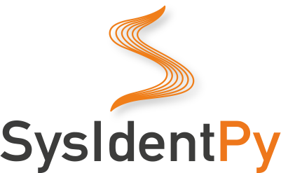
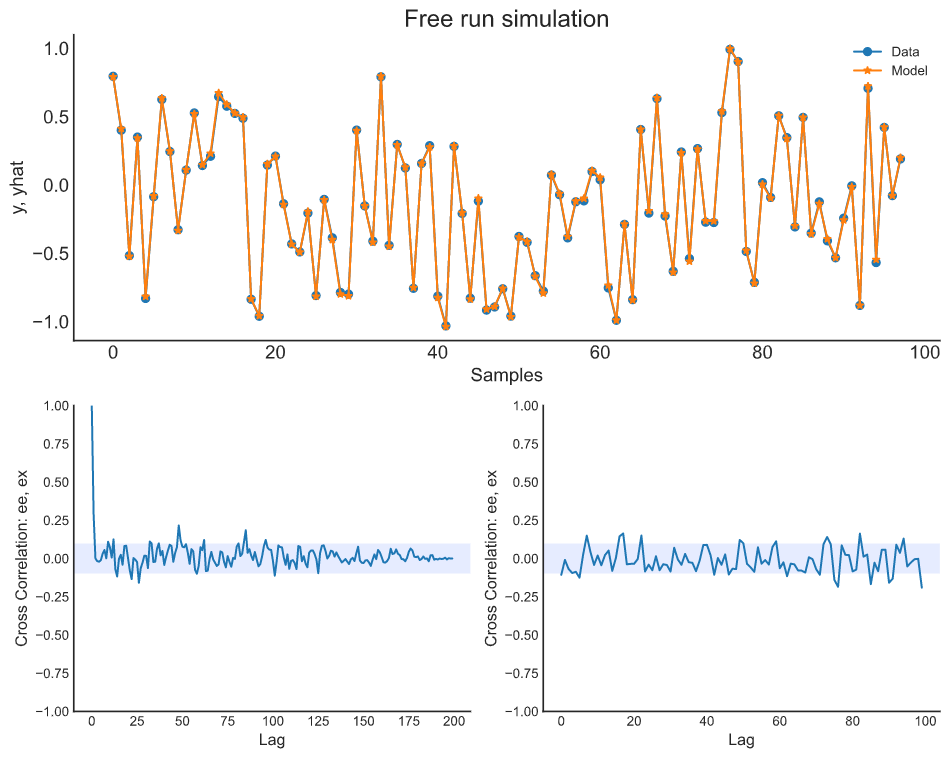

<p align="center">

</p>

[](https://joss.theoj.org/papers/10.21105/joss.02384)
[](https://pypi.org/project/sysidentpy/)
[](https://opensource.org/licenses/BSD-3-Clause)
[](https://github.com/wilsonrljr/sysidentpy/issues)
[](https://github.com/wilsonrljr/sysidentpy/issues)
[](https://pypi.org/project/sysidentpy/)
[](https://pypi.org/project/sysidentpy/)
[](https://pypi.org/project/sysidentpy/)
[](https://discord.gg/7afBSzU4)
[](https://github.com/wilsonrljr/sysidentpy/graphs/contributors)
[](https://github.com/wilsonrljr/sysidentpy/network/members)
[](https://github.com/wilsonrljr/sysidentpy/stargazers)


SysIdentPy is a Python module for System Identification using **NARMAX** models built on top of **numpy** and is distributed under the 3-Clause BSD license.

The project was started in by Wilson R. L. Junior, Luan Pascoal C. Andrade and Samir A. M. Martins as a project for System Identification discipline. Samuel joined early in 2019 and since then have contributed.

# Documentation

- Website: https://sysidentpy.org

# Examples

## SysIdentPy now support NARX Neural Network and General estimators, e.g., sklearn estimators and Catboost.

### Exemples
```python
from torch import nn
import numpy as np
import pandas as pd
import matplotlib.pyplot as plt
from sysidentpy.metrics import mean_squared_error
from sysidentpy.utils.generate_data import get_siso_data


# Generate a dataset of a simulated dynamical system
x_train, x_valid, y_train, y_valid = get_siso_data(n=1000,
                                                   colored_noise=False,
                                                   sigma=0.001,
                                                   train_percentage=80)
```

#### Polynomial NARX

```python
from sysidentpy.polynomial_basis import PolynomialNarmax

model = PolynomialNarmax(non_degree=2,
                         order_selection=True,
                         n_info_values=10,
                         extended_least_squares=False,
                         ylag=2, xlag=2,
                         info_criteria='aic',
                         estimator='least_squares'
)
model.fit(x_train, y_train)
yhat = model.predict(x_valid, y_valid)
results = pd.DataFrame(model.results(err_precision=8,
                                     dtype='dec'),
                       columns=['Regressors', 'Parameters', 'ERR'])

print(results)

   Regressors     Parameters        ERR
0        x1(k-2)     0.9000  0.95556574
1         y(k-1)     0.1999  0.04107943
2  x1(k-1)y(k-1)     0.1000  0.00335113

ee, ex, extras, lam = model.residuals(x_valid, y_valid, yhat)
model.plot_result(y_valid, yhat, ee, ex)
```


#### NARX Neural Network
```python
from sysidentpy.neural_network import NARXNN

class NARX(nn.Module):
    def __init__(self):
        super().__init__()
        self.lin = nn.Linear(4, 10)
        self.lin2 = nn.Linear(10, 10)
        self.lin3 = nn.Linear(10, 1)
        self.tanh = nn.Tanh()

    def forward(self, xb):
        z = self.lin(xb)
        z = self.tanh(z)
        z = self.lin2(z)
        z = self.tanh(z)
        z = self.lin3(z)
        return z

narx_net = NARXNN(net=NARX(),
                  ylag=2,
                  xlag=2,
                  loss_func='mse_loss',
                  optimizer='Adam',
                  epochs=200,
                  verbose=False,
                  optim_params={'betas': (0.9, 0.999), 'eps': 1e-05} # optional parameters of the optimizer
)

train_dl = narx_net.data_transform(x_train, y_train)
valid_dl = narx_net.data_transform(x_valid, y_valid)
narx_net.fit(train_dl, valid_dl)
yhat = narx_net.predict(x_valid, y_valid)
ee, ex, extras, lam = narx_net.residuals(x_valid, y_valid, yhat)
narx_net.plot_result(y_valid, yhat, ee, ex)
```


#### Catboost-narx
```python
from sysidentpy.general_estimators import NARX
from catboost import CatBoostRegressor

catboost_narx = NARX(base_estimator=CatBoostRegressor(iterations=300,
                                                      learning_rate=0.1,
                                                      depth=6),
                     xlag=2,
                     ylag=2,
                     fit_params={'verbose': False}
)

catboost_narx.fit(x_train, y_train)
yhat = catboost_narx.predict(x_valid, y_valid)
ee, ex, extras, lam = catboost_narx.residuals(x_valid, y_valid, yhat)
catboost_narx.plot_result(y_valid, yhat, ee, ex)
```


#### Catboost without NARX configuration

The following is the Catboost performance without the NARX configuration.


```python

def plot_results(yvalid, yhat):
    _, ax = plt.subplots(figsize=(14, 8))
    ax.plot(y_valid[:200], label='Data', marker='o')
    ax.plot(yhat[:200], label='Prediction', marker='*')
    ax.set_xlabel("$n$", fontsize=18)
    ax.set_ylabel("$y[n]$", fontsize=18)
    ax.grid()
    ax.legend(fontsize=18)
    plt.show()

catboost = CatBoostRegressor(iterations=300,
                            learning_rate=0.1,
                            depth=6)
catboost.fit(x_train, y_train, verbose=False)
plot_results(y_valid, catboost.predict(x_valid))
```


The examples directory has several Jupyter notebooks presenting basic tutorials of how to use the package and some specific applications of sysidentpy. Try it out!

# Requirements

SysIdentPy requires:

- Python (>= 3.6)
- NumPy (>= 1.5.0) for all numerical algorithms
- Matplotlib >= 1.5.2 for static plotiing and visualizations
- Pytorch (>=1.7.1) for building feed-forward neural networks

| Platform | Status |
| --------- | -----:|
| Linux | ok |
| Windows | ok |
| macOS | ok |

**SysIdentPy do not to support Python 2.7.**

A few examples require pandas >= 0.18.0. However, it is not required to use sysidentpy.

# Installation

The easiest way to get sysidentpy running is to install it using ``pip``
~~~~~~~~~~~~~~~~~~~~~~
pip install sysidentpy
~~~~~~~~~~~~~~~~~~~~~~

We will made it available at conda repository as soon as possible.

# Changelog

See the [changelog]( <http://sysidentpy.org/changelog/v0.1.3.html>) for a history of notable changes to SysIdentPy.

# Development

We welcome new contributors of all experience levels. The sysidentpy community goals are to be helpful, welcoming, and effective.

*Note*: we use the `pytest` package for testing. The test functions are located in tests subdirectories at each folder inside **SysIdentPy**, which check the validity of the algorithms.

Run the `pytest` in the respective folder to perform all the tests of the corresponding sub-packages.

Currently, we have around 81% of code coverage.

You can install pytest using
~~~~~~~~~~~~~~~~~~~~~~
pip install -U pytest
~~~~~~~~~~~~~~~~~~~~~~

### Example of how to run the tests:

Open a terminal emulator of your choice and go to a subdirectory, e.g,
~~~~~~~~~~~~~~~~~~~~
\sysidentpy\metrics\
~~~~~~~~~~~~~~~~~~~~

Just type `pytest` and you get a result like

~~~~~~~~
========== test session starts ==========

platform linux -- Python 3.7.6, pytest-5.4.2, py-1.8.1, pluggy-0.13.1

rootdir: ~/sysidentpy

plugins: cov-2.8.1

collected 12 items

tests/test_regression.py ............ [100%]

========== 12 passed in 2.45s ==================
~~~~~~~~~~~~~~
You can also see the code coverage using the `pytest-cov` package. First, install `pytest-cov` using
~~~
pip install pytest-cov
~~~
Run the command below in the SysIdentPy root directory, to generate the report.
~~~
pytest --cov=.
~~~

# Important links

- Official source code repo: https://github.com/wilsonrljr/sysidentpy

- Download releases: https://pypi.org/project/sysidentpy/

# Source code

You can check the latest sources with the command::
~~~~~~~~~~~~~~~~~~~~~~~~~~~~~~~~~~~~~~~~
git clone https://github.com/wilsonrljr/sysidentpy.git
~~~~~~~~~~~~~~~~~~~~~~~~~~~~~~~~~~~~~~~~

# Project History

The project was started by Wilson R. L. Junior, Luan Pascoal and Samir A. M. Martins as a project for System Identification discipline. Samuel joined early in 2019 and since then have contributed.

The initial purpose was to learn the python language. Over time, the project has matured to the state it is in today.

The project is currently maintained by its creators and looking for contributors.

# Communication

- Discord server: https://discord.gg/8eGE3PQ

  [](https://discord.gg/7afBSzU4)


- Website: http://sysidentpy.org

# Citation
[](https://joss.theoj.org/papers/10.21105/joss.02384)

If you use SysIdentPy on your project, please [drop me a line](mailto:wilsonrljr@outlook.com).

If you use SysIdentPy on your scientific publication, we would appreciate citations to the following paper:

- Lacerda et al., (2020). SysIdentPy: A Python package for System Identification using NARMAX models. Journal of Open Source Software, 5(54), 2384, https://doi.org/10.21105/joss.02384

```
@article{Lacerda2020,
  doi = {10.21105/joss.02384},
  url = {https://doi.org/10.21105/joss.02384},
  year = {2020},
  publisher = {The Open Journal},
  volume = {5},
  number = {54},
  pages = {2384},
  author = {Wilson Rocha Lacerda Junior and Luan Pascoal Costa da Andrade and Samuel Carlos Pessoa Oliveira and Samir Angelo Milani Martins},
  title = {SysIdentPy: A Python package for System Identification using NARMAX models},
  journal = {Journal of Open Source Software}
}
```

# Inspiration

The documentation and structure (even this section) is openly inspired by sklearn, einsteinpy, and many others as we used (and keep using) them to learn.
