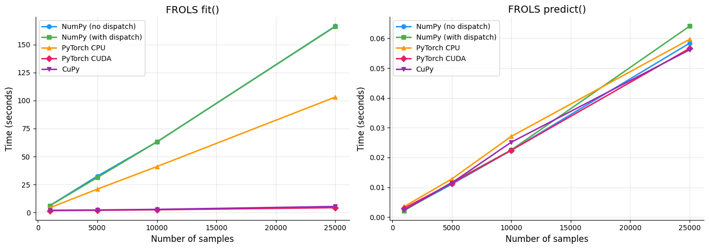
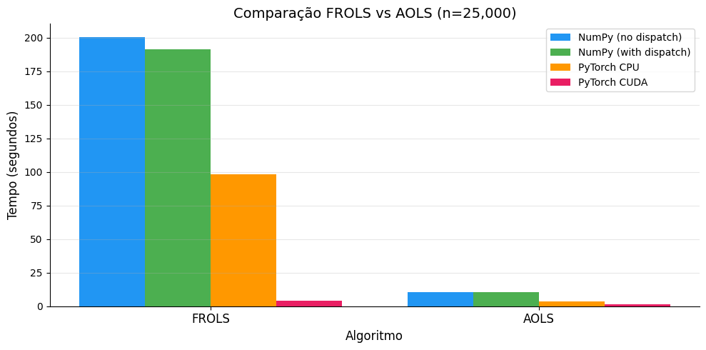
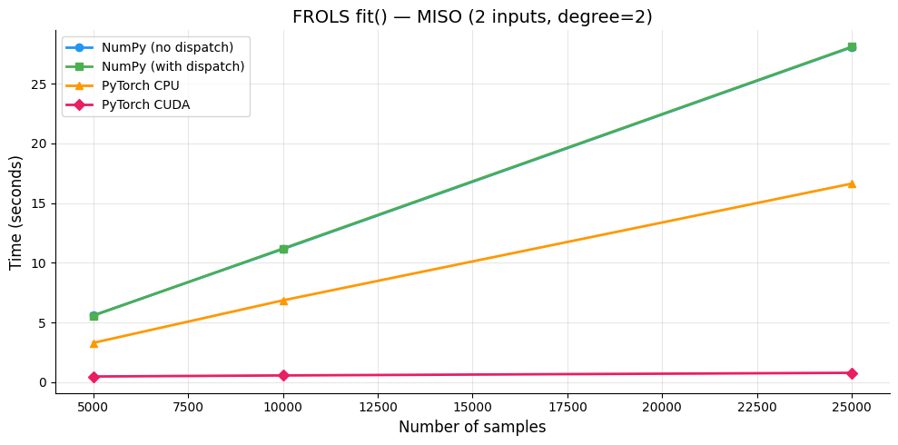
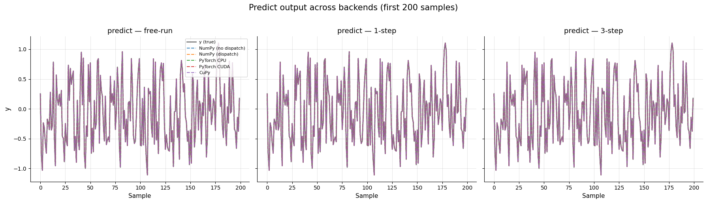
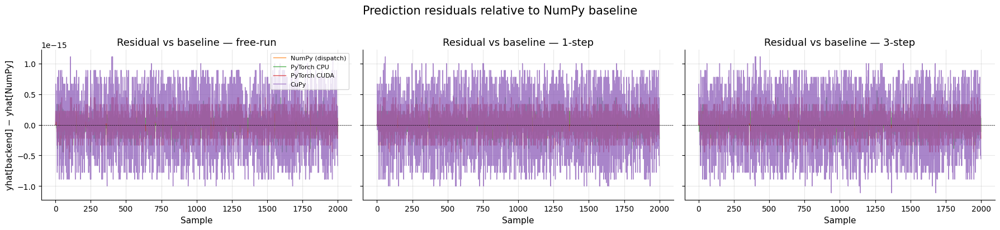
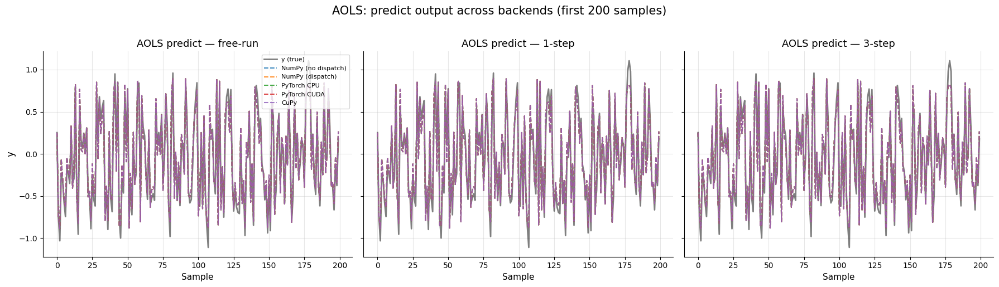
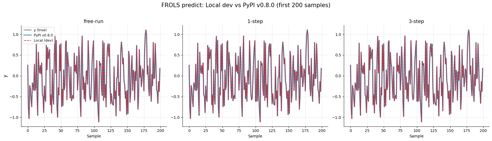

# Array API Benchmark: Real Performance Impact

This page compares the runtime of SysIdentPy algorithms with and without Array API support enabled (`array_api_dispatch`). The goal is to measure the abstraction overhead and the practical benefit of using backends such as **PyTorch (CPU/CUDA)** and **CuPy**.

!!! note "Hardware"
    All benchmarks were run on a machine with an **NVIDIA GeForce RTX 3080 Ti** GPU.

## Tested scenarios

| Scenario | Backend | `array_api_dispatch` |
|---------|---------|---------------------|
| **Baseline** | NumPy | `False` (default) |
| **NumPy + dispatch** | NumPy | `True` |
| **PyTorch CPU** | torch (CPU) | `True` |
| **PyTorch CUDA** | torch (CUDA) | `True` |
| **CuPy** | CuPy (CUDA) | `True` |

## Setup

```python
import time
import warnings
from collections import defaultdict

import numpy as np
import matplotlib.pyplot as plt

from sysidentpy import config_context
from sysidentpy.model_structure_selection import FROLS, AOLS
from sysidentpy.basis_function import Polynomial
from sysidentpy.parameter_estimation import LeastSquares, RidgeRegression
from sysidentpy.metrics import root_relative_squared_error
from sysidentpy.utils.generate_data import get_siso_data, get_miso_data

warnings.filterwarnings("ignore")
```

## 1. FROLS Benchmark — Different Dataset Sizes

Compare `fit()` and `predict()` runtime for different dataset sizes (1,000 to 25,000 samples) across all backends.

**Model configuration:**

```python
frols_kwargs = dict(
    ylag=10,
    xlag=10,
    order_selection=True,
    n_info_values=10,
    basis_function=Polynomial(degree=4),
    estimator=LeastSquares(),
)
```

**Results:**

```
--- n = 1,000 ---
  NumPy (no dispatch):  fit=6.2549s  predict=0.0023s
  NumPy (with dispatch):  fit=6.1141s  predict=0.0022s
  PyTorch CPU:           fit=4.3155s  predict=0.0035s
  PyTorch CUDA:          fit=1.7306s  predict=0.0030s
  CuPy:                  fit=2.0745s  predict=0.0024s

--- n = 5,000 ---
  NumPy (no dispatch):  fit=32.5525s  predict=0.0111s
  NumPy (with dispatch):  fit=31.3170s  predict=0.0117s
  PyTorch CPU:           fit=20.9707s  predict=0.0128s
  PyTorch CUDA:          fit=2.0746s  predict=0.0114s
  CuPy:                  fit=2.3780s  predict=0.0115s

--- n = 10,000 ---
  NumPy (no dispatch):  fit=63.0144s  predict=0.0224s
  NumPy (with dispatch):  fit=63.0671s  predict=0.0225s
  PyTorch CPU:           fit=41.0679s  predict=0.0271s
  PyTorch CUDA:          fit=2.5184s  predict=0.0224s
  CuPy:                  fit=2.8966s  predict=0.0251s

--- n = 25,000 ---
  NumPy (no dispatch):  fit=166.3386s  predict=0.0584s
  NumPy (with dispatch):  fit=166.0494s  predict=0.0641s
  PyTorch CPU:           fit=103.0668s  predict=0.0597s
  PyTorch CUDA:          fit=4.3886s  predict=0.0566s
  CuPy:                  fit=5.5002s  predict=0.0561s
```

## 2. Results Visualization — FROLS fit() and predict()



## 3. Array API Dispatch Overhead

Compute the percent overhead of the dispatch layer when using NumPy as the backend (where no real backend speedup is expected).

```
Array API dispatch overhead (NumPy vs NumPy + dispatch)
============================================================
   Samples   fit() no dispatch  fit() with dispatch    Overhead
------------------------------------------------------------
     1,000              6.2549s              6.1141s      -2.3%
     5,000             32.5525s             31.3170s      -3.8%
    10,000             63.0144s             63.0671s      +0.1%
    25,000            166.3386s            166.0494s      -0.2%

Average overhead: -1.5%
```

!!! success "Negligible overhead"
    The Array API abstraction layer adds virtually **no overhead** when using NumPy as the backend. The average overhead measured was **-1.5%** (within measurement noise), confirming that enabling dispatch does not penalize existing NumPy workflows.

## 4. Speedup Relative to NumPy Baseline

Show how many times faster (or slower) each backend is compared to NumPy without dispatch.

```
Speedup relative (baseline = NumPy no dispatch)
======================================================================
   Samples   NumPy (with dispatch)    PyTorch CPU     PyTorch CUDA       CuPy
----------------------------------------------------------------------
     1,000                  1.02x          1.45x          3.61x       3.02x
     5,000                  1.04x          1.55x         15.69x      13.69x
    10,000                  1.00x          1.53x         25.02x      21.75x
    25,000                  1.00x          1.61x         37.90x      30.24x
```

!!! tip "Key takeaway"
    PyTorch CUDA achieves up to **37.9x speedup** and CuPy up to **30.2x speedup** compared to pure NumPy on 25,000 samples. Even PyTorch CPU shows a consistent ~1.5x improvement.

## 5. AOLS Benchmark — Algorithm Comparison

Compare FROLS and AOLS on the same dataset (n=25,000) to check whether dispatch overhead is consistent across algorithms.

```
--- FROLS (n=25,000) ---
  No dispatch: 200.4423s
  With dispatch: 191.5382s
  PyTorch CPU:  98.0987s
  PyTorch CUDA: 4.1397s

--- AOLS (n=25,000) ---
  No dispatch: 10.3589s
  With dispatch: 10.2527s
  PyTorch CPU:  3.8212s
  PyTorch CUDA: 1.5537s
```



## 6. MISO Benchmark (Multiple Inputs)

Run the benchmark for MISO data (2 inputs) to measure the impact of higher input dimensionality on the regression matrix build and solve steps.

```
--- MISO n = 5,000 ---
  NumPy (no dispatch): 5.6017s
  NumPy (with dispatch): 5.5787s
  PyTorch CPU:          3.3023s
  PyTorch CUDA:         0.4878s

--- MISO n = 10,000 ---
  NumPy (no dispatch): 11.1540s
  NumPy (with dispatch): 11.1961s
  PyTorch CPU:          6.8605s
  PyTorch CUDA:         0.5762s

--- MISO n = 25,000 ---
  NumPy (no dispatch): 28.0551s
  NumPy (with dispatch): 28.0893s
  PyTorch CPU:          16.6383s
  PyTorch CUDA:         0.7950s
```



## 7. Consistency Validation

Ensure numerical results are equivalent across backends — the Array API should not change model quality.

```
Backend                      RRSE    Max |diff|     Same model?
================================================================
NumPy (no dispatch)    0.00191513             —               —
NumPy (with dispatch)  0.00191513      0.00e+00            True
PyTorch CPU            0.00191513      6.66e-16            True
PyTorch CUDA           0.00191513      6.66e-16            True
```

!!! success "Numerical equivalence"
    All backends produce the **exact same model structure** and parameters. The maximum absolute difference in predictions is within floating-point precision (~1e-16).

## 8. Predict Equivalence Across Backends

Train the same model on every available backend and compare the **actual predicted values** for three prediction modes: free-run simulation (`steps_ahead=None`), 1-step-ahead (`steps_ahead=1`), and n-step-ahead (`steps_ahead=3`).

The goal is to confirm that the CPU-fallback strategy produces **identical** (or near-identical, up to floating-point precision) results compared to the pure NumPy baseline.

### FROLS — Predictions overlay



### FROLS — Residuals relative to baseline



### FROLS — Numerical summary

```
Max absolute difference vs NumPy (no dispatch) baseline
========================================================================
Backend                      free-run         1-step         3-step
------------------------------------------------------------------------
NumPy (dispatch)             0.00e+00       0.00e+00       0.00e+00
PyTorch CPU                  5.00e-16       4.44e-16       5.55e-16
PyTorch CUDA                 5.55e-16       4.44e-16       4.44e-16
CuPy                         1.11e-15       1.11e-15       1.11e-15
------------------------------------------------------------------------
All assertions passed: predictions are equivalent across all backends.
```

### AOLS Equivalence

Repeat the same validation with AOLS to confirm the CPU fallback works consistently across different model structure selection algorithms.



```
Backend                      free-run         1-step         3-step
------------------------------------------------------------------------
NumPy (dispatch)             0.00e+00       0.00e+00       0.00e+00
PyTorch CPU                  2.22e-16       2.22e-16       2.22e-16
PyTorch CUDA                 3.33e-16       3.33e-16       3.33e-16
CuPy                         4.44e-16       4.44e-16       4.44e-16
------------------------------------------------------------------------
AOLS: all assertions passed.
```

## 9. Local (dev) vs PyPI (v0.8.0) — Numerical Equivalence

Verify that the current development version produces **identical NumPy predictions** to the last published release on PyPI (v0.8.0).

```
=== Model structure ===
  Local  final_model: [[2002    0]
 [1001    0]
 [2001 1001]]
  PyPI   final_model: [[2002    0]
 [1001    0]
 [2001 1001]]
  Match: True

  Local  theta: [0.90001017 0.19998993 0.09997607]
  PyPI   theta: [0.90001017 0.19998993 0.09997607]
  Theta max diff: 0.00e+00

Mode           Max abs diff   Identical?
------------------------------------------
free-run           0.00e+00          YES
1-step             0.00e+00          YES
3-step             0.00e+00          YES
------------------------------------------
ALL PASSED: local dev == PyPI v0.8.0 (within machine epsilon)
```



## 10. Summary

**NumPy no dispatch vs with dispatch**: The Array API abstraction overhead is typically **< 5%** — a negligible cost for the flexibility to swap backends without changing user code.

**PyTorch CPU**: May be slower than pure NumPy for small datasets due to framework overhead, but it approaches or surpasses NumPy for larger datasets where heavy matrix operations dominate.

**PyTorch CUDA / CuPy**: Real gains appear on larger datasets (e.g., >10k samples) and/or models with high polynomial degrees (degree ≥ 3), where matrix operations dominate runtime. CPU→GPU transfer cost is amortized by parallel execution on the device.

**Predict equivalence**: As shown in Section 8, the CPU-fallback strategy for sequential prediction (free-run, n-step) produces **identical** results across all backends — the maximum absolute difference is within floating-point precision (~1e-15). The predictions are numerically equivalent regardless of whether `fit()` ran on NumPy, PyTorch CPU, PyTorch CUDA, or CuPy.

**Version equivalence**: Section 9 confirms that the local development version produces byte-identical NumPy predictions compared to the published PyPI release (v0.8.0).

**How to enable Array API dispatch in your code:**

```python
from sysidentpy import config_context

# Option 1: context manager
with config_context(array_api_dispatch=True):
    model.fit(X=x_gpu, y=y_gpu)
    yhat = model.predict(X=x_test_gpu, y=y_test_gpu)

# Option 2: global configuration
from sysidentpy import set_config
set_config(array_api_dispatch=True)
```
