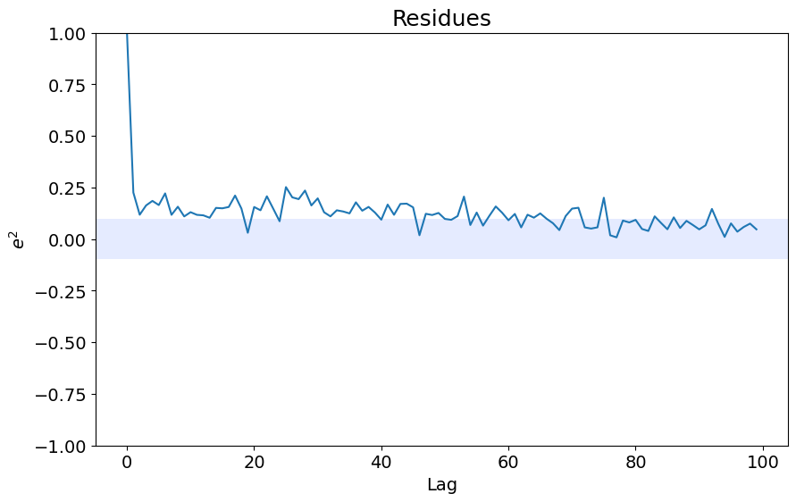
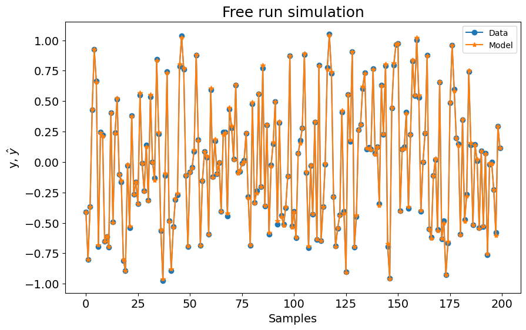
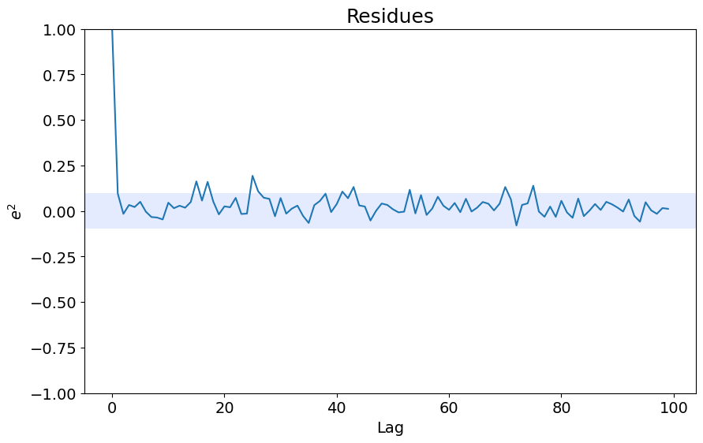
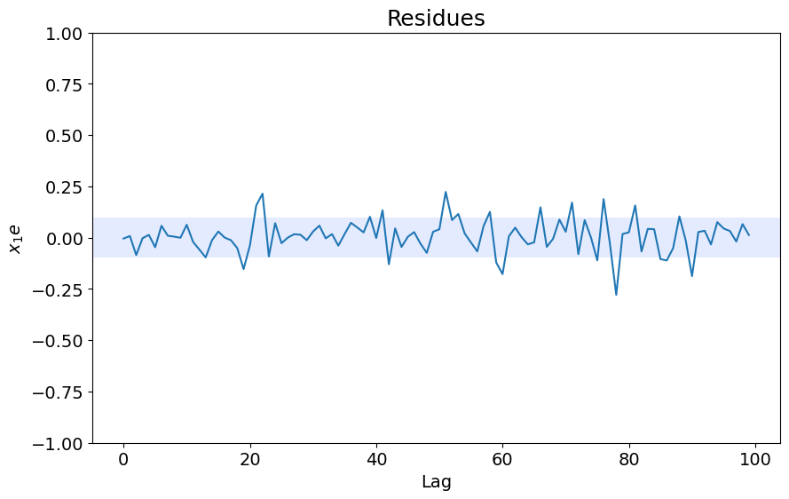

# Create a NARX Neural Network

Example created by Wilson Rocha Lacerda Junior

> **Looking for more details on NARMAX models?**
> For comprehensive information on models, methods, and a wide range of examples and benchmarks implemented in SysIdentPy, check out our book:
> [*Nonlinear System Identification and Forecasting: Theory and Practice With SysIdentPy*](https://sysidentpy.org/book/0%20-%20Preface/)
>
> This book provides in-depth guidance to support your work with SysIdentPy.

## Series-Parallel Training and Parallel prediction

Currently *SysIdentPy* support a Series-Parallel (open-loop) Feedforward Network training
process, which make the training process easier. We convert the NARX network from Series-Parallel to the Parallel (closed-loop) configuration for prediction. 

Series-Parallel allows us to use Pytorch directly for training, so we can use all the power of the Pytorch library to build our NARX Neural Network model! 


The reader is referred to the following paper for a more in depth discussion about Series-Parallel and Parallel configurations regarding NARX neural network:

[Parallel Training Considered Harmful?: Comparing series-parallel and parallel feedforward
network training](https://arxiv.org/pdf/1706.07119.pdf)


## Building a NARX Neural Network

First, just import the necessary packages


```python
pip install sysidentpy
```


```python
from torch import nn
from sysidentpy.metrics import mean_squared_error
from sysidentpy.utils.generate_data import get_siso_data
from sysidentpy.neural_network import NARXNN

from sysidentpy.basis_function import Polynomial
from sysidentpy.utils.plotting import plot_residues_correlation, plot_results
from sysidentpy.residues.residues_correlation import (
    compute_residues_autocorrelation,
    compute_cross_correlation,
)
from sysidentpy.utils.narmax_tools import regressor_code
import torch
```


```python
torch.cuda.is_available()
```


    False


```python
device = "cuda" if torch.cuda.is_available() else "cpu"
print(f"Using {device} device")
```

    Using cpu device


## Getting the data

The data is generated by simulating the following model:

$y_k = 0.2y_{k-1} + 0.1y_{k-1}x_{k-1} + 0.9x_{k-1} + e_{k}$.

If *colored_noise* is set to True:

$e_{k} = 0.8\nu_{k-1} + \nu_{k}$,

where $x$ is a uniformly distributed random variable and $\nu$ is a gaussian distributed variable with $\mu=0$ and $\sigma=0.1$


```python
x_train, x_valid, y_train, y_valid = get_siso_data(
    n=1000, colored_noise=False, sigma=0.01, train_percentage=80
)
```

## Choosing the NARX parameters, loss function and optimizer

One can create a NARXNN object and choose the maximum lag of both input and output for building the regressor matrix to serve as input of the network.

In addition, you can choose the loss function, the optimizer, the optional parameters of the optimizer, the number of epochs.

Because we built this feature on top of Pytorch, you can choose any of the loss function of the torch.nn.functional. [Click here](https://pytorch.org/docs/stable/nn.functional.html#loss-functions) for a list of the loss functions you can use. You just need to pass the name of the loss function you want.

Similarly, you can choose any of the optimizers of the torch.optim. [Click here](https://pytorch.org/docs/stable/optim.html) for a list of optimizers available.


```python
basis_function = Polynomial(degree=1)

narx_net = NARXNN(
    ylag=2,
    xlag=2,
    basis_function=basis_function,
    model_type="NARMAX",
    loss_func="mse_loss",
    optimizer="Adam",
    epochs=2000,
    verbose=False,
    device="cuda",
    optim_params={
        "betas": (0.9, 0.999),
        "eps": 1e-05,
    },  # optional parameters of the optimizer
)
```

    C:\Users\wilso\Desktop\projects\GitHub\sysidentpy\sysidentpy\neural_network\narx_nn.py:156: UserWarning: No CUDA available. We set the device as CPU
      self.device = self._check_cuda(device)


Since we have defined our NARXNN using $ylag=2$, $xlag=2$ and a polynomial basis function with $degree=1$, we have a regressor matrix with 4 features. We need the size of the regressor matrix to build the layers of our network. Our input data(x_train) have only one feature, but since we are creating an NARX network, a regressor matrix is built behind the scenes with new features based on the xlag and ylag.

If you need help finding how many regressors are created behind the scenes you can use the narmax_tools function regressor_code and take the size of the regressor code generated:


```python
basis_function = Polynomial(degree=1)

regressors = regressor_code(
    X=x_train,
    xlag=2,
    ylag=2,
    model_type="NARMAX",
    model_representation="neural_network",
    basis_function=basis_function,
)
```


```python
n_features = regressors.shape[0]  # the number of features of the NARX net
n_features
```


    4


```python
regressors
```


    array([[1001],
           [1002],
           [2001],
           [2002]])


## Building the NARX Neural Network

The configuration of your network follows exactly the same pattern of a network defined in Pytorch. The following representing our NARX neural network.


```python
class NARX(nn.Module):
    def __init__(self):
        super().__init__()
        self.lin = nn.Linear(n_features, 30)
        self.lin2 = nn.Linear(30, 30)
        self.lin3 = nn.Linear(30, 1)
        self.tanh = nn.Tanh()

    def forward(self, xb):
        z = self.lin(xb)
        z = self.tanh(z)
        z = self.lin2(z)
        z = self.tanh(z)
        z = self.lin3(z)
        return z
```

We have to pass the defined network to our NARXNN estimator.


```python
narx_net.net = NARX()
```


```python
if device == "cuda":
    narx_net.net.to(torch.device("cuda"))
```

## Fit and Predict

Because we have a fit (for training) and predict function for Polynomial NARMAX, we create the same pattern for the NARX net. So, you only have to fit and predict using the following:


```python
narx_net.fit(X=x_train, y=y_train, X_test=x_valid, y_test=y_valid)
```


    <sysidentpy.neural_network.narx_nn.NARXNN at 0x19ddfff3890>


```python
yhat = narx_net.predict(X=x_valid, y=y_valid)
```

## Results

Now we show the results


```python
print("MSE: ", mean_squared_error(y_valid, yhat))
plot_results(y=y_valid, yhat=yhat, n=1000)
ee = compute_residues_autocorrelation(y_valid, yhat)
plot_residues_correlation(data=ee, title="Residues", ylabel="$e^2$")
x1e = compute_cross_correlation(y_valid, yhat, x_valid)
plot_residues_correlation(data=x1e, title="Residues", ylabel="$x_1e$")
```

    MSE:  0.00013103585914746256


    

    


    

    


    

    


## Note

If you built the net configuration before calling the NARXNN, you can just pass the model to the NARXNN as follows:


```python
class NARX(nn.Module):
    def __init__(self):
        super().__init__()
        self.lin = nn.Linear(n_features, 30)
        self.lin2 = nn.Linear(30, 30)
        self.lin3 = nn.Linear(30, 1)
        self.tanh = nn.Tanh()

    def forward(self, xb):
        z = self.lin(xb)
        z = self.tanh(z)
        z = self.lin2(z)
        z = self.tanh(z)
        z = self.lin3(z)
        return z


narx_net2 = NARXNN(
    net=NARX(),
    ylag=2,
    xlag=2,
    basis_function=basis_function,
    model_type="NARMAX",
    loss_func="mse_loss",
    optimizer="Adam",
    epochs=2000,
    verbose=False,
    optim_params={
        "betas": (0.9, 0.999),
        "eps": 1e-05,
    },  # optional parameters of the optimizer
)

narx_net2.fit(X=x_train, y=y_train)
yhat = narx_net2.predict(X=x_valid, y=y_valid)
print("MSE: ", mean_squared_error(y_valid, yhat))

plot_results(y=y_valid, yhat=yhat, n=1000)
ee = compute_residues_autocorrelation(y_valid, yhat)
plot_residues_correlation(data=ee, title="Residues", ylabel="$e^2$")
x1e = compute_cross_correlation(y_valid, yhat, x_valid)
plot_residues_correlation(data=x1e, title="Residues", ylabel="$x_1e$")
```

    MSE:  0.00010086796658327408


    

    


    

    


    

    


# Note

Remember you can use n-steps-ahead prediction and NAR and NFIR models. Check how to use it in their respective examples.
