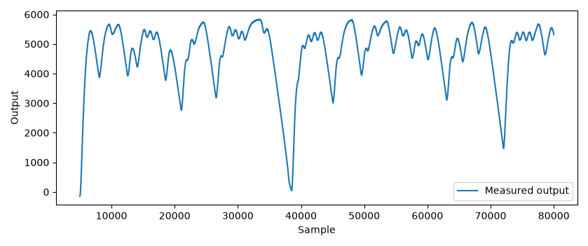
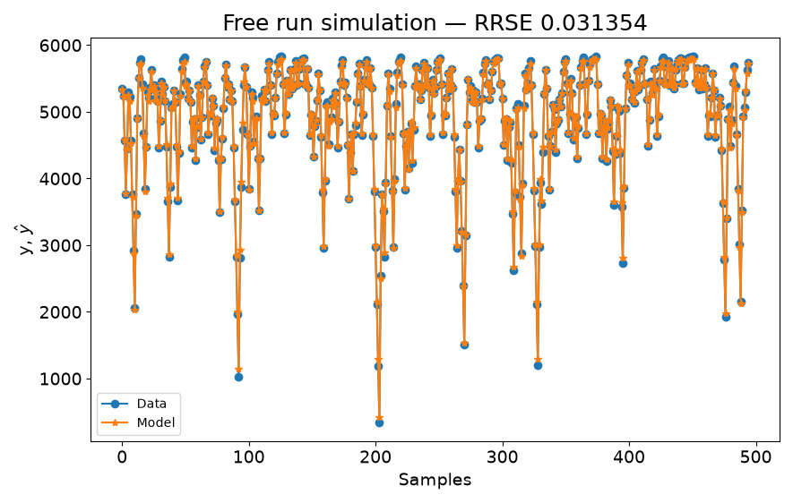
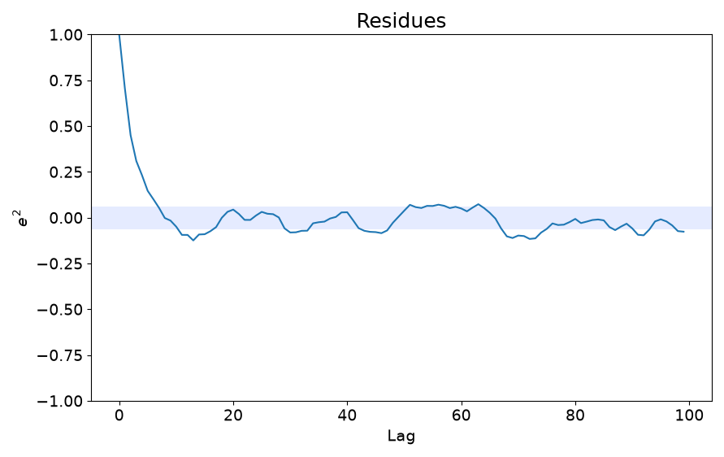
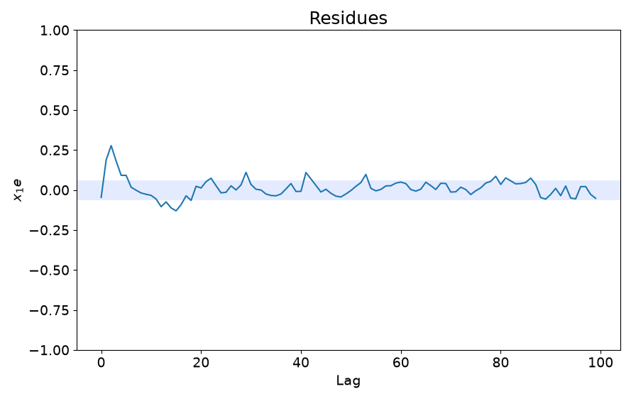
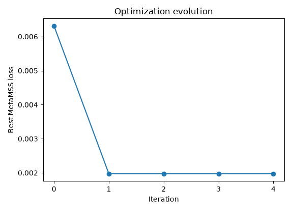

# Electromechanical System Identification - MetaMSS

Example created by Wilson Rocha Lacerda Junior

> **Looking for more details on NARMAX models?**
> For comprehensive information on models, methods, and a wide range of examples and benchmarks implemented in SysIdentPy, check out our book:
> [*Nonlinear System Identification and Forecasting: Theory and Practice With SysIdentPy*](https://sysidentpy.org/book/0%20-%20Preface/)
>
> This book provides in-depth guidance to support your work with SysIdentPy.


```python
import pandas as pd
import numpy as np
import matplotlib.pyplot as plt
from sklearn.preprocessing import StandardScaler
from sysidentpy.model_structure_selection import MetaMSS, FROLS
from sysidentpy.metrics import root_relative_squared_error
from sysidentpy.basis_function import Polynomial
from sysidentpy.parameter_estimation import RecursiveLeastSquares
from sysidentpy.utils.display_results import results
from sysidentpy.utils.plotting import plot_residues_correlation, plot_results
from sysidentpy.residues.residues_correlation import (
    compute_residues_autocorrelation,
    compute_cross_correlation,
)
```


```python
data_url = (
    "https://raw.githubusercontent.com/wilsonrljr/sysidentpy-data/"
    "4085901293ba5ed5674bb2911ef4d1fa20f3438d/datasets/generator/"
)
df1 = pd.read_csv(f"{data_url}x_cc.csv", header=None)
df2 = pd.read_csv(f"{data_url}y_cc.csv", header=None)

df2[5000:80000].plot(figsize=(10, 4))
```


    <Axes: >


    

    


```python
df1.iloc[::500].values.shape
```


    (1000, 1)


We decimate the data using $d=500$ and split the resulting 1,000 samples into
equal identification and validation sets. Input and output standardization is
fitted only on the identification set; the fitted transformations are then
applied to validation data, preventing information leakage.


```python
# We decimate the data using d=500 in this example.
x_train, x_test = np.split(df1.iloc[::500].values, 2)
y_train, y_test = np.split(df2.iloc[::500].values, 2)

x_scaler = StandardScaler()
y_scaler = StandardScaler()
x_train_scaled = x_scaler.fit_transform(x_train)
x_test_scaled = x_scaler.transform(x_test)
y_train_scaled = y_scaler.fit_transform(y_train)
y_test_scaled = y_scaler.transform(y_test)
```


```python
basis_function = Polynomial(degree=2)
estimator = RecursiveLeastSquares(lam=0.95, delta=0.01)

model = MetaMSS(
    xlag=5,
    ylag=5,
    estimator=estimator,
    maxiter=5,
    n_agents=15,
    basis_function=basis_function,
    random_state=42,
)

with np.errstate(over="ignore", invalid="ignore", divide="ignore"):
    model.fit(X=x_train_scaled, y=y_train_scaled)
```


The search may evaluate candidates whose recursions are numerically invalid.
`np.errstate` suppresses only those expected numerical warnings; predictions
from the selected model are explicitly checked before evaluation.


```python
yhat_free_scaled = model.predict(
    X=x_test_scaled, y=y_test_scaled, steps_ahead=None
)
yhat_one_step_scaled = model.predict(
    X=x_test_scaled, y=y_test_scaled, steps_ahead=1
)

yhat_free = y_scaler.inverse_transform(yhat_free_scaled)
yhat_one_step = y_scaler.inverse_transform(yhat_one_step_scaled)

if not (np.isfinite(yhat_free).all() and np.isfinite(yhat_one_step).all()):
    raise RuntimeError("The selected model produced a non-finite prediction.")

start = model.max_lag
y_eval = y_test[start:]
yhat_free_eval = yhat_free[start:]
yhat_one_step_eval = yhat_one_step[start:]
x_eval = x_test[start:]

rrse_free = root_relative_squared_error(y_eval, yhat_free_eval)
rrse_one_step = root_relative_squared_error(y_eval, yhat_one_step_eval)
print(f"Free-run RRSE: {rrse_free:.6f}")
print(f"One-step-ahead RRSE: {rrse_one_step:.6f}")

r = pd.DataFrame(
    results(
        model.final_model,
        model.theta,
        model.err,
        model.n_terms,
        err_precision=8,
        dtype="sci",
    ),
    columns=["Regressors", "Parameters", "ERR"],
)
print(r)

plot_results(
    y=y_eval,
    yhat=yhat_free_eval,
    n=1000,
    title=f"Free run simulation — RRSE {rrse_free:.6f}",
)
ee = compute_residues_autocorrelation(y_eval, yhat_free_eval)
plot_residues_correlation(data=ee, title="Residues", ylabel="$e^2$")
x1e = compute_cross_correlation(y_eval, yhat_free_eval, x_eval)
plot_residues_correlation(data=x1e, title="Residues", ylabel="$x_1e$")
```

    Free-run RRSE: 0.031354
    One-step-ahead RRSE: 0.022595
            Regressors   Parameters             ERR
    0           y(k-1)   7.0968E-01  0.00000000E+00
    1           y(k-3)  -5.8259E-02  0.00000000E+00
    2           y(k-4)  -1.0981E-04  0.00000000E+00
    3          x1(k-1)   3.7458E-01  0.00000000E+00
    4          x1(k-4)   2.2133E-01  0.00000000E+00
    5         y(k-1)^2  -2.2259E-02  0.00000000E+00
    6     y(k-2)y(k-1)   1.3530E-02  0.00000000E+00
    7     y(k-3)y(k-1)   1.6170E-02  0.00000000E+00
    8     y(k-4)y(k-1)  -2.0950E-02  0.00000000E+00
    9     y(k-5)y(k-1)  -5.9322E-03  0.00000000E+00
    10   x1(k-1)y(k-1)  -4.1207E-01  0.00000000E+00
    11   x1(k-2)y(k-1)  -1.6460E-01  0.00000000E+00
    12    y(k-4)y(k-2)   1.0074E-02  0.00000000E+00
    13    y(k-5)y(k-2)   1.4187E-02  0.00000000E+00
    14   x1(k-1)y(k-2)   2.8701E-01  0.00000000E+00
    15   x1(k-3)y(k-2)   3.5765E-03  0.00000000E+00
    16        y(k-3)^2  -1.2085E-02  0.00000000E+00
    17    y(k-4)y(k-3)   8.3141E-03  0.00000000E+00
    18   x1(k-1)y(k-3)  -1.2719E-01  0.00000000E+00
    19   x1(k-2)y(k-3)   2.9013E-02  0.00000000E+00
    20   x1(k-4)y(k-3)   9.3360E-03  0.00000000E+00
    21   x1(k-1)y(k-4)   3.6354E-02  0.00000000E+00
    22        y(k-5)^2  -3.4384E-03  0.00000000E+00
    23   x1(k-1)y(k-5)  -1.3772E-03  0.00000000E+00
    24   x1(k-5)y(k-5)  -1.0137E-03  0.00000000E+00
    25  x1(k-2)x1(k-1)  -1.1732E-02  0.00000000E+00
    26  x1(k-5)x1(k-1)   6.8615E-03  0.00000000E+00
    27       x1(k-2)^2   1.8984E+00  0.00000000E+00
    28  x1(k-3)x1(k-2)  -8.0513E-03  0.00000000E+00
    29  x1(k-5)x1(k-2)  -2.0967E-03  0.00000000E+00
    30       x1(k-4)^2  -1.8366E+00  0.00000000E+00
    31       x1(k-5)^2  -8.7361E-03  0.00000000E+00



    


    

    


    

    


With the same data split, lags, polynomial basis, search budget and seed, the
effect of standardization and the RLS forgetting factor is compactly summarized
as follows:

| Data treatment | `lam` | Free-run RRSE | One-step-ahead RRSE |
| --- | ---: | ---: | ---: |
| Without standardization | 0.98 | 2.184406 | 0.037653 |
| Standardized | 0.98 | 0.035944 | 0.021008 |
| Standardized | 0.95 | 0.031354 | 0.022595 |

The code above uses the last configuration. Both prediction modes are generated
in standardized coordinates, transformed back to the original output scale and
evaluated only after `model.max_lag`. The comparison shows that preprocessing
and the prediction mode are both essential parts of the reported result.

```python
# Plotting the evolution of the agents
plt.plot(model.best_by_iter, marker="o")
plt.title("Optimization evolution")
plt.xlabel("Iteration")
plt.ylabel("Best MetaMSS loss")
model.best_by_iter[-1]
```

    0.0019710527


    


```python
# You have access to all tested models
# model.tested_models
```


```python
from sklearn.neighbors import KNeighborsRegressor
from sklearn.tree import DecisionTreeRegressor
from sklearn.ensemble import RandomForestRegressor
from catboost import CatBoostRegressor
from sklearn.linear_model import ARDRegression
from sysidentpy.general_estimators import NARX

xlag = ylag = 5

estimators = [
    (
        "NARX_KNeighborsRegressor",
        NARX(
            base_estimator=KNeighborsRegressor(),
            xlag=xlag,
            ylag=ylag,
            basis_function=basis_function,
        ),
    ),
    (
        "NARX_DecisionTreeRegressor",
        NARX(
            base_estimator=DecisionTreeRegressor(random_state=42),
            xlag=xlag,
            ylag=ylag,
            basis_function=basis_function,
        ),
    ),
    (
        "NARX_RandomForestRegressor",
        NARX(
            base_estimator=RandomForestRegressor(
                n_estimators=200, random_state=42
            ),
            xlag=xlag,
            ylag=ylag,
            basis_function=basis_function,
        ),
    ),
    (
        "NARX_Catboost",
        NARX(
            base_estimator=CatBoostRegressor(
                iterations=800,
                learning_rate=0.1,
                depth=8,
                random_seed=42,
                allow_writing_files=False,
            ),
            xlag=xlag,
            ylag=ylag,
            basis_function=basis_function,
            fit_params={"verbose": False},
        ),
    ),
    (
        "NARX_ARD",
        NARX(
            base_estimator=ARDRegression(),
            xlag=xlag,
            ylag=ylag,
            basis_function=basis_function,
        ),
    ),
    (
        "FROLS-Polynomial_NARX",
        FROLS(
            order_selection=True,
            n_info_values=50,
            ylag=ylag,
            xlag=xlag,
            basis_function=basis_function,
            info_criteria="bic",
            err_tol=None,
        ),
    ),
    (
        "MetaMSS",
        MetaMSS(
            norm=-2,
            xlag=xlag,
            ylag=ylag,
            estimator=estimator,
            maxiter=5,
            n_agents=15,
            loss_func="metamss_loss",
            basis_function=basis_function,
            random_state=42,
        ),
    ),
]


all_results = {}
for model_name, modelo in estimators:
    all_results["%s" % model_name] = []
    with np.errstate(over="ignore", invalid="ignore", divide="ignore"):
        modelo.fit(X=x_train_scaled, y=y_train_scaled)
    yhat_scaled = modelo.predict(X=x_test_scaled, y=y_test_scaled)
    yhat = y_scaler.inverse_transform(yhat_scaled)
    start = modelo.max_lag
    result = root_relative_squared_error(y_test[start:], yhat[start:])
    all_results["%s" % model_name].append(result)
    print(model_name, "%.3f" % np.mean(result))
```

    NARX_KNeighborsRegressor 0.166
    NARX_DecisionTreeRegressor 0.413
    NARX_RandomForestRegressor 0.263
    NARX_Catboost 0.104
    NARX_ARD 0.074
    FROLS-Polynomial_NARX 0.080
    MetaMSS 0.031

```python
for model_name, metric in sorted(
    all_results.items(), key=lambda x: np.mean(x[1]), reverse=False
):
    print(model_name, np.mean(metric))
```

    MetaMSS 0.0313536683
    NARX_ARD 0.0739274875
    FROLS-Polynomial_NARX 0.0802556552
    NARX_Catboost 0.1040535249
    NARX_KNeighborsRegressor 0.1658751918
    NARX_RandomForestRegressor 0.2629589141
    NARX_DecisionTreeRegressor 0.4132172020
