## Dataset M4

O dataset M4 é um recurso bem conhecido para previsão de séries temporais, oferecendo uma ampla gama de séries de dados usadas para testar e melhorar métodos de previsão. Criado para a competição M4 organizada por Spyros Makridakis, este dataset impulsionou muitos avanços em técnicas de previsão.

O dataset M4 inclui 100.000 séries temporais de vários campos como demografia, finanças, indústria, macroeconomia e microeconomia, que foram selecionados aleatoriamente do banco de dados ForeDeCk. As séries vêm em diferentes frequências (anual, trimestral, mensal, semanal, diária e horária), tornando-o uma coleção abrangente para testar métodos de previsão.

Neste estudo de caso, focaremos no subconjunto horário do dataset M4. Este subconjunto consiste em dados de séries temporais registrados por hora, fornecendo uma visão detalhada e de alta frequência das mudanças ao longo do tempo. Dados horários apresentam desafios únicos devido à sua granularidade e ao potencial de capturar flutuações e padrões de curto prazo.

O dataset M4 fornece um benchmark padrão para comparar diferentes métodos de previsão, permitindo que pesquisadores e profissionais avaliem seus modelos de forma consistente. Com séries de vários domínios e frequências, o dataset M4 representa desafios de previsão do mundo real, tornando-o valioso para desenvolver técnicas de previsão robustas. A competição e o dataset em si levaram à criação de novos algoritmos e métodos, melhorando significativamente a precisão e confiabilidade das previsões.

Apresentaremos um passo a passo completo usando o dataset horário M4 para demonstrar as capacidades do SysIdentPy. O SysIdentPy oferece uma variedade de ferramentas e técnicas projetadas para lidar efetivamente com as complexidades de dados de séries temporais, mas focaremos em uma configuração rápida e fácil para este caso. Abordaremos a seleção de modelos e métricas de avaliação específicas para o dataset horário.

Ao final deste estudo de caso, você terá uma compreensão sólida de como usar o SysIdentPy para previsão com o dataset horário M4, preparando você para enfrentar desafios de previsão semelhantes em cenários do mundo real.

### Pacotes Necessários e Versões

Para garantir que você possa replicar este estudo de caso, é essencial usar versões específicas dos pacotes necessários. Abaixo está uma lista dos pacotes junto com suas respectivas versões necessárias para executar os estudos de caso efetivamente.

Para instalar todos os pacotes necessários, você pode criar um arquivo `requirements.txt` com o seguinte conteúdo:

```
sysidentpy==0.4.0
datasetsforecast==0.0.8
pandas==2.2.2
numpy==1.26.0
matplotlib==3.8.4
s3fs==2024.6.1
```

Então, instale os pacotes usando:
```
pip install -r requirements.txt
```

- Certifique-se de usar um ambiente virtual para evitar conflitos entre versões de pacotes.
- As versões especificadas são baseadas na compatibilidade com os exemplos de código fornecidos. Se você estiver usando versões diferentes, alguns ajustes no código podem ser necessários.

### Configuração do SysIdentPy

Nesta seção, demonstraremos a aplicação do SysIdentPy ao dataset Silver box. O código a seguir guiará você através do processo de carregamento do dataset, configuração dos parâmetros do SysIdentPy e construção de um modelo para o sistema mencionado.


```python
import warnings
import numpy as np
import pandas as pd
from pandas.errors import SettingWithCopyWarning
import matplotlib.pyplot as plt

from sysidentpy.model_structure_selection import FROLS, AOLS
from sysidentpy.basis_function import Polynomial
from sysidentpy.parameter_estimation import LeastSquares
from sysidentpy.metrics import (
    root_relative_squared_error,
    symmetric_mean_absolute_percentage_error,
)
from sysidentpy.utils.plotting import plot_results

from datasetsforecast.m4 import M4, M4Evaluation

warnings.simplefilter(action="ignore", category=FutureWarning)
warnings.simplefilter(action="ignore", category=UserWarning)
warnings.simplefilter(action="ignore", category=SettingWithCopyWarning)

train = pd.read_csv("https://auto-arima-results.s3.amazonaws.com/M4-Hourly.csv")
test = pd.read_csv(
    "https://auto-arima-results.s3.amazonaws.com/M4-Hourly-test.csv"
).rename(columns={"y": "y_test"})
```

Os gráficos a seguir fornecem uma visualização dos dados de treinamento para um pequeno subconjunto das séries temporais. O gráfico mostra os dados brutos, dando uma visão dos padrões e comportamentos inerentes a cada série.

Ao observar os dados, você pode ter uma noção da variedade e complexidade das séries temporais com as quais estamos trabalhando. Os gráficos podem revelar características importantes como tendências, padrões sazonais e anomalias potenciais dentro das séries temporais. Entender esses elementos é crucial para o desenvolvimento de modelos de previsão precisos.

No entanto, ao lidar com um grande número de séries temporais diferentes, é comum começar com suposições amplas em vez de análises individuais detalhadas. Neste contexto, adotaremos uma abordagem semelhante. Em vez de entrar nos detalhes de cada dataset, faremos algumas suposições gerais e veremos como o SysIdentPy as trata.

Esta abordagem fornece um ponto de partida prático, demonstrando como o SysIdentPy pode gerenciar diferentes tipos de dados de séries temporais sem muito trabalho. À medida que você se familiariza mais com a ferramenta, pode refinar seus modelos com insights mais detalhados. Por enquanto, vamos focar em usar o SysIdentPy para criar as previsões com base nessas suposições iniciais.

Nossa primeira suposição é que há um padrão sazonal de 24 horas nas séries. Examinando os gráficos abaixo, isso parece razoável. Portanto, começaremos a construir nossos modelos com `ylag=24`.


```python
ax = (
    train[train["unique_id"] == "H10"]
    .reset_index(drop=True)["y"]
    .plot(figsize=(15, 2), title="H10")
)
xcoords = [a for a in range(24, 24 * 30, 24)]

for xc in xcoords:
    plt.axvline(x=xc, color="red", linestyle="--", alpha=0.5)
```


    
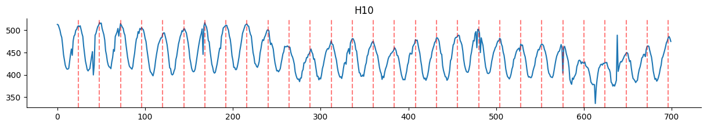
    


Vamos verificar e construir um modelo para o grupo `H20` antes de extrapolar as configurações para todos os grupos. Como não há features de entrada, usaremos um modelo tipo `NAR` no SysIdentPy. Para manter as coisas simples e rápidas, começaremos com função de base Polinomial com grau $1$.


```python
unique_id = "H20"
y_id = train[train["unique_id"] == unique_id]["y"].values.reshape(-1, 1)
y_val = test[test["unique_id"] == unique_id]["y_test"].values.reshape(-1, 1)

basis_function = Polynomial(degree=1)
model = FROLS(
    order_selection=True,
    ylag=24,
    estimator=LeastSquares(),
    basis_function=basis_function,
    model_type="NAR",
)

model.fit(y=y_id)
y_val = np.concatenate([y_id[-model.max_lag :], y_val])
y_hat = model.predict(y=y_val, forecast_horizon=48)
smape = symmetric_mean_absolute_percentage_error(
    y_val[model.max_lag : :], y_hat[model.max_lag : :]
)

plot_results(
    y=y_val[model.max_lag :],
    yhat=y_hat[model.max_lag :],
    n=30000,
    figsize=(15, 4),
    title=f"Grupo: {unique_id} - SMAPE {round(smape, 4)}",
)
```


    
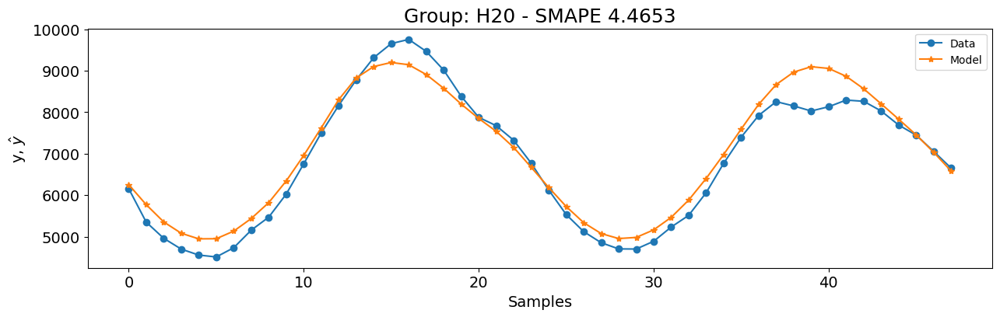
    


Provavelmente, os resultados não são ótimos e não funcionarão para todos os grupos. No entanto, vamos verificar como esta configuração se compara ao modelo vencedor da [competição de séries temporais M4](https://www.researchgate.net/publication/325901666_The_M4_Competition_Results_findings_conclusion_and_way_forward): o Exponential Smoothing with Recurrent Neural Networks ([ESRNN](https://www.sciencedirect.com/science/article/abs/pii/S0169207019301153)).


```python
esrnn_url = (
    "https://github.com/Nixtla/m4-forecasts/raw/master/forecasts/submission-118.zip"
)
esrnn_forecasts = M4Evaluation.load_benchmark("data", "Hourly", esrnn_url)
esrnn_evaluation = M4Evaluation.evaluate("data", "Hourly", esrnn_forecasts)

esrnn_evaluation
```


<div>
<style scoped>
    .dataframe tbody tr th:only-of-type {
        vertical-align: middle;
    }

    .dataframe tbody tr th {
        vertical-align: top;
    }

    .dataframe thead th {
        text-align: right;
    }
</style>
<table border="1" class="dataframe">
  <thead>
    <tr style="text-align: right;">
      <th></th>
      <th>SMAPE</th>
      <th>MASE</th>
      <th>OWA</th>
    </tr>
  </thead>
  <tbody>
    <tr>
      <th>Hourly</th>
      <td>9.328443</td>
      <td>0.893046</td>
      <td>0.440163</td>
    </tr>
  </tbody>
</table>
</div>


O código a seguir levou apenas 49 segundos para rodar na minha máquina (processador AMD Ryzen 5 5600x, 32GB RAM a 3600MHz). Devido à sua eficiência, não criei uma versão paralela. Ao final deste caso de uso, você verá como o SysIdentPy pode ser rápido e eficaz, entregando bons resultados sem muita otimização.


```python
r = []
ds_test = list(range(701, 749))
for u_id, data in train.groupby(by=["unique_id"], observed=True):
    y_id = data["y"].values.reshape(-1, 1)
    basis_function = Polynomial(degree=1)
    model = FROLS(
        ylag=24,
        estimator=LeastSquares(),
        basis_function=basis_function,
        model_type="NAR",
        n_info_values=25,
    )
    try:
        model.fit(y=y_id)
        y_val = y_id[-model.max_lag :].reshape(-1, 1)
        y_hat = model.predict(y=y_val, forecast_horizon=48)
        r.append(
            [
                u_id * len(y_hat[model.max_lag : :]),
                ds_test,
                y_hat[model.max_lag : :].ravel(),
            ]
        )
    except Exception:
        print(f"Problema com {u_id}")

results_1 = pd.DataFrame(r, columns=["unique_id", "ds", "NARMAX_1"]).explode(
    ["unique_id", "ds", "NARMAX_1"]
)
results_1["NARMAX_1"] = results_1["NARMAX_1"].astype(float)  # .clip(lower=10)
pivot_df = results_1.pivot(index="unique_id", columns="ds", values="NARMAX_1")
results = pivot_df.to_numpy()

M4Evaluation.evaluate("data", "Hourly", results)
```


<div>
<style scoped>
    .dataframe tbody tr th:only-of-type {
        vertical-align: middle;
    }

    .dataframe tbody tr th {
        vertical-align: top;
    }

    .dataframe thead th {
        text-align: right;
    }
</style>
<table border="1" class="dataframe">
  <thead>
    <tr style="text-align: right;">
      <th></th>
      <th>SMAPE</th>
      <th>MASE</th>
      <th>OWA</th>
    </tr>
  </thead>
  <tbody>
    <tr>
      <th>Hourly</th>
      <td>16.034196</td>
      <td>0.958083</td>
      <td>0.636132</td>
    </tr>
  </tbody>
</table>
</div>


Os resultados iniciais são razoáveis, mas não correspondem exatamente ao desempenho do `ESRNN`. Esses resultados são baseados apenas em nossa primeira suposição. Para entender melhor o desempenho, vamos examinar os grupos com os piores resultados.


O gráfico a seguir ilustra dois desses grupos, `H147` e `H136`. Ambos exibem um padrão sazonal de 24 horas.


No entanto, uma observação mais atenta revela um insight adicional: além do padrão diário, essas séries também mostram um padrão semanal. Observe como os dados parecem quando dividimos a série em segmentos semanais.


```python
xcoords = list(range(0, 168 * 5, 168))
filtered_train = train[train["unique_id"] == "H147"].reset_index(drop=True)

fig, ax = plt.subplots(figsize=(10, 1.5 * len(xcoords[1:])))
for i, start in enumerate(xcoords[:-1]):
    end = xcoords[i + 1]
    ax = fig.add_subplot(len(xcoords[1:]), 1, i + 1)
    filtered_train["y"].iloc[start:end].plot(ax=ax)
    ax.set_title(f"H147 -> Fatia {i+1}: Hora {start} a {end-1}")

plt.tight_layout()
plt.show()
```


    
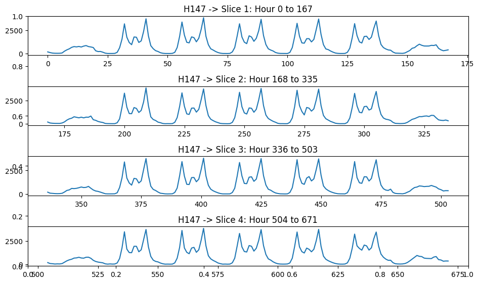
    


Portanto, construiremos modelos definindo `ylag=168`.

> Note que este é um número muito alto para lags, então tenha cuidado se quiser tentar com graus polinomiais mais altos porque o tempo para rodar os modelos pode aumentar significativamente. Tentei algumas configurações com grau polinomial igual a 2 e levou apenas $6$ minutos para rodar (ainda menos, usando `AOLS`), sem fazer o código rodar em paralelo. Como você pode ver, o SysIdentPy pode ser muito rápido e você pode torná-lo mais rápido aplicando paralelização.


```python
# isso levou 2min para rodar no meu computador.
r = []
ds_test = list(range(701, 749))
for u_id, data in train.groupby(by=["unique_id"], observed=True):
    y_id = data["y"].values.reshape(-1, 1)
    basis_function = Polynomial(degree=1)
    model = FROLS(
        ylag=168,
        estimator=LeastSquares(),
        basis_function=basis_function,
        model_type="NAR",
    )
    try:
        model.fit(y=y_id)
        y_val = y_id[-model.max_lag :].reshape(-1, 1)
        y_hat = model.predict(y=y_val, forecast_horizon=48)
        r.append(
            [
                u_id * len(y_hat[model.max_lag : :]),
                ds_test,
                y_hat[model.max_lag : :].ravel(),
            ]
        )
    except Exception:
        print(f"Problema com {u_id}")

results_1 = pd.DataFrame(r, columns=["unique_id", "ds", "NARMAX_1"]).explode(
    ["unique_id", "ds", "NARMAX_1"]
)
results_1["NARMAX_1"] = results_1["NARMAX_1"].astype(float)  # .clip(lower=10)
pivot_df = results_1.pivot(index="unique_id", columns="ds", values="NARMAX_1")
results = pivot_df.to_numpy()
M4Evaluation.evaluate("data", "Hourly", results)
```


<div>
<style scoped>
    .dataframe tbody tr th:only-of-type {
        vertical-align: middle;
    }

    .dataframe tbody tr th {
        vertical-align: top;
    }

    .dataframe thead th {
        text-align: right;
    }
</style>
<table border="1" class="dataframe">
  <thead>
    <tr style="text-align: right;">
      <th></th>
      <th>SMAPE</th>
      <th>MASE</th>
      <th>OWA</th>
    </tr>
  </thead>
  <tbody>
    <tr>
      <th>Hourly</th>
      <td>10.475998</td>
      <td>0.773749</td>
      <td>0.446471</td>
    </tr>
  </tbody>
</table>
</div>


Agora, os resultados estão muito mais próximos dos do modelo `ESRNN`! Enquanto o Erro Percentual Absoluto Médio Simétrico (`SMAPE`) é ligeiramente pior, o Erro Escalado Absoluto Médio (`MASE`) é melhor quando comparado ao `ESRNN`, levando a uma métrica de Média Ponderada Geral (`OWA`) muito semelhante. Notavelmente, esses resultados são alcançados usando apenas modelos `AR` simples. A seguir, vamos ver se o método `AOLS` pode fornecer resultados ainda melhores.


```python
r = []
ds_test = list(range(701, 749))
for u_id, data in train.groupby(by=["unique_id"], observed=True):
    y_id = data["y"].values.reshape(-1, 1)
    basis_function = Polynomial(degree=1)
    model = AOLS(
        ylag=168,
        basis_function=basis_function,
        model_type="NAR",
        # devido às configurações de lag alto, k foi aumentado para 6 como um palpite inicial
        k=6,
    )
    try:
        model.fit(y=y_id)
        y_val = y_id[-model.max_lag :].reshape(-1, 1)
        y_hat = model.predict(y=y_val, forecast_horizon=48)
        r.append(
            [
                u_id * len(y_hat[model.max_lag : :]),
                ds_test,
                y_hat[model.max_lag : :].ravel(),
            ]
        )
    except Exception:
        print(f"Problema com {u_id}")

results_1 = pd.DataFrame(r, columns=["unique_id", "ds", "NARMAX_1"]).explode(
    ["unique_id", "ds", "NARMAX_1"]
)
results_1["NARMAX_1"] = results_1["NARMAX_1"].astype(float)  # .clip(lower=10)
pivot_df = results_1.pivot(index="unique_id", columns="ds", values="NARMAX_1")
results = pivot_df.to_numpy()
M4Evaluation.evaluate("data", "Hourly", results)
```


<div>
<style scoped>
    .dataframe tbody tr th:only-of-type {
        vertical-align: middle;
    }

    .dataframe tbody tr th {
        vertical-align: top;
    }

    .dataframe thead th {
        text-align: right;
    }
</style>
<table border="1" class="dataframe">
  <thead>
    <tr style="text-align: right;">
      <th></th>
      <th>SMAPE</th>
      <th>MASE</th>
      <th>OWA</th>
    </tr>
  </thead>
  <tbody>
    <tr>
      <th>Hourly</th>
      <td>9.951141</td>
      <td>0.809965</td>
      <td>0.439755</td>
    </tr>
  </tbody>
</table>
</div>


A Média Ponderada Geral (`OWA`) é ainda melhor que a do modelo `ESRNN`! Além disso, o método `AOLS` foi incrivelmente eficiente, levando apenas **6 segundos para rodar**. Esta combinação de alto desempenho e execução rápida torna o `AOLS` uma alternativa atraente para previsão de séries temporais em casos com múltiplas séries.

Antes de terminar, vamos verificar como o desempenho do modelo `H147` melhorou com a configuração `ylag=168`.


> Com base no artigo de benchmark M4, também poderíamos limitar as previsões menores que 10 para 10 e os resultados seriam ligeiramente melhores. Mas isso fica a critério do usuário.

Poderíamos alcançar um desempenho ainda melhor com algum ajuste fino da configuração do modelo. No entanto, deixarei a exploração desses ajustes alternativos como um exercício para o usuário. Porém, tenha em mente que experimentar com diferentes configurações nem sempre garante resultados melhores. Um conhecimento teórico mais profundo pode frequentemente levá-lo a melhores configurações e, portanto, melhores resultados.

## Dispositivo Elétrico Acoplado

O dataset CE8 de acionamentos elétricos acoplados [dataset - Nonlinear Benchmark](https://www.nonlinearbenchmark.org/benchmarks) apresenta um caso de uso interessante para demonstrar o desempenho do SysIdentPy. Este sistema envolve dois motores elétricos acionando uma polia com uma correia flexível, criando um ambiente dinâmico ideal para testar ferramentas de identificação de sistemas.

> O [site de benchmarks não lineares](https://www.nonlinearbenchmark.org/benchmarks) representa uma contribuição significativa para a comunidade de identificação de sistemas e aprendizado de máquina. Os usuários são encorajados a explorar todos os artigos referenciados no site.

### Visão Geral do Sistema

O sistema CE8, ilustrado na Figura 1, apresenta:
- **Dois Motores Elétricos**: Estes motores controlam independentemente a tensão e a velocidade da correia, fornecendo controle simétrico em torno do zero. Isso permite movimentos tanto horários quanto anti-horários.
- **Mecanismo de Polia**: A polia é suportada por uma mola, introduzindo um modo dinâmico levemente amortecido que adiciona complexidade ao sistema.
- **Foco no Controle de Velocidade**: O foco principal é o sistema de controle de velocidade. A velocidade angular da polia é medida usando um contador de pulsos, que é insensível à direção da velocidade.


> Figura 1. Design do sistema CE8.

### Sensor e Filtragem

O processo de medição envolve:
- **Contador de Pulsos**: Este sensor mede a velocidade angular da polia sem considerar a direção.
- **Filtragem Analógica Passa-Baixa**: Reduz o ruído de alta frequência, seguido por filtragem anti-aliasing para preparar o sinal para processamento digital. Os efeitos dinâmicos são principalmente influenciados pelas constantes de tempo do acionamento elétrico e pela mola, com a filtragem passa-baixa tendo impacto mínimo na saída.

### Resultados SOTA

O SysIdentPy pode ser usado para construir modelos robustos para identificar e modelar as dinâmicas complexas do sistema CE8. O desempenho será comparado com um benchmark fornecido por [Max D. Champneys, Gerben I. Beintema, Roland Tóth, Maarten Schoukens, and Timothy J. Rogers - Baselines for Nonlinear Benchmarks, Workshop on Nonlinear System Identification Benchmarks, 2024.](https://arxiv.org/pdf/2405.10779)


O benchmark avalia a métrica média entre os dois experimentos. Por isso o método SOTA não tem a melhor métrica para o `teste 1`, mas ainda é o melhor no geral. O objetivo deste estudo de caso não é apenas demonstrar a robustez do SysIdentPy, mas também fornecer insights valiosos sobre suas aplicações práticas em sistemas dinâmicos do mundo real.

### Pacotes e Versões Necessários

Para garantir que você possa replicar este estudo de caso, é essencial usar versões específicas dos pacotes necessários. Abaixo está uma lista dos pacotes junto com suas respectivas versões necessárias para executar os estudos de caso de forma eficaz.

Para instalar todos os pacotes necessários, você pode criar um arquivo `requirements.txt` com o seguinte conteúdo:

```
sysidentpy==0.4.0
pandas==2.2.2
numpy==1.26.0
matplotlib==3.8.4
nonlinear_benchmarks==0.1.2
```

Então, instale os pacotes usando:
```
pip install -r requirements.txt
```

- Certifique-se de usar um ambiente virtual para evitar conflitos entre versões de pacotes.
- As versões especificadas são baseadas na compatibilidade com os exemplos de código fornecidos. Se você estiver usando versões diferentes, alguns ajustes no código podem ser necessários.

### Configuração do SysIdentPy

Nesta seção, demonstraremos a aplicação do SysIdentPy ao dataset CE8 de acionamentos elétricos acoplados. Este exemplo mostra o desempenho robusto do SysIdentPy na modelagem e identificação de sistemas dinâmicos complexos. O código a seguir irá guiá-lo através do processo de carregamento do dataset, configuração dos parâmetros do SysIdentPy e construção de um modelo para o sistema CE8.

Este exemplo prático ajudará os usuários a entender como utilizar efetivamente o SysIdentPy para suas próprias tarefas de identificação de sistemas, aproveitando seus recursos avançados para lidar com as complexidades de sistemas dinâmicos do mundo real. Vamos mergulhar no código e explorar as capacidades do SysIdentPy.


```python
import numpy as np
import pandas as pd
import matplotlib.pyplot as plt

from sysidentpy.model_structure_selection import FROLS
from sysidentpy.basis_function import Polynomial, Fourier
from sysidentpy.utils.display_results import results
from sysidentpy.parameter_estimation import LeastSquares
from sysidentpy.metrics import root_mean_squared_error
from sysidentpy.utils.plotting import plot_results

import nonlinear_benchmarks

train_val, test = nonlinear_benchmarks.CED(atleast_2d=True)
data_train_1, data_train_2 = train_val
data_test_1, data_test_2 = test
```

Usamos o pacote `nonlinear_benchmarks` para carregar os dados. O usuário é direcionado à documentação do pacote [GerbenBeintema - nonlinear_benchmarks: The official dataload for nonlinear benchmark datasets](https://github.com/GerbenBeintema/nonlinear_benchmarks/tree/master) para verificar os detalhes de como usá-lo.

O gráfico a seguir detalha os dados de treinamento e teste de ambos os experimentos. Aqui estamos tentando obter dois modelos, um para cada experimento, que tenham um desempenho melhor que os baselines mencionados.


```python
plt.plot(data_train_1.u)
plt.plot(data_train_1.y)
plt.title("Experimento 1: dados de treinamento")
plt.show()

plt.plot(data_test_1.u)
plt.plot(data_test_1.y)
plt.title("Experimento 1: dados de teste")
plt.show()

plt.plot(data_train_2.u)
plt.plot(data_train_2.y)
plt.title("Experimento 2: dados de treinamento")
plt.show()

plt.plot(data_test_2.u)
plt.plot(data_test_2.y)
plt.title("Experimento 2: dados de teste")
plt.show()
```


    
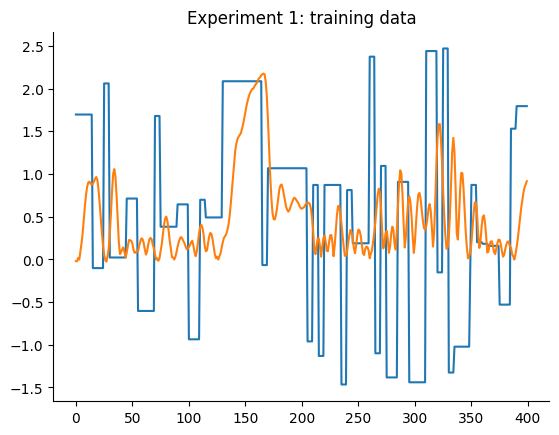
    


    
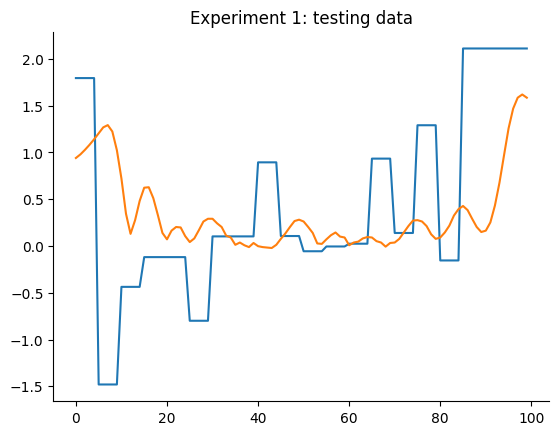
    


    
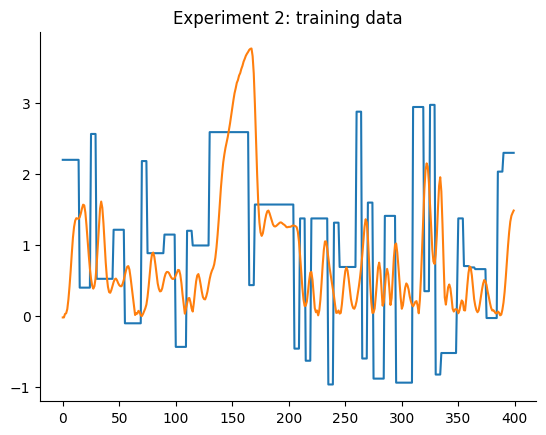
    


    
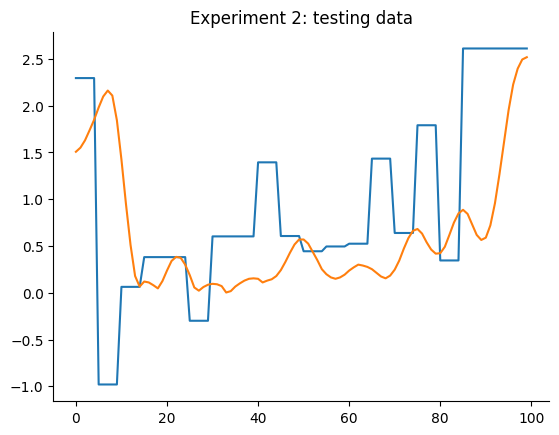
    


### Resultados

Primeiro, definiremos exatamente a mesma configuração para construir modelos para ambos os experimentos. Podemos ter modelos melhores otimizando as configurações individualmente, mas começaremos de forma simples.

Uma configuração básica do FROLS usando uma função base polinomial com grau igual a 2 é definida. O critério de informação será o padrão, o `aic`. Os `xlag` e `ylag` são definidos como $7$ neste primeiro exemplo.

Modelo para o experimento 1:


```python
y_train = data_train_1.y
y_test = data_test_1.y
x_train = data_train_1.u
x_test = data_test_1.u

n = data_test_1.state_initialization_window_length

basis_function = Polynomial(degree=2)
model = FROLS(
    xlag=7,
    ylag=7,
    basis_function=basis_function,
    estimator=LeastSquares(),
    info_criteria="aic",
    n_info_values=120,
)

model.fit(X=x_train, y=y_train)
y_test = np.concatenate([y_train[-model.max_lag :], y_test])
x_test = np.concatenate([x_train[-model.max_lag :], x_test])
yhat = model.predict(X=x_test, y=y_test[: model.max_lag, :])
rmse = root_mean_squared_error(y_test[model.max_lag + n :], yhat[model.max_lag + n :])
plot_results(
    y=y_test[model.max_lag :],
    yhat=yhat[model.max_lag :],
    n=10000,
    title=f"Simulação Free Run. Modelo 1 -> RMSE: {round(rmse, 4)}",
)
```


    
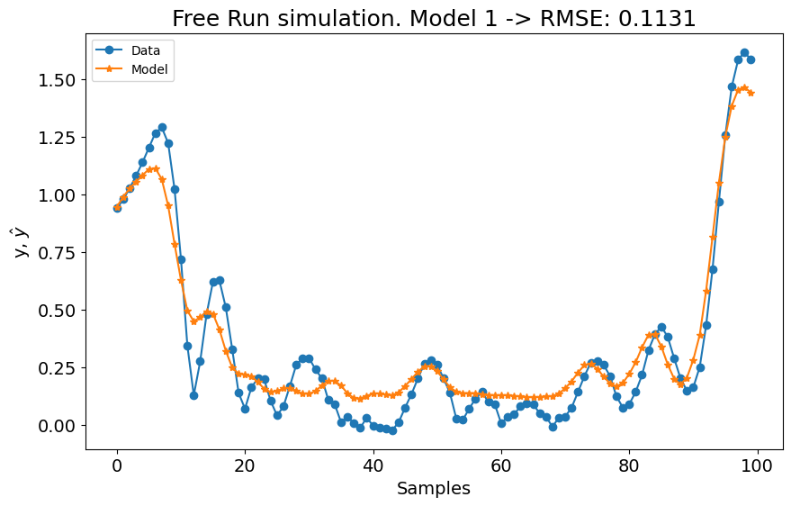
    


Modelo para o experimento 2:


```python
y_train = data_train_2.y
y_test = data_test_2.y
x_train = data_train_2.u
x_test = data_test_2.u

n = data_test_2.state_initialization_window_length

basis_function = Polynomial(degree=2)
model = FROLS(
    xlag=7,
    ylag=7,
    basis_function=basis_function,
    estimator=LeastSquares(),
    info_criteria="aic",
    n_info_values=120,
)

model.fit(X=x_train, y=y_train)
y_test = np.concatenate([y_train[-model.max_lag :], y_test])
x_test = np.concatenate([x_train[-model.max_lag :], x_test])
yhat = model.predict(X=x_test, y=y_test[: model.max_lag, :])
rmse = root_mean_squared_error(y_test[model.max_lag + n :], yhat[model.max_lag + n :])
plot_results(
    y=y_test[model.max_lag :],
    yhat=yhat[model.max_lag :],
    n=10000,
    title=f"Simulação Free Run. Modelo 2 -> RMSE: {round(rmse, 4)}",
)
```


    
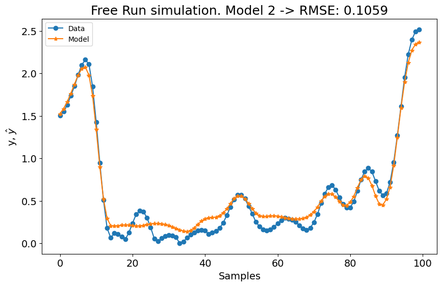
    


A primeira configuração para o experimento 1 já é melhor que os modelos **LTI ARX**, **LTI SS**, **GRU**, **LSTM**, **MLP NARX**, **MLP FIR**, **OLSTM** e **SOTA** mostrados na tabela do benchmark. Melhor que 8 de 11 modelos mostrados no benchmark. Para o experimento 2, é melhor que **LTI ARX**, **LTI SS**, **GRU**, **RNN**, **LSTM**, **OLSTM** e **pNARX** (7 de 11). É um bom começo, mas vamos verificar se o desempenho melhora se definirmos um lag maior para `xlag` e `ylag`.

A métrica média é $(0.1131 + 0.1059)/2 = 0.1095$, o que é muito bom, mas pior que o SOTA ($0.0945$). Agora vamos aumentar os lags para `x` e `y` para verificar se obtemos um modelo melhor. Antes de aumentar os lags, o critério de informação é mostrado:


```python
xaxis = np.arange(1, model.n_info_values + 1)
plt.plot(xaxis, model.info_values)
plt.xlabel("n_terms")
plt.ylabel("Critério de Informação")
```


    Text(0, 0.5, 'Critério de Informação')


    
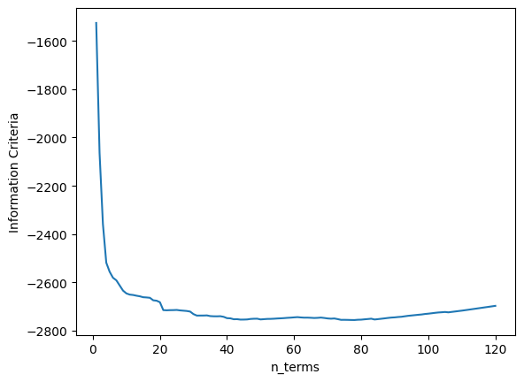
    


Pode-se observar que após 22 regressores, adicionar novos regressores não melhora o desempenho do modelo (considerando a configuração definida para aquele modelo). Como queremos experimentar modelos com lags maiores e grau de não linearidade maior, o critério de parada será alterado para `err_tol` em vez de critério de informação. Isso fará o algoritmo rodar consideravelmente mais rápido.


```python
# experimento 1
y_train = data_train_1.y
y_test = data_test_1.y
x_train = data_train_1.u
x_test = data_test_1.u

n = data_test_1.state_initialization_window_length

basis_function = Polynomial(degree=2)
model = FROLS(
    xlag=14,
    ylag=14,
    basis_function=basis_function,
    estimator=LeastSquares(),
    err_tol=0.9996,
    n_terms=22,
    order_selection=False,
)

model.fit(X=x_train, y=y_train)
print(model.final_model.shape, model.err.sum())
y_test = np.concatenate([y_train[-model.max_lag :], y_test])
x_test = np.concatenate([x_train[-model.max_lag :], x_test])
yhat = model.predict(X=x_test, y=y_test[: model.max_lag, :])

rmse = root_mean_squared_error(y_test[model.max_lag + n :], yhat[model.max_lag + n :])

plot_results(
    y=y_test[model.max_lag :],
    yhat=yhat[model.max_lag :],
    n=10000,
    title=f"Simulação Free Run. Modelo 1 -> RMSE: {round(rmse, 4)}",
)
```

    (22, 2) 0.9970964868326048


    
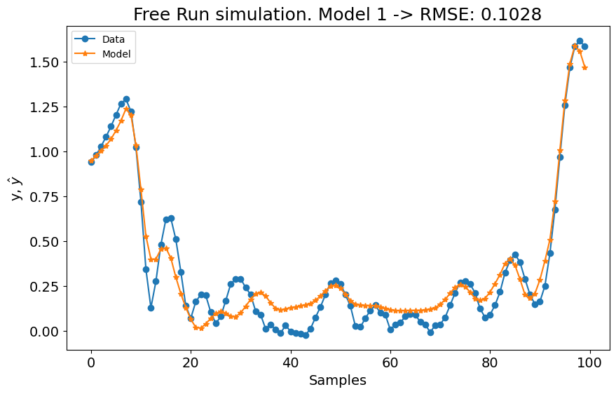
    


```python
# experimento 2
y_train = data_train_2.y
y_test = data_test_2.y
x_train = data_train_2.u
x_test = data_test_2.u

n = data_test_2.state_initialization_window_length

basis_function = Polynomial(degree=2)
model = FROLS(
    xlag=14,
    ylag=14,
    basis_function=basis_function,
    estimator=LeastSquares(),
    info_criteria="aicc",
    err_tol=0.9996,
    n_terms=22,
    order_selection=False,
)

model.fit(X=x_train, y=y_train)
y_test = np.concatenate([y_train[-model.max_lag :], y_test])
x_test = np.concatenate([x_train[-model.max_lag :], x_test])
yhat = model.predict(X=x_test, y=y_test[: model.max_lag, :])

rmse = root_mean_squared_error(y_test[model.max_lag + n :], yhat[model.max_lag + n :])

plot_results(
    y=y_test[model.max_lag :],
    yhat=yhat[model.max_lag :],
    n=10000,
    title=f"Simulação Free Run. Modelo 2 -> RMSE: {round(rmse, 4)}",
)
```


    
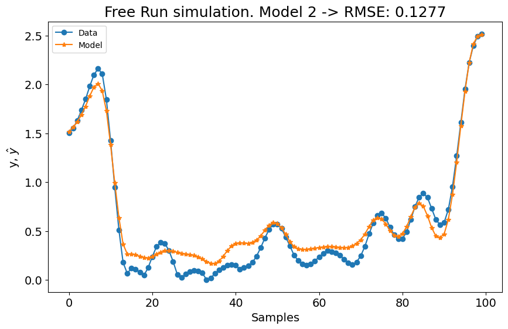
    


No primeiro experimento, o modelo mostrou uma leve melhoria, enquanto o desempenho do segundo experimento experimentou uma pequena queda. Aumentar as configurações de lag com estas configurações não resultou em mudanças significativas. Portanto, vamos definir o grau polinomial para $3$ e aumentar o número de termos para construir o modelo para `n_terms=40` se o `err_tol` não for atingido. É importante notar que estes valores são escolhidos empiricamente. Também poderíamos ajustar a técnica de estimação de parâmetros, o `err_tol`, o algoritmo de seleção de estrutura do modelo e a função base, entre outros fatores. Os usuários são encorajados a empregar técnicas de ajuste de hiperparâmetros para encontrar as combinações ótimas de hiperparâmetros.


```python
# experimento 1
y_train = data_train_1.y
y_test = data_test_1.y
x_train = data_train_1.u
x_test = data_test_1.u

n = data_test_1.state_initialization_window_length

basis_function = Polynomial(degree=3)
model = FROLS(
    xlag=14,
    ylag=14,
    basis_function=basis_function,
    estimator=LeastSquares(),
    err_tol=0.9996,
    n_terms=40,
    order_selection=False,
)

model.fit(X=x_train, y=y_train)
print(model.final_model.shape, model.err.sum())
y_test = np.concatenate([y_train[-model.max_lag :], y_test])
x_test = np.concatenate([x_train[-model.max_lag :], x_test])
yhat = model.predict(X=x_test, y=y_test[: model.max_lag, :])

rmse = root_mean_squared_error(y_test[model.max_lag + n :], yhat[model.max_lag + n :])

plot_results(
    y=y_test[model.max_lag :],
    yhat=yhat[model.max_lag :],
    n=10000,
    title=f"Simulação Free Run. Modelo 1 -> RMSE: {round(rmse, 4)}",
)
```

    (40, 3) 0.9982136069197526


    
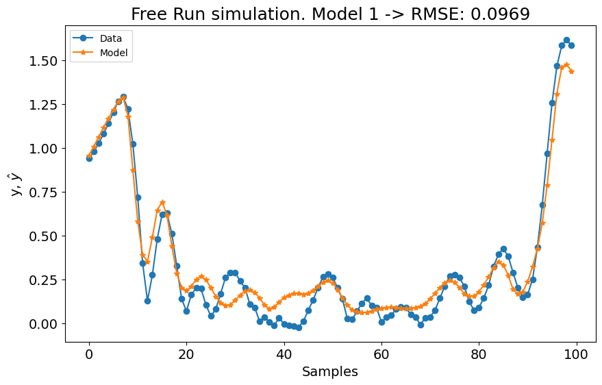
    


```python
# experimento 2
y_train = data_train_2.y
y_test = data_test_2.y
x_train = data_train_2.u
x_test = data_test_2.u

n = data_test_2.state_initialization_window_length

basis_function = Polynomial(degree=3)
model = FROLS(
    xlag=14,
    ylag=14,
    basis_function=basis_function,
    estimator=LeastSquares(),
    info_criteria="aicc",
    err_tol=0.9996,
    n_terms=40,
    order_selection=False,
)

model.fit(X=x_train, y=y_train)
y_test = np.concatenate([y_train[-model.max_lag :], y_test])
x_test = np.concatenate([x_train[-model.max_lag :], x_test])
yhat = model.predict(X=x_test, y=y_test[: model.max_lag, :])

rmse = root_mean_squared_error(y_test[model.max_lag + n :], yhat[model.max_lag + n :])

plot_results(
    y=y_test[model.max_lag :],
    yhat=yhat[model.max_lag :],
    n=10000,
    title=f"Simulação Free Run. Modelo 2 -> RMSE: {round(rmse, 4)}",
)
```


    
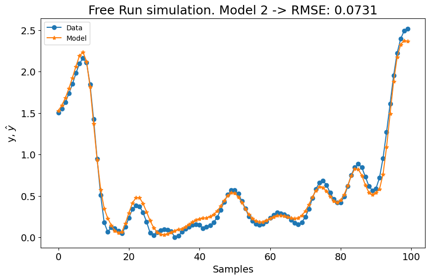
    


Como mostrado no gráfico, superamos os resultados do estado da arte (SOTA) com uma métrica média de $(0.0969 + 0.0731)/2 = 0.0849$. Além disso, a métrica para o primeiro experimento iguala o melhor modelo no benchmark, e a métrica para o segundo experimento supera levemente o melhor modelo do benchmark. Usando a mesma configuração para ambos os modelos, alcançamos os melhores resultados gerais!

## Wiener-Hammerstein

O conteúdo da descrição deriva principalmente do [site do benchmark - Nonlinear Benchmark](https://www.nonlinearbenchmark.org/benchmarks) e do [artigo associado - Wiener-Hammerstein benchmark with process noise](https://data.4tu.nl/articles/_/12952124). Para uma descrição detalhada, os leitores são encaminhados às referências vinculadas.

> O site de benchmarks não lineares representa uma contribuição significativa para a comunidade de identificação de sistemas e aprendizado de máquina. Os usuários são encorajados a explorar todos os artigos referenciados no site.

Este benchmark foca em um circuito eletrônico Wiener-Hammerstein onde o ruído de processo desempenha um papel significativo na distorção do sinal de saída.

A estrutura Wiener-Hammerstein é um sistema orientado a blocos bem conhecido que contém uma não linearidade estática intercalada entre dois blocos Lineares Invariantes no Tempo (LTI) (Figura 2). Este arranjo apresenta um problema de identificação desafiador devido à presença desses blocos LTI.


> Figura 2: o sistema Wiener-Hammerstein

Na Figura 2, o sistema Wiener-Hammerstein é ilustrado com ruído de processo $e_x(t)$ entrando antes da não linearidade estática $f(x)$, intercalado entre blocos LTI representados por $R(s)$ e $S(s)$ na entrada e saída, respectivamente. Além disso, pequenas fontes de ruído desprezíveis $e_u(t)$ e $e_y(t)$ afetam os canais de medição. Os sinais de entrada e saída medidos são denotados como $u_m(t)$ e $y_m(t)$.

O primeiro bloco LTI $R(s)$ é efetivamente modelado como um filtro passa-baixa de terceira ordem. O segundo subsistema LTI $S(s)$ é configurado como um filtro Chebyshev inverso com atenuação de banda de parada de $40 dB$ e frequência de corte de $5 kHz$. Notavelmente, $S(s)$ inclui um zero de transmissão dentro da faixa de frequência operacional, complicando sua inversão.

A não linearidade estática $f(x)$ é implementada usando uma rede de diodo-resistor, resultando em não linearidade de saturação. O ruído de processo $e_x(t)$ é introduzido como ruído gaussiano branco filtrado, gerado a partir de um filtro Butterworth passa-baixa de terceira ordem em tempo discreto seguido por zero-order hold e filtragem de reconstrução passa-baixa analógica com corte de $20 kHz$.

As fontes de ruído de medição $e_u(t)$ e $e_y(t)$ são mínimas comparadas a $e_x(t)$. As entradas do sistema e o ruído de processo são gerados usando um Gerador de Forma de Onda Arbitrária (AWG), especificamente o Agilent/HP E1445A, amostrando a $78125 Hz$, sincronizado com um sistema de aquisição (Agilent/HP E1430A) para garantir coerência de fase e prevenir erros de vazamento. O buffering entre as placas de aquisição e as entradas e saídas do sistema minimiza a distorção do equipamento de medição.

O benchmark fornece dois sinais de teste padrão através do site de benchmarking: um multisine de fase aleatória e um sinal de varredura senoidal. Ambos os sinais têm um valor $rms$ de $0.71 Vrms$ e cobrem frequências de DC a $15 kHz$ (excluindo DC). A varredura senoidal abrange esta faixa de frequência a uma taxa de $4.29 MHz/min$. Estes conjuntos de teste servem como alvos para avaliar o desempenho do modelo, enfatizando representação precisa sob condições variadas.

O benchmark Wiener-Hammerstein destaca três desafios principais de identificação de sistemas não lineares:

1. **Ruído de Processo:** Significativo no sistema, influenciando a fidelidade da saída.
2. **Não Linearidade Estática:** Indiretamente acessível a partir de dados medidos, apresentando desafios de identificação.
3. **Dinâmicas de Saída:** Inversão complexa devido à presença de zero de transmissão em $S(s)$.

O objetivo deste benchmark é desenvolver e validar modelos robustos usando dados de estimação separados, garantindo caracterização precisa do comportamento do sistema Wiener-Hammerstein.

### Pacotes Necessários e Versões

Para garantir que você possa replicar este estudo de caso, é essencial usar versões específicas dos pacotes necessários. Abaixo está uma lista dos pacotes junto com suas respectivas versões necessárias para executar os estudos de caso efetivamente.

Para instalar todos os pacotes necessários, você pode criar um arquivo `requirements.txt` com o seguinte conteúdo:

```
sysidentpy==0.4.0
pandas==2.2.2
numpy==1.26.0
matplotlib==3.8.4
nonlinear_benchmarks==0.1.2
```

Então, instale os pacotes usando:
```
pip install -r requirements.txt
```

- Certifique-se de usar um ambiente virtual para evitar conflitos entre versões de pacotes.
- As versões especificadas são baseadas na compatibilidade com os exemplos de código fornecidos. Se você estiver usando versões diferentes, alguns ajustes no código podem ser necessários.

### Configuração do SysIdentPy

Nesta seção, demonstraremos a aplicação do SysIdentPy ao dataset do sistema Wiener-Hammerstein. O código a seguir guiará você através do processo de carregamento do dataset, configuração dos parâmetros do SysIdentPy e construção de um modelo para o sistema Wiener-Hammerstein.


```python
import numpy as np
import pandas as pd
import matplotlib.pyplot as plt

from sysidentpy.model_structure_selection import FROLS, AOLS, MetaMSS
from sysidentpy.basis_function import Polynomial, Fourier
from sysidentpy.utils.display_results import results
from sysidentpy.parameter_estimation import (
    LeastSquares,
    BoundedVariableLeastSquares,
    NonNegativeLeastSquares,
    LeastSquaresMinimalResidual,
)

from sysidentpy.metrics import root_mean_squared_error
from sysidentpy.utils.plotting import plot_results

import nonlinear_benchmarks

train_val, test = nonlinear_benchmarks.WienerHammerBenchMark(atleast_2d=True)
x_train, y_train = train_val
x_test, y_test = test
```

Usamos o pacote `nonlinear_benchmarks` para carregar os dados. O usuário é encaminhado à [documentação do pacote](https://github.com/GerbenBeintema/nonlinear_benchmarks/tree/master) para verificar os detalhes de como usá-lo.

O gráfico a seguir detalha os dados de treinamento e teste do experimento.


```python
plot_n = 800

plt.figure(figsize=(15, 4))
plt.plot(x_train[:plot_n])
plt.plot(y_train[:plot_n])
plt.title("Experimento: dados de treinamento")
plt.legend(["x_train", "y_train"])
plt.show()

plt.figure(figsize=(15, 4))
plt.plot(x_test[:plot_n])
plt.plot(y_test[:plot_n])
plt.title("Experimento: dados de teste")
plt.legend(["x_test", "y_test"])
plt.show()
```


    
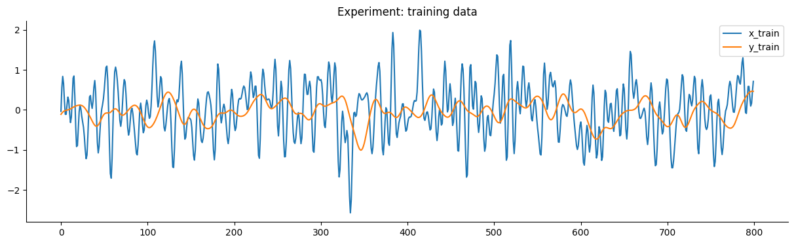
    


    
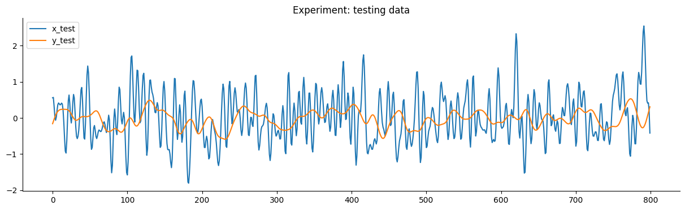
    


O objetivo deste benchmark é obter um modelo que tenha um desempenho melhor que o modelo SOTA fornecido no artigo de benchmarking.


> Resultados estado-da-arte apresentados no [artigo de benchmarking](https://arxiv.org/pdf/2405.10779). Nesta seção estamos trabalhando apenas com os resultados Wiener-Hammerstein, que são apresentados na coluna $W-H$.

### Resultados

Começaremos com uma configuração básica do FROLS usando uma função de base polinomial com grau igual a 2. O `xlag` e `ylag` são definidos como $7$ neste primeiro exemplo. Como o dataset é consideravelmente grande, começaremos com `n_info_values=50`. Isso significa que o algoritmo FROLS não incluirá todos os regressores ao calcular os critérios de informação usados para determinar a ordem do modelo. Embora esta abordagem possa resultar em um modelo sub-ótimo, é um ponto de partida razoável para nossa primeira tentativa.


```python
# 3min para rodar na minha máquina (amd 5600x, 32gb ram)

n = test.state_initialization_window_length

basis_function = Polynomial(degree=2)
model = FROLS(
    xlag=7,
    ylag=7,
    basis_function=basis_function,
    estimator=LeastSquares(unbiased=False),
    n_info_values=50,
)

model.fit(X=x_train, y=y_train)
y_test = np.concatenate([y_train[-model.max_lag :], y_test])
x_test = np.concatenate([x_train[-model.max_lag :], x_test])
yhat = model.predict(X=x_test, y=y_test[: model.max_lag, :])
rmse = root_mean_squared_error(y_test[model.max_lag + n :], yhat[model.max_lag + n :])
rmse_sota = rmse / y_test.std()
plot_results(
    y=y_test[model.max_lag :],
    yhat=yhat[model.max_lag :],
    n=1000,
    title=f"SysIdentPy -> RMSE: {round(rmse, 4)}, NRMSE: {round(rmse_sota, 4)}",
)
```


    
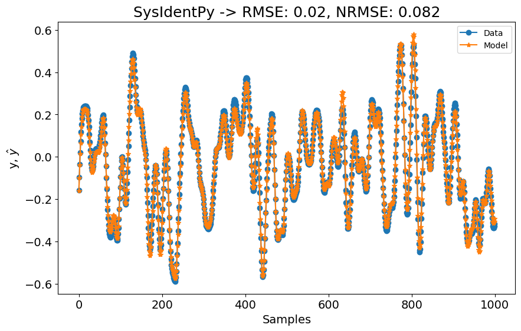
    


A primeira configuração já é melhor que os modelos **SOTA** mostrados na tabela de benchmark! Começamos usando `xlag=ylag=7` para ter uma ideia de quão bem o SysIdentPy lidaria com este dataset, mas os resultados já são muito bons! No entanto, o artigo de benchmarking indica que eles usaram lags maiores para seus modelos. Vamos verificar o que acontece se definirmos `xlag=ylag=10`.


```python
# 7min para rodar na minha máquina (amd 5600x, 32gb ram)

x_train, y_train = train_val
x_test, y_test = test

n = test.state_initialization_window_length

basis_function = Polynomial(degree=2)
model = FROLS(
    xlag=10,
    ylag=10,
    basis_function=basis_function,
    estimator=LeastSquares(unbiased=False),
    n_info_values=50,
)

model.fit(X=x_train, y=y_train)
y_test = np.concatenate([y_train[-model.max_lag :], y_test])
x_test = np.concatenate([x_train[-model.max_lag :], x_test])
yhat = model.predict(X=x_test, y=y_test[: model.max_lag, :])
rmse = root_mean_squared_error(y_test[model.max_lag + n :], yhat[model.max_lag + n :])
rmse_sota = rmse / y_test.std()
plot_results(
    y=y_test[model.max_lag :],
    yhat=yhat[model.max_lag :],
    n=1000,
    title=f"SysIdentPy -> RMSE: {round(rmse, 4)}, NRMSE: {round(rmse_sota, 4)}",
)
```


    
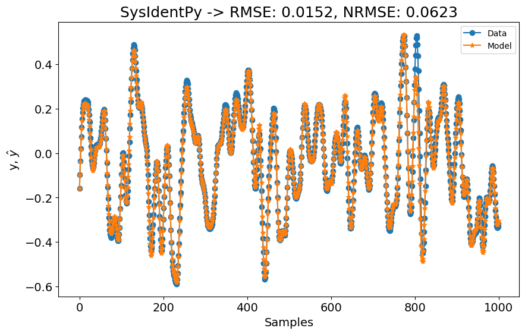
    


O desempenho é ainda melhor agora! Por enquanto, não estamos preocupados com a complexidade do modelo (mesmo neste caso onde estamos comparando com uma rede neural de estado profundo...). No entanto, se verificarmos a ordem do modelo e o gráfico `AIC`, vemos que o modelo tem 50 regressores, mas os valores de `AIC` não mudam muito após cada regressão adicionada.


```python
plt.plot(model.info_values)
```


    [<matplotlib.lines.Line2D at 0x28c0058a450>]


    
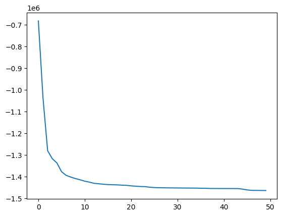
    


Então, o que acontece se definirmos um modelo com metade dos regressores?


```python
# 14 segundos para rodar

x_train, y_train = train_val
x_test, y_test = test

n = test.state_initialization_window_length

basis_function = Polynomial(degree=2)
model = FROLS(
    xlag=10,
    ylag=10,
    basis_function=basis_function,
    estimator=LeastSquares(unbiased=False),
    n_info_values=50,
    n_terms=25,
    order_selection=False,
)

model.fit(X=x_train, y=y_train)
y_test = np.concatenate([y_train[-model.max_lag :], y_test])
x_test = np.concatenate([x_train[-model.max_lag :], x_test])
yhat = model.predict(X=x_test, y=y_test[: model.max_lag, :])
rmse = root_mean_squared_error(y_test[model.max_lag + n :], yhat[model.max_lag + n :])
rmse_sota = rmse / y_test.std()
plot_results(
    y=y_test[model.max_lag :],
    yhat=yhat[model.max_lag :],
    n=1000,
    title=f"SysIdentPy -> RMSE: {round(rmse, 4)}, NRMSE: {round(rmse_sota, 4)}",
)
```


    
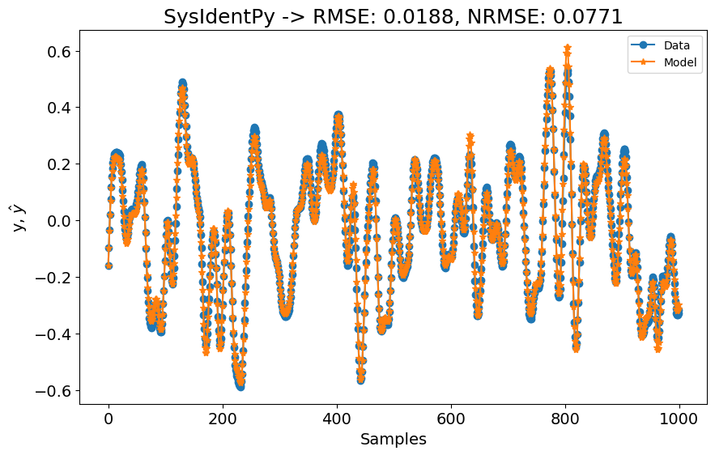
    


Como mostrado na figura acima, os resultados ainda superam os modelos SOTA apresentados no artigo de benchmarking. Os resultados SOTA do artigo provavelmente também poderiam ser melhorados. Os usuários são encorajados a explorar o [pacote deepsysid](https://github.com/AlexandraBaier/deepsysid), que pode ser usado para construir redes neurais de estado profundo.

Esta configuração básica pode servir como ponto de partida para os usuários desenvolverem modelos ainda melhores usando o SysIdentPy. Experimente!

## Previsão de Demanda de Passageiros Aéreos

## Nota

O exemplo a seguir **não** tem a intenção de afirmar que uma biblioteca é melhor que outra. O foco principal destes exemplos é mostrar que o SysIdentPy pode ser uma boa alternativa para pessoas que desejam modelar séries temporais.

Compararemos os resultados obtidos usando as bibliotecas **sktime** e **neural prophet**.

Do sktime, os seguintes modelos serão utilizados:

- AutoARIMA

- BATS

- TBATS

- Exponential Smoothing

- Prophet

- AutoETS

Por questão de brevidade, do **SysIdentPy** apenas os métodos **MetaMSS**, **AOLS**, **FROLS** (com função base polinomial) e **NARXNN** serão utilizados. Consulte a documentação do SysIdentPy para conhecer outras formas de modelagem com a biblioteca.


```python
from warnings import simplefilter
import matplotlib.pyplot as plt
import numpy as np
import pandas as pd

import scipy.signal.signaltools


def _centered(arr, newsize):
    # Return the center newsize portion of the array.
    newsize = np.asarray(newsize)
    currsize = np.array(arr.shape)
    startind = (currsize - newsize) // 2
    endind = startind + newsize
    myslice = [slice(startind[k], endind[k]) for k in range(len(endind))]
    return arr[tuple(myslice)]


scipy.signal.signaltools._centered = _centered

from sysidentpy.model_structure_selection import FROLS
from sysidentpy.model_structure_selection import AOLS
from sysidentpy.model_structure_selection import MetaMSS
from sysidentpy.basis_function import Polynomial
from sysidentpy.utils.plotting import plot_results
from torch import nn

# from sysidentpy.metrics import mean_squared_error
from sysidentpy.neural_network import NARXNN

from sktime.datasets import load_airline
from sktime.forecasting.ets import AutoETS
from sktime.forecasting.arima import ARIMA, AutoARIMA
from sktime.forecasting.base import ForecastingHorizon
from sktime.forecasting.exp_smoothing import ExponentialSmoothing
from sktime.forecasting.fbprophet import Prophet
from sktime.forecasting.tbats import TBATS
from sktime.forecasting.bats import BATS

# from sktime.forecasting.model_evaluation import evaluate
from sktime.forecasting.model_selection import temporal_train_test_split
from sktime.performance_metrics.forecasting import mean_squared_error
from sktime.utils.plotting import plot_series
from neuralprophet import NeuralProphet
from neuralprophet import set_random_seed

simplefilter("ignore", FutureWarning)
np.seterr(all="ignore")

%matplotlib inline

loss = mean_squared_error
```

## Dados de passageiros aéreos


```python
y = load_airline()
y_train, y_test = temporal_train_test_split(y, test_size=23)  # 23 amostras para teste
plot_series(y_train, y_test, labels=["y_train", "y_test"])
fh = ForecastingHorizon(y_test.index, is_relative=False)
print(y_train.shape[0], y_test.shape[0])
```

    121 23


    
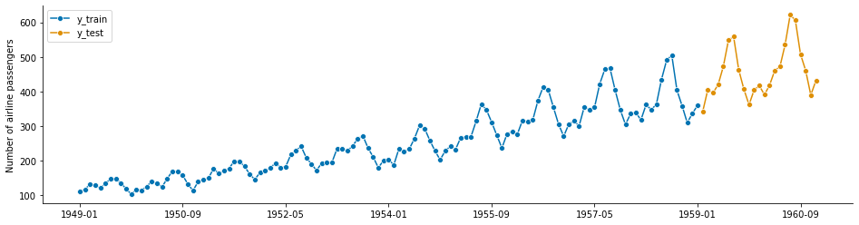
    


## Resultados

| No. | Pacote | Erro Quadrático Médio |
| --- | ------- | ------------- |
| 1 | SysIdentPy (Modelo Neural) | 316.54 |
| 2 | SysIdentPy (MetaMSS) | 450.99 |
| 3 | SysIdentPy (AOLS) | 476.64 |
| 4 | NeuralProphet | 501.24 |
| 5 | SysIdentPy (FROLS) | 805.95 |
| 6 | Exponential Smoothing | 910.52 |
| 7 | Prophet | 1186.00 |
| 8 | AutoArima | 1714.47 |
| 9 | Arima Manual | 2085.42 |
| 10 | ETS | 2590.05 |
| 11 | BATS | 7286.64 |
| 12 | TBATS | 7448.43 |


## SysIdentPy FROLS


```python
y = load_airline()
y_train, y_test = temporal_train_test_split(y, test_size=23)
y_train = y_train.values.reshape(-1, 1)
y_test = y_test.values.reshape(-1, 1)

basis_function = Polynomial(degree=1)
sysidentpy = FROLS(
    order_selection=True,
    ylag=13,  # os lags para todos os modelos serão 13
    basis_function=basis_function,
    model_type="NAR",
)
sysidentpy.fit(y=y_train)
y_test = np.concatenate([y_train[-sysidentpy.max_lag :], y_test])

yhat = sysidentpy.predict(y=y_test, forecast_horizon=23)
frols_loss = loss(
    pd.Series(y_test.flatten()[sysidentpy.max_lag :]),
    pd.Series(yhat.flatten()[sysidentpy.max_lag :]),
)
print(frols_loss)

plot_results(y=y_test[sysidentpy.max_lag :], yhat=yhat[sysidentpy.max_lag :])
```

    805.9521186338106


    
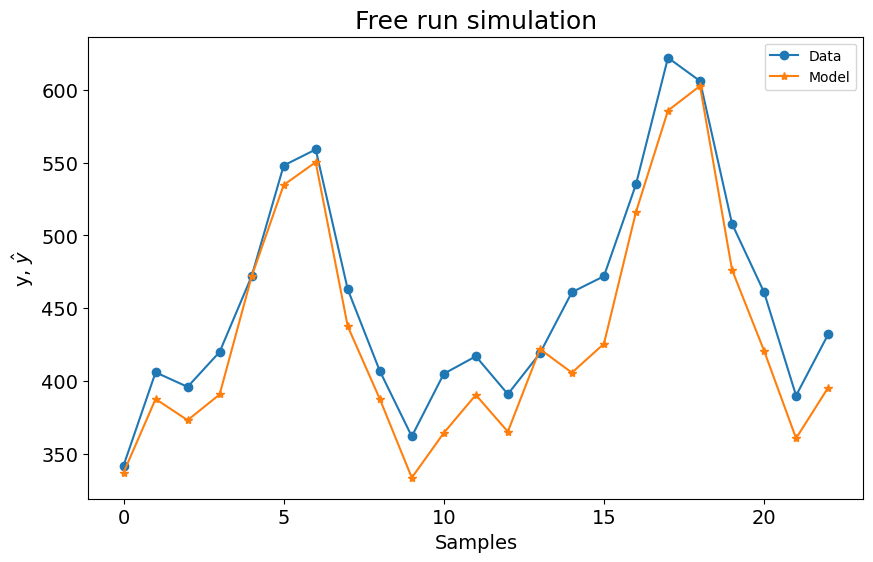
    


## SysIdentPy AOLS


```python
y = load_airline()
y_train, y_test = temporal_train_test_split(y, test_size=23)
y_train = y_train.values.reshape(-1, 1)
y_test = y_test.values.reshape(-1, 1)

df_train, df_test = temporal_train_test_split(y, test_size=23)
df_train = df_train.reset_index()
df_train.columns = ["ds", "y"]
df_train["ds"] = pd.to_datetime(df_train["ds"].astype(str))
df_test = df_test.reset_index()
df_test.columns = ["ds", "y"]
df_test["ds"] = pd.to_datetime(df_test["ds"].astype(str))

sysidentpy_AOLS = AOLS(
    ylag=13, k=2, L=1, model_type="NAR", basis_function=basis_function
)
sysidentpy_AOLS.fit(y=y_train)
y_test = np.concatenate([y_train[-sysidentpy_AOLS.max_lag :], y_test])

yhat = sysidentpy_AOLS.predict(y=y_test, steps_ahead=None, forecast_horizon=23)
aols_loss = loss(
    pd.Series(y_test.flatten()[sysidentpy_AOLS.max_lag :]),
    pd.Series(yhat.flatten()[sysidentpy_AOLS.max_lag :]),
)
print(aols_loss)

plot_results(y=y_test[sysidentpy_AOLS.max_lag :], yhat=yhat[sysidentpy_AOLS.max_lag :])
```

    476.64996316992523


    
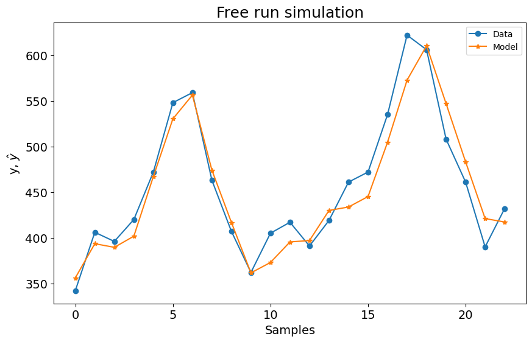
    


## SysIdentPy MetaMSS


```python
set_random_seed(42)

y = load_airline()
y_train, y_test = temporal_train_test_split(y, test_size=23)
y_train = y_train.values.reshape(-1, 1)
y_test = y_test.values.reshape(-1, 1)

sysidentpy_metamss = MetaMSS(
    basis_function=basis_function, ylag=13, model_type="NAR", test_size=0.17
)
sysidentpy_metamss.fit(y=y_train)

y_test = np.concatenate([y_train[-sysidentpy_metamss.max_lag :], y_test])

yhat = sysidentpy_metamss.predict(y=y_test, steps_ahead=None, forecast_horizon=23)
metamss_loss = loss(
    pd.Series(y_test.flatten()[sysidentpy_metamss.max_lag :]),
    pd.Series(yhat.flatten()[sysidentpy_metamss.max_lag :]),
)
print(metamss_loss)

plot_results(
    y=y_test[sysidentpy_metamss.max_lag :], yhat=yhat[sysidentpy_metamss.max_lag :]
)
```

    450.992127624293


    
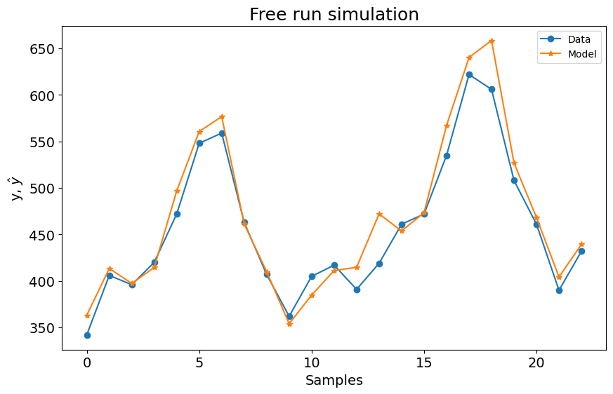
    


## SysIdentPy Neural NARX


```python
import torch

torch.manual_seed(42)

y = load_airline()
y_train, y_test = temporal_train_test_split(y, test_size=36)
y_train = y_train.values.reshape(-1, 1)
y_test = y_test.values.reshape(-1, 1)
x_train = np.zeros_like(y_train)
x_test = np.zeros_like(y_test)


class NARX(nn.Module):
    def __init__(self):
        super().__init__()
        self.lin = nn.Linear(13, 20)
        self.lin2 = nn.Linear(20, 20)
        self.lin3 = nn.Linear(20, 20)
        self.lin4 = nn.Linear(20, 1)
        self.relu = nn.ReLU()

    def forward(self, xb):
        z = self.lin(xb)
        z = self.relu(z)
        z = self.lin2(z)
        z = self.relu(z)
        z = self.lin3(z)
        z = self.relu(z)
        z = self.lin4(z)
        return z


narx_net = NARXNN(
    net=NARX(),
    ylag=13,
    model_type="NAR",
    basis_function=Polynomial(degree=1),
    epochs=900,
    verbose=False,
    learning_rate=2.5e-02,
    optim_params={},  # parâmetros opcionais do otimizador
)

narx_net.fit(y=y_train)
yhat = narx_net.predict(y=y_test, forecast_horizon=23)
narxnet_loss = loss(
    pd.Series(y_test.flatten()[narx_net.max_lag :]),
    pd.Series(yhat.flatten()[narx_net.max_lag :]),
)
print(narxnet_loss)
plot_results(y=y_test[narx_net.max_lag :], yhat=yhat[narx_net.max_lag :])
```

    316.54086775668776


    
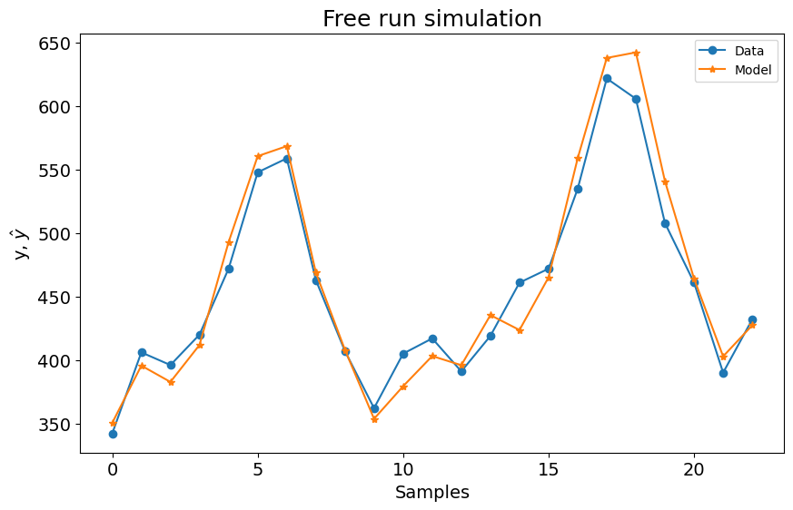
    


```python
y = load_airline()
y_train, y_test = temporal_train_test_split(y, test_size=23)  # 23 amostras para teste
plot_series(y_train, y_test, labels=["y_train", "y_test"])
fh = ForecastingHorizon(y_test.index, is_relative=False)
print(y_train.shape[0], y_test.shape[0])
```

    121 23


    
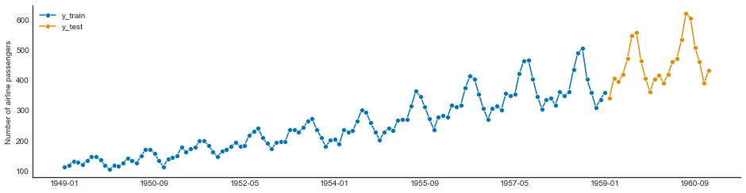
    


## Exponential Smoothing


```python
es = ExponentialSmoothing(trend="add", seasonal="multiplicative", sp=12)
y = load_airline()
y_train, y_test = temporal_train_test_split(y, test_size=23)
es.fit(y_train)
y_pred_es = es.predict(fh)

plot_series(y_test, y_pred_es, labels=["y_test", "y_pred"])
es_loss = loss(y_test, y_pred_es)
es_loss
```


    910.462659260655


    
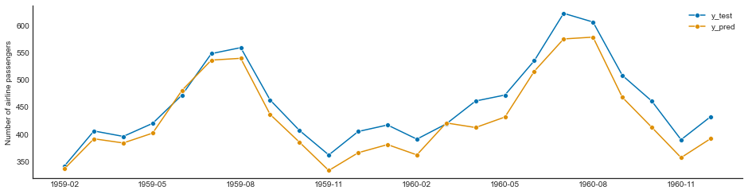
    


## AutoETS


```python
y = load_airline()

y_train, y_test = temporal_train_test_split(y, test_size=23)
ets = AutoETS(auto=True, sp=12, n_jobs=-1)
ets.fit(y_train)
y_pred_ets = ets.predict(fh)

plot_series(y_test, y_pred_ets, labels=["y_test", "y_pred"])
ets_loss = loss(y_test, y_pred_ets)
ets_loss
```


    1739.117296439066


    
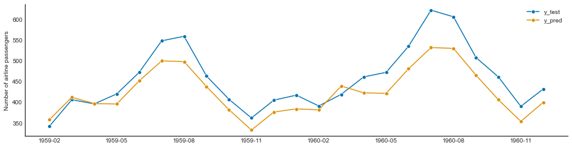
    


## AutoArima


```python
auto_arima = AutoARIMA(sp=12, suppress_warnings=True)
y = load_airline()

y_train, y_test = temporal_train_test_split(y, test_size=23)
auto_arima.fit(y_train)
y_pred_auto_arima = auto_arima.predict(fh)

plot_series(y_test, y_pred_auto_arima, labels=["y_test", "y_pred"])
autoarima_loss = loss(y_test, y_pred_auto_arima)
autoarima_loss
```


    1714.4753226965322


    
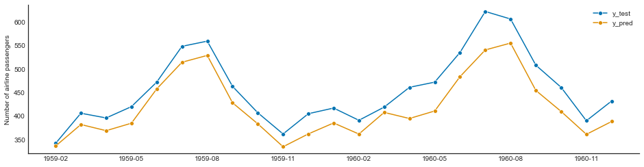
    


## Arima 


```python
y = load_airline()

y_train, y_test = temporal_train_test_split(y, test_size=23)
manual_arima = ARIMA(
    order=(13, 1, 0), suppress_warnings=True
)  # seasonal_order=(0, 1, 0, 12)
manual_arima.fit(y_train)
y_pred_manual_arima = manual_arima.predict(fh)
plot_series(y_test, y_pred_manual_arima, labels=["y_test", "y_pred"])
manualarima_loss = loss(y_test, y_pred_manual_arima)
manualarima_loss
```


    2085.425167938668


    
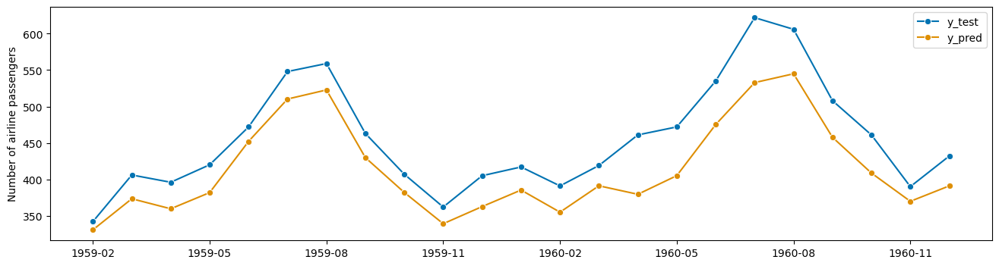
    


## BATS


```python
y = load_airline()

y_train, y_test = temporal_train_test_split(y, test_size=23)
bats = BATS(sp=12, use_trend=True, use_box_cox=False)
bats.fit(y_train)
y_pred_bats = bats.predict(fh)

plot_series(y_test, y_pred_bats, labels=["y_test", "y_pred"])
bats_loss = loss(y_test, y_pred_bats)
bats_loss
```


    7286.6484525676415


    
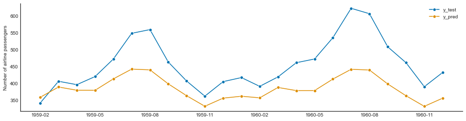
    


## TBATS


```python
y = load_airline()

y_train, y_test = temporal_train_test_split(y, test_size=23)
tbats = TBATS(sp=12, use_trend=True, use_box_cox=False)
tbats.fit(y_train)
y_pred_tbats = tbats.predict(fh)
plot_series(y_test, y_pred_tbats, labels=["y_test", "y_pred"])
tbats_loss = loss(y_test, y_pred_tbats)
tbats_loss
```


    7448.434672875093


    
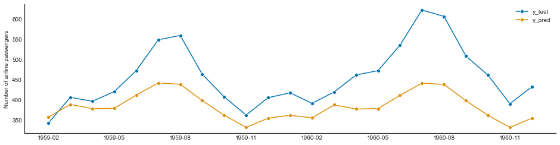
    


## Prophet


```python
set_random_seed(42)

y = load_airline()

y_train, y_test = temporal_train_test_split(y, test_size=23)
z = y.copy()
z = z.to_timestamp(freq="M")
z_train, z_test = temporal_train_test_split(z, test_size=23)


prophet = Prophet(
    seasonality_mode="multiplicative",
    n_changepoints=int(len(y_train) / 12),
    add_country_holidays={"country_name": "Germany"},
    yearly_seasonality=True,
    weekly_seasonality=False,
    daily_seasonality=False,
)
prophet.fit(z_train)
y_pred_prophet = prophet.predict(fh.to_relative(cutoff=y_train.index[-1]))

y_pred_prophet.index = y_test.index
plot_series(y_test, y_pred_prophet, labels=["y_test", "y_pred"])
prophet_loss = loss(y_test, y_pred_prophet)
prophet_loss
```


    1186.0045566050442


    
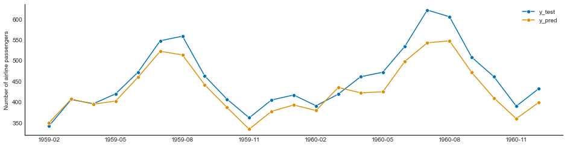
    


## Neural Prophet


```python
set_random_seed(42)

df = pd.read_csv(r".\datasets\air_passengers.csv")
m = NeuralProphet(seasonality_mode="multiplicative")
df_train = df.iloc[:-23, :].copy()
df_test = df.iloc[-23:, :].copy()

m = NeuralProphet(seasonality_mode="multiplicative")

metrics = m.fit(df_train, freq="MS")

future = m.make_future_dataframe(
    df_train, periods=23, n_historic_predictions=len(df_train)
)

forecast = m.predict(future)
plt.plot(forecast["yhat1"].values[-23:])
plt.plot(df_test["y"].values)
neuralprophet_loss = loss(forecast["yhat1"].values[-23:], df_test["y"].values)
neuralprophet_loss
```

    501.24794023767436


    
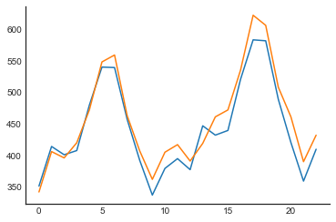
    


```python
results = {
    "Exponential Smoothing": es_loss,
    "ETS": ets_loss,
    "AutoArima": autoarima_loss,
    "Arima Manual": manualarima_loss,
    "BATS": bats_loss,
    "TBATS": tbats_loss,
    "Prophet": prophet_loss,
    "SysIdentPy (Modelo Polinomial)": frols_loss,
    "SysIdentPy (Modelo Neural)": narxnet_loss,
    "SysIdentPy (AOLS)": aols_loss,
    "SysIdentPy (MetaMSS)": metamss_loss,
    "NeuralProphet": neuralprophet_loss,
}

sorted(results.items(), key=lambda result: result[1])
```


    [('SysIdentPy (Modelo Neural)', 316.54086775668776),
     ('SysIdentPy (MetaMSS)', 450.992127624293),
     ('SysIdentPy (AOLS)', 476.64996316992523),
     ('NeuralProphet', 501.24794023767436),
     ('SysIdentPy (Modelo Polinomial)', 805.9521186338106),
     ('Exponential Smoothing', 910.462659260655),
     ('Prophet', 1186.0045566050442),
     ('AutoArima', 1714.4753226965322),
     ('ETS', 1739.117296439066),
     ('Arima Manual', 2085.425167938668),
     ('BATS', 7286.6484525676415),
     ('TBATS', 7448.434672875093)]

## Sistema com Histerese - Modelagem de um Dispositivo Amortecedor Magneto-reológico

Os efeitos de memória entre entrada e saída quase-estáticas tornam a modelagem de sistemas histeréticos muito difícil. Modelos baseados em física são frequentemente usados para descrever os loops de histerese, mas esses modelos geralmente carecem da simplicidade e eficiência requeridas em aplicações práticas envolvendo caracterização, identificação e controle de sistemas. Como detalhado em [Martins, S. A. M. and Aguirre, L. A. - Sufficient conditions for rate-independent hysteresis in autoregressive identified models](https://www.sciencedirect.com/science/article/abs/pii/S0888327015005968), modelos NARX provaram ser uma escolha viável para descrever os loops de histerese. Veja o Capítulo 8 para um background detalhado. No entanto, mesmo considerando as condições suficientes para representação de histerese independente de taxa, algoritmos clássicos de seleção de estrutura falham em retornar um modelo com desempenho decente e o usuário precisa definir uma função multi-valorada para garantir a ocorrência da estrutura limitante $\mathcal{H}$ ([Martins, S. A. M. and Aguirre, L. A. - Sufficient conditions for rate-independent hysteresis in autoregressive identified models](https://www.sciencedirect.com/science/article/abs/pii/S0888327015005968)).

Embora algum progresso tenha sido feito, trabalhos anteriores foram limitados a modelos com um único ponto de equilíbrio. O presente estudo de caso visa apresentar novas perspectivas na seleção de estrutura de modelos de sistemas histeréticos considerando os casos onde os modelos têm múltiplas entradas e não é restrito quanto ao número de pontos de equilíbrio. Para isso, o algoritmo MetaMSS será usado para construir um modelo para um amortecedor magneto-reológico (MRD) considerando as condições suficientes mencionadas.

### Uma Breve descrição do modelo Bouc-Wen de dispositivo amortecedor magneto-reológico

Os dados usados neste estudo de caso são do modelo Bouc-Wen ([Bouc, R - Forced Vibrations of a Mechanical System with Hysteresis](https://www.scirp.org/reference/referencespapers?referenceid=726819)), ([Wen, Y. X. - Method for Random Vibration of Hysteretic Systems](https://ascelibrary.org/doi/10.1061/JMCEA3.0002106)) de um MRD cujo diagrama esquemático é mostrado na figura abaixo.


> O modelo para um amortecedor magneto-reológico proposto por [Spencer, B. F. and Sain, M. K. - Controlling buildings: a new frontier in feedback](https://ieeexplore.ieee.org/document/642972).

A forma geral do modelo Bouc-Wen pode ser descrita como ([Spencer, B. F. and Sain, M. K. - Controlling buildings: a new frontier in feedback](https://ieeexplore.ieee.org/document/642972)):

$$
\begin{equation}
\dfrac{dz}{dt} = g\left[x,z,sign\left(\dfrac{dx}{dt}\right)\right]\dfrac{dx}{dt},
\end{equation}
$$

onde $z$ é a saída do modelo histerético, $x$ a entrada e $g[\cdot]$ uma função não linear de $x$, $z$ e $sign (dx/dt)$. ([Spencer, B. F. and Sain, M. K. - Controlling buildings: a new frontier in feedback](https://ieeexplore.ieee.org/document/642972)) propuseram o seguinte modelo fenomenológico para o dispositivo mencionado:

$$
\begin{align}
f&= c_1\dot{\rho}+k_1(x-x_0),\nonumber\\
\dot{\rho}&=\dfrac{1}{c_0+c_1}[\alpha z+c_0\dot{x}+k_0(x-\rho)],\nonumber\\
\dot{z}&=-\gamma|\dot{x}-\dot{\rho}|z|z|^{n-1}-\beta(\dot{x}-\dot{\rho})|z|^n+A(\dot{x}-\dot{\rho}),\nonumber\\
\alpha&=\alpha_a+\alpha_bu_{bw},\nonumber\\
c_1&=c_{1a}+c_{1b}u_{bw},\nonumber\\
c_0&=c_{0a}+c_{0b}u_{bw},\nonumber\\
\dot{u}_{bw}&=-\eta(u_{bw}-E).
\end{align}
$$

onde $f$ é a força de amortecimento, $c_1$ e $c_0$ representam os coeficientes viscosos, $E$ é a tensão de entrada, $x$ é o deslocamento e $\dot{x}$ é a velocidade do modelo. Os parâmetros do sistema (veja a tabela abaixo) foram retirados de [Leva, A. and Piroddi, L. - NARX-based technique for the modelling of magneto-rheological damping devices](https://iopscience.iop.org/article/10.1088/0964-1726/11/1/309).

| Parâmetro  | Valor          | Parâmetro | Valor        |
|------------|----------------|-----------|--------------|
| $c_{0_a}$  | $20.2 \, N \, s/cm$  | $\alpha_{a}$  | $44.9 \, N/cm$  |
| $c_{0_b}$  | $2.68 \, N \, s/cm \, V$ | $\alpha_{b}$  | $638 \, N/cm$   |
| $c_{1_a}$  | $350 \, N \, s/cm$   | $\gamma$      | $39.3 \, cm^{-2}$ |
| $c_{1_b}$  | $70.7 \, N \, s/cm \, V$  | $\beta$       | $39.3 \, cm^{-2}$ |
| $k_{0}$    | $15 \, N/cm$    | $n$           | $2$          |
| $k_{1}$    | $5.37 \, N/cm$   | $\eta$       | $251 \, s^{-1}$ |
| $x_{0}$    | $0 \, cm$      | $A$           | $47.2$       |

Para este estudo particular, tanto as entradas de deslocamento quanto de tensão, $x$ e $E$, respectivamente, foram geradas filtrando uma sequência de ruído gaussiano branco usando um filtro FIR Blackman-Harris com frequência de corte de $6$Hz. O tamanho do passo de integração foi definido como $h = 0.002$, seguindo os procedimentos descritos em [Martins, S. A. M. and Aguirre, L. A. - Sufficient conditions for rate-independent hysteresis in autoregressive identified models](https://www.sciencedirect.com/science/article/abs/pii/S0888327015005968). Estes procedimentos são apenas para fins de identificação, já que as entradas de um MRD podem ter várias características diferentes.

Os dados usados neste exemplo são fornecidos pelo Professor Samir Angelo Milani Martins.

Os desafios são:

- possui uma não linearidade com memória, ou seja, uma não linearidade dinâmica;
- a não linearidade é governada por uma variável interna z(t), que não é mensurável;
- a forma funcional não linear na equação de Bouc Wen é não linear no parâmetro;
- a forma funcional não linear na equação de Bouc Wen não admite uma expansão de série de Taylor finita devido à presença de valores absolutos

### Pacotes Necessários e Versões

Para garantir que você possa replicar este estudo de caso, é essencial usar versões específicas dos pacotes necessários. Abaixo está uma lista dos pacotes junto com suas respectivas versões necessárias para executar os estudos de caso efetivamente.

Para instalar todos os pacotes necessários, você pode criar um arquivo `requirements.txt` com o seguinte conteúdo:

```
sysidentpy==0.4.0
pandas==2.2.2
numpy==1.26.0
matplotlib==3.8.4
scikit-learn==1.4.2
```

Então, instale os pacotes usando:
```
pip install -r requirements.txt
```

- Certifique-se de usar um ambiente virtual para evitar conflitos entre versões de pacotes.
- As versões especificadas são baseadas na compatibilidade com os exemplos de código fornecidos. Se você estiver usando versões diferentes, alguns ajustes no código podem ser necessários.

### Configuração do SysIdentPy


```python
import numpy as np
from sklearn.preprocessing import MaxAbsScaler, MinMaxScaler
import pandas as pd
import matplotlib.pyplot as plt

from sysidentpy.model_structure_selection import FROLS
from sysidentpy.basis_function import Polynomial
from sysidentpy.utils.display_results import results
from sysidentpy.parameter_estimation import LeastSquares
from sysidentpy.metrics import root_relative_squared_error
from sysidentpy.utils.plotting import plot_results

df = pd.read_csv(
    "https://raw.githubusercontent.com/wilsonrljr/sysidentpy-data/refs/heads/main/datasets/bouc_wen/boucwen_histeretic_system.csv"
)
scaler_x = MaxAbsScaler()
scaler_y = MaxAbsScaler()

init = 400
x_train = df[["E", "v"]].iloc[init : df.shape[0] // 2, :]
x_train["sign_v"] = np.sign(df["v"])
x_train = scaler_x.fit_transform(x_train)

x_test = df[["E", "v"]].iloc[df.shape[0] // 2 + 1 : df.shape[0] - init, :]
x_test["sign_v"] = np.sign(df["v"])
x_test = scaler_x.transform(x_test)

y_train = df[["f"]].iloc[init : df.shape[0] // 2, :].values.reshape(-1, 1)
y_train = scaler_y.fit_transform(y_train)

y_test = (
    df[["f"]].iloc[df.shape[0] // 2 + 1 : df.shape[0] - init, :].values.reshape(-1, 1)
)
y_test = scaler_y.transform(y_test)

# Plotando os dados
plt.figure(figsize=(10, 8))
plt.suptitle("Dados de identificação (treinamento)", fontsize=16)

plt.subplot(221)
plt.plot(y_train, "k")
plt.ylabel("Força - Saída")
plt.xlabel("Amostras")
plt.title("y")
plt.grid()
plt.axis([0, 1500, -1.5, 1.5])

plt.subplot(222)
plt.plot(x_train[:, 0], "k")
plt.ylabel("Tensão de Controle")
plt.xlabel("Amostras")
plt.title("x_1")
plt.grid()
plt.axis([0, 1500, 0, 1])

plt.subplot(223)
plt.plot(x_train[:, 1], "k")
plt.ylabel("Velocidade")
plt.xlabel("Amostras")
plt.title("x_2")
plt.grid()
plt.axis([0, 1500, -1.5, 1.5])

plt.subplot(224)
plt.plot(x_train[:, 2], "k")
plt.ylabel("sign(Velocidade)")
plt.xlabel("Amostras")
plt.title("x_3")
plt.grid()
plt.axis([0, 1500, -1.5, 1.5])

plt.tight_layout(rect=[0, 0, 1, 0.95])
plt.show()
```


    
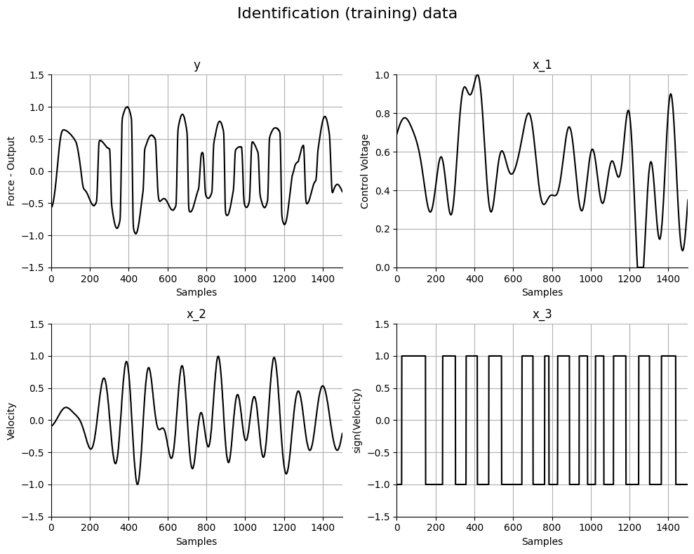
    


Vamos verificar como é o comportamento histerético considerando cada entrada:


```python
plt.figure()
plt.plot(x_train[:, 0], y_train)
plt.xlabel("x1 - Tensão")
plt.ylabel("y - Força")

plt.figure()
plt.plot(x_train[:, 1], y_train)
plt.xlabel("x2 - Velocidade")
plt.ylabel("y - Força")

plt.figure()
plt.plot(x_train[:, 2], y_train)
plt.xlabel("u3 - sign(Velocidade)")
plt.ylabel("y - Força")
```


    Text(0, 0.5, 'y - Força')


    
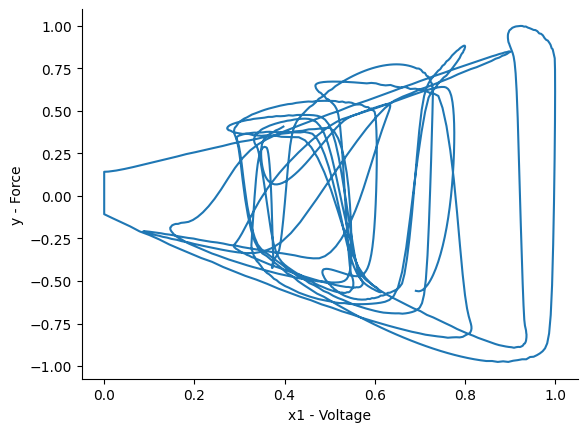
    


    
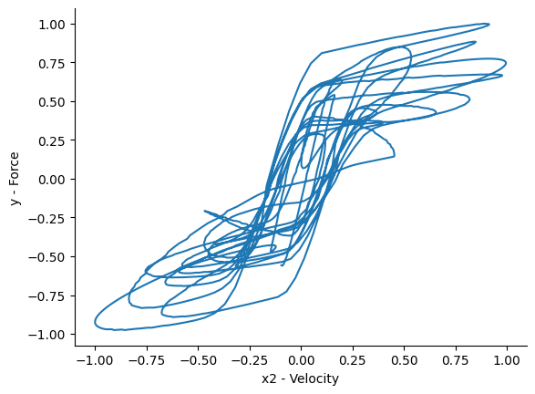
    


    
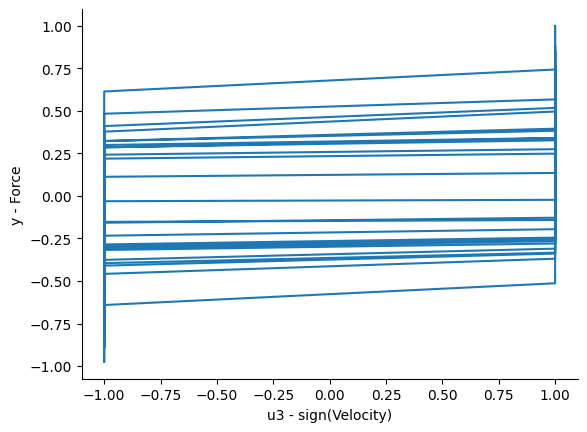
    


Agora, podemos simplesmente construir um modelo NARX:


```python
basis_function = Polynomial(degree=3)
model = FROLS(
    xlag=[[1], [1], [1]],
    ylag=1,
    basis_function=basis_function,
    estimator=LeastSquares(),
    info_criteria="aic",
)

model.fit(X=x_train, y=y_train)
yhat = model.predict(X=x_test, y=y_test[: model.max_lag :, :])
rrse = root_relative_squared_error(y_test[model.max_lag :], yhat[model.max_lag :])
print(rrse)
plot_results(
    y=y_test[model.max_lag :],
    yhat=yhat[model.max_lag :],
    n=10000,
    title="FROLS: sign(v) e MaxAbsScaler",
)
```

    0.04510435472905795


    
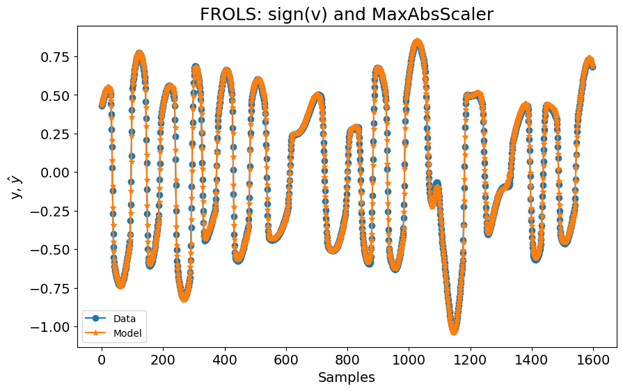
    


Se removermos a entrada `sign(v)` e tentarmos construir um modelo NARX usando a mesma configuração, o modelo diverge, como pode ser visto na figura a seguir:


```python
basis_function = Polynomial(degree=3)
model = FROLS(
    xlag=[[1], [1]],
    ylag=1,
    basis_function=basis_function,
    estimator=LeastSquares(),
    info_criteria="aic",
)

model.fit(X=x_train[:, :2], y=y_train)
yhat = model.predict(X=x_test[:, :2], y=y_test[: model.max_lag :, :])
rrse = root_relative_squared_error(y_test[model.max_lag :], yhat[model.max_lag :])
print(rrse)
plot_results(
    y=y_test[model.max_lag :],
    yhat=yhat[model.max_lag :],
    n=10000,
    title="FROLS: MaxAbsScaler, descartando sign(v)",
)
```

    nan


    c:\Users\wilso\miniconda3\envs\sysidentpyv04\Lib\site-packages\sysidentpy\narmax_base.py:724: RuntimeWarning: overflow encountered in power
      regressor_value[j] = np.prod(np.power(raw_regressor, model_exponent))
    c:\Users\wilso\miniconda3\envs\sysidentpyv04\Lib\site-packages\sysidentpy\metrics\_regression.py:216: RuntimeWarning: overflow encountered in square
      numerator = np.sum(np.square((yhat - y)))


    
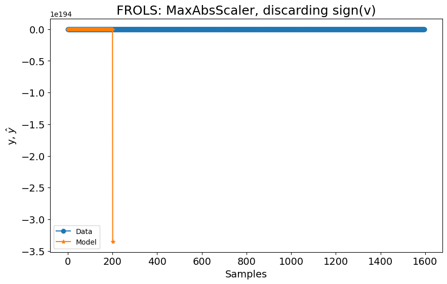
    


Se usarmos o algoritmo `MetaMSS` em vez disso, os resultados são melhores.


```python
from sysidentpy.model_structure_selection import MetaMSS

basis_function = Polynomial(degree=3)
model = MetaMSS(
    xlag=[[1], [1]],
    ylag=1,
    basis_function=basis_function,
    estimator=LeastSquares(),
    random_state=42,
)

model.fit(X=x_train[:, :2], y=y_train)
yhat = model.predict(X=x_test[:, :2], y=y_test[: model.max_lag :, :])
rrse = root_relative_squared_error(y_test[model.max_lag :], yhat[model.max_lag :])
print(rrse)
plot_results(
    y=y_test[model.max_lag :],
    yhat=yhat[model.max_lag :],
    n=10000,
    title="MetaMSS: MaxAbsScaler, descartando sign(v)",
)
```

    c:\Users\wilso\miniconda3\envs\sysidentpyv04\Lib\site-packages\sysidentpy\narmax_base.py:724: RuntimeWarning: overflow encountered in power
      regressor_value[j] = np.prod(np.power(raw_regressor, model_exponent))
    c:\Users\wilso\miniconda3\envs\sysidentpyv04\Lib\site-packages\sysidentpy\model_structure_selection\meta_model_structure_selection.py:453: RuntimeWarning: overflow encountered in square
      sum_of_squared_residues = np.sum(residues**2)
    c:\Users\wilso\miniconda3\envs\sysidentpyv04\Lib\site-packages\sysidentpy\metrics\_regression.py:216: RuntimeWarning: overflow encountered in square
      numerator = np.sum(np.square((yhat - y)))
    c:\Users\wilso\miniconda3\envs\sysidentpyv04\Lib\site-packages\numpy\linalg\linalg.py:2590: RuntimeWarning: divide by zero encountered in power
      absx **= ord
    c:\Users\wilso\miniconda3\envs\sysidentpyv04\Lib\site-packages\numpy\core\fromnumeric.py:88: RuntimeWarning: invalid value encountered in reduce
      return ufunc.reduce(obj, axis, dtype, out, **passkwargs)


    0.24685651932553157


    
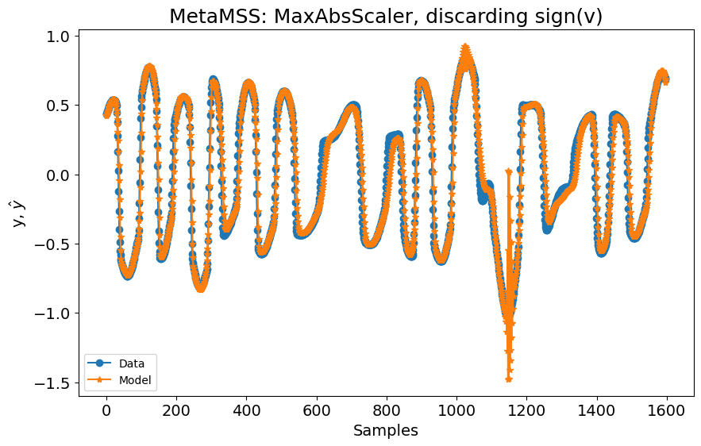
    


No entanto, quando a saída do sistema atinge seu valor mínimo, o modelo oscila


```python
plot_results(
    y=y_test[1100:1200], yhat=yhat[1100:1200], n=10000, title="Região instável"
)
```


    
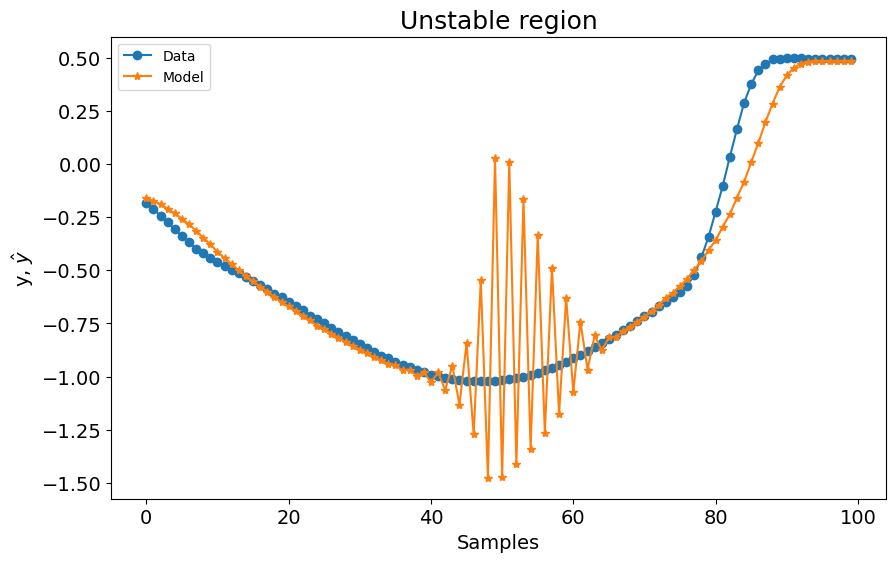
    


Se adicionarmos a entrada `sign(v)` novamente e usarmos `MetaMSS`, os resultados são muito próximos do algoritmo `FROLS` com todas as entradas


```python
basis_function = Polynomial(degree=3)
model = MetaMSS(
    xlag=[[1], [1], [1]],
    ylag=1,
    basis_function=basis_function,
    estimator=LeastSquares(),
    random_state=42,
)

model.fit(X=x_train, y=y_train)
yhat = model.predict(X=x_test, y=y_test[: model.max_lag :, :])
rrse = root_relative_squared_error(y_test[model.max_lag :], yhat[model.max_lag :])
print(rrse)
plot_results(
    y=y_test[model.max_lag :],
    yhat=yhat[model.max_lag :],
    n=10000,
    title="MetaMSS: sign(v) e MaxAbsScaler",
)
```

    c:\Users\wilso\miniconda3\envs\sysidentpyv04\Lib\site-packages\sysidentpy\parameter_estimation\estimators.py:75: UserWarning: Psi matrix might have linearly dependent rows.Be careful and check your data
      self._check_linear_dependence_rows(psi)
    c:\Users\wilso\miniconda3\envs\sysidentpyv04\Lib\site-packages\sysidentpy\narmax_base.py:724: RuntimeWarning: overflow encountered in power
      regressor_value[j] = np.prod(np.power(raw_regressor, model_exponent))
    c:\Users\wilso\miniconda3\envs\sysidentpyv04\Lib\site-packages\sysidentpy\model_structure_selection\meta_model_structure_selection.py:453: RuntimeWarning: overflow encountered in square
      sum_of_squared_residues = np.sum(residues**2)
    c:\Users\wilso\miniconda3\envs\sysidentpyv04\Lib\site-packages\numpy\linalg\linalg.py:2590: RuntimeWarning: divide by zero encountered in power
      absx **= ord


    0.055422497807759194


    
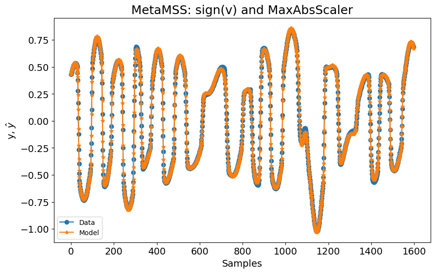
    


Este caso também destacará a importância do escalonamento de dados. Anteriormente, usamos o método `MaxAbsScaler`, que resultou em ótimos modelos ao usar as entradas `sign(v)`, mas também resultou em modelos instáveis ao remover essa feature de entrada. Quando o escalonamento é aplicado usando `MinMaxScaler`, no entanto, a estabilidade geral dos resultados melhora, e o modelo não diverge, mesmo quando a entrada `sign(v)` é removida, usando o algoritmo `FROLS`.

O usuário pode obter os resultados abaixo apenas alterando o método de escalonamento de dados usando


```python
scaler_x = MinMaxScaler()
scaler_y = MinMaxScaler()
```

e executando cada modelo novamente. Essa é a única mudança para melhorar os resultados.


> FROLS: com `sign(v)` e `MinMaxScaler`. RMSE: 0.1159


FROLS: descartando `sign(v)` e usando `MinMaxScaler`. RMSE: 0.1639


> MetaMSS: descartando `sign(v)` e usando `MinMaxScaler`. RMSE: 0.1762


> MetaMSS: incluindo `sign(v)` e usando `MinMaxScaler`. RMSE: 0.0694

Em contraste, o método MetaMSS retornou o melhor modelo geral, mas não melhor que o melhor método `FROLS` usando `MaxAbsScaler`.

Aqui está o loop histerético predito:


```python
plt.plot(x_test[:, 1], yhat)
```


    [<matplotlib.lines.Line2D at 0x225ff4f8b00>]


    
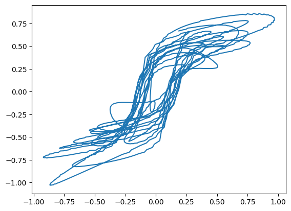

## Silver box

O conteúdo da descrição deriva principalmente (copiar e colar) do [artigo associado - Three free data sets for development and benchmarking in nonlinear system identification](https://ieeexplore.ieee.org/document/6669201). Para uma descrição detalhada, os leitores são encaminhados à referência vinculada.

> O sistema Silverbox pode ser visto como uma implementação eletrônica do oscilador de Duffing. É construído como um sistema linear invariante no tempo de 2ª ordem com uma não linearidade estática polinomial de 3º grau ao redor dele em feedback. Este tipo de dinâmica é, por exemplo, frequentemente encontrado em sistemas mecânicos [Nonlinear Benchmark - Silverbox](https://www.nonlinearbenchmark.org/benchmarks/silverbox).

Neste estudo de caso, criaremos um modelo NARX para o benchmark Silver box. O Silver box representa uma versão simplificada de processos oscilatórios mecânicos, que são uma categoria crítica de sistemas dinâmicos não lineares. Exemplos incluem suspensões de veículos, onde amortecedores e molas progressivas desempenham papéis vitais. Os dados gerados pelo Silver box fornecem uma representação simplificada de tais componentes combinados. O circuito elétrico que gera esses dados aproxima de perto, mas não corresponde perfeitamente, aos modelos idealizados descritos abaixo.

Conforme descrito no artigo original, o sistema foi excitado usando um gerador de forma de onda geral (HPE1445A). O sinal de entrada começa como um sinal de tempo discreto $r(k)$, que é convertido para um sinal analógico $r_c(t)$ usando reconstrução zero-order-hold. O sinal de excitação real $u_0(t)$ é então obtido passando $r_c(t)$ através de um filtro passa-baixa analógico $G(p)$ para eliminar o conteúdo de alta frequência em torno de múltiplos da frequência de amostragem. Aqui, $p$ denota o operador de diferenciação. Assim, a entrada é dada por:

$$
u_0(t) = G(p) r_c(t).
$$

Os sinais de entrada e saída foram medidos usando placas de aquisição de dados HP1430A, com relógios sincronizados para as placas de aquisição e gerador. A frequência de amostragem foi:

$$
f_s = \frac{10^7}{2^{14}} = 610.35 \, \text{Hz}.
$$

O silver box usa circuitos elétricos analógicos para gerar dados representando um sistema mecânico ressonante não linear com uma massa móvel $m$, amortecimento viscoso $d$, e uma mola não linear $k(y)$. O circuito elétrico é projetado para relacionar o deslocamento $y(t)$ (a saída) à força $u(t)$ (a entrada) pela seguinte equação diferencial:

$$
m \frac{d^2 y(t)}{dt^2} + d \frac{d y(t)}{dt} + k(y(t)) y(t) = u(t).
$$

A mola progressiva não linear é descrita por uma rigidez estática dependente da posição:

$$
k(y(t)) = a + b y^2(t).
$$

A relação sinal-ruído é suficientemente alta para modelar o sistema sem considerar o ruído de medição. No entanto, o ruído de medição pode ser incluído substituindo $y(t)$ pela variável artificial $x(t)$ na equação acima, e introduzindo perturbações $w(t)$ e $e(t)$ da seguinte forma:

$$
\begin{align}
& m \frac{d^2 x(t)}{dt^2} + d \frac{d x(t)}{dt} + k(x(t)) x(t) = u(t) + w(t), \\
& k(x(t)) = a + b x^2(t), \\
& y(t) = x(t) + e(t).
\end{align}
$$

### Pacotes Necessários e Versões

Para garantir que você possa replicar este estudo de caso, é essencial usar versões específicas dos pacotes necessários. Abaixo está uma lista dos pacotes junto com suas respectivas versões necessárias para executar os estudos de caso efetivamente.

Para instalar todos os pacotes necessários, você pode criar um arquivo `requirements.txt` com o seguinte conteúdo:

```
sysidentpy==0.4.0
pandas==2.2.2
numpy==1.26.0
matplotlib==3.8.4
nonlinear_benchmarks==0.1.2
```

Então, instale os pacotes usando:

```
pip install -r requirements.txt
```

- Certifique-se de usar um ambiente virtual para evitar conflitos entre versões de pacotes.
- As versões especificadas são baseadas na compatibilidade com os exemplos de código fornecidos. Se você estiver usando versões diferentes, alguns ajustes no código podem ser necessários.

### Configuração do SysIdentPy

Nesta seção, demonstraremos a aplicação do SysIdentPy ao dataset Silver box. O código a seguir guiará você através do processo de carregamento do dataset, configuração dos parâmetros do SysIdentPy e construção de um modelo para o sistema mencionado.


```python
import numpy as np
import matplotlib.pyplot as plt

from sysidentpy.model_structure_selection import FROLS
from sysidentpy.basis_function import Polynomial, Fourier
from sysidentpy.parameter_estimation import LeastSquares
from sysidentpy.metrics import root_mean_squared_error
from sysidentpy.utils.plotting import plot_results

import nonlinear_benchmarks

train_val, test = nonlinear_benchmarks.Silverbox(atleast_2d=True)

x_train, y_train = train_val.u, train_val.y
test_multisine, test_arrow_full, test_arrow_no_extrapolation = test
x_test, y_test = test_multisine.u, test_multisine.y

n = test_multisine.state_initialization_window_length
```

Usamos o pacote `nonlinear_benchmarks` para carregar os dados. O usuário é encaminhado à [documentação do pacote - GerbenBeintema/nonlinear_benchmarks: The official dataload for http://www.nonlinearbenchmark.org/ (github.com)](https://github.com/GerbenBeintema/nonlinear_benchmarks/tree/master) para verificar os detalhes de como usá-lo.

O gráfico a seguir detalha os dados de treinamento e teste do experimento.


```python
plt.plot(x_train)
plt.plot(y_train, alpha=0.3)
plt.title("Experimento 1: dados de treinamento")
plt.show()

plt.plot(x_test)
plt.plot(y_test, alpha=0.3)
plt.title("Experimento 1: dados de teste")
plt.show()

plt.plot(test_arrow_full.u)
plt.plot(test_arrow_full.y, alpha=0.3)
plt.title("Experimento 2: dados de treinamento")
plt.show()

plt.plot(test_arrow_no_extrapolation.u)
plt.plot(test_arrow_no_extrapolation.y, alpha=0.2)
plt.title("Experimento 2: dados de teste")
plt.show()
```


    
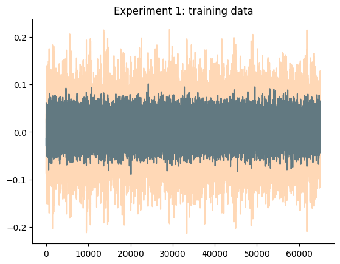
    


    
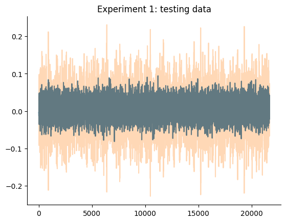
    


    
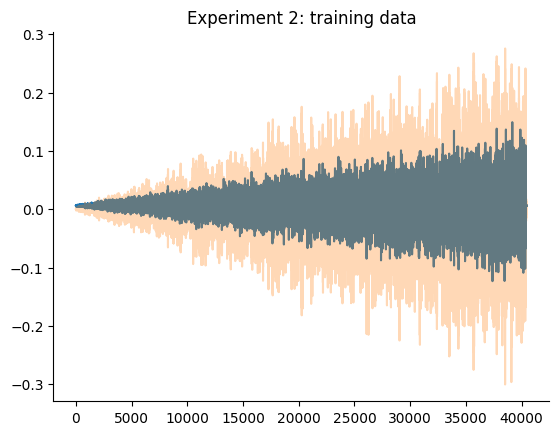
    


    
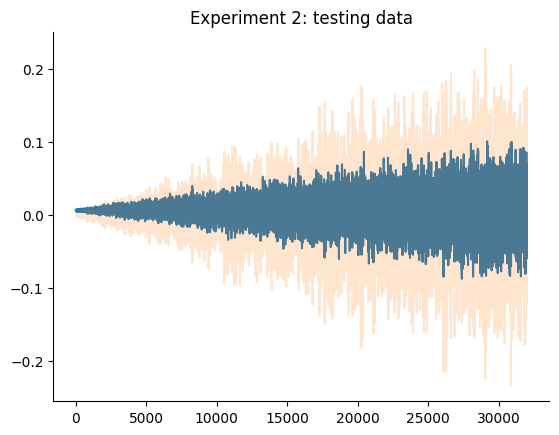
    


> Nota Importante

O objetivo deste benchmark é desenvolver um modelo que supere o modelo estado-da-arte (SOTA) apresentado no artigo de benchmarking. No entanto, os resultados no [artigo](https://arxiv.org/pdf/2012.07697) diferem daqueles fornecidos no [repositório GitHub](https://github.com/GerbenBeintema/SS-encoder-WH-Silver/blob/main/SS%20encoder%20Silverbox.ipynb).

| nx  | Conjunto        | NRMS    | RMS (mV)   |
| --- | --------------- | ------- | ---------- |
| 2   | Treino          | 0.10653 | 5.8103295  |
| 2   | Validação       | 0.11411 | 6.1938068  |
| 2   | Teste           | 0.19151 | 10.2358533 |
| 2   | Teste (no extra)| 0.12284 | 5.2789727  |
| 4   | Treino          | 0.03571 | 1.9478290  |
| 4   | Validação       | 0.03922 | 2.1286373  |
| 4   | Teste           | 0.12712 | 6.7943448  |
| 4   | Teste (no extra)| 0.05204 | 2.2365904  |
| 8   | Treino          | 0.03430 | 1.8707026  |
| 8   | Validação       | 0.03732 | 2.0254112  |
| 8   | Teste           | 0.10826 | 5.7865255  |
| 8   | Teste (no extra)| 0.04743 | 2.0382715  |
> Tabela: resultados apresentados no github.

Parece que os valores mostrados no artigo realmente representam o tempo de treinamento, não as métricas de erro. Entrarei em contato com os autores para confirmar esta informação. De acordo com o site Nonlinear Benchmark, a informação é a seguinte:


onde os valores na coluna "Training time" correspondem aos apresentados como métricas de erro no artigo.

> Enquanto aguardamos a confirmação dos valores corretos para este benchmark, demonstraremos o desempenho do SysIdentPy. No entanto, nos absteremos de fazer comparações ou tentar melhorar o modelo nesta fase.

### Resultados

Começaremos (como fizemos em todos os outros estudos de caso) com uma configuração básica do FROLS usando uma função de base polinomial com grau igual a 2. O `xlag` e `ylag` são definidos como $7$ neste primeiro exemplo. Como o dataset é consideravelmente grande, começaremos com `n_info_values=40`. Como estamos lidando com um grande dataset de treinamento, usaremos o `err_tol` em vez de critérios de informação para ter um desempenho mais rápido. Também definiremos `n_terms=40`, o que significa que a busca parará se o `err_tol` for atingido ou 40 regressores forem testados no algoritmo `ERR`. Embora esta abordagem possa resultar em um modelo sub-ótimo, é um ponto de partida razoável para nossa primeira tentativa. Existem três experimentos diferentes: multisine, arrow (full) e arrow (no extrapolation).


```python
basis_function = Polynomial(degree=2)
model = FROLS(
    xlag=7,
    ylag=7,
    basis_function=basis_function,
    estimator=LeastSquares(),
    err_tol=0.999,
    n_terms=40,
    order_selection=False,
)

model.fit(X=x_train, y=y_train)
y_test = np.concatenate([y_train[-model.max_lag :], y_test])
x_test = np.concatenate([x_train[-model.max_lag :], x_test])
yhat = model.predict(X=x_test, y=y_test[: model.max_lag, :])
rmse = root_mean_squared_error(y_test[model.max_lag + n :], yhat[model.max_lag + n :])
nrmse = rmse / y_test.std()
rmse_mv = 1000 * rmse
print(nrmse, rmse_mv)
plot_results(
    y=y_test[model.max_lag :],
    yhat=yhat[model.max_lag :],
    n=30000,
    figsize=(15, 4),
    title=f"Multisine. Modelo -> RMSE (x1000) mv: {round(rmse_mv, 4)}",
)

plot_results(
    y=y_test[model.max_lag :],
    yhat=yhat[model.max_lag :],
    n=300,
    figsize=(15, 4),
    title=f"Multisine. Modelo -> RMSE (x1000) mv: {round(rmse_mv, 4)}",
)
```

    0.1423804033714937 7.727682109791501


    
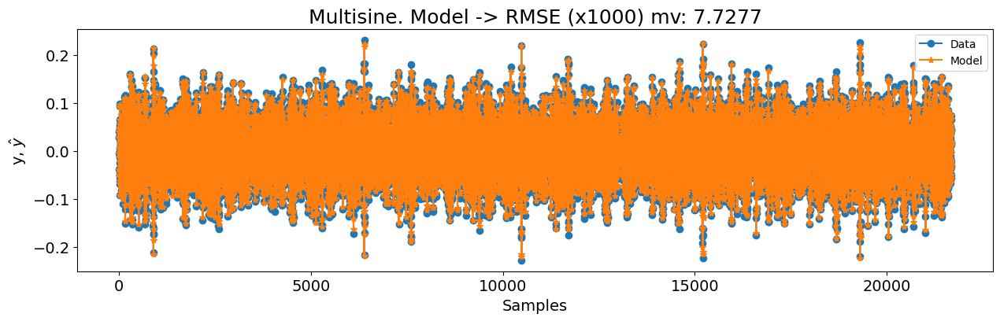
    


    
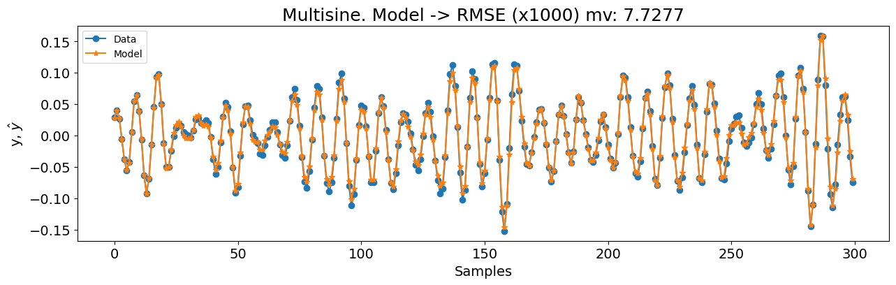
    


```python
x_train, y_train = train_val.u, train_val.y
test_multisine, test_arrow_full, test_arrow_no_extrapolation = test
x_test, y_test = test_arrow_full.u, test_arrow_full.y

n = test_arrow_full.state_initialization_window_length

basis_function = Polynomial(degree=3)
model = FROLS(
    xlag=14,
    ylag=14,
    basis_function=basis_function,
    estimator=LeastSquares(),
    err_tol=0.9999,
    n_terms=80,
    order_selection=False,
)

model.fit(X=x_train, y=y_train)
# não concatenaremos os últimos valores dos dados de treino para usar como condição inicial aqui porque
# estes dados de teste têm um comportamento muito diferente.
# No entanto, se você quiser, pode fazer isso e verá que o modelo ainda terá
# um ótimo desempenho após algumas iterações
yhat = model.predict(X=x_test, y=y_test[: model.max_lag, :])
rmse = root_mean_squared_error(y_test[model.max_lag + n :], yhat[model.max_lag + n :])
nrmse = rmse / y_test.std()
rmse_mv = 1000 * rmse

print(nrmse, rmse_mv)

plot_results(
    y=y_test[model.max_lag :],
    yhat=yhat[model.max_lag :],
    n=30000,
    figsize=(15, 4),
    title=f"Arrow (full). Modelo -> RMSE (x1000) mv: {round(rmse_mv, 4)}",
)

plot_results(
    y=y_test[model.max_lag :],
    yhat=yhat[model.max_lag :],
    n=300,
    figsize=(15, 4),
    title=f"Arrow (full). Modelo -> RMSE (x1000) mv: {round(rmse_mv, 4)}",
)
```

    0.07762658947015803 4.14903534238172


    
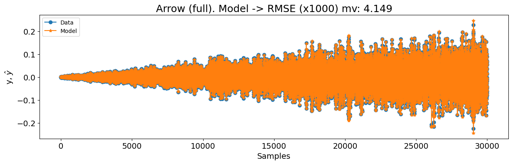
    


    
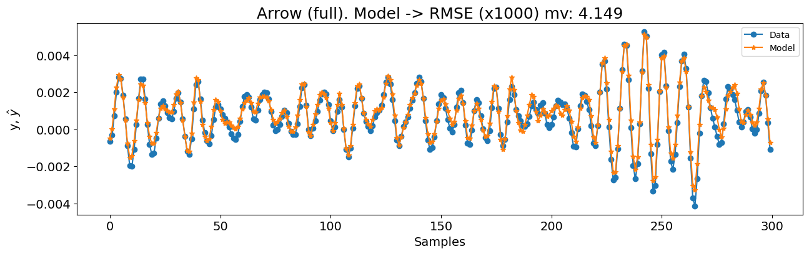
    


```python
x_train, y_train = train_val.u, train_val.y
test_multisine, test_arrow_full, test_arrow_no_extrapolation = test
x_test, y_test = test_arrow_no_extrapolation.u, test_arrow_no_extrapolation.y

n = test_arrow_no_extrapolation.state_initialization_window_length

basis_function = Polynomial(degree=3)
model = FROLS(
    xlag=14,
    ylag=14,
    basis_function=basis_function,
    estimator=LeastSquares(),
    err_tol=0.9999,
    n_terms=40,
    order_selection=False,
)

model.fit(X=x_train, y=y_train)
yhat = model.predict(X=x_test, y=y_test[: model.max_lag, :])
rmse = root_mean_squared_error(y_test[model.max_lag + n :], yhat[model.max_lag + n :])
nrmse = rmse / y_test.std()
rmse_mv = 1000 * rmse
print(nrmse, rmse_mv)

plot_results(
    y=y_test[model.max_lag :],
    yhat=yhat[model.max_lag :],
    n=30000,
    figsize=(15, 4),
    title=f"Arrow (no extrapolation). Modelo -> RMSE (x1000) mv: {round(rmse_mv, 4)}",
)

plot_results(
    y=y_test[model.max_lag :],
    yhat=yhat[model.max_lag :],
    n=300,
    figsize=(15, 4),
    title=f"Simulação Free Run. Modelo -> RMSE (x1000) mv: {round(rmse_mv, 4)}",
)
```

    0.05187400789723806 2.2293393254015776


    
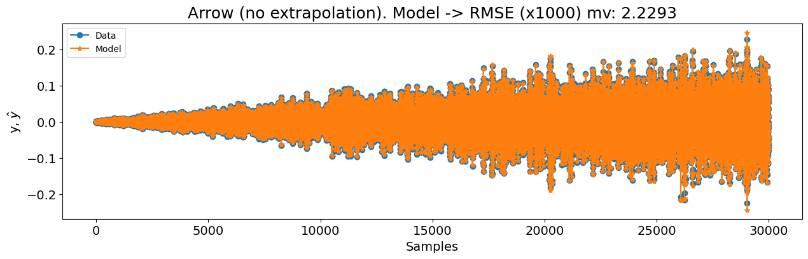
    


    
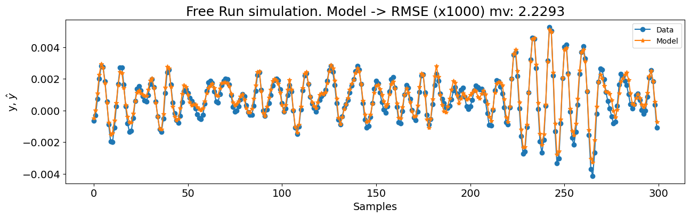

## F-16 Ground Vibration Test Benchmark

**Nota**: Os exemplos a seguir não tentam replicar os resultados dos manuscritos citados. Mesmo os parâmetros do modelo como ylag e xlag e o tamanho dos dados de identificação e validação não são os mesmos dos artigos citados. Além disso, ajuste de taxa de amostragem e outras preparações de dados diferentes não são tratados aqui.

## Referência

**O texto a seguir foi retirado do link http://www.nonlinearbenchmark.org/#F16**.

**Nota**: O leitor é encaminhado ao site mencionado para uma referência completa sobre o experimento. Por enquanto, este notebook é apenas um exemplo simples do desempenho do SysIdentPy em um conjunto de dados do mundo real. Um estudo mais detalhado deste sistema será publicado no futuro.

> O benchmark do Ground Vibration Test da F-16 apresenta um sistema de alta ordem com não linearidades de folga e atrito na interface de montagem das cargas úteis.

> Os dados experimentais disponibilizados aos participantes do Workshop foram adquiridos em uma aeronave F-16 em escala real na ocasião do Siemens LMS Ground Vibration Testing Master Class, realizado em setembro de 2014 na base militar de Saffraanberg, Sint-Truiden, Bélgica.

> Durante a campanha de testes, duas cargas úteis simuladas foram montadas nas pontas das asas para simular as propriedades de massa e inércia de dispositivos reais que tipicamente equipam uma F-16 em voo. A estrutura da aeronave foi instrumentada com acelerômetros. Um excitador foi fixado sob a asa direita para aplicar sinais de entrada. A fonte dominante de não linearidade nas dinâmicas estruturais era esperada originar das interfaces de montagem das duas cargas úteis. Essas interfaces consistem em elementos de conexão em forma de T no lado da carga útil, deslizados através de um trilho fixado ao lado da asa. Uma investigação preliminar mostrou que a conexão traseira da interface asa direita-carga útil era a fonte predominante de distorções não lineares nas dinâmicas da aeronave e, portanto, é o foco deste estudo de benchmark.

> Uma formulação detalhada do problema de identificação pode ser encontrada aqui. Todos os arquivos fornecidos e informações sobre o sistema de benchmark da aeronave F-16 estão disponíveis para download aqui. Este arquivo zip contém uma descrição detalhada do sistema, os conjuntos de dados de estimação e teste, e algumas fotos da configuração. Os dados estão disponíveis nos formatos de arquivo .csv e .mat.

> Por favor, cite o benchmark F16 como:

> J.P. Noël and M. Schoukens, F-16 aircraft benchmark based on ground vibration test data, 2017 Workshop on Nonlinear System Identification Benchmarks, pp. 19-23, Brussels, Belgium, April 24-26, 2017.


```bash
pip install sysidentpy
```


```python
import numpy as np
import pandas as pd
import matplotlib.pyplot as plt
from sysidentpy.model_structure_selection import FROLS
from sysidentpy.basis_function import Polynomial
from sysidentpy.parameter_estimation import LeastSquares
from sysidentpy.metrics import root_relative_squared_error
from sysidentpy.utils.display_results import results
from sysidentpy.utils.plotting import plot_residues_correlation, plot_results
from sysidentpy.residues.residues_correlation import (
    compute_residues_autocorrelation,
    compute_cross_correlation,
)
```


```python
f_16 = pd.read_csv(
    r"https://raw.githubusercontent.com/wilsonrljr/sysidentpy-data/refs/heads/main/datasets/f_16_vibration_test/f-16.txt",
    header=None,
    names=["x1", "x2", "y"],
)
```


```python
f_16.shape
```


    (32768, 3)


## Visualizando os Dados


```python
f_16[["x1", "x2"]][0:500].plot(figsize=(12, 8))
```


    <Axes: >


    
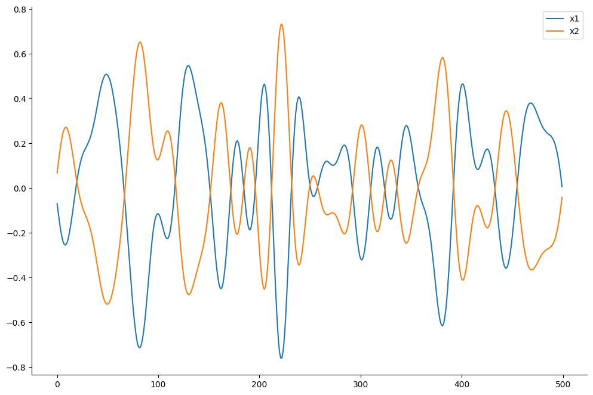
    


```python
f_16["y"][0:2000].plot(figsize=(12, 8))
```


    <Axes: >


    
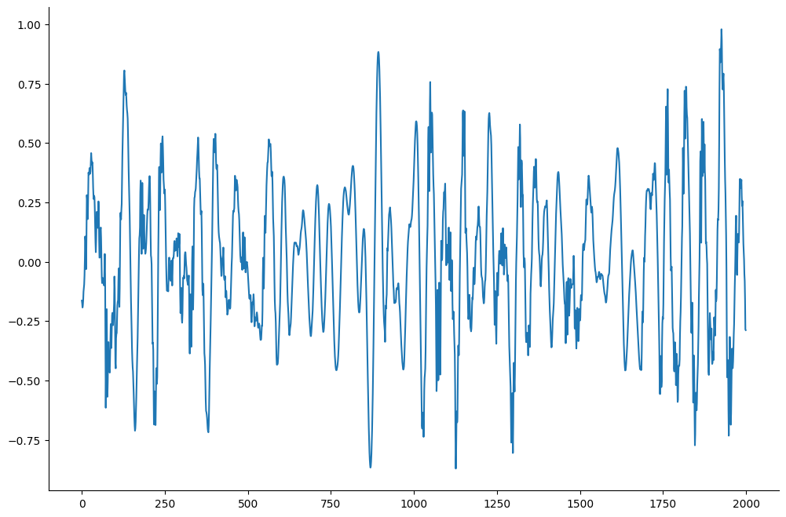
    


## Dividindo os Dados


```python
x1_id, x1_val = f_16["x1"][0:16384].values.reshape(-1, 1), f_16["x1"][
    16384::
].values.reshape(-1, 1)
x2_id, x2_val = f_16["x2"][0:16384].values.reshape(-1, 1), f_16["x2"][
    16384::
].values.reshape(-1, 1)
x_id = np.concatenate([x1_id, x2_id], axis=1)
x_val = np.concatenate([x1_val, x2_val], axis=1)

y_id, y_val = f_16["y"][0:16384].values.reshape(-1, 1), f_16["y"][
    16384::
].values.reshape(-1, 1)
```

## Configurando os Lags de Entrada


```python
x1lag = list(range(1, 10))
x2lag = list(range(1, 10))
x2lag
```


    [1, 2, 3, 4, 5, 6, 7, 8, 9]


## Treinamento e Avaliação do Modelo


```python
basis_function = Polynomial(degree=1)
estimator = LeastSquares()

model = FROLS(
    order_selection=True,
    n_info_values=39,
    ylag=20,
    xlag=[x1lag, x2lag],
    info_criteria="bic",
    estimator=estimator,
    basis_function=basis_function,
)

model.fit(X=x_id, y=y_id)
y_hat = model.predict(X=x_val, y=y_val)
rrse = root_relative_squared_error(y_val, y_hat)
print(rrse)
r = pd.DataFrame(
    results(
        model.final_model,
        model.theta,
        model.err,
        model.n_terms,
        err_precision=8,
        dtype="sci",
    ),
    columns=["Regressores", "Parâmetros", "ERR"],
)
print(r)
```

    0.2910089654603829
       Regressores   Parâmetros             ERR
    0      y(k-1)   1.8387E+00  9.43378253E-01
    1      y(k-2)  -1.8938E+00  1.95167599E-02
    2      y(k-3)   1.3337E+00  1.02432261E-02
    3      y(k-6)  -1.6038E+00  8.03485985E-03
    4      y(k-9)   2.6776E-01  9.27874557E-04
    5     x2(k-7)  -2.2385E+01  3.76837313E-04
    6     x1(k-1)   8.2709E+00  6.81508210E-04
    7     x2(k-3)   1.0587E+02  1.57459800E-03
    8     x1(k-8)  -3.7975E+00  7.35086279E-04
    9     x2(k-1)   8.5725E+01  4.85358786E-04
    10     y(k-7)   1.3955E+00  2.77245281E-04
    11     y(k-5)   1.3219E+00  8.64120037E-04
    12    y(k-10)  -2.9306E-01  8.51717688E-04
    13     y(k-4)  -9.5479E-01  7.23623116E-04
    14     y(k-8)  -7.1309E-01  4.44988077E-04
    15    y(k-12)  -3.0437E-01  1.49743148E-04
    16    y(k-11)   4.8602E-01  3.34613282E-04
    17    y(k-13)  -8.2442E-02  1.43738964E-04
    18    y(k-15)  -1.6762E-01  1.25546584E-04
    19    x1(k-2)  -8.9698E+00  9.76699739E-05
    20    y(k-17)   2.2036E-02  4.55983807E-05
    21    y(k-14)   2.4900E-01  1.10314107E-04
    22    y(k-19)  -6.8239E-03  1.99734771E-05
    23    x2(k-9)  -9.6265E+01  2.98523208E-05
    24    x2(k-8)   2.2620E+02  2.34402543E-04
    25    x2(k-2)  -2.3609E+02  1.04172323E-04
    26    y(k-20)  -5.4663E-02  5.37895336E-05
    27    x2(k-6)  -2.3651E+02  2.11392628E-05
    28    x2(k-4)   1.7378E+02  2.18396315E-05
    29    x1(k-7)   4.9862E+00  2.03811842E-05


```python
plot_results(y=y_val, yhat=y_hat, n=1000)
ee = compute_residues_autocorrelation(y_val, y_hat)
plot_residues_correlation(data=ee, title="Resíduos", ylabel="$e^2$")
x1e = compute_cross_correlation(y_val, y_hat, x_val[:, 0])
plot_residues_correlation(data=x1e, title="Resíduos", ylabel="$x_1e$")
```


    
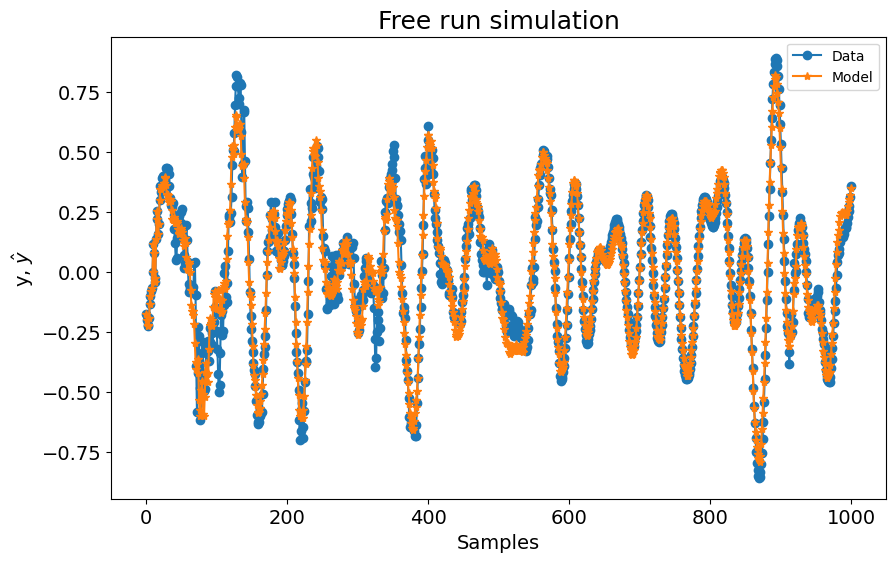
    


    
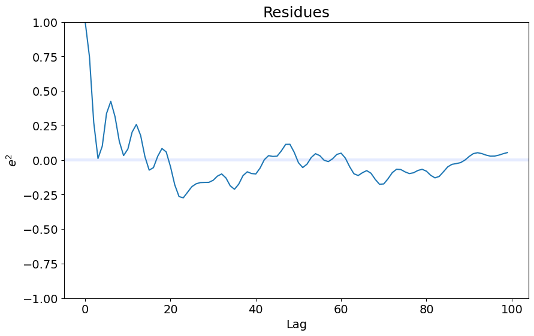
    


    
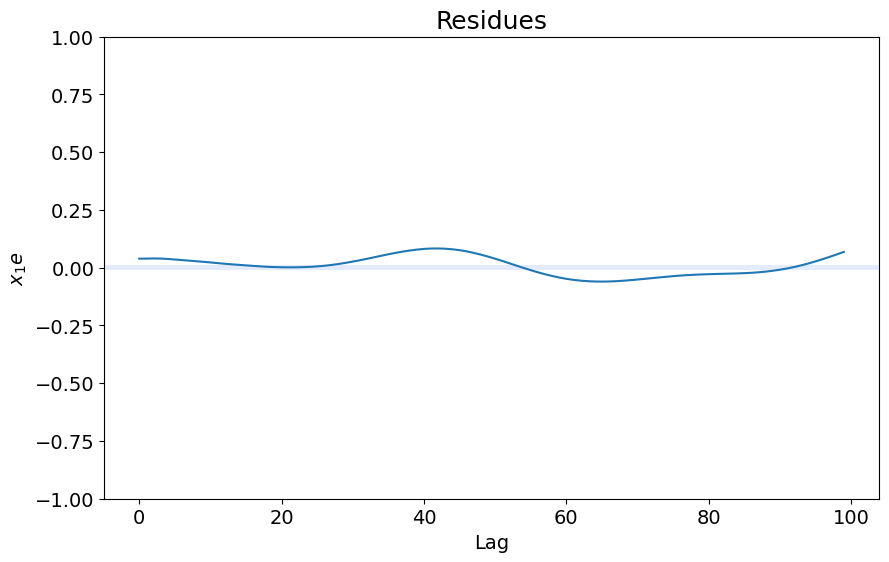
    


## Gráfico de Critérios de Informação


```python
xaxis = np.arange(1, model.n_info_values + 1)
plt.plot(xaxis, model.info_values)
plt.xlabel("n_terms")
plt.ylabel("Critério de Informação")

# Você pode usar o gráfico abaixo para escolher o "n_terms" e executar o modelo novamente com o valor mais adequado de termos.
```


    Text(0, 0.5, 'Critério de Informação')


    
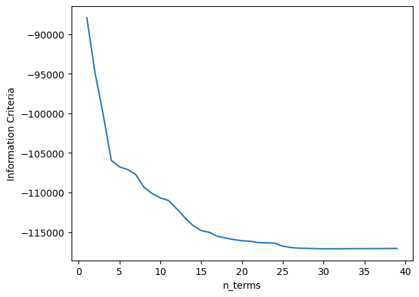

## Previsão Fotovoltaica

## Nota

O exemplo a seguir **não** tem a intenção de afirmar que uma biblioteca é melhor que outra. O foco principal destes exemplos é mostrar que o SysIdentPy pode ser uma boa alternativa para pessoas que desejam modelar séries temporais.

Compararemos os resultados obtidos com a biblioteca **neural prophet**.

Por questão de brevidade, do **SysIdentPy** apenas os métodos **MetaMSS**, **AOLS** e **FROLS** (com função base polinomial) serão utilizados. Consulte a documentação do SysIdentPy para conhecer outras formas de modelagem com a biblioteca.


Compararemos um previsor de 1 passo à frente em dados de irradiância solar (que pode ser um proxy para produção fotovoltaica). A configuração do modelo neuralprophet foi retirada da documentação do neuralprophet (https://neuralprophet.com/html/example_links/energy_data_example.html)

O treinamento ocorrerá em 80% dos dados, reservando os últimos 20% para validação.

Nota: os dados usados neste exemplo podem ser encontrados no github do neuralprophet.


```python
from warnings import simplefilter
import matplotlib.pyplot as plt
import numpy as np
import pandas as pd

from sysidentpy.model_structure_selection import FROLS, AOLS, MetaMSS
from sysidentpy.basis_function import Polynomial
from sysidentpy.parameter_estimation import LeastSquares
from sysidentpy.utils.plotting import plot_results
from sysidentpy.metrics import mean_squared_error

from neuralprophet import NeuralProphet
from neuralprophet import set_random_seed

simplefilter("ignore", FutureWarning)
np.seterr(all="ignore")

%matplotlib inline

loss = mean_squared_error
```

## FROLS


```python
raw = pd.read_csv(
    "https://raw.githubusercontent.com/wilsonrljr/sysidentpy-data/refs/heads/main/datasets/san_francisco_pv_ghi/SanFrancisco_PV_GHI.csv"
)
df = pd.DataFrame()
df["ds"] = pd.date_range("1/1/2015 1:00:00", freq=str(60) + "Min", periods=8760)
df["y"] = raw.iloc[:, 0].values

df_train, df_val = df.iloc[:7008, :], df.iloc[7008:, :]

y = df["y"].values.reshape(-1, 1)
y_train = df_train["y"].values.reshape(-1, 1)
y_test = df_val["y"].values.reshape(-1, 1)

x_train = df_train["ds"].dt.hour.values.reshape(-1, 1)
x_test = df_val["ds"].dt.hour.values.reshape(-1, 1)

basis_function = Polynomial(degree=1)
sysidentpy = FROLS(
    order_selection=True,
    ylag=24,
    xlag=24,
    info_criteria="bic",
    basis_function=basis_function,
    model_type="NARMAX",
    estimator=LeastSquares(),
)

sysidentpy.fit(X=x_train, y=y_train)
x_test = np.concatenate([x_train[-sysidentpy.max_lag :], x_test])
y_test = np.concatenate([y_train[-sysidentpy.max_lag :], y_test])

yhat = sysidentpy.predict(X=x_test, y=y_test, steps_ahead=1)
sysidentpy_loss = loss(
    pd.Series(y_test.flatten()[sysidentpy.max_lag :]),
    pd.Series(yhat.flatten()[sysidentpy.max_lag :]),
)
print(sysidentpy_loss)

plot_results(y=y_test[-104:], yhat=yhat[-104:])
```

    2204.333646698544


    
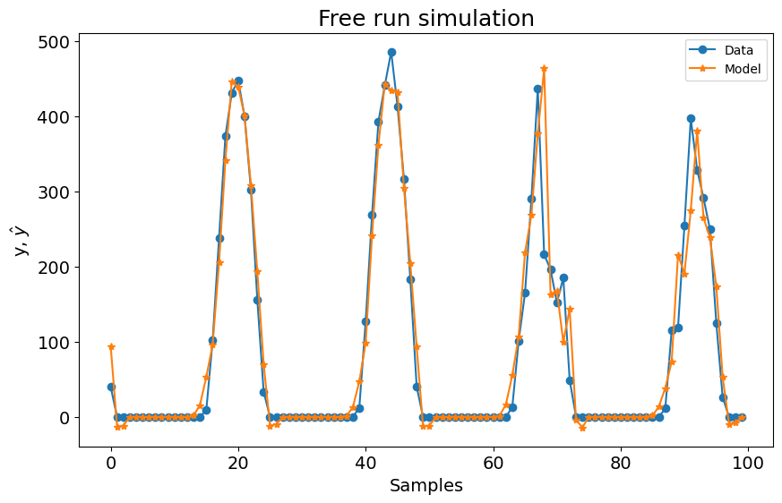
    


## MetaMSS


```python
set_random_seed(42)
raw = pd.read_csv(
    "https://raw.githubusercontent.com/wilsonrljr/sysidentpy-data/refs/heads/main/datasets/san_francisco_pv_ghi/SanFrancisco_PV_GHI.csv"
)
df = pd.DataFrame()
df["ds"] = pd.date_range("1/1/2015 1:00:00", freq=str(60) + "Min", periods=8760)
df["y"] = raw.iloc[:, 0].values

df_train, df_val = df.iloc[:7008, :], df.iloc[7008:, :]

y = df["y"].values.reshape(-1, 1)
y_train = df_train["y"].values.reshape(-1, 1)
y_test = df_val["y"].values.reshape(-1, 1)

x_train = df_train["ds"].dt.hour.values.reshape(-1, 1)
x_test = df_val["ds"].dt.hour.values.reshape(-1, 1)

basis_function = Polynomial(degree=1)
estimator = LeastSquares()
sysidentpy_metamss = MetaMSS(
    basis_function=basis_function,
    xlag=24,
    ylag=24,
    estimator=estimator,
    maxiter=10,
    steps_ahead=1,
    n_agents=15,
    loss_func="metamss_loss",
    model_type="NARMAX",
    random_state=42,
)
sysidentpy_metamss.fit(X=x_train, y=y_train)
x_test = np.concatenate([x_train[-sysidentpy_metamss.max_lag :], x_test])
y_test = np.concatenate([y_train[-sysidentpy_metamss.max_lag :], y_test])

yhat = sysidentpy_metamss.predict(X=x_test, y=y_test, steps_ahead=1)
metamss_loss = loss(
    pd.Series(y_test.flatten()[sysidentpy_metamss.max_lag :]),
    pd.Series(yhat.flatten()[sysidentpy_metamss.max_lag :]),
)
print(metamss_loss)

plot_results(y=y_test[-104:], yhat=yhat[-104:])
```

    2157.7700127350877


    
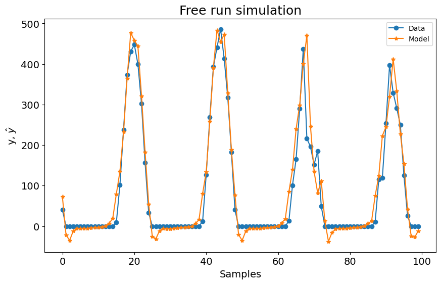
    


## AOLS


```python
set_random_seed(42)
raw = pd.read_csv(
    "https://raw.githubusercontent.com/wilsonrljr/sysidentpy-data/refs/heads/main/datasets/san_francisco_pv_ghi/SanFrancisco_PV_GHI.csv"
)
df = pd.DataFrame()
df["ds"] = pd.date_range("1/1/2015 1:00:00", freq=str(60) + "Min", periods=8760)
df["y"] = raw.iloc[:, 0].values

df_train, df_val = df.iloc[:7008, :], df.iloc[7008:, :]

y = df["y"].values.reshape(-1, 1)
y_train = df_train["y"].values.reshape(-1, 1)
y_test = df_val["y"].values.reshape(-1, 1)

x_train = df_train["ds"].dt.hour.values.reshape(-1, 1)
x_test = df_val["ds"].dt.hour.values.reshape(-1, 1)
basis_function = Polynomial(degree=1)
sysidentpy_AOLS = AOLS(
    ylag=24, xlag=24, k=2, L=1, model_type="NARMAX", basis_function=basis_function
)
sysidentpy_AOLS.fit(X=x_train, y=y_train)
x_test = np.concatenate([x_train[-sysidentpy_AOLS.max_lag :], x_test])
y_test = np.concatenate([y_train[-sysidentpy_AOLS.max_lag :], y_test])

yhat = sysidentpy_AOLS.predict(X=x_test, y=y_test, steps_ahead=1)
aols_loss = loss(
    pd.Series(y_test.flatten()[sysidentpy_AOLS.max_lag :]),
    pd.Series(yhat.flatten()[sysidentpy_AOLS.max_lag :]),
)
print(aols_loss)


plot_results(y=y_test[-104:], yhat=yhat[-104:])
```

    2361.561682547365


    
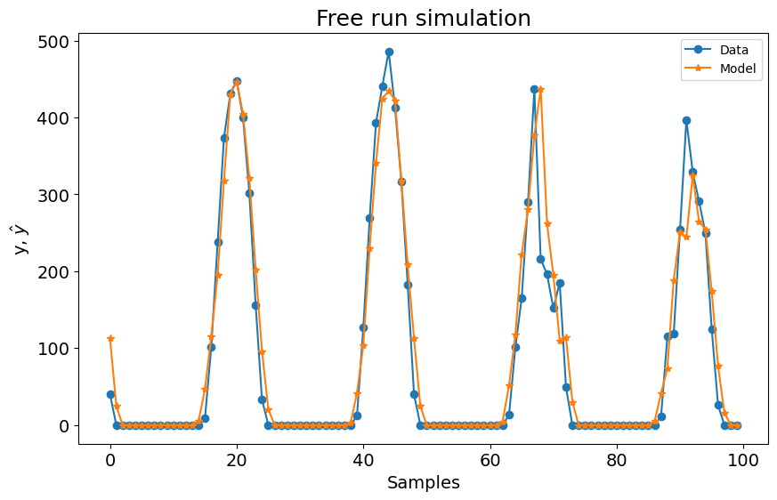
    


## Neural Prophet


```python
set_random_seed(42)

raw = pd.read_csv(
    "https://raw.githubusercontent.com/wilsonrljr/sysidentpy-data/refs/heads/main/datasets/san_francisco_pv_ghi/SanFrancisco_PV_GHI.csv"
)
df = pd.DataFrame()
df["ds"] = pd.date_range("1/1/2015 1:00:00", freq=str(60) + "Min", periods=8760)
df["y"] = raw.iloc[:, 0].values

m = NeuralProphet(
    n_lags=24,
    ar_sparsity=0.5,
    # num_hidden_layers = 2,
    # d_hidden=20,
)
metrics = m.fit(df, freq="H", valid_p=0.2)

df_train, df_val = m.split_df(df, valid_p=0.2)
m.test(df_val)

future = m.make_future_dataframe(df_val, n_historic_predictions=True)
forecast = m.predict(future)
# fig = m.plot(forecast)
print(loss(forecast["y"][24:-1], forecast["yhat1"][24:-1]))
```

    WARNING: nprophet - fit: Parts of code may break if using other than daily data.
    INFO: nprophet.utils - set_auto_seasonalities: Disabling yearly seasonality. Run NeuralProphet with yearly_seasonality=True to override this.
    INFO: nprophet.config - set_auto_batch_epoch: Auto-set batch_size to 32
    INFO: nprophet.config - set_auto_batch_epoch: Auto-set epochs to 7
     87%|████████▋ | 87/100 [00:00<00:00, 644.82it/s]
    INFO: nprophet - _lr_range_test: learning rate range test found optimal lr: 1.23E-01
    Epoch[7/7]: 100%|██████████| 7/7 [00:02<00:00,  2.58it/s, SmoothL1Loss=0.00415, MAE=58.8, RegLoss=0.0112]
    INFO: nprophet - _evaluate: Validation metrics:    SmoothL1Loss    MAE
    1         0.003 48.746


    4642.234763049609


```python
plt.plot(forecast["y"][-104:], "ro-")
plt.plot(forecast["yhat1"][-104:], "k*-")
```


    [<matplotlib.lines.Line2D at 0x2618e76ebe0>]


    
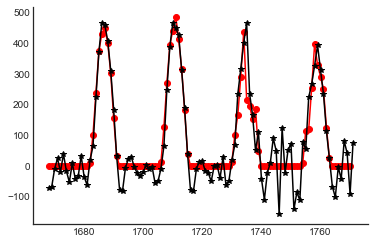
