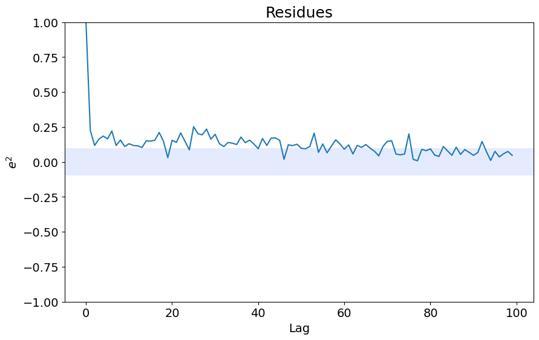
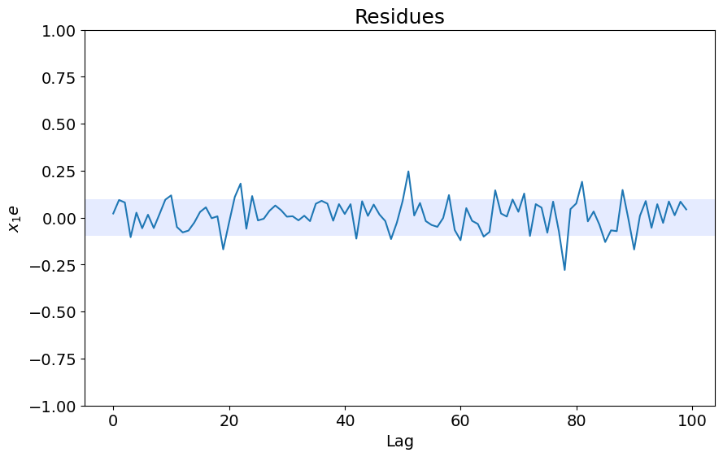
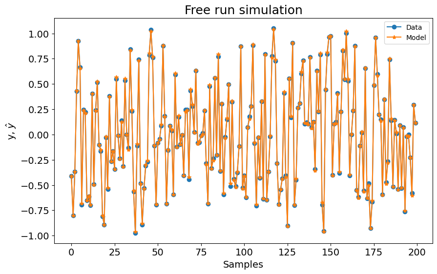
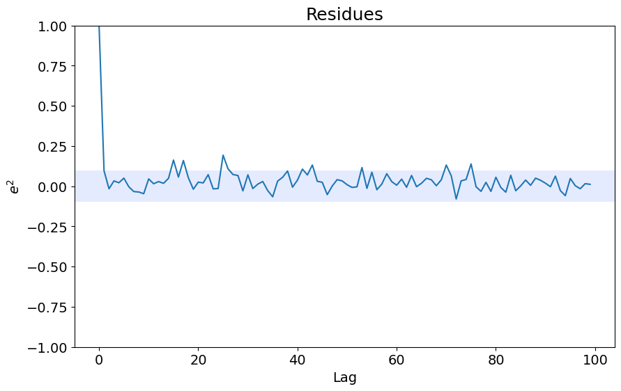
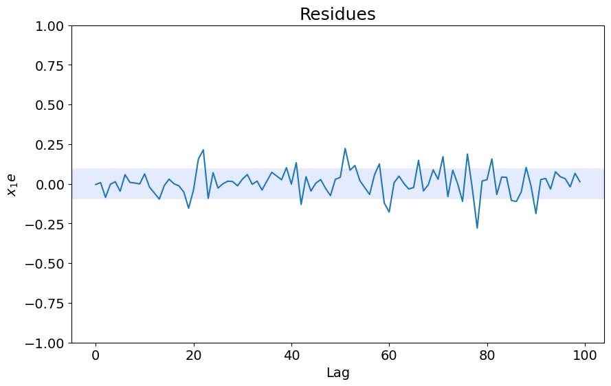

# Criar uma Rede Neural NARX

Exemplo criado por Wilson Rocha Lacerda Junior

> **Procurando mais detalhes sobre modelos NARMAX?**
> Para informações completas sobre modelos, métodos e uma ampla variedade de exemplos e benchmarks implementados no SysIdentPy, confira nosso livro:
> [*Nonlinear System Identification and Forecasting: Theory and Practice With SysIdentPy*](https://sysidentpy.org/book/0%20-%20Preface/)
>
> Este livro oferece orientação aprofundada para apoiar seu trabalho com o SysIdentPy.

## Treinamento Series-Parallel e Predição Parallel

Atualmente, o *SysIdentPy* suporta um processo de treinamento de rede Feedforward Series-Parallel (malha aberta), o que torna o processo de treinamento mais fácil. Convertemos a rede NARX da configuração Series-Parallel para a configuração Parallel (malha fechada) para predição.

A configuração Series-Parallel nos permite usar o Pytorch diretamente para treinamento, então podemos usar todo o poder da biblioteca Pytorch para construir nosso modelo de Rede Neural NARX!


O leitor é direcionado ao seguinte artigo para uma discussão mais aprofundada sobre as configurações Series-Parallel e Parallel em redes neurais NARX:

[Parallel Training Considered Harmful?: Comparing series-parallel and parallel feedforward
network training](https://arxiv.org/pdf/1706.07119.pdf)


## Construindo uma Rede Neural NARX

Primeiro, importe os pacotes necessários


```python
pip install sysidentpy
```


```python
from torch import nn
from sysidentpy.metrics import mean_squared_error
from sysidentpy.utils.generate_data import get_siso_data
from sysidentpy.neural_network import NARXNN

from sysidentpy.basis_function import Polynomial
from sysidentpy.utils.plotting import plot_residues_correlation, plot_results
from sysidentpy.residues.residues_correlation import (
    compute_residues_autocorrelation,
    compute_cross_correlation,
)
from sysidentpy.utils.narmax_tools import regressor_code
import torch
```


```python
torch.cuda.is_available()
```


    False


```python
device = "cuda" if torch.cuda.is_available() else "cpu"
print(f"Using {device} device")
```

    Using cpu device


## Obtendo os dados

Os dados são gerados simulando o seguinte modelo:

$y_k = 0.2y_{k-1} + 0.1y_{k-1}x_{k-1} + 0.9x_{k-1} + e_{k}$.

Se *colored_noise* for definido como True:

$e_{k} = 0.8\nu_{k-1} + \nu_{k}$,

onde $x$ é uma variável aleatória uniformemente distribuída e $\nu$ é uma variável com distribuição gaussiana com $\mu=0$ e $\sigma=0.1$


```python
x_train, x_valid, y_train, y_valid = get_siso_data(
    n=1000, colored_noise=False, sigma=0.01, train_percentage=80
)
```

## Escolhendo os parâmetros NARX, função de perda e otimizador

Você pode criar um objeto NARXNN e escolher o lag máximo tanto da entrada quanto da saída para construir a matriz de regressores que servirá como entrada da rede.

Além disso, você pode escolher a função de perda, o otimizador, os parâmetros opcionais do otimizador e o número de épocas.

Como construímos esta funcionalidade sobre o Pytorch, você pode escolher qualquer função de perda do torch.nn.functional. [Clique aqui](https://pytorch.org/docs/stable/nn.functional.html#loss-functions) para uma lista das funções de perda disponíveis. Você só precisa passar o nome da função de perda desejada.

Da mesma forma, você pode escolher qualquer otimizador do torch.optim. [Clique aqui](https://pytorch.org/docs/stable/optim.html) para uma lista de otimizadores disponíveis.


```python
basis_function = Polynomial(degree=1)

narx_net = NARXNN(
    ylag=2,
    xlag=2,
    basis_function=basis_function,
    model_type="NARMAX",
    loss_func="mse_loss",
    optimizer="Adam",
    epochs=2000,
    verbose=False,
    device="cuda",
    optim_params={
        "betas": (0.9, 0.999),
        "eps": 1e-05,
    },  # optional parameters of the optimizer
)
```

    C:\Users\wilso\Desktop\projects\GitHub\sysidentpy\sysidentpy\neural_network\narx_nn.py:156: UserWarning: No CUDA available. We set the device as CPU
      self.device = self._check_cuda(device)


Como definimos nosso NARXNN usando $ylag=2$, $xlag=2$ e uma função base polinomial com $degree=1$, temos uma matriz de regressores com 4 features. Precisamos do tamanho da matriz de regressores para construir as camadas da nossa rede. Nossos dados de entrada (x_train) têm apenas uma feature, mas como estamos criando uma rede NARX, uma matriz de regressores é construída internamente com novas features baseadas no xlag e ylag.

Se você precisar de ajuda para descobrir quantos regressores são criados internamente, pode usar a função narmax_tools regressor_code e verificar o tamanho do código de regressores gerado:


```python
basis_function = Polynomial(degree=1)

regressors = regressor_code(
    X=x_train,
    xlag=2,
    ylag=2,
    model_type="NARMAX",
    model_representation="neural_network",
    basis_function=basis_function,
)
```


```python
n_features = regressors.shape[0]  # the number of features of the NARX net
n_features
```


    4


```python
regressors
```


    array([[1001],
           [1002],
           [2001],
           [2002]])


## Construindo a Rede Neural NARX

A configuração da sua rede segue exatamente o mesmo padrão de uma rede definida em Pytorch. O código a seguir representa nossa rede neural NARX.


```python
class NARX(nn.Module):
    def __init__(self):
        super().__init__()
        self.lin = nn.Linear(n_features, 30)
        self.lin2 = nn.Linear(30, 30)
        self.lin3 = nn.Linear(30, 1)
        self.tanh = nn.Tanh()

    def forward(self, xb):
        z = self.lin(xb)
        z = self.tanh(z)
        z = self.lin2(z)
        z = self.tanh(z)
        z = self.lin3(z)
        return z
```

Precisamos passar a rede definida para nosso estimador NARXNN.


```python
narx_net.net = NARX()
```


```python
if device == "cuda":
    narx_net.net.to(torch.device("cuda"))
```

## Fit e Predict

Como temos uma função fit (para treinamento) e predict para o NARMAX Polinomial, criamos o mesmo padrão para a rede NARX. Então, você só precisa usar fit e predict da seguinte forma:


```python
narx_net.fit(X=x_train, y=y_train, X_test=x_valid, y_test=y_valid)
```


    <sysidentpy.neural_network.narx_nn.NARXNN at 0x19ddfff3890>


```python
yhat = narx_net.predict(X=x_valid, y=y_valid)
```

## Resultados

Agora mostramos os resultados


```python
print("MSE: ", mean_squared_error(y_valid, yhat))
plot_results(y=y_valid, yhat=yhat, n=1000)
ee = compute_residues_autocorrelation(y_valid, yhat)
plot_residues_correlation(data=ee, title="Residues", ylabel="$e^2$")
x1e = compute_cross_correlation(y_valid, yhat, x_valid)
plot_residues_correlation(data=x1e, title="Residues", ylabel="$x_1e$")
```

    MSE:  0.00013103585914746256


    

    


    

    


    

    


## Nota

Se você construir a configuração da rede antes de chamar o NARXNN, pode simplesmente passar o modelo para o NARXNN da seguinte forma:


```python
class NARX(nn.Module):
    def __init__(self):
        super().__init__()
        self.lin = nn.Linear(n_features, 30)
        self.lin2 = nn.Linear(30, 30)
        self.lin3 = nn.Linear(30, 1)
        self.tanh = nn.Tanh()

    def forward(self, xb):
        z = self.lin(xb)
        z = self.tanh(z)
        z = self.lin2(z)
        z = self.tanh(z)
        z = self.lin3(z)
        return z


narx_net2 = NARXNN(
    net=NARX(),
    ylag=2,
    xlag=2,
    basis_function=basis_function,
    model_type="NARMAX",
    loss_func="mse_loss",
    optimizer="Adam",
    epochs=2000,
    verbose=False,
    optim_params={
        "betas": (0.9, 0.999),
        "eps": 1e-05,
    },  # optional parameters of the optimizer
)

narx_net2.fit(X=x_train, y=y_train)
yhat = narx_net2.predict(X=x_valid, y=y_valid)
print("MSE: ", mean_squared_error(y_valid, yhat))

plot_results(y=y_valid, yhat=yhat, n=1000)
ee = compute_residues_autocorrelation(y_valid, yhat)
plot_residues_correlation(data=ee, title="Residues", ylabel="$e^2$")
x1e = compute_cross_correlation(y_valid, yhat, x_valid)
plot_residues_correlation(data=x1e, title="Residues", ylabel="$x_1e$")
```

    MSE:  0.00010086796658327408


    

    


    

    


    

    


# Nota

Lembre-se que você pode usar predição n-steps-ahead e modelos NAR e NFIR. Verifique como usá-los em seus respectivos exemplos.

