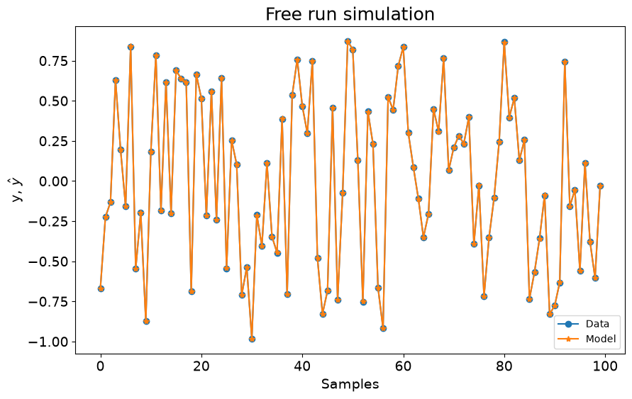
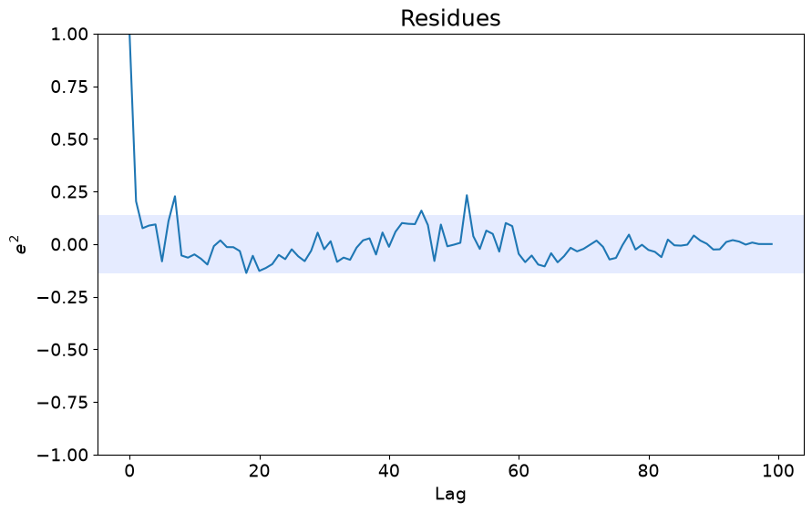
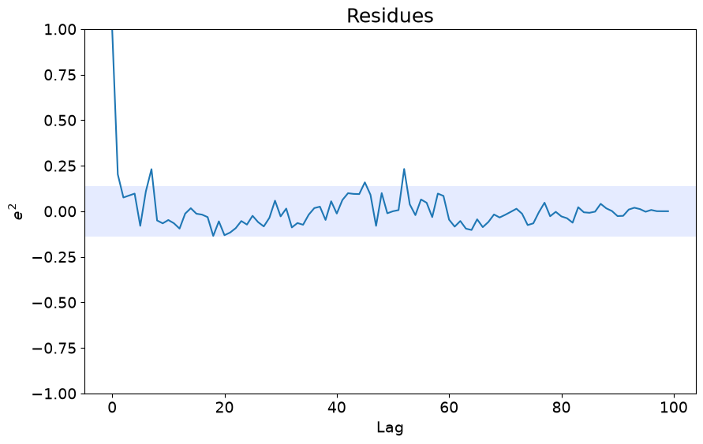
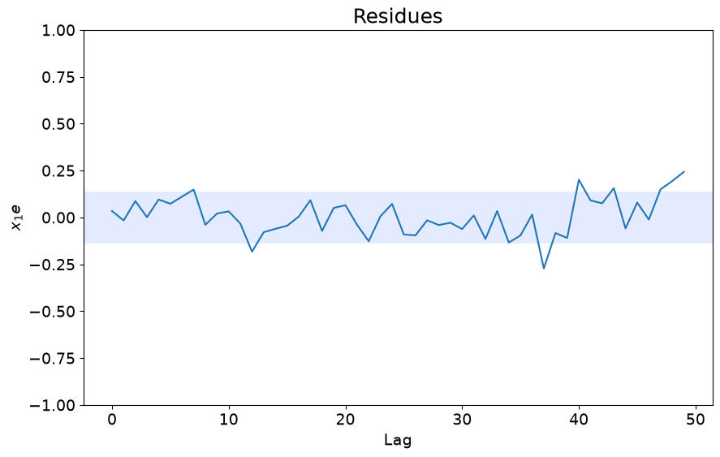

# Simular Modelos Existentes

Exemplo criado por Wilson Rocha Lacerda Junior

> **Procurando mais detalhes sobre modelos NARMAX?**
> Para informações completas sobre modelos, métodos e uma ampla variedade de exemplos e benchmarks implementados no SysIdentPy, confira nosso livro:
> [*Nonlinear System Identification and Forecasting: Theory and Practice With SysIdentPy*](https://sysidentpy.org/book/0%20-%20Preface/)
>
> Este livro oferece orientação aprofundada para apoiar seu trabalho com o SysIdentPy.


```bash
pip install sysidentpy
```


```python
import numpy as np
import pandas as pd
from sysidentpy.simulation import SimulateNARMAX
from sysidentpy.metrics import root_relative_squared_error
from sysidentpy.utils.generate_data import get_siso_data
from sysidentpy.basis_function import Polynomial
from sysidentpy.parameter_estimation import LeastSquares
from sysidentpy.utils.display_results import results
from sysidentpy.utils.plotting import plot_residues_correlation, plot_results
from sysidentpy.residues.residues_correlation import (
    compute_residues_autocorrelation,
    compute_cross_correlation,
)
```

## Gerando dados de amostra com 1 entrada e 1 saída
### Os dados são gerados simulando o seguinte modelo:

$y_k = 0.2y_{k-1} + 0.1y_{k-1}x_{k-1} + 0.9x_{k-2} + e_{k}$

Se *colored_noise* for definido como True:

$e_{k} = 0.8\nu_{k-1} + \nu_{k}$

onde $x$ é uma variável aleatória uniformemente distribuída e $\nu$ é uma variável com distribuição gaussiana com $\mu=0$ e $\sigma=0.1$

No próximo exemplo, geraremos dados com 1000 amostras com ruído branco e selecionando 90% dos dados para treinar o modelo.


```python
np.random.seed(42)

x_train, x_test, y_train, y_test = get_siso_data(
    n=1000, colored_noise=False, sigma=0.001, train_percentage=90
)
```

## Definindo o modelo

Já sabemos que os dados gerados são resultado do modelo $𝑦_𝑘=0.2𝑦_{𝑘−1}+0.1𝑦_{𝑘−1}𝑥_{𝑘−1}+0.9𝑥_{𝑘−2}+𝑒_𝑘$. Assim, podemos criar um modelo com esses regressores seguindo um padrão de codificação:
- $0$ é o termo constante,
- $[1001] = y_{k-1}$
- $[100n] = y_{k-n}$
- $[200n] = x1_{k-n}$
- $[300n] = x2_{k-n}$
- $[1011, 1001] = y_{k-11} \times y_{k-1}$
- $[100n, 100m] = y_{k-n} \times y_{k-m}$
- $[12001, 1003, 1001] = x11_{k-1} \times y_{k-3} \times y_{k-1}$
- e assim por diante

### Nota Importante

A ordem dos códigos dentro de cada linha do modelo importa.

Se você usar [2001, 1001], funcionará, mas [1001, 2001] não (o regressor será ignorado). Sempre coloque o maior valor primeiro:
- $[2003, 2001]$ **funciona**
- $[2001, 2003]$ **não funciona**

Trataremos esta limitação em uma atualização futura. As linhas do modelo podem
aparecer em qualquer ordem, mas cada valor de `theta` deve corresponder à linha
de `model` na mesma posição.


```python
s = SimulateNARMAX(
    basis_function=Polynomial(), calculate_err=True, estimate_parameter=False
)

# the model must be a numpy array
model = np.array(
    [
        [1001, 0],  # y(k-1)
        [2001, 1001],  # x1(k-1)y(k-1)
        [2002, 0],  # x1(k-2)
    ]
)
# theta deve ter formato (n, 1) e seguir a ordem das linhas de model
theta = np.array([[0.2, 0.1, 0.9]]).T
```

## Simulando o modelo

Após definir o modelo e theta, só precisamos usar o método simulate.

O método simulate retorna os valores preditos e os resultados onde podemos visualizar os regressores, parâmetros e valores de ERR.


```python
yhat = s.simulate(
    X_test=x_test,
    y_test=y_test,
    model_code=model,
    theta=theta,
)

r = pd.DataFrame(
    results(s.final_model, s.theta, s.err, s.n_terms, err_precision=8, dtype="sci"),
    columns=["Regressors", "Parameters", "ERR"],
)
print(r)

plot_results(y=y_test, yhat=yhat, n=1000)
ee = compute_residues_autocorrelation(y_test, yhat)
plot_residues_correlation(data=ee, title="Residues", ylabel="$e^2$")
x1e = compute_cross_correlation(y_test, yhat, x_test)
plot_residues_correlation(data=x1e, title="Residues", ylabel="$x_1e$")
```

          Regressors  Parameters             ERR
    0         y(k-1)  2.0000E-01  0.00000000E+00
    1  x1(k-1)y(k-1)  1.0000E-01  0.00000000E+00
    2        x1(k-2)  9.0000E-01  0.00000000E+00


    

    


    

    


    

    


### Opções

Você pode definir o `steps_ahead` para executar a predição/simulação:


```python
yhat = s.simulate(
    X_test=x_test,
    y_test=y_test,
    model_code=model,
    theta=theta,
    steps_ahead=1,
)
rrse = root_relative_squared_error(y_test, yhat)
print(rrse)
```

    0.0018437406169225401


```python
yhat = s.simulate(
    X_test=x_test,
    y_test=y_test,
    model_code=model,
    theta=theta,
    steps_ahead=21,
)
rrse = root_relative_squared_error(y_test, yhat)
print(rrse)
```

    0.0018771888780714843


### Estimando os parâmetros

Se você tiver apenas a estrutura do modelo, pode criar um objeto com `estimate_parameter=True` e escolher o método de estimação usando `estimator`. Neste caso, você precisa passar os dados de treinamento para estimação dos parâmetros.

Quando `estimate_parameter=True`, também calculamos o ERR considerando apenas os regressores definidos pelo usuário.


```python
s = SimulateNARMAX(
    basis_function=Polynomial(),
    estimate_parameter=True,
    estimator=LeastSquares(),
    calculate_err=True,
)

yhat = s.simulate(
    X_train=x_train,
    y_train=y_train,
    X_test=x_test,
    y_test=y_test,
    model_code=model,
    # theta will be estimated using the defined estimator
)

r = pd.DataFrame(
    results(s.final_model, s.theta, s.err, s.n_terms, err_precision=8, dtype="sci"),
    columns=["Regressors", "Parameters", "ERR"],
)
print(r)

plot_results(y=y_test, yhat=yhat, n=1000)
ee = compute_residues_autocorrelation(y_test, yhat)
plot_residues_correlation(data=ee, title="Residues", ylabel="$e^2$")
x1e = compute_cross_correlation(y_test, yhat, x_test)
plot_residues_correlation(data=x1e, title="Residues", ylabel="$x_1e$")
```

          Regressors  Parameters             ERR
    0         y(k-1)  2.0002E-01  9.55432286E-01
    1  x1(k-1)y(k-1)  1.0004E-01  4.12434401E-02
    2        x1(k-2)  8.9998E-01  3.32077000E-03


    

    


    

    


    

    
