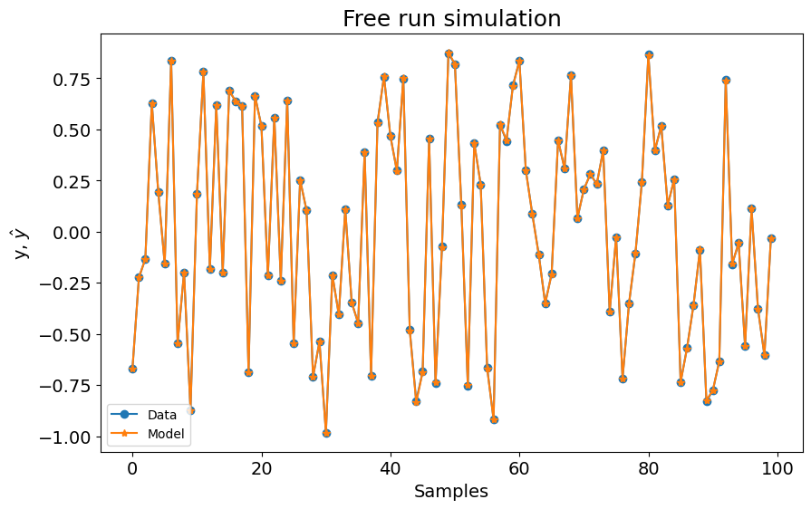

# Modelo NFIR - Visão Geral

Exemplo criado por Wilson Rocha Lacerda Junior

> **Procurando mais detalhes sobre modelos NARMAX?**
> Para informações completas sobre modelos, métodos e uma ampla variedade de exemplos e benchmarks implementados no SysIdentPy, confira nosso livro:
> [*Nonlinear System Identification and Forecasting: Theory and Practice With SysIdentPy*](https://sysidentpy.org/book/0%20-%20Preface/)
>
> Este livro oferece orientação aprofundada para apoiar seu trabalho com o SysIdentPy.

Este exemplo mostra como usar o SysIdentPy para construir modelos NFIR. Modelos NFIR são modelos sem realimentação de saída. Em outras palavras, não há regressores $y(k-n_y)$, apenas $x(k-n_x)$.

O modelo NFIR pode ser descrito como:

$$
    y_k= F^\ell[x_{k-d}, x_{k-d-1}, \dotsc, x_{k-d-n_x}, e_{k-1}, \dotsc, e_{k-n_e}] + e_k
$$

onde $n_x \in \mathbb{N}$ é o lag máximo para a entrada do sistema; $x_k \in \mathbb{R}^{n_x}$ é a entrada do sistema no tempo discreto $k \in \mathbb{N}^n$; $e_k \in \mathbb{R}^{n_e}$ representa incertezas e possível ruído no tempo discreto $k$. Neste caso, $\mathcal{F}^\ell$ é alguma função não-linear dos regressores de entrada com grau de não-linearidade $\ell \in \mathbb{N}$ e $d$ é um atraso de tempo tipicamente definido como $d=1$.

É importante notar que o tamanho do modelo NFIR é geralmente significativamente maior comparado ao tamanho de seu equivalente modelo NARMAX. Esta desvantagem pode ser notada na dimensionalidade de modelos lineares e leva a cenários ainda mais complexos no caso não-linear.

Portanto, se você está procurando modelos parcimoniosos e compactos, considere usar modelos NARMAX. No entanto, ao comparar modelos NFIR e NARMAX, é geralmente mais desafiador estabelecer estabilidade, particularmente em um contexto orientado a controle, com modelos NARMAX do que com modelos NFIR.


```python
pip install sysidentpy
```


```python
import pandas as pd
import numpy as np
from sysidentpy.utils.generate_data import get_siso_data
from sysidentpy.metrics import root_relative_squared_error
from sysidentpy.basis_function import Polynomial
from sysidentpy.parameter_estimation import LeastSquares, RecursiveLeastSquares
from sysidentpy.utils.display_results import results
from sysidentpy.utils.plotting import plot_results
from sysidentpy.model_structure_selection import AOLS, FROLS
```

NFIR x NARMAX

Vamos reproduzir o mesmo exemplo fornecido na ["seção de funcionalidades principais"](https://sysidentpy.org/examples/basic_steps/). Naquele exemplo, usamos um modelo NARX com xlag e ylag iguais a 2 e um grau de não-linearidade igual a 2. Isso resultou em um modelo com 3 regressores e um RRSE (métrica de validação) igual a $0.000184$

| Regressores   | Parâmetros   | ERR            |
|---------------|--------------|----------------|
| x1(k-2)       | 9.0001E-01   | 9.57505011E-01 |
| y(k-1)        | 2.0001E-01   | 3.89117583E-02 |
| x1(k-1)y(k-1) | 9.9992E-02   | 3.58319976E-03 |

### Então, o que acontece se eu usar um modelo NFIR com a mesma configuração?


```python
np.random.seed(seed=42)
# gerando dados simulados
x_train, x_test, y_train, y_test = get_siso_data(
    n=1000, colored_noise=False, sigma=0.001, train_percentage=90
)

basis_function = Polynomial(degree=2)
estimator = LeastSquares()
model = FROLS(
    order_selection=True,
    xlag=2,
    info_criteria="aic",
    estimator=estimator,
    basis_function=basis_function,
    model_type="NFIR",
)

model.fit(X=x_train, y=y_train)
yhat = model.predict(X=x_test, y=y_test)
rrse = root_relative_squared_error(y_test, yhat)
print(rrse)

r = pd.DataFrame(
    results(
        model.final_model,
        model.theta,
        model.err,
        model.n_terms,
        err_precision=8,
        dtype="sci",
    ),
    columns=["Regressors", "Parameters", "ERR"],
)
print(r)

plot_results(y=y_test, yhat=yhat, n=1000)
```

    C:\Users\wilso\Desktop\projects\GitHub\sysidentpy\sysidentpy\model_structure_selection\forward_regression_orthogonal_least_squares.py:618: UserWarning: n_info_values is greater than the maximum number of all regressors space considering the chosen y_lag, u_lag, and non_degree. We set as 6
      self.info_values = self.information_criterion(reg_matrix, y)


    0.2129700627690414
      Regressors  Parameters             ERR
    0    x1(k-2)  8.9017E-01  9.55432286E-01


    

    


No caso NFIR, obtivemos um modelo com 1 regressor, mas com RRSE significativamente pior ($0.21$)

| Regressores | Parâmetros  | ERR            |
|-------------|-------------|----------------|
| x1(k-2)     | 8.9017E-01  | 9.55432286E-01 |


Então, para obter um modelo NFIR melhor, temos que definir um modelo de ordem mais alta. Em outras palavras, temos que definir um lag máximo maior para construir o modelo.

Vamos definir xlag=3.


```python
np.random.seed(seed=42)
# gerando dados simulados
x_train, x_test, y_train, y_test = get_siso_data(
    n=1000, colored_noise=False, sigma=0.001, train_percentage=90
)

basis_function = Polynomial(degree=2)
estimator = LeastSquares()
model = FROLS(
    order_selection=True,
    xlag=3,
    info_criteria="aic",
    estimator=estimator,
    basis_function=basis_function,
    model_type="NFIR",
)

model.fit(X=x_train, y=y_train)
yhat = model.predict(X=x_test, y=y_test)
rrse = root_relative_squared_error(y_test, yhat)
print(rrse)

r = pd.DataFrame(
    results(
        model.final_model,
        model.theta,
        model.err,
        model.n_terms,
        err_precision=8,
        dtype="sci",
    ),
    columns=["Regressors", "Parameters", "ERR"],
)
print(r)

plot_results(y=y_test, yhat=yhat, n=1000)
```

    0.04314951932710626
           Regressors  Parameters             ERR
    0         x1(k-2)  8.9980E-01  9.55367779E-01
    1         x1(k-3)  1.7832E-01  3.94348076E-02
    2  x1(k-3)x1(k-1)  9.1104E-02  3.33315478E-03


    

    


Agora, o modelo tem 3 regressores, mas o RRSE ainda é pior ($0.04$).

| Regressores     | Parâmetros  | ERR            |
|-----------------|-------------|----------------|
| x1(k-2)         | 8.9980E-01  | 9.55367779E-01 |
| x1(k-3)         | 1.7832E-01  | 3.94348076E-02 |
| x1(k-3)x1(k-1)  | 9.1104E-02  | 3.33315478E-03 |

Vamos definir xlag=5.


```python
np.random.seed(seed=42)
# gerando dados simulados
x_train, x_test, y_train, y_test = get_siso_data(
    n=1000, colored_noise=False, sigma=0.001, train_percentage=90
)

basis_function = Polynomial(degree=2)
estimator = LeastSquares()
model = FROLS(
    order_selection=True,
    xlag=5,
    info_criteria="aic",
    estimator=estimator,
    basis_function=basis_function,
    model_type="NFIR",
    err_tol=None,
)

model.fit(X=x_train, y=y_train)
yhat = model.predict(X=x_test, y=y_test)
rrse = root_relative_squared_error(y_test, yhat)
print(rrse)

r = pd.DataFrame(
    results(
        model.final_model,
        model.theta,
        model.err,
        model.n_terms,
        err_precision=8,
        dtype="sci",
    ),
    columns=["Regressors", "Parameters", "ERR"],
)
print(r)

plot_results(y=y_test, yhat=yhat, n=1000)
```

    0.004209451216121233
           Regressors  Parameters             ERR
    0         x1(k-2)  8.9978E-01  9.55485306E-01
    1         x1(k-3)  1.7979E-01  3.93181813E-02
    2  x1(k-3)x1(k-1)  8.9706E-02  3.33141271E-03
    3         x1(k-4)  3.5772E-02  1.54789285E-03
    4  x1(k-4)x1(k-2)  1.7615E-02  1.09675506E-04
    5  x1(k-4)x1(k-1)  1.7871E-02  1.13215338E-04
    6         x1(k-5)  6.9594E-03  6.23773643E-05
    7  x1(k-5)x1(k-1)  4.1353E-03  6.10794551E-06
    8  x1(k-5)x1(k-3)  3.4007E-03  3.98364615E-06
    9  x1(k-5)x1(k-2)  2.9798E-03  3.42693984E-06


    

    


Agora o RRSE está mais próximo do modelo NARMAX, mas o modelo NFIR tem 10 regressores. Então, como mencionado antes, a ordem dos modelos NFIR é geralmente maior que a do modelo NARMAX para obter resultados comparáveis.

| Regressores     | Parâmetros  | ERR            |
|-----------------|-------------|----------------|
| x1(k-2)         | 8.9978E-01  | 9.55485306E-01 |
| x1(k-3)         | 1.7979E-01  | 3.93181813E-02 |
| x1(k-3)x1(k-1)  | 8.9706E-02  | 3.33141271E-03 |
| x1(k-4)         | 3.5772E-02  | 1.54789285E-03 |
| x1(k-4)x1(k-2)  | 1.7615E-02  | 1.09675506E-04 |
| x1(k-4)x1(k-1)  | 1.7871E-02  | 1.13215338E-04 |
| x1(k-5)         | 6.9594E-03  | 6.23773643E-05 |
| x1(k-5)x1(k-1)  | 4.1353E-03  | 6.10794551E-06 |
| x1(k-5)x1(k-3)  | 3.4007E-03  | 3.98364615E-06 |
| x1(k-5)x1(k-2)  | 2.9798E-03  | 3.42693984E-06 |

xlag = 35


```python
np.random.seed(seed=42)
# gerando dados simulados
x_train, x_test, y_train, y_test = get_siso_data(
    n=1000, colored_noise=False, sigma=0.001, train_percentage=90
)

basis_function = Polynomial(degree=2)
estimator = RecursiveLeastSquares()
model = FROLS(
    order_selection=True,
    xlag=35,
    n_info_values=200,
    info_criteria="aic",
    estimator=estimator,
    basis_function=basis_function,
    model_type="NFIR",
    err_tol=None,
)

model.fit(X=x_train, y=y_train)
yhat = model.predict(X=x_test, y=y_test)
rrse = root_relative_squared_error(y_test, yhat)
print(rrse)

r = pd.DataFrame(
    results(
        model.final_model,
        model.theta,
        model.err,
        model.n_terms,
        err_precision=8,
        dtype="sci",
    ),
    columns=["Regressors", "Parameters", "ERR"],
)
print(r)

plot_results(y=y_test, yhat=yhat, n=1000)
```

    0.0033427508754120074
            Regressors  Parameters             ERR
    0          x1(k-2)  9.0009E-01  9.55386378E-01
    1          x1(k-3)  1.8001E-01  3.94178379E-02
    2   x1(k-3)x1(k-1)  9.0886E-02  3.32874170E-03
    3          x1(k-4)  3.5412E-02  1.54540871E-03
    4   x1(k-4)x1(k-2)  1.8743E-02  1.12751104E-04
    5   x1(k-4)x1(k-1)  1.8378E-02  1.13878189E-04
    6          x1(k-5)  6.7236E-03  6.27406151E-05
    7   x1(k-5)x1(k-1)  4.4974E-03  6.32909200E-06
    8   x1(k-5)x1(k-3)  3.5420E-03  3.95779051E-06
    9   x1(k-5)x1(k-2)  5.5656E-03  3.39231220E-06
    10         x1(k-6)  1.5079E-03  2.37202762E-06
    11  x1(k-6)x1(k-2)  1.8768E-03  3.65196792E-07
    12  x1(k-6)x1(k-3)  1.0685E-03  2.92529290E-07
    13  x1(k-6)x1(k-1)  6.3191E-04  2.55676107E-07


    

    


Agora o RRSE está mais próximo do modelo NARMAX, mas o modelo NFIR tem 14 regressores, com `RRSE=0.0033`. Então, como você pode verificar nestes exemplos, a ordem dos modelos NFIR é geralmente maior que a do modelo NARMAX para obter resultados comparáveis, mesmo tentando diferentes algoritmos de estimação de parâmetros.

| Regressores       | Parâmetros  | ERR             |
|-------------------|-------------|-----------------|
| x1(k-2)           | 9.0009E-01  | 9.55386378E-01  |
| x1(k-3)           | 1.8001E-01  | 3.94178379E-02  |
| x1(k-3)x1(k-1)    | 9.0886E-02  | 3.32874170E-03  |
| x1(k-4)           | 3.5412E-02  | 1.54540871E-03  |
| x1(k-4)x1(k-2)    | 1.8743E-02  | 1.12751104E-04  |
| x1(k-4)x1(k-1)    | 1.8378E-02  | 1.13878189E-04  |
| x1(k-5)           | 6.7236E-03  | 6.27406151E-05  |
| x1(k-5)x1(k-1)    | 4.4974E-03  | 6.32909200E-06  |
| x1(k-5)x1(k-3)    | 3.5420E-03  | 3.95779051E-06  |
| x1(k-5)x1(k-2)    | 5.5656E-03  | 3.39231220E-06  |
| x1(k-6)           | 1.5079E-03  | 2.37202762E-06  |
| x1(k-6)x1(k-2)    | 1.8768E-03  | 3.65196792E-07  |
| x1(k-6)x1(k-3)    | 1.0685E-03  | 2.92529290E-07  |
| x1(k-6)x1(k-1)    | 6.3191E-04  | 2.55676107E-07  |
