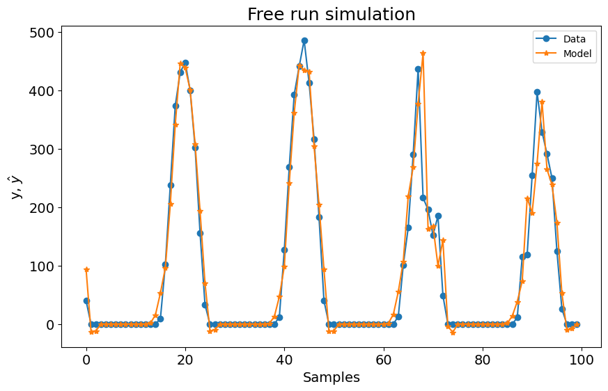
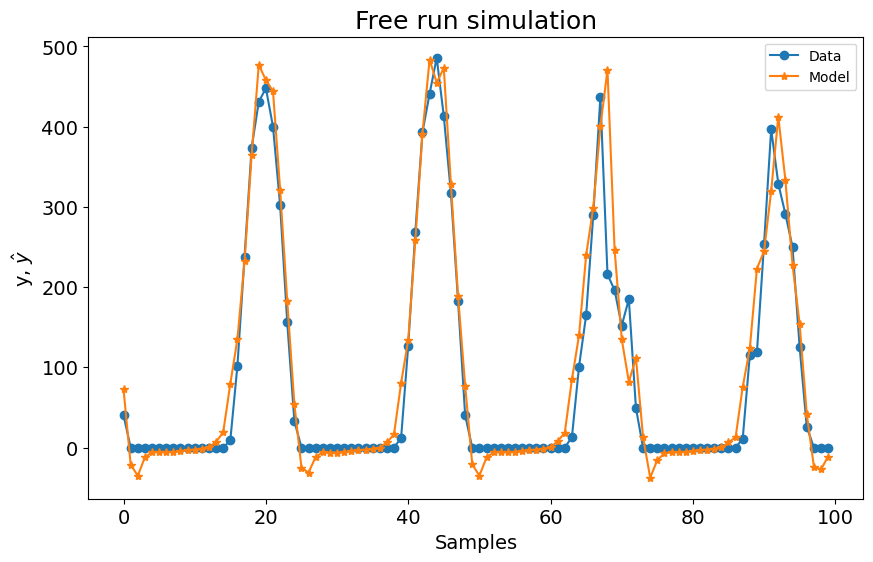
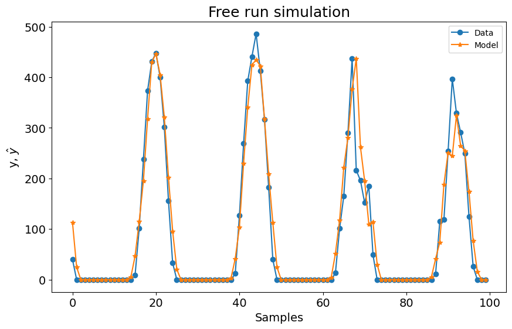
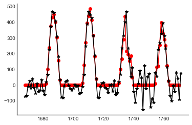

# Benchmark de Previsão Fotovoltaica

Exemplo criado por Wilson Rocha Lacerda Junior

> **Procurando mais detalhes sobre modelos NARMAX?**
> Para informações completas sobre modelos, métodos e uma ampla variedade de exemplos e benchmarks implementados no SysIdentPy, confira nosso livro:
> [*Nonlinear System Identification and Forecasting: Theory and Practice With SysIdentPy*](https://sysidentpy.org/book/0%20-%20Preface/)
>
> Este livro fornece orientações detalhadas para apoiar seu trabalho com o SysIdentPy.

## Nota

O exemplo a seguir **não** tem a intenção de afirmar que uma biblioteca é melhor que outra. O foco principal destes exemplos é mostrar que o SysIdentPy pode ser uma boa alternativa para pessoas que desejam modelar séries temporais.

Compararemos os resultados obtidos com a biblioteca **neural prophet**.

Por questão de brevidade, do **SysIdentPy** apenas os métodos **MetaMSS**, **AOLS** e **FROLS** (com função base polinomial) serão utilizados. Consulte a documentação do SysIdentPy para conhecer outras formas de modelagem com a biblioteca.


Compararemos um previsor de 1 passo à frente em dados de irradiância solar (que pode ser um proxy para produção fotovoltaica). A configuração do modelo neuralprophet foi retirada da documentação do neuralprophet (https://neuralprophet.com/html/example_links/energy_data_example.html)

O treinamento ocorrerá em 80% dos dados, reservando os últimos 20% para validação.

Nota: os dados usados neste exemplo podem ser encontrados no github do neuralprophet.


```python
from warnings import simplefilter
import matplotlib.pyplot as plt
import numpy as np
import pandas as pd

from sysidentpy.model_structure_selection import FROLS, AOLS, MetaMSS
from sysidentpy.basis_function import Polynomial
from sysidentpy.parameter_estimation import LeastSquares
from sysidentpy.utils.plotting import plot_results
from sysidentpy.metrics import mean_squared_error

from neuralprophet import NeuralProphet
from neuralprophet import set_random_seed

simplefilter("ignore", FutureWarning)
np.seterr(all="ignore")

%matplotlib inline

loss = mean_squared_error
```

## FROLS


```python
raw = pd.read_csv(
    "https://raw.githubusercontent.com/wilsonrljr/sysidentpy-data/refs/heads/main/datasets/san_francisco_pv_ghi/SanFrancisco_PV_GHI.csv"
)
df = pd.DataFrame()
df["ds"] = pd.date_range("1/1/2015 1:00:00", freq=str(60) + "Min", periods=8760)
df["y"] = raw.iloc[:, 0].values

df_train, df_val = df.iloc[:7008, :], df.iloc[7008:, :]

y = df["y"].values.reshape(-1, 1)
y_train = df_train["y"].values.reshape(-1, 1)
y_test = df_val["y"].values.reshape(-1, 1)

x_train = df_train["ds"].dt.hour.values.reshape(-1, 1)
x_test = df_val["ds"].dt.hour.values.reshape(-1, 1)

basis_function = Polynomial(degree=1)
sysidentpy = FROLS(
    order_selection=True,
    ylag=24,
    xlag=24,
    info_criteria="bic",
    basis_function=basis_function,
    model_type="NARMAX",
    estimator=LeastSquares(),
)

sysidentpy.fit(X=x_train, y=y_train)
x_test = np.concatenate([x_train[-sysidentpy.max_lag :], x_test])
y_test = np.concatenate([y_train[-sysidentpy.max_lag :], y_test])

yhat = sysidentpy.predict(X=x_test, y=y_test, steps_ahead=1)
sysidentpy_loss = loss(
    pd.Series(y_test.flatten()[sysidentpy.max_lag :]),
    pd.Series(yhat.flatten()[sysidentpy.max_lag :]),
)
print(sysidentpy_loss)

plot_results(y=y_test[-104:], yhat=yhat[-104:])
```

    2204.333646698544


    

    


## MetaMSS


```python
set_random_seed(42)
raw = pd.read_csv(
    "https://raw.githubusercontent.com/wilsonrljr/sysidentpy-data/refs/heads/main/datasets/san_francisco_pv_ghi/SanFrancisco_PV_GHI.csv"
)
df = pd.DataFrame()
df["ds"] = pd.date_range("1/1/2015 1:00:00", freq=str(60) + "Min", periods=8760)
df["y"] = raw.iloc[:, 0].values

df_train, df_val = df.iloc[:7008, :], df.iloc[7008:, :]

y = df["y"].values.reshape(-1, 1)
y_train = df_train["y"].values.reshape(-1, 1)
y_test = df_val["y"].values.reshape(-1, 1)

x_train = df_train["ds"].dt.hour.values.reshape(-1, 1)
x_test = df_val["ds"].dt.hour.values.reshape(-1, 1)

basis_function = Polynomial(degree=1)
estimator = LeastSquares()
sysidentpy_metamss = MetaMSS(
    basis_function=basis_function,
    xlag=24,
    ylag=24,
    estimator=estimator,
    maxiter=10,
    steps_ahead=1,
    n_agents=15,
    loss_func="metamss_loss",
    model_type="NARMAX",
    random_state=42,
)
sysidentpy_metamss.fit(X=x_train, y=y_train)
x_test = np.concatenate([x_train[-sysidentpy_metamss.max_lag :], x_test])
y_test = np.concatenate([y_train[-sysidentpy_metamss.max_lag :], y_test])

yhat = sysidentpy_metamss.predict(X=x_test, y=y_test, steps_ahead=1)
metamss_loss = loss(
    pd.Series(y_test.flatten()[sysidentpy_metamss.max_lag :]),
    pd.Series(yhat.flatten()[sysidentpy_metamss.max_lag :]),
)
print(metamss_loss)

plot_results(y=y_test[-104:], yhat=yhat[-104:])
```

    2157.7700127350877


    

    


## AOLS


```python
set_random_seed(42)
raw = pd.read_csv(
    "https://raw.githubusercontent.com/wilsonrljr/sysidentpy-data/refs/heads/main/datasets/san_francisco_pv_ghi/SanFrancisco_PV_GHI.csv"
)
df = pd.DataFrame()
df["ds"] = pd.date_range("1/1/2015 1:00:00", freq=str(60) + "Min", periods=8760)
df["y"] = raw.iloc[:, 0].values

df_train, df_val = df.iloc[:7008, :], df.iloc[7008:, :]

y = df["y"].values.reshape(-1, 1)
y_train = df_train["y"].values.reshape(-1, 1)
y_test = df_val["y"].values.reshape(-1, 1)

x_train = df_train["ds"].dt.hour.values.reshape(-1, 1)
x_test = df_val["ds"].dt.hour.values.reshape(-1, 1)
basis_function = Polynomial(degree=1)
sysidentpy_AOLS = AOLS(
    ylag=24, xlag=24, k=2, L=1, model_type="NARMAX", basis_function=basis_function
)
sysidentpy_AOLS.fit(X=x_train, y=y_train)
x_test = np.concatenate([x_train[-sysidentpy_AOLS.max_lag :], x_test])
y_test = np.concatenate([y_train[-sysidentpy_AOLS.max_lag :], y_test])

yhat = sysidentpy_AOLS.predict(X=x_test, y=y_test, steps_ahead=1)
aols_loss = loss(
    pd.Series(y_test.flatten()[sysidentpy_AOLS.max_lag :]),
    pd.Series(yhat.flatten()[sysidentpy_AOLS.max_lag :]),
)
print(aols_loss)


plot_results(y=y_test[-104:], yhat=yhat[-104:])
```

    2361.561682547365


    

    


## Neural Prophet


```python
set_random_seed(42)

raw = pd.read_csv(
    "https://raw.githubusercontent.com/wilsonrljr/sysidentpy-data/refs/heads/main/datasets/san_francisco_pv_ghi/SanFrancisco_PV_GHI.csv"
)
df = pd.DataFrame()
df["ds"] = pd.date_range("1/1/2015 1:00:00", freq=str(60) + "Min", periods=8760)
df["y"] = raw.iloc[:, 0].values

m = NeuralProphet(
    n_lags=24,
    ar_sparsity=0.5,
    # num_hidden_layers = 2,
    # d_hidden=20,
)
metrics = m.fit(df, freq="H", valid_p=0.2)

df_train, df_val = m.split_df(df, valid_p=0.2)
m.test(df_val)

future = m.make_future_dataframe(df_val, n_historic_predictions=True)
forecast = m.predict(future)
# fig = m.plot(forecast)
print(loss(forecast["y"][24:-1], forecast["yhat1"][24:-1]))
```

    WARNING: nprophet - fit: Parts of code may break if using other than daily data.
    INFO: nprophet.utils - set_auto_seasonalities: Disabling yearly seasonality. Run NeuralProphet with yearly_seasonality=True to override this.
    INFO: nprophet.config - set_auto_batch_epoch: Auto-set batch_size to 32
    INFO: nprophet.config - set_auto_batch_epoch: Auto-set epochs to 7
     87%|████████▋ | 87/100 [00:00<00:00, 644.82it/s]
    INFO: nprophet - _lr_range_test: learning rate range test found optimal lr: 1.23E-01
    Epoch[7/7]: 100%|██████████| 7/7 [00:02<00:00,  2.58it/s, SmoothL1Loss=0.00415, MAE=58.8, RegLoss=0.0112]
    INFO: nprophet - _evaluate: Validation metrics:    SmoothL1Loss    MAE
    1         0.003 48.746


    4642.234763049609


```python
plt.plot(forecast["y"][-104:], "ro-")
plt.plot(forecast["yhat1"][-104:], "k*-")
```


    [<matplotlib.lines.Line2D at 0x2618e76ebe0>]


    

    
