# Benchmark de Passageiros Aéreos

Exemplo criado por Wilson Rocha Lacerda Junior

> **Procurando mais detalhes sobre modelos NARMAX?**
> Para informações completas sobre modelos, métodos e uma ampla variedade de exemplos e benchmarks implementados no SysIdentPy, confira nosso livro:
> [*Nonlinear System Identification and Forecasting: Theory and Practice With SysIdentPy*](https://sysidentpy.org/book/0%20-%20Preface/)
>
> Este livro fornece orientações detalhadas para apoiar seu trabalho com o SysIdentPy.

## Nota

O exemplo a seguir **não** tem a intenção de afirmar que uma biblioteca é melhor que outra. O foco principal destes exemplos é mostrar que o SysIdentPy pode ser uma boa alternativa para pessoas que desejam modelar séries temporais.

Compararemos os resultados obtidos usando as bibliotecas **sktime** e **neural prophet**.

Do sktime, os seguintes modelos serão utilizados:

- AutoARIMA

- BATS

- TBATS

- Exponential Smoothing

- Prophet

- AutoETS

Por questão de brevidade, do **SysIdentPy** apenas os métodos **MetaMSS**, **AOLS**, **FROLS** (com função base polinomial) e **NARXNN** serão utilizados. Consulte a documentação do SysIdentPy para conhecer outras formas de modelagem com a biblioteca.


```python
from warnings import simplefilter
import matplotlib.pyplot as plt
import numpy as np
import pandas as pd

import scipy.signal.signaltools


def _centered(arr, newsize):
    # Return the center newsize portion of the array.
    newsize = np.asarray(newsize)
    currsize = np.array(arr.shape)
    startind = (currsize - newsize) // 2
    endind = startind + newsize
    myslice = [slice(startind[k], endind[k]) for k in range(len(endind))]
    return arr[tuple(myslice)]


scipy.signal.signaltools._centered = _centered

from sysidentpy.model_structure_selection import FROLS
from sysidentpy.model_structure_selection import AOLS
from sysidentpy.model_structure_selection import MetaMSS
from sysidentpy.basis_function import Polynomial
from sysidentpy.utils.plotting import plot_results
from torch import nn

# from sysidentpy.metrics import mean_squared_error
from sysidentpy.neural_network import NARXNN

from sktime.datasets import load_airline
from sktime.forecasting.ets import AutoETS
from sktime.forecasting.arima import ARIMA, AutoARIMA
from sktime.forecasting.base import ForecastingHorizon
from sktime.forecasting.exp_smoothing import ExponentialSmoothing
from sktime.forecasting.fbprophet import Prophet
from sktime.forecasting.tbats import TBATS
from sktime.forecasting.bats import BATS

# from sktime.forecasting.model_evaluation import evaluate
from sktime.forecasting.model_selection import temporal_train_test_split
from sktime.performance_metrics.forecasting import mean_squared_error
from sktime.utils.plotting import plot_series
from neuralprophet import NeuralProphet
from neuralprophet import set_random_seed

simplefilter("ignore", FutureWarning)
np.seterr(all="ignore")

%matplotlib inline

loss = mean_squared_error
```

## Dados de passageiros aéreos


```python
y = load_airline()
y_train, y_test = temporal_train_test_split(y, test_size=23)  # 23 amostras para teste
plot_series(y_train, y_test, labels=["y_train", "y_test"])
fh = ForecastingHorizon(y_test.index, is_relative=False)
print(y_train.shape[0], y_test.shape[0])
```

    121 23


    
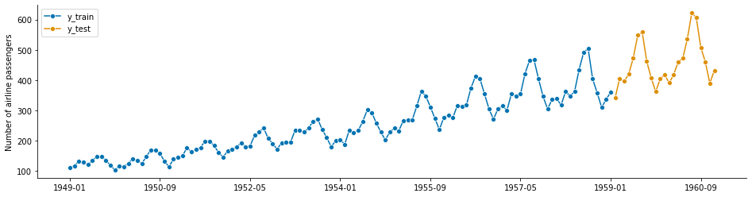
    


## Resultados

| No. | Pacote | Erro Quadrático Médio |
| --- | ------- | ------------- |
| 1 | SysIdentPy (Modelo Neural) | 316.54 |
| 2 | SysIdentPy (MetaMSS) | 450.99 |
| 3 | SysIdentPy (AOLS) | 476.64 |
| 4 | NeuralProphet | 501.24 |
| 5 | SysIdentPy (FROLS) | 805.95 |
| 6 | Exponential Smoothing | 910.52 |
| 7 | Prophet | 1186.00 |
| 8 | AutoArima | 1714.47 |
| 9 | Arima Manual | 2085.42 |
| 10 | ETS | 2590.05 |
| 11 | BATS | 7286.64 |
| 12 | TBATS | 7448.43 |


## SysIdentPy FROLS


```python
y = load_airline()
y_train, y_test = temporal_train_test_split(y, test_size=23)
y_train = y_train.values.reshape(-1, 1)
y_test = y_test.values.reshape(-1, 1)

basis_function = Polynomial(degree=1)
sysidentpy = FROLS(
    order_selection=True,
    ylag=13,  # os lags para todos os modelos serão 13
    basis_function=basis_function,
    model_type="NAR",
)
sysidentpy.fit(y=y_train)
y_test = np.concatenate([y_train[-sysidentpy.max_lag :], y_test])

yhat = sysidentpy.predict(y=y_test, forecast_horizon=23)
frols_loss = loss(
    pd.Series(y_test.flatten()[sysidentpy.max_lag :]),
    pd.Series(yhat.flatten()[sysidentpy.max_lag :]),
)
print(frols_loss)

plot_results(y=y_test[sysidentpy.max_lag :], yhat=yhat[sysidentpy.max_lag :])
```

    805.9521186338106


    
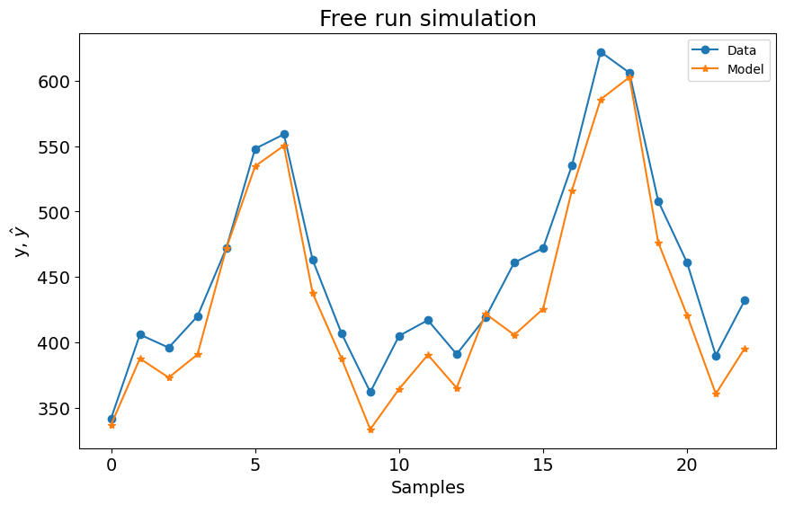
    


## SysIdentPy AOLS


```python
y = load_airline()
y_train, y_test = temporal_train_test_split(y, test_size=23)
y_train = y_train.values.reshape(-1, 1)
y_test = y_test.values.reshape(-1, 1)

df_train, df_test = temporal_train_test_split(y, test_size=23)
df_train = df_train.reset_index()
df_train.columns = ["ds", "y"]
df_train["ds"] = pd.to_datetime(df_train["ds"].astype(str))
df_test = df_test.reset_index()
df_test.columns = ["ds", "y"]
df_test["ds"] = pd.to_datetime(df_test["ds"].astype(str))

sysidentpy_AOLS = AOLS(
    ylag=13, k=2, L=1, model_type="NAR", basis_function=basis_function
)
sysidentpy_AOLS.fit(y=y_train)
y_test = np.concatenate([y_train[-sysidentpy_AOLS.max_lag :], y_test])

yhat = sysidentpy_AOLS.predict(y=y_test, steps_ahead=None, forecast_horizon=23)
aols_loss = loss(
    pd.Series(y_test.flatten()[sysidentpy_AOLS.max_lag :]),
    pd.Series(yhat.flatten()[sysidentpy_AOLS.max_lag :]),
)
print(aols_loss)

plot_results(y=y_test[sysidentpy_AOLS.max_lag :], yhat=yhat[sysidentpy_AOLS.max_lag :])
```

    476.64996316992523


    
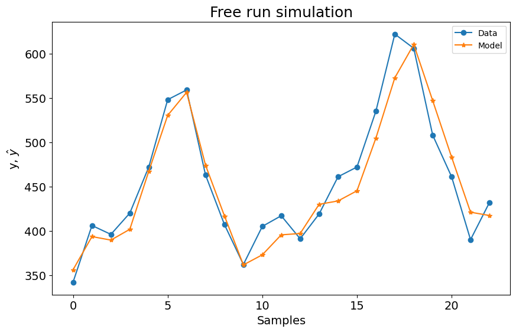
    


## SysIdentPy MetaMSS


```python
set_random_seed(42)

y = load_airline()
y_train, y_test = temporal_train_test_split(y, test_size=23)
y_train = y_train.values.reshape(-1, 1)
y_test = y_test.values.reshape(-1, 1)

sysidentpy_metamss = MetaMSS(
    basis_function=basis_function, ylag=13, model_type="NAR", test_size=0.17
)
sysidentpy_metamss.fit(y=y_train)

y_test = np.concatenate([y_train[-sysidentpy_metamss.max_lag :], y_test])

yhat = sysidentpy_metamss.predict(y=y_test, steps_ahead=None, forecast_horizon=23)
metamss_loss = loss(
    pd.Series(y_test.flatten()[sysidentpy_metamss.max_lag :]),
    pd.Series(yhat.flatten()[sysidentpy_metamss.max_lag :]),
)
print(metamss_loss)

plot_results(
    y=y_test[sysidentpy_metamss.max_lag :], yhat=yhat[sysidentpy_metamss.max_lag :]
)
```

    450.992127624293


    
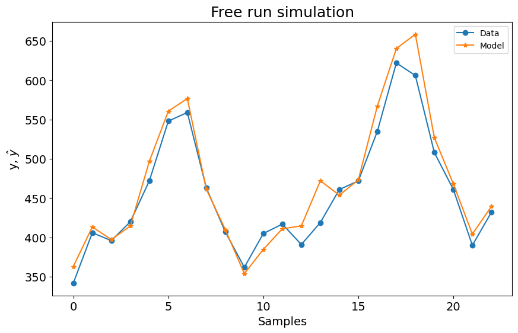
    


## SysIdentPy Neural NARX


```python
import torch

torch.manual_seed(42)

y = load_airline()
y_train, y_test = temporal_train_test_split(y, test_size=36)
y_train = y_train.values.reshape(-1, 1)
y_test = y_test.values.reshape(-1, 1)
x_train = np.zeros_like(y_train)
x_test = np.zeros_like(y_test)


class NARX(nn.Module):
    def __init__(self):
        super().__init__()
        self.lin = nn.Linear(13, 20)
        self.lin2 = nn.Linear(20, 20)
        self.lin3 = nn.Linear(20, 20)
        self.lin4 = nn.Linear(20, 1)
        self.relu = nn.ReLU()

    def forward(self, xb):
        z = self.lin(xb)
        z = self.relu(z)
        z = self.lin2(z)
        z = self.relu(z)
        z = self.lin3(z)
        z = self.relu(z)
        z = self.lin4(z)
        return z


narx_net = NARXNN(
    net=NARX(),
    ylag=13,
    model_type="NAR",
    basis_function=Polynomial(degree=1),
    epochs=900,
    verbose=False,
    learning_rate=2.5e-02,
    optim_params={},  # parâmetros opcionais do otimizador
)

narx_net.fit(y=y_train)
yhat = narx_net.predict(y=y_test, forecast_horizon=23)
narxnet_loss = loss(
    pd.Series(y_test.flatten()[narx_net.max_lag :]),
    pd.Series(yhat.flatten()[narx_net.max_lag :]),
)
print(narxnet_loss)
plot_results(y=y_test[narx_net.max_lag :], yhat=yhat[narx_net.max_lag :])
```

    316.54086775668776


    
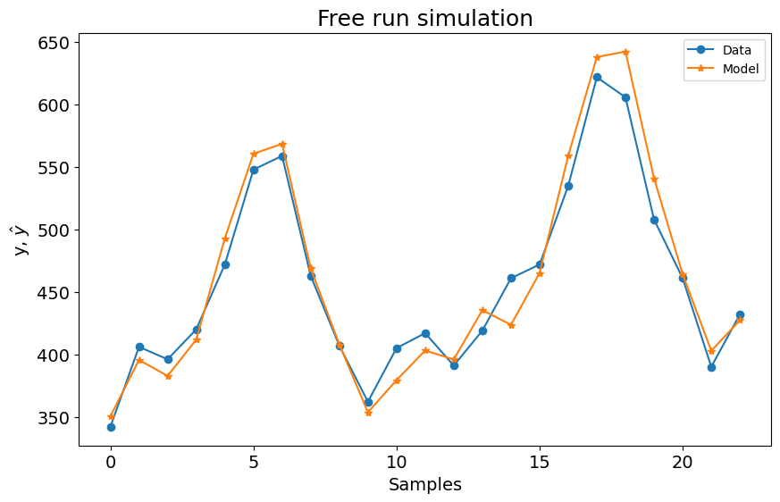
    


```python
y = load_airline()
y_train, y_test = temporal_train_test_split(y, test_size=23)  # 23 amostras para teste
plot_series(y_train, y_test, labels=["y_train", "y_test"])
fh = ForecastingHorizon(y_test.index, is_relative=False)
print(y_train.shape[0], y_test.shape[0])
```

    121 23


    
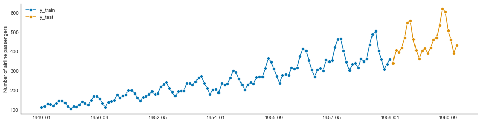
    


## Exponential Smoothing


```python
es = ExponentialSmoothing(trend="add", seasonal="multiplicative", sp=12)
y = load_airline()
y_train, y_test = temporal_train_test_split(y, test_size=23)
es.fit(y_train)
y_pred_es = es.predict(fh)

plot_series(y_test, y_pred_es, labels=["y_test", "y_pred"])
es_loss = loss(y_test, y_pred_es)
es_loss
```


    910.462659260655


    
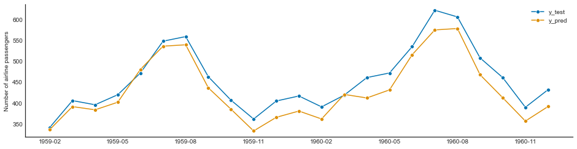
    


## AutoETS


```python
y = load_airline()

y_train, y_test = temporal_train_test_split(y, test_size=23)
ets = AutoETS(auto=True, sp=12, n_jobs=-1)
ets.fit(y_train)
y_pred_ets = ets.predict(fh)

plot_series(y_test, y_pred_ets, labels=["y_test", "y_pred"])
ets_loss = loss(y_test, y_pred_ets)
ets_loss
```


    1739.117296439066


    
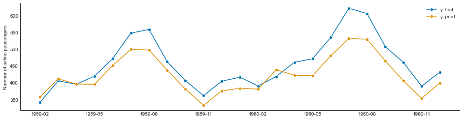
    


## AutoArima


```python
auto_arima = AutoARIMA(sp=12, suppress_warnings=True)
y = load_airline()

y_train, y_test = temporal_train_test_split(y, test_size=23)
auto_arima.fit(y_train)
y_pred_auto_arima = auto_arima.predict(fh)

plot_series(y_test, y_pred_auto_arima, labels=["y_test", "y_pred"])
autoarima_loss = loss(y_test, y_pred_auto_arima)
autoarima_loss
```


    1714.4753226965322


    
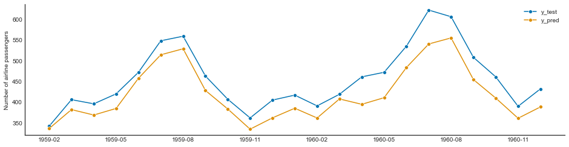
    


## Arima 


```python
y = load_airline()

y_train, y_test = temporal_train_test_split(y, test_size=23)
manual_arima = ARIMA(
    order=(13, 1, 0), suppress_warnings=True
)  # seasonal_order=(0, 1, 0, 12)
manual_arima.fit(y_train)
y_pred_manual_arima = manual_arima.predict(fh)
plot_series(y_test, y_pred_manual_arima, labels=["y_test", "y_pred"])
manualarima_loss = loss(y_test, y_pred_manual_arima)
manualarima_loss
```


    2085.425167938668


    
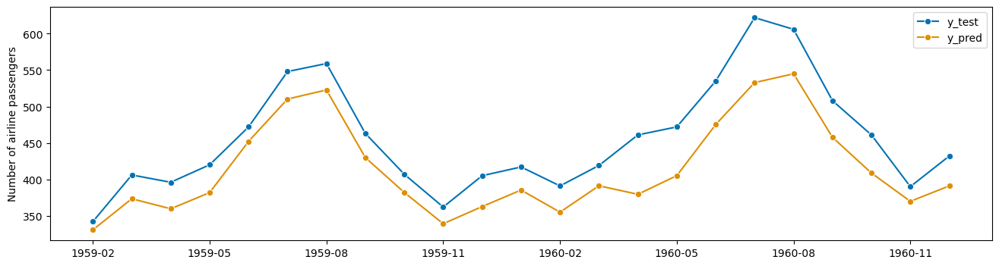
    


## BATS


```python
y = load_airline()

y_train, y_test = temporal_train_test_split(y, test_size=23)
bats = BATS(sp=12, use_trend=True, use_box_cox=False)
bats.fit(y_train)
y_pred_bats = bats.predict(fh)

plot_series(y_test, y_pred_bats, labels=["y_test", "y_pred"])
bats_loss = loss(y_test, y_pred_bats)
bats_loss
```


    7286.6484525676415


    
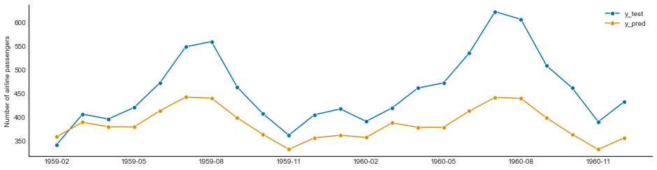
    


## TBATS


```python
y = load_airline()

y_train, y_test = temporal_train_test_split(y, test_size=23)
tbats = TBATS(sp=12, use_trend=True, use_box_cox=False)
tbats.fit(y_train)
y_pred_tbats = tbats.predict(fh)
plot_series(y_test, y_pred_tbats, labels=["y_test", "y_pred"])
tbats_loss = loss(y_test, y_pred_tbats)
tbats_loss
```


    7448.434672875093


    
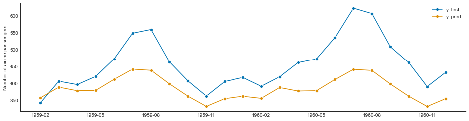
    


## Prophet


```python
set_random_seed(42)

y = load_airline()

y_train, y_test = temporal_train_test_split(y, test_size=23)
z = y.copy()
z = z.to_timestamp(freq="M")
z_train, z_test = temporal_train_test_split(z, test_size=23)


prophet = Prophet(
    seasonality_mode="multiplicative",
    n_changepoints=int(len(y_train) / 12),
    add_country_holidays={"country_name": "Germany"},
    yearly_seasonality=True,
    weekly_seasonality=False,
    daily_seasonality=False,
)
prophet.fit(z_train)
y_pred_prophet = prophet.predict(fh.to_relative(cutoff=y_train.index[-1]))

y_pred_prophet.index = y_test.index
plot_series(y_test, y_pred_prophet, labels=["y_test", "y_pred"])
prophet_loss = loss(y_test, y_pred_prophet)
prophet_loss
```


    1186.0045566050442


    
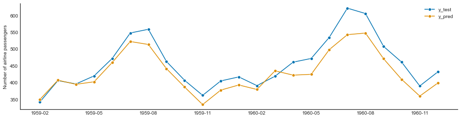
    


## Neural Prophet


```python
set_random_seed(42)

df = pd.read_csv(r".\datasets\air_passengers.csv")
m = NeuralProphet(seasonality_mode="multiplicative")
df_train = df.iloc[:-23, :].copy()
df_test = df.iloc[-23:, :].copy()

m = NeuralProphet(seasonality_mode="multiplicative")

metrics = m.fit(df_train, freq="MS")

future = m.make_future_dataframe(
    df_train, periods=23, n_historic_predictions=len(df_train)
)

forecast = m.predict(future)
plt.plot(forecast["yhat1"].values[-23:])
plt.plot(df_test["y"].values)
neuralprophet_loss = loss(forecast["yhat1"].values[-23:], df_test["y"].values)
neuralprophet_loss
```

    501.24794023767436


    
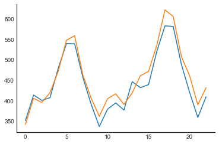
    


```python
results = {
    "Exponential Smoothing": es_loss,
    "ETS": ets_loss,
    "AutoArima": autoarima_loss,
    "Arima Manual": manualarima_loss,
    "BATS": bats_loss,
    "TBATS": tbats_loss,
    "Prophet": prophet_loss,
    "SysIdentPy (Modelo Polinomial)": frols_loss,
    "SysIdentPy (Modelo Neural)": narxnet_loss,
    "SysIdentPy (AOLS)": aols_loss,
    "SysIdentPy (MetaMSS)": metamss_loss,
    "NeuralProphet": neuralprophet_loss,
}

sorted(results.items(), key=lambda result: result[1])
```


    [('SysIdentPy (Modelo Neural)', 316.54086775668776),
     ('SysIdentPy (MetaMSS)', 450.992127624293),
     ('SysIdentPy (AOLS)', 476.64996316992523),
     ('NeuralProphet', 501.24794023767436),
     ('SysIdentPy (Modelo Polinomial)', 805.9521186338106),
     ('Exponential Smoothing', 910.462659260655),
     ('Prophet', 1186.0045566050442),
     ('AutoArima', 1714.4753226965322),
     ('ETS', 1739.117296439066),
     ('Arima Manual', 2085.425167938668),
     ('BATS', 7286.6484525676415),
     ('TBATS', 7448.434672875093)]
