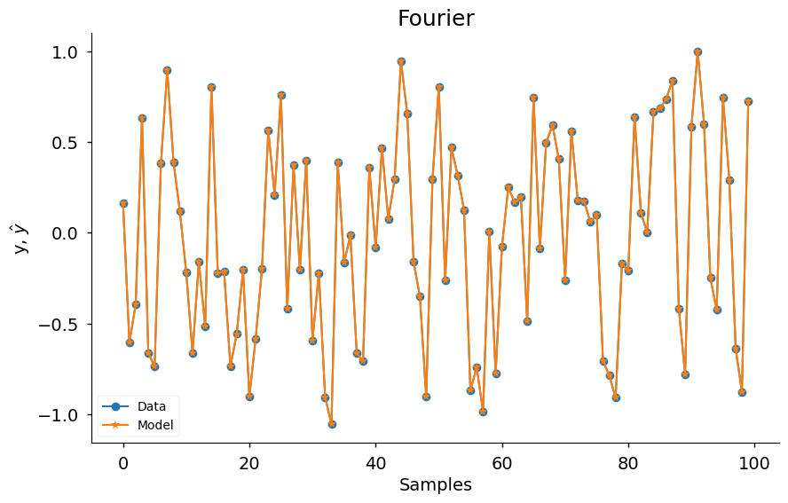
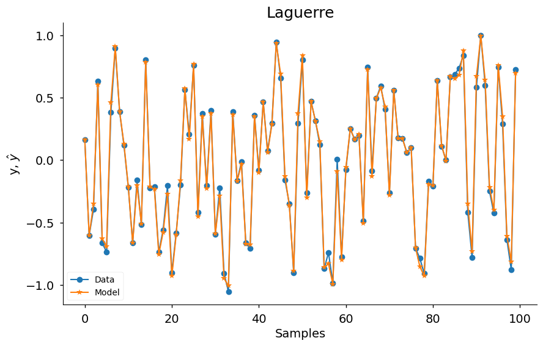
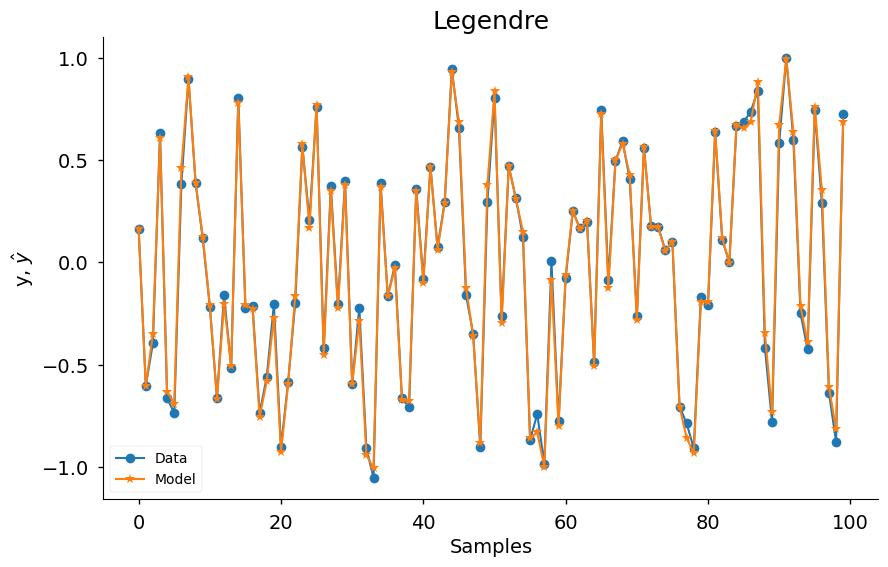
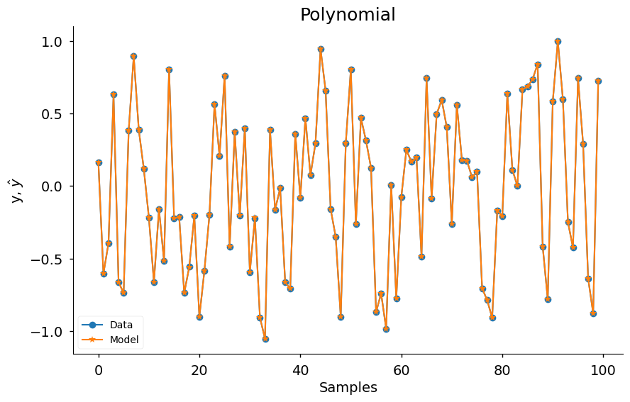

# Funções Base - Visão Geral

Exemplo criado por Wilson Rocha Lacerda Junior

> **Procurando mais detalhes sobre modelos NARMAX?**
> Para informações completas sobre modelos, métodos e uma ampla variedade de exemplos e benchmarks implementados no SysIdentPy, confira nosso livro:
> [*Nonlinear System Identification and Forecasting: Theory and Practice With SysIdentPy*](https://sysidentpy.org/book/0%20-%20Preface/)
>
> Este livro oferece orientação aprofundada para apoiar seu trabalho com o SysIdentPy.


Este notebook não tem como objetivo encontrar os melhores modelos possíveis para identificação de sistemas. Em vez disso, serve como uma demonstração simples das funções base disponíveis no SysIdentPy. O objetivo é apresentar cada função base com código mínimo para ilustrar como usá-las dentro do framework SysIdentPy.

Usamos configurações básicas para seleção de estrutura do modelo e estimação de parâmetros, mas para aplicações do mundo real, você pode precisar ajustar os hiperparâmetros e explorar métodos mais avançados para alcançar resultados ótimos.

Para mais detalhes sobre o SysIdentPy e como aproveitar totalmente suas capacidades, consulte a [documentação oficial](https://sysidentpy.org/) e o [livro](https://sysidentpy.org/book/0%20-%20Preface/).

## Introdução

Neste exemplo, exploraremos como usar o SysIdentPy para aplicar várias funções base para identificação de sistemas e seleção de estrutura do modelo. Usaremos um dataset simulado e aplicaremos o algoritmo FROLS com diferentes funções base. Cada função base será avaliada e os resultados serão plotados para comparar seu desempenho.

Você pode aprender mais sobre as funções base do SysIdentPy consultando a [documentação](https://sysidentpy.org/) oficial.


```python
from sysidentpy.utils.generate_data import get_siso_data
from sysidentpy.parameter_estimation import LeastSquares
from sysidentpy.utils.plotting import plot_results
from sysidentpy.model_structure_selection import FROLS
from sysidentpy import basis_function
```

## Gerando Dados Simulados

Começamos gerando dados simulados Single-Input Single-Output (SISO) usando a função get_siso_data. Este utilitário nos permite criar dados realistas para tarefas de identificação de sistemas. Para mais detalhes sobre como personalizar o processo de geração de dados, visite a [documentação de utilitários de dados](https://sysidentpy.org/code/utils/#sysidentpy.utils.generate_data.get_siso_data).


```python
x_train, x_valid, y_train, y_valid = get_siso_data(
    n=1000, colored_noise=False, sigma=0.0001, train_percentage=90
)
```

## Funções Base no SysIdentPy

O SysIdentPy fornece várias funções base que podem ser usadas na identificação de sistemas. As funções base transformam os dados de entrada em um espaço de features, permitindo a identificação de sistemas não-lineares.

O seguinte trecho de código carrega e instancia dinamicamente cada função base disponível. Você pode explorar a lista completa de funções base disponíveis no SysIdentPy visitando a [documentação de funções base](https://sysidentpy.org/code/basis-function/).


```python
basis_function.__all__
```


    ['Bernstein',
     'Bilinear',
     'Fourier',
     'Hermite',
     'HermiteNormalized',
     'Laguerre',
     'Legendre',
     'Polynomial']


```python
import inspect
from sysidentpy import basis_function

for basis_name, bf in inspect.getmembers(basis_function):
    if inspect.isclass(bf):
        estimator = LeastSquares()
        model = FROLS(
            order_selection=True,
            n_info_values=15,
            ylag=2,
            xlag=2,
            info_criteria="aic",
            estimator=estimator,
            err_tol=None,
            basis_function=bf(degree=5),
        )

        model.fit(X=x_train, y=y_train)
        yhat = model.predict(X=x_valid, y=y_valid)

        plot_results(
            y=y_valid,
            yhat=yhat,
            n=100,
            title=f"{basis_name}",
            xlabel="Samples",
            ylabel=r"y, $\hat{y}$",
            data_color="#1f77b4",
            model_color="#ff7f0e",
            marker="o",
            model_marker="*",
            linewidth=1.5,
            figsize=(10, 6),
            style="seaborn-v0_8-notebook",
            facecolor="white",
        )
```

    c:\Users\wilso\Desktop\projects\GitHub\sysidentpy\sysidentpy\utils\deprecation.py:40: FutureWarning:  `bias` and `n` are deprecated in 0.5.0 and will be removed in 1.0.0. Use `include_bias` and `degree`, respectively, instead.
      warnings.warn(message, FutureWarning, stacklevel=1)


    

    


    

    


    

    


    

    


    

    


    

    


    

    


    

    
