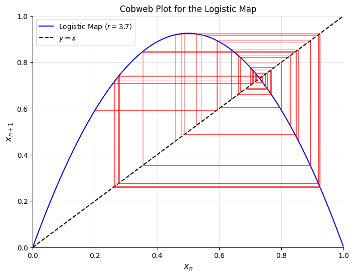
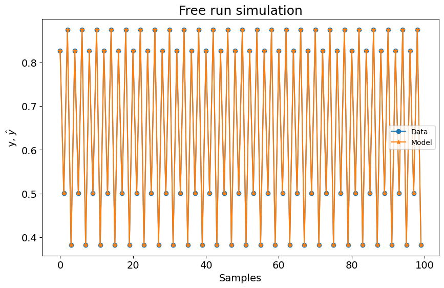

# Mapa Logístico

Tutorial criado por Wilson Rocha

## O Mapa Logístico

Sistemas caóticos são processos determinísticos que exibem comportamento imprevisível e aparentemente aleatório devido à sua extrema sensibilidade às condições iniciais. Embora governados por regras simples, esses sistemas são notoriamente difíceis de modelar em escalas de tempo longas, tornando-os um desafio fascinante para identificação de sistemas. O Mapa Logístico é um exemplo clássico de caos, primeiro popularizado na ecologia para modelar o crescimento populacional. Sua equação simples,

$$
x_{n+1} = r x_n (1 - x_n)
$$

captura uma rica variedade de comportamentos, desde equilíbrios estáveis até oscilações periódicas e caos completo, dependendo do parâmetro de crescimento $r$. Estudando este sistema, obtemos insights sobre fenômenos universais como a rota de duplicação de período para o caos e o surgimento de estruturas fractais em diagramas de bifurcação. Neste tutorial, usaremos o SysIdentPy para modelar o Mapa Logístico e reconstruir seu diagrama de bifurcação, demonstrando como abordagens orientadas a dados podem capturar dinâmicas caóticas.

## Visualizando o Mapa Logístico

Para entender o Mapa Logístico, vamos primeiro visualizar seu comportamento em diferentes regimes de $r$:

- **Pontos Fixos Estáveis $r < 3$**: Para $r$ baixo, a população converge para um valor estacionário.
- **Regimes Periódicos $3 < r < 3.57$**: À medida que $r$ aumenta, o sistema passa por bifurcações de duplicação de período, oscilando entre 2, 4, 8, … estados.
- **Caos $r \geq 3.57$**: Além do ponto de acumulação, o sistema se comporta caoticamente, com trajetórias que nunca se repetem.

Um **gráfico de teia de aranha** ajuda a visualizar o processo de iteração: começando de um $x_0$ inicial, alternamos entre avaliar o Mapa Logístico (saltos verticais) e atualizar $x_n$ (movimentos horizontais para a diagonal). Regimes caóticos mostram padrões erráticos e não repetitivos de teia de aranha, enquanto regimes periódicos traçam ciclos estáveis.


```python
import numpy as np
import matplotlib.pyplot as plt
import pandas as pd

from sysidentpy.model_structure_selection import FROLS
from sysidentpy.basis_function import Polynomial
from sysidentpy.parameter_estimation import LeastSquares

from sysidentpy.utils.plotting import plot_results
from sysidentpy.utils.display_results import results


def logistic_map(x, r):
    """Calcular uma iteração do mapa logístico."""
    return r * x * (1 - x)


# Parâmetros
r = 3.7  # Taxa de crescimento (tente 2.8, 3.2, 3.5, 3.9)
n_iter = 50  # Número de iterações
x0 = 0.2  # Condição inicial

# Criar gráfico de teia de aranha
x = np.linspace(0, 1, 1000)
f = logistic_map(x, r)

plt.figure(figsize=(8, 6))
plt.plot(x, f, "b-", label=f"Mapa Logístico ($r={r}$)")
plt.plot(x, x, "k--", label="$y = x$")

# Simular iterações
xt = np.zeros(n_iter)
xt[0] = x0
for i in range(n_iter - 1):
    y = logistic_map(xt[i], r)
    plt.plot([xt[i], xt[i]], [xt[i], y], "r", lw=0.5)  # Linha vertical
    plt.plot([xt[i], y], [y, y], "r", lw=0.5)  # Linha horizontal
    xt[i + 1] = y

plt.xlabel("$x_n$", fontsize=12)
plt.ylabel("$x_{n+1}$", fontsize=12)
plt.title("Gráfico de Teia de Aranha para o Mapa Logístico")
plt.legend()
plt.grid(alpha=0.3)
plt.xlim(0, 1)
plt.ylim(0, 1)
plt.show()
```


    

    


O gráfico acima mostra a Curva Logística (Azul). A linha diagonal (Preta Tracejada) representa $x_{n+1} = x_n$ e mostra as interseções com a curva logística que indicam pontos fixos. Finalmente, as linhas verticais da trajetória da Teia de Aranha (em vermelho) aplicam o mapa $x_n \to x_{n+1}$ e as linhas horizontais redefinem $x_n = x_{n+1}$ para a próxima iteração.

A interpretação por regime pode ser feita da seguinte forma:

- Ponto Fixo Estável (ex., $r = 2.8$):
  A teia de aranha espirala para dentro até um único ponto.

- Periódico (ex., $r = 3.5$):
  A trajetória cicla entre 4 pontos (período-4).

- Caótico (ex., $r = 3.9$):
  As linhas vermelhas nunca se repetem, preenchendo o espaço erraticamente.

### **3. Gerando o Diagrama de Bifurcação**

O diagrama de bifurcação resume como o comportamento de longo prazo do Mapa Logístico muda com $r$. Vamos criá-lo considerando:
1. Variando $r$ em um intervalo ($3.5 \leq r \leq 4.0$).
2. Iterar o mapa: Para cada $r$, descartar iterações transientes (primeiros 500 passos) para focar no comportamento assintótico.
3. Plotar $x$ para as iterações restantes.

O diagrama de bifurcação revela várias características-chave. Cascatas de duplicação de período ocorrem quando bifurcações sucessivas dividem pontos estáveis em pares, levando a períodos progressivamente mais longos. Regiões caóticas emergem como bandas densas de pontos, indicando alta sensibilidade às condições iniciais. Dentro dessas regiões caóticas, janelas de ordem aparecem, como perto de $r \approx 3.83$, onde o comportamento periódico reemerge temporariamente, destacando a estrutura sutil subjacente ao caos.

Este diagrama serve como uma "impressão digital" do sistema, que reconstruiremos posteriormente usando modelos SysIdentPy.


```python
num = 1000
N = 1000
N_drop = 500
r0 = 3.5

rs = r0 + np.arange(num) / num * (4 - r0)
xss = []

# Gerar dados de bifurcação
for r in rs:
    x = 0.5  # Condição inicial
    xs = []

    # Iterações de aquecimento (descartar transiente)
    for _ in range(N_drop):
        x = logistic_map(x, r)

    # Armazenar iterações estáveis
    for _ in range(N):
        x = logistic_map(x, r)
        xs.append(x)

    xss.append(xs)

plt.figure(figsize=(4, 4), dpi=100)
for r, xs in zip(rs, xss):
    plt.plot([r] * len(xs), xs, ",", alpha=0.1, c="black", rasterized=True)

plt.xlabel("$r$")
plt.ylabel("$x_n$")
plt.title("Diagrama de Bifurcação do Mapa Logístico")
plt.tight_layout()
plt.show()
```


    

    


Vamos começar construindo um modelo para o mapa logístico com $r = 3.5$ para avaliar como o SysIdentPy se sai neste cenário periódico.


```python
y = np.array(xss[0]).reshape(-1, 1)
y_train = y[:800, :].copy()
y_test = y[200:, :].copy()

basis_function = Polynomial(degree=3)
model = FROLS(
    ylag=1,
    estimator=LeastSquares(),
    basis_function=basis_function,
    model_type="NAR",
)
model.fit(y=y_train)
yhat = model.predict(y=y_test[:2].reshape(-1, 1), forecast_horizon=len(y_test))

r = pd.DataFrame(
    results(
        model.final_model,
        model.theta,
        model.err,
        model.n_terms,
        err_precision=8,
        dtype="sci",
    ),
    columns=["Regressores", "Parâmetros", "ERR"],
)
print(r)

plot_results(y=y_test[model.max_lag :], yhat=yhat[model.max_lag :])
```

      Regressores   Parâmetros             ERR
    0          1  -2.4433E-14  9.05069788E-01
    1   y(k-1)^3   3.6415E-14  9.17450154E-02
    2     y(k-1)   3.5000E+00  3.13396079E-03
    3   y(k-1)^2  -3.5000E+00  5.12359326E-05


    

    


### **5. Reconstruindo o Diagrama de Bifurcação com Modelos**

Um modelo orientado a dados como NARMAX pode replicar o comportamento de bifurcação do Mapa Logístico? Vamos descobrir:

Os seguintes passos serão executados:

1. Loop sobre $r$: Para cada valor no intervalo (ex., 2.5 a 4.0 em passos de 0.01).
2. Treinar um modelo: Gerar dados sintéticos para o $r$ atual, dividir em conjuntos de treino/teste, e ajustar um modelo NARMAX usando o algoritmo `FROLS` do SysIdentPy.
3. Previsão: Usar o modelo treinado para prever estados futuros, começando de uma condição inicial.
4. Plotar: Coletar os estados assintóticos e sobrepor em um diagrama de bifurcação.


```python
def fit_model(y_train, y_test, degree=3, ylag=1, n_info_values=50):
    """Ajustar um modelo NARX e retornar previsões."""
    basis_function = Polynomial(degree=degree)
    model = FROLS(
        ylag=ylag,
        n_info_values=n_info_values,
        estimator=LeastSquares(),
        basis_function=basis_function,
        model_type="NAR",
    )
    model.fit(y=y_train)
    return model.predict(
        y=y_test[: model.max_lag].reshape(-1, 1), forecast_horizon=len(y_test)
    )


def generate_bifurcation_data(rs, N, N_drop):
    """Gerar dados do mapa logístico e previsões do modelo para cada r."""
    xss, yhat_bifurcation = [], []
    for r in rs:
        x = 0.5
        # Iterações de aquecimento
        for _ in range(N_drop):
            x = logistic_map(x, r)

        # Iterações estáveis (loop corrigido)
        xs = []
        for _ in range(N):
            x = logistic_map(x, r)
            xs.append(x)

        xss.append(xs)

        # Preparar dados para modelagem
        y = np.array(xs).reshape(-1, 1)
        y_train, y_test = y[:800, :], y[200:, :]
        yhat = fit_model(y_train, y_test)
        yhat_bifurcation.append(np.array(yhat))

    return xss, yhat_bifurcation


# Parâmetros
num = 1000
N, N_drop = 1000, 500
r0 = 3.5
rs = r0 + np.arange(num) / num * (4 - r0)

xss, yhat_bifurcation = generate_bifurcation_data(rs, N, N_drop)

# Plotar diagrama de bifurcação previsto
plt.figure(figsize=(4, 4), dpi=100)
for ind, r in enumerate(rs):
    plt.plot(
        [r] * len(yhat_bifurcation[ind]),
        yhat_bifurcation[ind],
        ",",
        alpha=0.1,
        c="black",
        rasterized=True,
    )

plt.title("Diagrama de Bifurcação com Previsões FROLS", fontsize=14)
plt.xlabel("$r$", fontsize=12)
plt.ylabel("$x_n$", fontsize=12)
plt.grid(alpha=0.2)
plt.show()
```


    

    


Conforme mostrado nos gráficos acima, os modelos reproduzem com precisão ciclos estáveis em regimes periódicos, com erros de previsão mínimos. Em regimes caóticos, os modelos fornecem previsões precisas a curto prazo, mas ocorre divergência a longo prazo devido à sensibilidade às condições iniciais, destacando as limitações inerentes à modelagem de sistemas caóticos. O diagrama de bifurcação gerado mantém as características-chave, como duplicação de período e transições caóticas, embora detalhes mais finos possam requerer um modelo com maior complexidade. Este experimento demonstra a capacidade do SysIdentPy de capturar dinâmicas não lineares essenciais, mesmo em cenários caóticos.
