# Sistema de Lorenz

Exemplo criado por Wilson Rocha

Nota: Este exemplo é baseado na referência de simulação do sistema de Lorenz de [UF|Physics: Introduction to Biological Physics](https://cmp.phys.ufl.edu/PHZ4710/files/unit5/Lorenz-system.html). Parte do código usado para as simulações de Lorenz e o diagrama de bifurcação é adaptado deste recurso.


```python
import matplotlib.pyplot as plt
import numpy as np
import pandas as pd
from scipy.integrate import odeint

from sysidentpy.model_structure_selection import FROLS
from sysidentpy.basis_function import Polynomial
from sysidentpy.utils.plotting import plot_results
from sysidentpy.parameter_estimation import LeastSquares
from sysidentpy.utils.display_results import results
```

## O Sistema de Lorenz

O **sistema de Lorenz** é um exemplo bem conhecido na teoria do caos, consistindo em três equações diferenciais ordinárias que descrevem o comportamento de correntes de convecção na atmosfera. Introduzido pela primeira vez por Edward Lorenz em 1963, este sistema é famoso por exibir dinâmicas caóticas, onde pequenas mudanças nas condições iniciais levam a resultados drasticamente diferentes. Apesar de ser determinístico, o comportamento do sistema é altamente imprevisível, tornando-o um exemplo-chave de caos em matemática e ciência.

As equações que definem o sistema de Lorenz são:

$$
\begin{aligned}
\frac{dx}{dt} &= \sigma (y - x), \\
\frac{dy}{dt} &= x (\rho - z) - y, \\
\frac{dz}{dt} &= xy - \beta z,
\end{aligned}
$$

Onde:
- $x$, $y$ e $z$ representam variáveis como a taxa de convecção, a diferença de temperatura entre o ar ascendente e descendente, e o desvio da temperatura em relação à média,
- $\sigma$ é o número de Prandtl (viscosidade do fluido/difusividade térmica), $\rho$ é o número de Rayleigh (impulsiona a convecção), e $\beta$ é um parâmetro do sistema relacionado à geometria do sistema. O caos emerge em $\rho = 28$, $\sigma = 10$, $\beta = 8/3$.

Neste tutorial, usaremos o SysIdentPy para criar um modelo do sistema de Lorenz. O SysIdentPy nos permite identificar os parâmetros do sistema a partir de dados e explorar seu comportamento caótico de forma estruturada. Primeiro geraremos dados resolvendo as equações de Lorenz numericamente e então aplicaremos o SysIdentPy para modelar o sistema, capturando a dinâmica do atrator e estimando os principais parâmetros do sistema.

## Visualizando o Atrator de Lorenz

O atrator de Lorenz, um gráfico tridimensional das soluções do sistema, ilustra visualmente o comportamento caótico do sistema, muitas vezes lembrando uma forma de "borboleta". Esta estrutura caótica revela a dependência sensível do sistema às condições iniciais, significando que mesmo pequenas diferenças nos pontos de partida podem levar a trajetórias vastamente diferentes. Este é um exemplo marcante de movimento não-periódico em sistemas dinâmicos.

O parâmetro $\rho$ desempenha um papel crítico na formação do comportamento do sistema. Variando $\rho$, é possível observar transições de estados estacionários para caos. Para valores mais baixos de $\rho$, o sistema permanece estável, frequentemente exibindo comportamento periódico. À medida que $\rho$ aumenta, o sistema se torna cada vez mais sensível e começa a exibir dinâmicas complexas e caóticas. Explorar essas transições permite uma compreensão mais profunda de como sistemas determinísticos podem evoluir para sistemas caóticos e destaca o conceito de bifurcação dentro da dinâmica não linear.


```python
def lorenz(xyz, t, sigma, rho, beta):
    x, y, z = xyz  # parse variables
    dxdt = sigma * (y - x)
    dydt = x * (rho - z) - y
    dzdt = x * y - beta * z
    return [dxdt, dydt, dzdt]


sigma = 10.0
beta = 8 / 3
rho = 28.0

T = 50.0  # tempo total de execução
dt = 0.01  # passo de tempo
time_points = np.arange(0.0, T, dt)

# Valores de estado estacionário não triviais para plotagem
x2 = y2 = np.sqrt(beta * (rho - 1))  # estado estacionário não trivial
z2 = rho - 1

init = np.random.rand(3) * 2 - 1  # condições iniciais entre -1 e 1
sol2 = odeint(lorenz, init, time_points, args=(sigma, rho, beta))

plt.figure(figsize=(10, 6))
# Plotar estados estacionários não triviais como linhas horizontais
plt.axhline(x2, color="k", lw=1, linestyle="--", label=f"Estado estacionário: x={x2:.2f}")
plt.axhline(-x2, color="k", lw=1, linestyle="--", label=f"Estado estacionário: x={-x2:.2f}")

# Plotar a trajetória única
plt.plot(time_points, sol2[:, 0], lw=2, label=f"Trajetória iniciando em {init}")

plt.xlabel(r"$t$")
plt.ylabel(r"$x$")
plt.title("Atrator de Lorenz: Trajetória Única")
plt.legend()
plt.show()
```


    
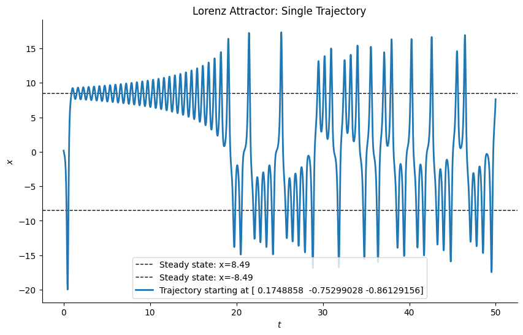
    


```python
plt.figure()
plt.plot(sol2[:, 0], sol2[:, 2])  # plotar trajetórias projetadas no plano (x,z)
plt.plot(
    [sol2[0, 0]], [sol2[0, 2]], "b^"
)  # triângulo azul marca o ponto inicial de cada trajetória
plt.plot([x2], [z2], "rx")  # estado estacionário
plt.plot([-x2], [z2], "rx")  # estado estacionário
plt.xlabel(r"$x$")
plt.ylabel(r"$z$")
plt.show()
```


    
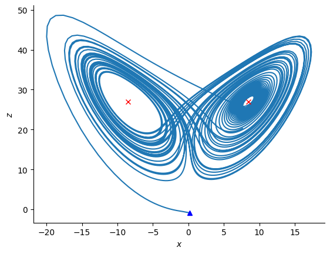
    


```python
# Vamos agora visualizar todas as soluções como trajetórias em um gráfico 3D

fig = plt.figure()
ax = fig.add_subplot(projection="3d")
ax.plot(sol2[:, 0], sol2[:, 1], sol2[:, 2])
ax.set_xlabel(r"$x$")
ax.set_ylabel(r"$y$")
ax.set_zlabel(r"$z$")
plt.show()
```


    
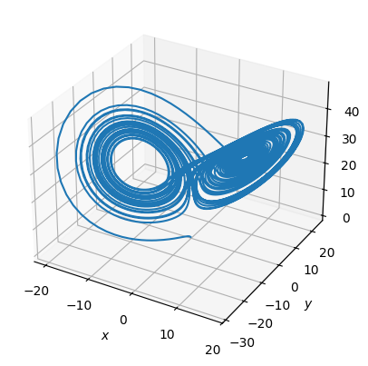
    


O diagrama de bifurcação mostra os possíveis estados estacionários ou órbitas periódicas do sistema para diferentes valores de um parâmetro do sistema (como $\rho$). Esta é uma forma compacta e poderosa de visualizar como pequenas mudanças em um parâmetro podem alterar drasticamente o comportamento do sistema.


```python
sigma = 10.0
beta = 8 / 3.0

t1 = 20.0  # tempo para adicionar perturbação
T = 100.0
dt = 0.01
time_points = np.arange(0.0, 50.0, 0.01)

rho_list = np.geomspace(0.1, 1000.0, 401)  # lista de valores de rho espaçados geometricamente
sol_list = []  # lista de soluções das equações de Lorenz

for rho in rho_list:
    init = np.random.rand(3) * 2 - 1  # valores iniciais aleatórios
    sol = odeint(lorenz, init, time_points, args=(sigma, rho, beta))
    sol_list.append(sol)


rP = 1  # início da instabilidade na origem, bifurcação pitchfork
rH = sigma * (sigma + beta + 3) / (sigma - beta - 1)  # início do caos, bifurcação de Hopf

plt.figure(figsize=(8, 6))
plt.axvline(rP, lw=1, ls=":", label=r"$\rho = 1$")
plt.axvline(rH, lw=1, ls="--", label=r"$\rho = %.3f$" % rH)
plt.axvline(28, lw=1, ls="-", label=r"$\rho = 28$")
for i in range(len(rho_list)):
    rho = rho_list[i]
    sol = sol_list[i]
    y = sol[int(t1 / dt) :, 0]
    x = [rho] * len(y)
    plt.scatter(x, y, s=0.1, c="k", marker=".", edgecolor="none")

plt.xscale("log")
plt.xlabel(r"$\rho$")
plt.ylabel(r"$x$")
plt.legend()
plt.show()
```


    
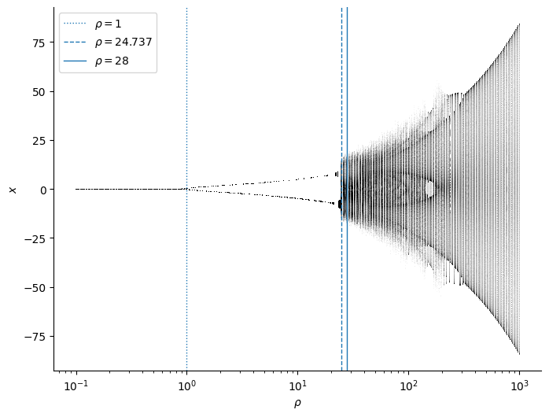
    


O estado estacionário estável na origem sofre uma **bifurcação pitchfork**, dividindo-se em dois estados estacionários distintos. À medida que o parâmetro aumenta ainda mais, esses dois estados estacionários experimentam uma **bifurcação de Hopf**, onde um dos pontos fixos se torna um ponto de sela, marcando o início do comportamento caótico. Para $\rho < 24.74$, o sistema exibe estados estacionários ou órbitas periódicas, enquanto para $\rho \geq 24.74$, o caos emerge, revelando uma estrutura fractal.

## Modelagem com SysIdentPy

Vamos visualizar os dados que precisamos modelar


```python
plt.plot(sol2)
```


    [<matplotlib.lines.Line2D at 0x27c7c2b5bb0>,
     <matplotlib.lines.Line2D at 0x27c7c177ce0>,
     <matplotlib.lines.Line2D at 0x27c75eb8da0>]


    
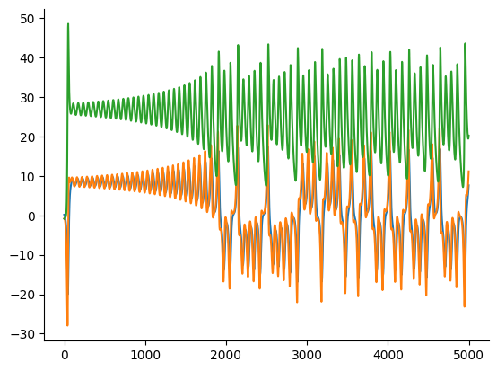
    


```python
def prepare_data(data, y_col, x_cols, train_size=4000):
    """Dividir e remodelar os dados para cada modelo."""
    train_data, test_data = data[:train_size], data[train_size:]

    # Extrair y (alvo) e x (preditores)
    y_train, y_test = train_data[:, y_col].reshape(-1, 1), test_data[:, y_col].reshape(
        -1, 1
    )
    x_train, x_test = train_data[:, x_cols], test_data[:, x_cols]

    return x_train, y_train, x_test, y_test


def train_and_predict(x_train, y_train, x_test, y_test):
    """Treinar o modelo e fazer previsões."""
    basis_function = Polynomial(degree=2)
    model = FROLS(
        ylag=1,
        xlag=[[1], [1]],
        estimator=LeastSquares(),
        basis_function=basis_function,
    )
    model.fit(X=x_train, y=y_train)
    yhat = model.predict(
        X=x_test,
        y=y_test[: model.max_lag].reshape(-1, 1),
    )

    r = pd.DataFrame(
        results(
            model.final_model,
            model.theta,
            model.err,
            model.n_terms,
            err_precision=8,
            dtype="sci",
        ),
        columns=["Regressores", "Parâmetros", "ERR"],
    )
    print(r)
    return yhat


# Primeiro modelo: Usando sol2[:, 0] para y e sol2[:, [1, 2]] para x
x_train, y_train, x_test, y_test = prepare_data(
    sol2, y_col=0, x_cols=[1, 2], train_size=4000
)
yhat_1 = train_and_predict(x_train, y_train, x_test, y_test)

# definir 1 porque é o lag máximo. Pode definir como model.max_lag também
plot_results(y=y_test[1:], yhat=yhat_1[1:], n=1000)

# Segundo modelo: Usando sol2[:, 1] para y e sol2[:, [0, 2]] para x
x_train, y_train, x_test, y_test = prepare_data(
    sol2, y_col=1, x_cols=[0, 2], train_size=4000
)
yhat_2 = train_and_predict(x_train, y_train, x_test, y_test)

plot_results(y=y_test[1:], yhat=yhat_2[1:], n=1000)

# Terceiro modelo: Usando sol2[:, 2] para y e sol2[:, [0, 1]] para x
x_train, y_train, x_test, y_test = prepare_data(
    sol2, y_col=2, x_cols=[0, 1], train_size=4000
)
yhat_3 = train_and_predict(x_train, y_train, x_test, y_test)

plot_results(y=y_test[1:], yhat=yhat_3[1:], n=1000)
```

           Regressores   Parâmetros             ERR
    0          y(k-1)   9.1832E-01  9.98019711E-01
    1         x1(k-1)   9.4946E-02  1.97448493E-03
    2   x2(k-1)y(k-1)  -4.7263E-04  5.79130765E-06
    3  x2(k-1)x1(k-1)  -2.1239E-05  4.72613968E-09
    4         x2(k-1)   6.9084E-06  4.82674757E-10
    5       x1(k-1)^2  -1.1524E-06  4.27141670E-11
    6        y(k-1)^2  -8.8057E-06  3.31043247E-11
    7               1  -1.8509E-04  3.67821804E-11
    8   x1(k-1)y(k-1)   7.9252E-06  5.31217490E-11
    9       x2(k-1)^2   5.5901E-07  5.27580418E-12


    
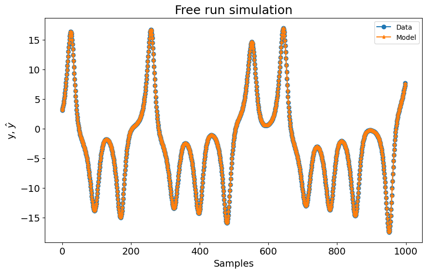
    


           Regressores   Parâmetros             ERR
    0          y(k-1)   9.9829E-01  9.96084591E-01
    1   x2(k-1)y(k-1)  -6.5230E-04  3.09653629E-03
    2  x2(k-1)x1(k-1)  -9.6452E-03  4.62214305E-04
    3         x1(k-1)   2.7760E-01  3.50549821E-04
    4         x2(k-1)   2.8138E-04  3.86911341E-07
    5        y(k-1)^2  -3.2352E-05  3.41517241E-08
    6       x1(k-1)^2  -2.6343E-04  2.79943269E-08
    7               1  -6.2559E-03  3.02963912E-08
    8   x1(k-1)y(k-1)   2.3472E-04  4.11556688E-08
    9       x2(k-1)^2   1.5355E-05  3.32074748E-09


    
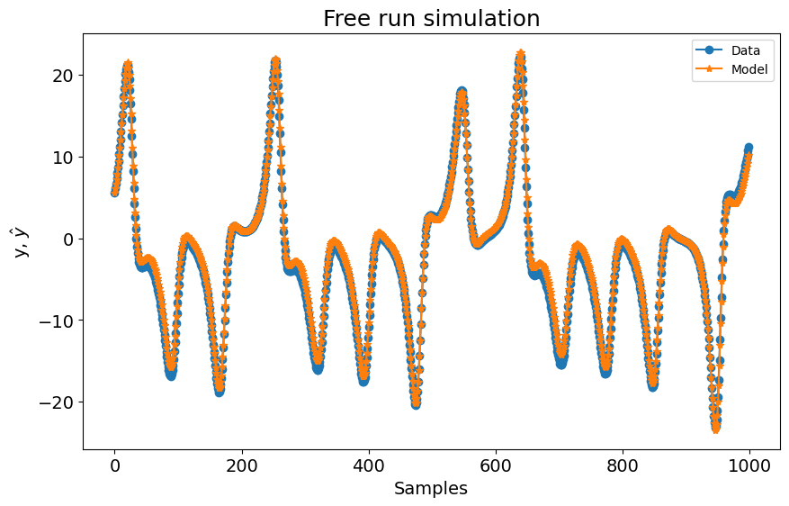
    


           Regressores   Parâmetros             ERR
    0          y(k-1)   9.7932E-01  9.99326652E-01
    1  x2(k-1)x1(k-1)   8.7471E-03  6.70396643E-04
    2       x2(k-1)^2   9.5637E-04  2.13515631E-06
    3       x1(k-1)^2  -1.1022E-04  4.45532422E-07
    4         x1(k-1)   4.1767E-03  3.37917913E-08
    5        y(k-1)^2  -1.5200E-04  1.35172660E-08
    6               1  -3.4932E-02  2.45525697E-08
    7         x2(k-1)  -2.9565E-03  1.41491234E-09
    8   x2(k-1)y(k-1)   8.8849E-05  3.12544165E-09
    9   x1(k-1)y(k-1)  -1.0276E-04  6.02297621E-09


    
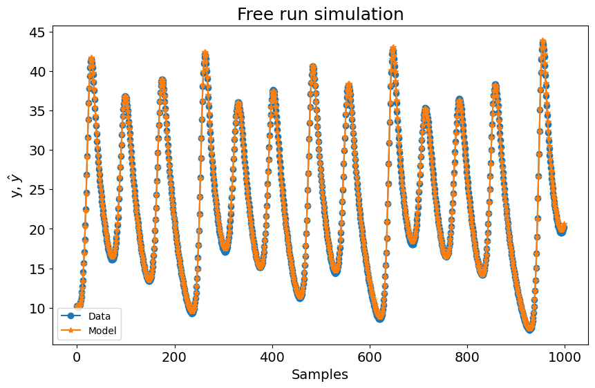
    


## Resultados

Agora podemos visualizar os resultados de cada trajetória prevista


```python
# Primeiro modelo: Usando previsões de yhat_1 (x previsto vs z previsto)
plt.figure()
plt.plot(yhat_1, yhat_3)  # plotar previsões projetadas no plano (x, z)
plt.plot(
    [sol2[0, 0]], [sol2[0, 2]], "b^"
)  # triângulo azul marca o ponto inicial de cada trajetória
plt.plot([x2], [z2], "rx")  # estado estacionário
plt.plot([-x2], [z2], "rx")  # estado estacionário
plt.xlabel(r"$x$")
plt.ylabel(r"$z$")
plt.title("Gráfico Borboleta - Previsões do Modelo 1")
plt.show()

# Segundo modelo: Usando previsões de yhat_2 (y previsto vs z previsto)
plt.figure()
plt.plot(yhat_2, yhat_3)  # plotar previsões projetadas no plano (y, z)
plt.plot(
    [sol2[0, 1]], [sol2[0, 2]], "b^"
)  # triângulo azul marca o ponto inicial de cada trajetória
plt.plot([x2], [z2], "rx")  # estado estacionário
plt.plot([-x2], [z2], "rx")  # estado estacionário
plt.xlabel(r"$y$")
plt.ylabel(r"$z$")
plt.title("Gráfico Borboleta - Previsões do Modelo 2")
plt.show()

# Terceiro modelo: Usando previsões de yhat_3 (z previsto vs x previsto)
plt.figure()
plt.plot(yhat_3, yhat_1)  # plotar previsões projetadas no plano (z, x)
plt.plot(
    [sol2[0, 2]], [sol2[0, 0]], "b^"
)  # triângulo azul marca o ponto inicial de cada trajetória
plt.plot([z2], [x2], "rx")  # estado estacionário
plt.plot([z2], [-x2], "rx")  # estado estacionário
plt.xlabel(r"$z$")
plt.ylabel(r"$x$")
plt.title("Gráfico Borboleta - Previsões do Modelo 3")
plt.show()
```


    
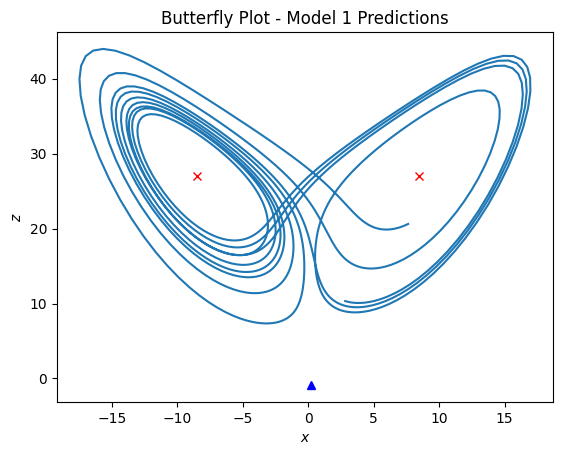
    


    
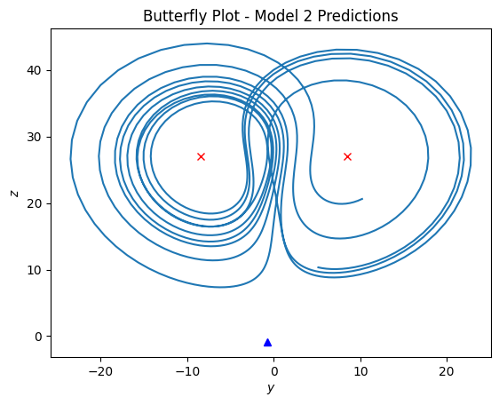
    


    
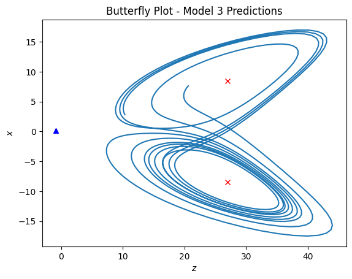
    


```python
fig = plt.figure()
ax = fig.add_subplot(111, projection="3d")
ax.plot(yhat_1, yhat_2, yhat_3)
ax.set_xlabel(r"$x$")
ax.set_ylabel(r"$y$")
ax.set_zlabel(r"$z$")
ax.set_title("Gráfico 3D Borboleta com Dados Previstos")
plt.show()
```


    
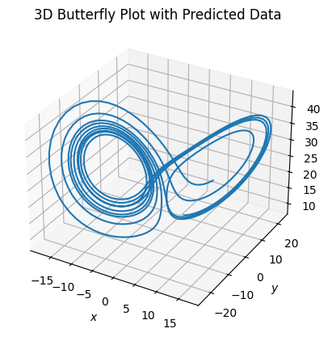
    


Conforme mostrado nos gráficos acima, os modelos capturam efetivamente a dinâmica do sistema de Lorenz, reproduzindo os ciclos estáveis em regimes periódicos com erros de previsão mínimos. Em regimes caóticos, os modelos mantêm previsões precisas a curto prazo, mas podem exibir divergência a longo prazo, o que é esperado devido à sensibilidade às condições iniciais intrínseca aos sistemas caóticos. Embora detalhes mais finos possam requerer configurações de modelo mais sofisticadas, o SysIdentPy demonstra sua capacidade de modelar a dinâmica não linear do sistema de Lorenz, mesmo no regime caótico. Este experimento destaca a versatilidade do SysIdentPy em capturar comportamentos estáveis e caóticos em sistemas complexos.
