# Dispositivo Elétrico Acoplado

Nota: O exemplo mostrado neste notebook é retirado do livro [Nonlinear System Identification and Forecasting: Theory and Practice with SysIdentPy](https://sysidentpy.org/book/0-Preface/).

O dataset CE8 de acionamentos elétricos acoplados [dataset - Nonlinear Benchmark](https://www.nonlinearbenchmark.org/benchmarks) apresenta um caso de uso interessante para demonstrar o desempenho do SysIdentPy. Este sistema envolve dois motores elétricos acionando uma polia com uma correia flexível, criando um ambiente dinâmico ideal para testar ferramentas de identificação de sistemas.

> O [site de benchmarks não lineares](https://www.nonlinearbenchmark.org/benchmarks) representa uma contribuição significativa para a comunidade de identificação de sistemas e aprendizado de máquina. Os usuários são encorajados a explorar todos os artigos referenciados no site.

### Visão Geral do Sistema

O sistema CE8, ilustrado na Figura 1, apresenta:
- **Dois Motores Elétricos**: Estes motores controlam independentemente a tensão e a velocidade da correia, fornecendo controle simétrico em torno do zero. Isso permite movimentos tanto horários quanto anti-horários.
- **Mecanismo de Polia**: A polia é suportada por uma mola, introduzindo um modo dinâmico levemente amortecido que adiciona complexidade ao sistema.
- **Foco no Controle de Velocidade**: O foco principal é o sistema de controle de velocidade. A velocidade angular da polia é medida usando um contador de pulsos, que é insensível à direção da velocidade.


> Figura 1. Design do sistema CE8.

### Sensor e Filtragem

O processo de medição envolve:
- **Contador de Pulsos**: Este sensor mede a velocidade angular da polia sem considerar a direção.
- **Filtragem Analógica Passa-Baixa**: Reduz o ruído de alta frequência, seguido por filtragem anti-aliasing para preparar o sinal para processamento digital. Os efeitos dinâmicos são principalmente influenciados pelas constantes de tempo do acionamento elétrico e pela mola, com a filtragem passa-baixa tendo impacto mínimo na saída.

### Resultados SOTA

O SysIdentPy pode ser usado para construir modelos robustos para identificar e modelar as dinâmicas complexas do sistema CE8. O desempenho será comparado com um benchmark fornecido por [Max D. Champneys, Gerben I. Beintema, Roland Tóth, Maarten Schoukens, and Timothy J. Rogers - Baselines for Nonlinear Benchmarks, Workshop on Nonlinear System Identification Benchmarks, 2024.](https://arxiv.org/pdf/2405.10779)


O benchmark avalia a métrica média entre os dois experimentos. Por isso o método SOTA não tem a melhor métrica para o `teste 1`, mas ainda é o melhor no geral. O objetivo deste estudo de caso não é apenas demonstrar a robustez do SysIdentPy, mas também fornecer insights valiosos sobre suas aplicações práticas em sistemas dinâmicos do mundo real.

### Pacotes e Versões Necessários

Para garantir que você possa replicar este estudo de caso, é essencial usar versões específicas dos pacotes necessários. Abaixo está uma lista dos pacotes junto com suas respectivas versões necessárias para executar os estudos de caso de forma eficaz.

Para instalar todos os pacotes necessários, você pode criar um arquivo `requirements.txt` com o seguinte conteúdo:

```
sysidentpy==0.4.0
pandas==2.2.2
numpy==1.26.0
matplotlib==3.8.4
nonlinear_benchmarks==0.1.2
```

Então, instale os pacotes usando:
```
pip install -r requirements.txt
```

- Certifique-se de usar um ambiente virtual para evitar conflitos entre versões de pacotes.
- As versões especificadas são baseadas na compatibilidade com os exemplos de código fornecidos. Se você estiver usando versões diferentes, alguns ajustes no código podem ser necessários.

### Configuração do SysIdentPy

Nesta seção, demonstraremos a aplicação do SysIdentPy ao dataset CE8 de acionamentos elétricos acoplados. Este exemplo mostra o desempenho robusto do SysIdentPy na modelagem e identificação de sistemas dinâmicos complexos. O código a seguir irá guiá-lo através do processo de carregamento do dataset, configuração dos parâmetros do SysIdentPy e construção de um modelo para o sistema CE8.

Este exemplo prático ajudará os usuários a entender como utilizar efetivamente o SysIdentPy para suas próprias tarefas de identificação de sistemas, aproveitando seus recursos avançados para lidar com as complexidades de sistemas dinâmicos do mundo real. Vamos mergulhar no código e explorar as capacidades do SysIdentPy.


```python
import numpy as np
import pandas as pd
import matplotlib.pyplot as plt

from sysidentpy.model_structure_selection import FROLS
from sysidentpy.basis_function import Polynomial, Fourier
from sysidentpy.utils.display_results import results
from sysidentpy.parameter_estimation import LeastSquares
from sysidentpy.metrics import root_mean_squared_error
from sysidentpy.utils.plotting import plot_results

import nonlinear_benchmarks

train_val, test = nonlinear_benchmarks.CED(atleast_2d=True)
data_train_1, data_train_2 = train_val
data_test_1, data_test_2 = test
```

Usamos o pacote `nonlinear_benchmarks` para carregar os dados. O usuário é direcionado à documentação do pacote [GerbenBeintema - nonlinear_benchmarks: The official dataload for nonlinear benchmark datasets](https://github.com/GerbenBeintema/nonlinear_benchmarks/tree/master) para verificar os detalhes de como usá-lo.

O gráfico a seguir detalha os dados de treinamento e teste de ambos os experimentos. Aqui estamos tentando obter dois modelos, um para cada experimento, que tenham um desempenho melhor que os baselines mencionados.


```python
plt.plot(data_train_1.u)
plt.plot(data_train_1.y)
plt.title("Experimento 1: dados de treinamento")
plt.show()

plt.plot(data_test_1.u)
plt.plot(data_test_1.y)
plt.title("Experimento 1: dados de teste")
plt.show()

plt.plot(data_train_2.u)
plt.plot(data_train_2.y)
plt.title("Experimento 2: dados de treinamento")
plt.show()

plt.plot(data_test_2.u)
plt.plot(data_test_2.y)
plt.title("Experimento 2: dados de teste")
plt.show()
```


    
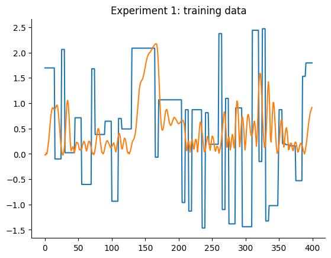
    


    
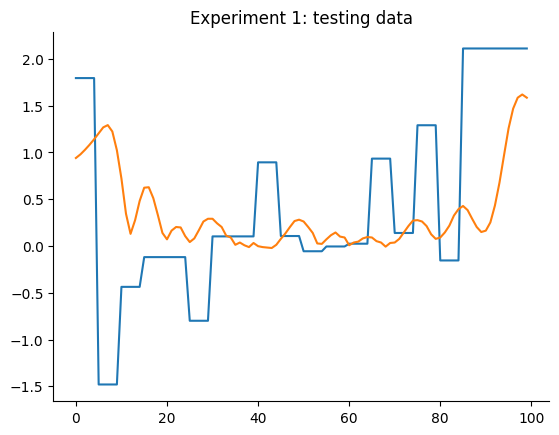
    


    
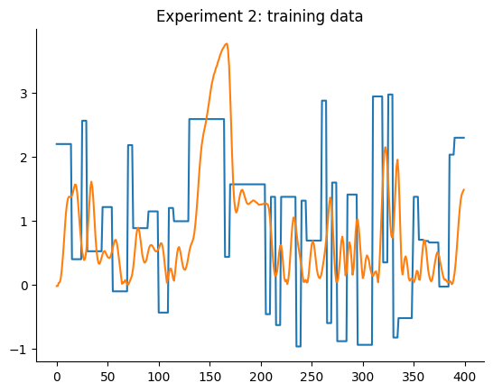
    


    
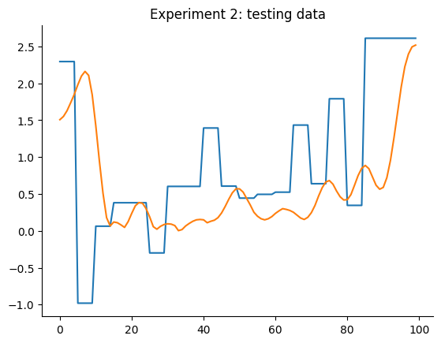
    


### Resultados

Primeiro, definiremos exatamente a mesma configuração para construir modelos para ambos os experimentos. Podemos ter modelos melhores otimizando as configurações individualmente, mas começaremos de forma simples.

Uma configuração básica do FROLS usando uma função base polinomial com grau igual a 2 é definida. O critério de informação será o padrão, o `aic`. Os `xlag` e `ylag` são definidos como $7$ neste primeiro exemplo.

Modelo para o experimento 1:


```python
y_train = data_train_1.y
y_test = data_test_1.y
x_train = data_train_1.u
x_test = data_test_1.u

n = data_test_1.state_initialization_window_length

basis_function = Polynomial(degree=2)
model = FROLS(
    xlag=7,
    ylag=7,
    basis_function=basis_function,
    estimator=LeastSquares(),
    info_criteria="aic",
    n_info_values=120,
)

model.fit(X=x_train, y=y_train)
y_test = np.concatenate([y_train[-model.max_lag :], y_test])
x_test = np.concatenate([x_train[-model.max_lag :], x_test])
yhat = model.predict(X=x_test, y=y_test[: model.max_lag, :])
rmse = root_mean_squared_error(y_test[model.max_lag + n :], yhat[model.max_lag + n :])
plot_results(
    y=y_test[model.max_lag :],
    yhat=yhat[model.max_lag :],
    n=10000,
    title=f"Simulação Free Run. Modelo 1 -> RMSE: {round(rmse, 4)}",
)
```


    
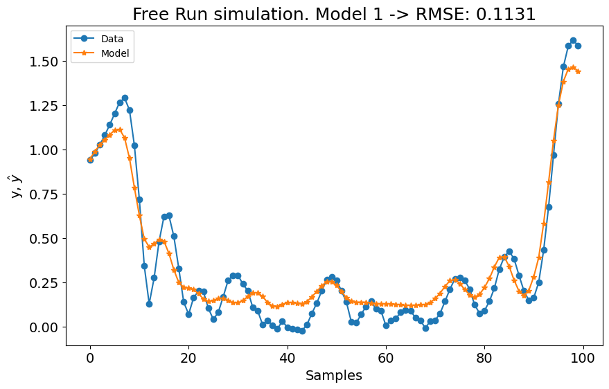
    


Modelo para o experimento 2:


```python
y_train = data_train_2.y
y_test = data_test_2.y
x_train = data_train_2.u
x_test = data_test_2.u

n = data_test_2.state_initialization_window_length

basis_function = Polynomial(degree=2)
model = FROLS(
    xlag=7,
    ylag=7,
    basis_function=basis_function,
    estimator=LeastSquares(),
    info_criteria="aic",
    n_info_values=120,
)

model.fit(X=x_train, y=y_train)
y_test = np.concatenate([y_train[-model.max_lag :], y_test])
x_test = np.concatenate([x_train[-model.max_lag :], x_test])
yhat = model.predict(X=x_test, y=y_test[: model.max_lag, :])
rmse = root_mean_squared_error(y_test[model.max_lag + n :], yhat[model.max_lag + n :])
plot_results(
    y=y_test[model.max_lag :],
    yhat=yhat[model.max_lag :],
    n=10000,
    title=f"Simulação Free Run. Modelo 2 -> RMSE: {round(rmse, 4)}",
)
```


    
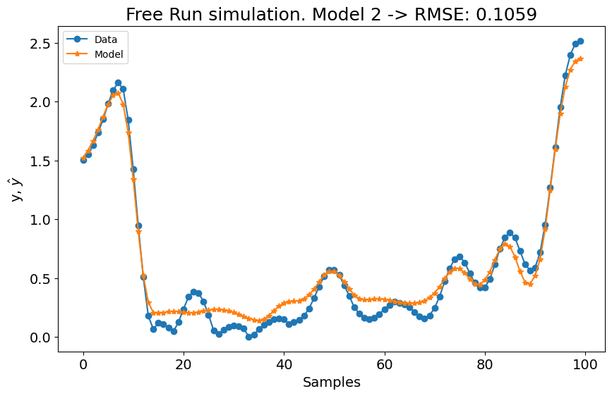
    


A primeira configuração para o experimento 1 já é melhor que os modelos **LTI ARX**, **LTI SS**, **GRU**, **LSTM**, **MLP NARX**, **MLP FIR**, **OLSTM** e **SOTA** mostrados na tabela do benchmark. Melhor que 8 de 11 modelos mostrados no benchmark. Para o experimento 2, é melhor que **LTI ARX**, **LTI SS**, **GRU**, **RNN**, **LSTM**, **OLSTM** e **pNARX** (7 de 11). É um bom começo, mas vamos verificar se o desempenho melhora se definirmos um lag maior para `xlag` e `ylag`.

A métrica média é $(0.1131 + 0.1059)/2 = 0.1095$, o que é muito bom, mas pior que o SOTA ($0.0945$). Agora vamos aumentar os lags para `x` e `y` para verificar se obtemos um modelo melhor. Antes de aumentar os lags, o critério de informação é mostrado:


```python
xaxis = np.arange(1, model.n_info_values + 1)
plt.plot(xaxis, model.info_values)
plt.xlabel("n_terms")
plt.ylabel("Critério de Informação")
```


    Text(0, 0.5, 'Critério de Informação')


    
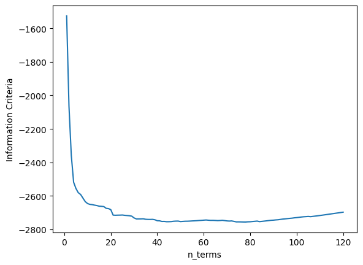
    


Pode-se observar que após 22 regressores, adicionar novos regressores não melhora o desempenho do modelo (considerando a configuração definida para aquele modelo). Como queremos experimentar modelos com lags maiores e grau de não linearidade maior, o critério de parada será alterado para `err_tol` em vez de critério de informação. Isso fará o algoritmo rodar consideravelmente mais rápido.


```python
# experimento 1
y_train = data_train_1.y
y_test = data_test_1.y
x_train = data_train_1.u
x_test = data_test_1.u

n = data_test_1.state_initialization_window_length

basis_function = Polynomial(degree=2)
model = FROLS(
    xlag=14,
    ylag=14,
    basis_function=basis_function,
    estimator=LeastSquares(),
    err_tol=0.9996,
    n_terms=22,
    order_selection=False,
)

model.fit(X=x_train, y=y_train)
print(model.final_model.shape, model.err.sum())
y_test = np.concatenate([y_train[-model.max_lag :], y_test])
x_test = np.concatenate([x_train[-model.max_lag :], x_test])
yhat = model.predict(X=x_test, y=y_test[: model.max_lag, :])

rmse = root_mean_squared_error(y_test[model.max_lag + n :], yhat[model.max_lag + n :])

plot_results(
    y=y_test[model.max_lag :],
    yhat=yhat[model.max_lag :],
    n=10000,
    title=f"Simulação Free Run. Modelo 1 -> RMSE: {round(rmse, 4)}",
)
```

    (22, 2) 0.9970964868326048


    
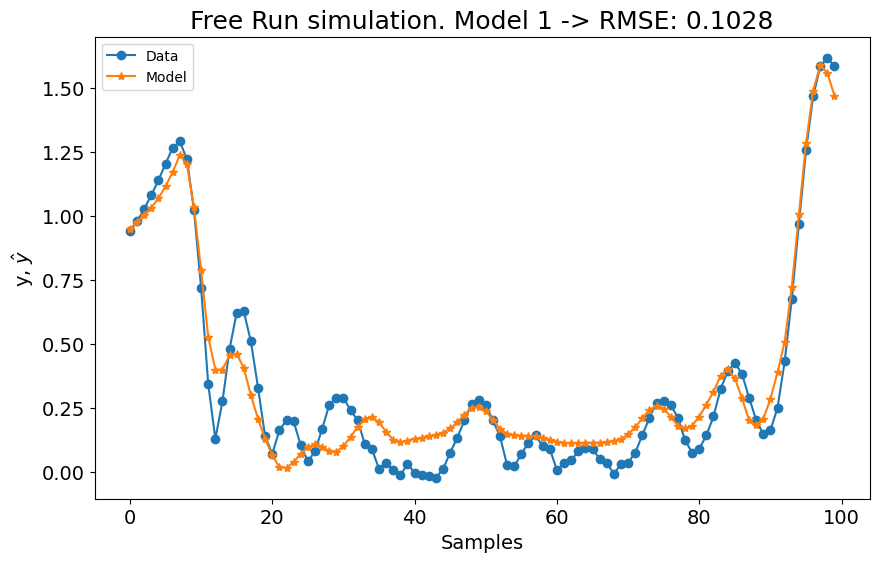
    


```python
# experimento 2
y_train = data_train_2.y
y_test = data_test_2.y
x_train = data_train_2.u
x_test = data_test_2.u

n = data_test_2.state_initialization_window_length

basis_function = Polynomial(degree=2)
model = FROLS(
    xlag=14,
    ylag=14,
    basis_function=basis_function,
    estimator=LeastSquares(),
    info_criteria="aicc",
    err_tol=0.9996,
    n_terms=22,
    order_selection=False,
)

model.fit(X=x_train, y=y_train)
y_test = np.concatenate([y_train[-model.max_lag :], y_test])
x_test = np.concatenate([x_train[-model.max_lag :], x_test])
yhat = model.predict(X=x_test, y=y_test[: model.max_lag, :])

rmse = root_mean_squared_error(y_test[model.max_lag + n :], yhat[model.max_lag + n :])

plot_results(
    y=y_test[model.max_lag :],
    yhat=yhat[model.max_lag :],
    n=10000,
    title=f"Simulação Free Run. Modelo 2 -> RMSE: {round(rmse, 4)}",
)
```


    
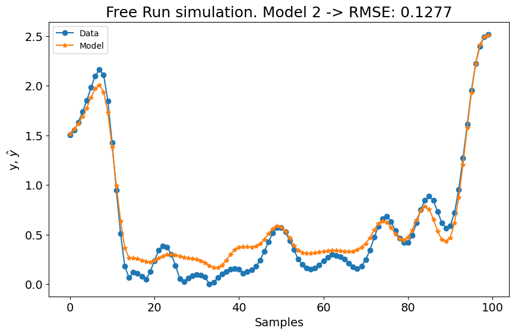
    


No primeiro experimento, o modelo mostrou uma leve melhoria, enquanto o desempenho do segundo experimento experimentou uma pequena queda. Aumentar as configurações de lag com estas configurações não resultou em mudanças significativas. Portanto, vamos definir o grau polinomial para $3$ e aumentar o número de termos para construir o modelo para `n_terms=40` se o `err_tol` não for atingido. É importante notar que estes valores são escolhidos empiricamente. Também poderíamos ajustar a técnica de estimação de parâmetros, o `err_tol`, o algoritmo de seleção de estrutura do modelo e a função base, entre outros fatores. Os usuários são encorajados a empregar técnicas de ajuste de hiperparâmetros para encontrar as combinações ótimas de hiperparâmetros.


```python
# experimento 1
y_train = data_train_1.y
y_test = data_test_1.y
x_train = data_train_1.u
x_test = data_test_1.u

n = data_test_1.state_initialization_window_length

basis_function = Polynomial(degree=3)
model = FROLS(
    xlag=14,
    ylag=14,
    basis_function=basis_function,
    estimator=LeastSquares(),
    err_tol=0.9996,
    n_terms=40,
    order_selection=False,
)

model.fit(X=x_train, y=y_train)
print(model.final_model.shape, model.err.sum())
y_test = np.concatenate([y_train[-model.max_lag :], y_test])
x_test = np.concatenate([x_train[-model.max_lag :], x_test])
yhat = model.predict(X=x_test, y=y_test[: model.max_lag, :])

rmse = root_mean_squared_error(y_test[model.max_lag + n :], yhat[model.max_lag + n :])

plot_results(
    y=y_test[model.max_lag :],
    yhat=yhat[model.max_lag :],
    n=10000,
    title=f"Simulação Free Run. Modelo 1 -> RMSE: {round(rmse, 4)}",
)
```

    (40, 3) 0.9982136069197526


    
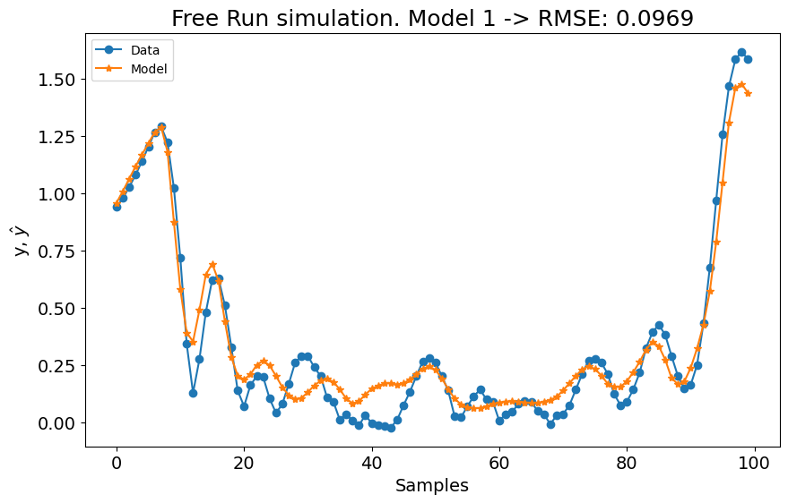
    


```python
# experimento 2
y_train = data_train_2.y
y_test = data_test_2.y
x_train = data_train_2.u
x_test = data_test_2.u

n = data_test_2.state_initialization_window_length

basis_function = Polynomial(degree=3)
model = FROLS(
    xlag=14,
    ylag=14,
    basis_function=basis_function,
    estimator=LeastSquares(),
    info_criteria="aicc",
    err_tol=0.9996,
    n_terms=40,
    order_selection=False,
)

model.fit(X=x_train, y=y_train)
y_test = np.concatenate([y_train[-model.max_lag :], y_test])
x_test = np.concatenate([x_train[-model.max_lag :], x_test])
yhat = model.predict(X=x_test, y=y_test[: model.max_lag, :])

rmse = root_mean_squared_error(y_test[model.max_lag + n :], yhat[model.max_lag + n :])

plot_results(
    y=y_test[model.max_lag :],
    yhat=yhat[model.max_lag :],
    n=10000,
    title=f"Simulação Free Run. Modelo 2 -> RMSE: {round(rmse, 4)}",
)
```


    
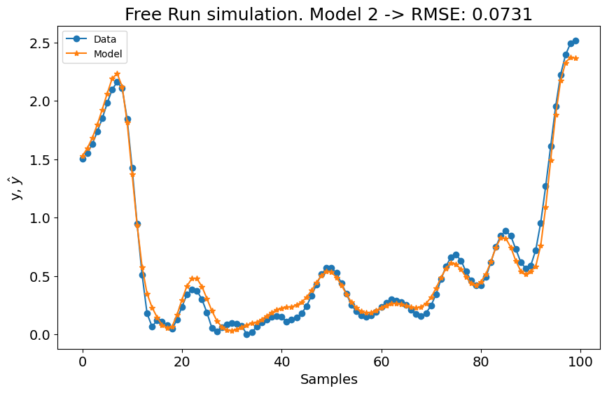
    


Como mostrado no gráfico, superamos os resultados do estado da arte (SOTA) com uma métrica média de $(0.0969 + 0.0731)/2 = 0.0849$. Além disso, a métrica para o primeiro experimento iguala o melhor modelo no benchmark, e a métrica para o segundo experimento supera levemente o melhor modelo do benchmark. Usando a mesma configuração para ambos os modelos, alcançamos os melhores resultados gerais!
