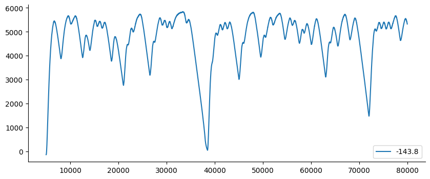

# Identificação de Sistema Eletromecânico - Entropic Regression

Exemplo criado por Wilson Rocha Lacerda Junior

> **Procurando mais detalhes sobre modelos NARMAX?**
> Para informações completas sobre modelos, métodos e uma ampla variedade de exemplos e benchmarks implementados no SysIdentPy, confira nosso livro:
> [*Nonlinear System Identification and Forecasting: Theory and Practice With SysIdentPy*](https://sysidentpy.org/book/0%20-%20Preface/)
>
> Este livro fornece orientações detalhadas para apoiar seu trabalho com o SysIdentPy.

Mais detalhes sobre estes dados podem ser encontrados no seguinte artigo (em português): https://www.researchgate.net/publication/320418710_Identificacao_de_um_motorgerador_CC_por_meio_de_modelos_polinomiais_autorregressivos_e_redes_neurais_artificiais


```python
pip install sysidentpy
```


```python
import numpy as np
import pandas as pd
from sysidentpy.model_structure_selection import ER
from sysidentpy.basis_function import Polynomial
from sysidentpy.parameter_estimation import RecursiveLeastSquares
from sysidentpy.metrics import root_relative_squared_error
from sysidentpy.utils.display_results import results
from sysidentpy.utils.plotting import plot_residues_correlation, plot_results
from sysidentpy.residues.residues_correlation import (
    compute_residues_autocorrelation,
    compute_cross_correlation,
)
```


```python
df1 = pd.read_csv(
    "https://raw.githubusercontent.com/wilsonrljr/sysidentpy-data/refs/heads/main/datasets/generator/x_cc.csv"
)
df2 = pd.read_csv(
    "https://raw.githubusercontent.com/wilsonrljr/sysidentpy-data/refs/heads/main/datasets/generator/y_cc.csv"
)
```


```python
df2[5000:80000].plot(figsize=(10, 4))
```


    <Axes: >


    

    


```python
# decimaremos os dados usando d=500 neste exemplo
x_train, x_valid = np.split(df1.iloc[::500].values, 2)
y_train, y_valid = np.split(df2.iloc[::500].values, 2)
```

## Construindo um Modelo NARX Polinomial usando o Algoritmo Entropic Regression


```python
basis_function = Polynomial(degree=2)
estimator = RecursiveLeastSquares()

model = ER(
    ylag=6,
    xlag=6,
    n_perm=2,
    k=2,
    skip_forward=True,
    estimator=estimator,
    basis_function=basis_function,
)
```


```python
model.fit(X=x_train, y=y_train)
yhat = model.predict(X=x_valid, y=y_valid)
rrse = root_relative_squared_error(y_valid, yhat)
print(rrse)

r = pd.DataFrame(
    results(
        model.final_model,
        model.theta,
        model.err,
        model.n_terms,
        err_precision=8,
        dtype="sci",
    ),
    columns=["Regressores", "Parâmetros", "ERR"],
)
print(r)

plot_results(y=y_valid, yhat=yhat, n=1000)
ee = compute_residues_autocorrelation(y_valid, yhat)
plot_residues_correlation(data=ee, title="Resíduos", ylabel="$e^2$")
x1e = compute_cross_correlation(y_valid, yhat, x_valid)
plot_residues_correlation(data=x1e, title="Resíduos", ylabel="$x_1e$")
```

    0.03276775133089435
            Regressores   Parâmetros             ERR
    0                1  -6.7052E+02  0.00000000E+00
    1           y(k-1)   9.6022E-01  0.00000000E+00
    2           y(k-5)  -3.0769E-02  0.00000000E+00
    3          x1(k-2)   7.3733E+02  0.00000000E+00
    4         y(k-1)^2   1.5897E-04  0.00000000E+00
    5     y(k-2)y(k-1)  -2.2080E-04  0.00000000E+00
    6     y(k-3)y(k-1)   2.9946E-06  0.00000000E+00
    7     y(k-5)y(k-1)   4.9779E-06  0.00000000E+00
    8    x1(k-1)y(k-1)  -1.7036E-01  0.00000000E+00
    9    x1(k-2)y(k-1)  -2.0748E-01  0.00000000E+00
    10   x1(k-4)y(k-1)   8.3724E-03  0.00000000E+00
    11        y(k-2)^2   7.3635E-05  0.00000000E+00
    12   x1(k-1)y(k-2)   1.2028E-01  0.00000000E+00
    13   x1(k-2)y(k-2)   8.0270E-02  0.00000000E+00
    14   x1(k-3)y(k-2)  -3.0208E-03  0.00000000E+00
    15   x1(k-4)y(k-2)  -8.8307E-03  0.00000000E+00
    16   x1(k-1)y(k-3)  -4.9095E-02  0.00000000E+00
    17   x1(k-1)y(k-4)   1.2375E-02  0.00000000E+00
    18       x1(k-1)^2   1.1682E+02  0.00000000E+00
    19  x1(k-3)x1(k-2)   5.2777E+00  0.00000000E+00


    

    


    

    


    

    
