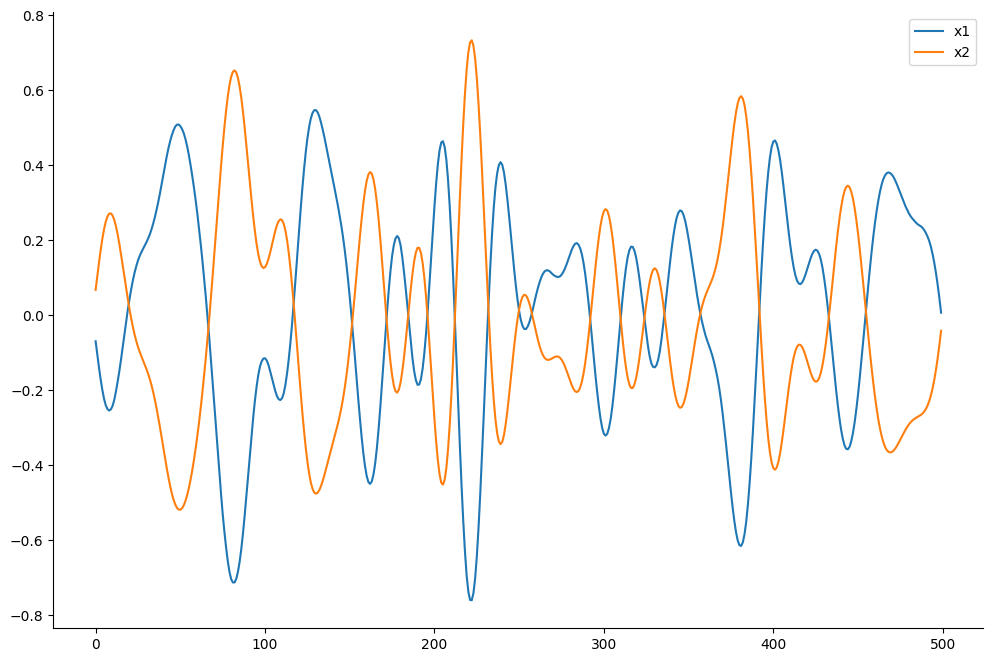
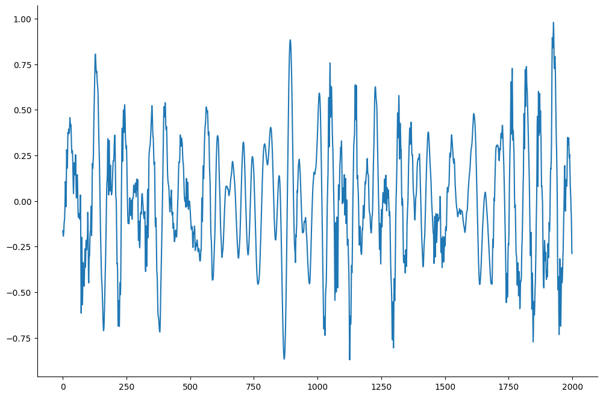
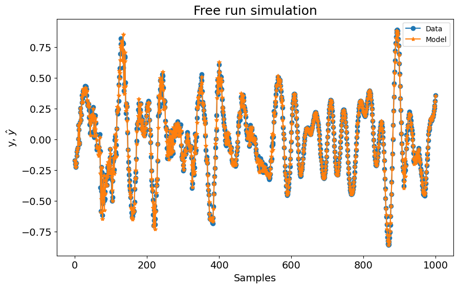
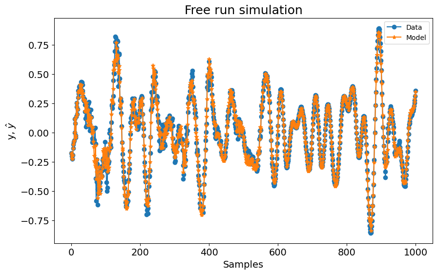
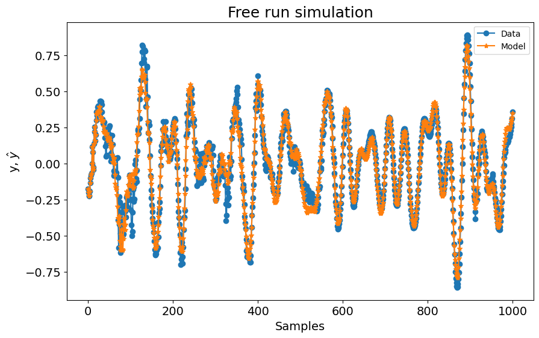

# Aeronave F-16 - Predição N-passos à Frente

**Nota**: Os exemplos a seguir não tentam replicar os resultados dos manuscritos citados. Mesmo os parâmetros do modelo como ylag e xlag e o tamanho dos dados de identificação e validação não são os mesmos dos artigos citados. Além disso, ajuste de taxa de amostragem e outras preparações de dados diferentes não são tratados aqui.

> **Procurando mais detalhes sobre modelos NARMAX?**
> Para informações completas sobre modelos, métodos e uma ampla variedade de exemplos e benchmarks implementados no SysIdentPy, confira nosso livro:
> [*Nonlinear System Identification and Forecasting: Theory and Practice With SysIdentPy*](https://sysidentpy.org/book/0%20-%20Preface/)
>
> Este livro fornece orientações detalhadas para apoiar seu trabalho com o SysIdentPy.

**O texto a seguir foi retirado do link http://www.nonlinearbenchmark.org/#F16**.

**Nota**: O leitor é encaminhado ao site mencionado para uma referência completa sobre o experimento. Por enquanto, este notebook é apenas um exemplo simples do desempenho do SysIdentPy em um conjunto de dados do mundo real. Um estudo mais detalhado deste sistema será publicado no futuro.

> O benchmark do Ground Vibration Test da F-16 apresenta um sistema de alta ordem com não linearidades de folga e atrito na interface de montagem das cargas úteis.

> Os dados experimentais disponibilizados aos participantes do Workshop foram adquiridos em uma aeronave F-16 em escala real na ocasião do Siemens LMS Ground Vibration Testing Master Class, realizado em setembro de 2014 na base militar de Saffraanberg, Sint-Truiden, Bélgica.

> Durante a campanha de testes, duas cargas úteis simuladas foram montadas nas pontas das asas para simular as propriedades de massa e inércia de dispositivos reais que tipicamente equipam uma F-16 em voo. A estrutura da aeronave foi instrumentada com acelerômetros. Um excitador foi fixado sob a asa direita para aplicar sinais de entrada. A fonte dominante de não linearidade nas dinâmicas estruturais era esperada originar das interfaces de montagem das duas cargas úteis. Essas interfaces consistem em elementos de conexão em forma de T no lado da carga útil, deslizados através de um trilho fixado ao lado da asa. Uma investigação preliminar mostrou que a conexão traseira da interface asa direita-carga útil era a fonte predominante de distorções não lineares nas dinâmicas da aeronave e, portanto, é o foco deste estudo de benchmark.

> Uma formulação detalhada do problema de identificação pode ser encontrada aqui. Todos os arquivos fornecidos e informações sobre o sistema de benchmark da aeronave F-16 estão disponíveis para download aqui. Este arquivo zip contém uma descrição detalhada do sistema, os conjuntos de dados de estimação e teste, e algumas fotos da configuração. Os dados estão disponíveis nos formatos de arquivo .csv e .mat.

> Por favor, cite o benchmark F16 como:

> J.P. Noël and M. Schoukens, F-16 aircraft benchmark based on ground vibration test data, 2017 Workshop on Nonlinear System Identification Benchmarks, pp. 19-23, Brussels, Belgium, April 24-26, 2017.


```python
pip install sysidentpy
```


```python
import numpy as np
import pandas as pd
from sysidentpy.model_structure_selection import FROLS
from sysidentpy.basis_function import Polynomial
from sysidentpy.parameter_estimation import LeastSquares
from sysidentpy.metrics import root_relative_squared_error
from sysidentpy.utils.display_results import results
from sysidentpy.utils.plotting import plot_results
```

## Preparando os Dados


```python
f_16 = pd.read_csv(
    r"https://raw.githubusercontent.com/wilsonrljr/sysidentpy-data/refs/heads/main/datasets/f_16_vibration_test/f-16.txt",
    header=None,
    names=["x1", "x2", "y"],
)
```


```python
f_16.shape
```


    (32768, 3)


```python
f_16[["x1", "x2"]][0:500].plot(figsize=(12, 8))
```


    <Axes: >


    

    


```python
f_16["y"][0:2000].plot(figsize=(12, 8))
```


    <Axes: >


    

    


```python
x1_id, x1_val = f_16["x1"][0:16384].values.reshape(-1, 1), f_16["x1"][
    16384::
].values.reshape(-1, 1)
x2_id, x2_val = f_16["x2"][0:16384].values.reshape(-1, 1), f_16["x2"][
    16384::
].values.reshape(-1, 1)
x_id = np.concatenate([x1_id, x2_id], axis=1)
x_val = np.concatenate([x1_val, x2_val], axis=1)

y_id, y_val = f_16["y"][0:16384].values.reshape(-1, 1), f_16["y"][
    16384::
].values.reshape(-1, 1)
```


```python
x1lag = list(range(1, 10))
x2lag = list(range(1, 10))
x2lag
```


    [1, 2, 3, 4, 5, 6, 7, 8, 9]


## Construindo o Modelo


```python
basis_function = Polynomial(degree=1)
estimator = LeastSquares()

model = FROLS(
    order_selection=True,
    n_info_values=39,
    ylag=20,
    xlag=[x1lag, x2lag],
    info_criteria="bic",
    estimator=estimator,
    basis_function=basis_function,
)

model.fit(X=x_id, y=y_id)
```


    <sysidentpy.model_structure_selection.forward_regression_orthogonal_least_squares.FROLS at 0x25d368a8910>


## Definindo o Horizonte de Previsão

Para realizar uma predição de n-passos à frente, você só precisa definir o argumento "steps_ahead".

**Nota** O valor padrão para steps_ahead é None e realiza uma predição de infinitos passos à frente


```python
y_hat = model.predict(X=x_val, y=y_val, steps_ahead=1)
rrse = root_relative_squared_error(y_val, y_hat)
print(rrse)
r = pd.DataFrame(
    results(
        model.final_model,
        model.theta,
        model.err,
        model.n_terms,
        err_precision=8,
        dtype="sci",
    ),
    columns=["Regressores", "Parâmetros", "ERR"],
)
print(r)

plot_results(y=y_val, yhat=y_hat, n=1000)
```

    0.09610207940697202
       Regressores   Parâmetros             ERR
    0      y(k-1)   1.8387E+00  9.43378253E-01
    1      y(k-2)  -1.8938E+00  1.95167599E-02
    2      y(k-3)   1.3337E+00  1.02432261E-02
    3      y(k-6)  -1.6038E+00  8.03485985E-03
    4      y(k-9)   2.6776E-01  9.27874557E-04
    5     x2(k-7)  -2.2385E+01  3.76837313E-04
    6     x1(k-1)   8.2709E+00  6.81508210E-04
    7     x2(k-3)   1.0587E+02  1.57459800E-03
    8     x1(k-8)  -3.7975E+00  7.35086279E-04
    9     x2(k-1)   8.5725E+01  4.85358786E-04
    10     y(k-7)   1.3955E+00  2.77245281E-04
    11     y(k-5)   1.3219E+00  8.64120037E-04
    12    y(k-10)  -2.9306E-01  8.51717688E-04
    13     y(k-4)  -9.5479E-01  7.23623116E-04
    14     y(k-8)  -7.1309E-01  4.44988077E-04
    15    y(k-12)  -3.0437E-01  1.49743148E-04
    16    y(k-11)   4.8602E-01  3.34613282E-04
    17    y(k-13)  -8.2442E-02  1.43738964E-04
    18    y(k-15)  -1.6762E-01  1.25546584E-04
    19    x1(k-2)  -8.9698E+00  9.76699739E-05
    20    y(k-17)   2.2036E-02  4.55983807E-05
    21    y(k-14)   2.4900E-01  1.10314107E-04
    22    y(k-19)  -6.8239E-03  1.99734771E-05
    23    x2(k-9)  -9.6265E+01  2.98523208E-05
    24    x2(k-8)   2.2620E+02  2.34402543E-04
    25    x2(k-2)  -2.3609E+02  1.04172323E-04
    26    y(k-20)  -5.4663E-02  5.37895336E-05
    27    x2(k-6)  -2.3651E+02  2.11392628E-05
    28    x2(k-4)   1.7378E+02  2.18396315E-05
    29    x1(k-7)   4.9862E+00  2.03811842E-05


    

    


```python
y_hat = model.predict(X=x_val, y=y_val, steps_ahead=5)
rrse = root_relative_squared_error(y_val, y_hat)
print(rrse)
plot_results(y=y_val, yhat=y_hat, n=1000)
```

    0.2168472873799118


    

    


```python
y_hat = model.predict(X=x_val, y=y_val, steps_ahead=None)
rrse = root_relative_squared_error(y_val, y_hat)
print(rrse)
plot_results(y=y_val, yhat=y_hat, n=1000)
```

    0.2910089654603829


    

    
