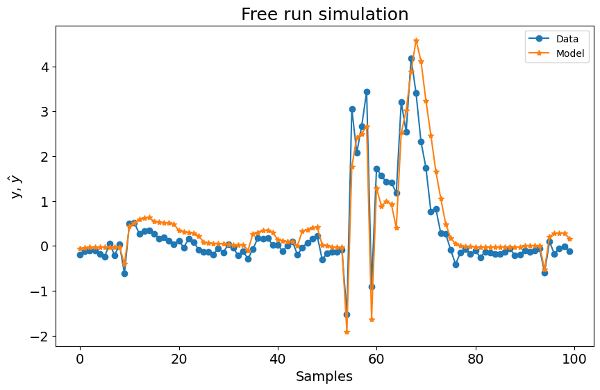
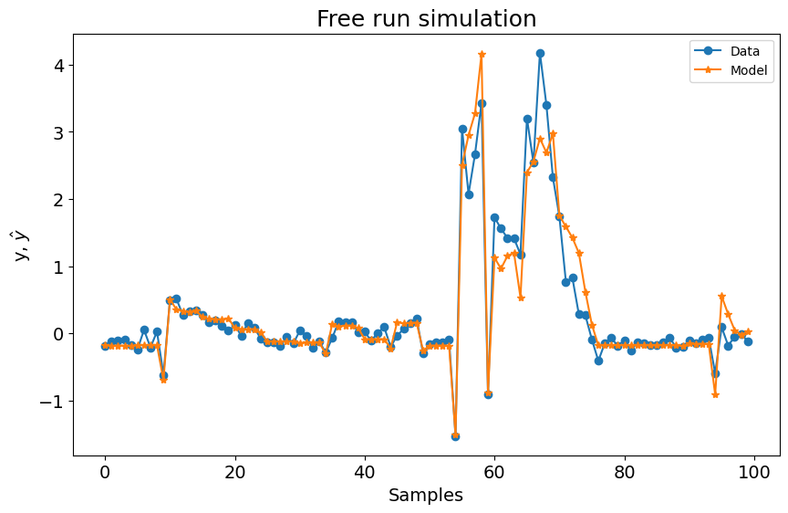

# Fourier NARX - Visão Geral

Exemplo criado por Wilson Rocha Lacerda Junior

> **Procurando mais detalhes sobre modelos NARMAX?**
> Para informações completas sobre modelos, métodos e uma ampla variedade de exemplos e benchmarks implementados no SysIdentPy, confira nosso livro:
> [*Nonlinear System Identification and Forecasting: Theory and Practice With SysIdentPy*](https://sysidentpy.org/book/0%20-%20Preface/)
>
> Este livro oferece orientação aprofundada para apoiar seu trabalho com o SysIdentPy.

Este exemplo mostra como alterar ou adicionar uma nova função base pode melhorar o modelo.


```python
import numpy as np
import matplotlib.pyplot as plt

from sysidentpy.model_structure_selection import FROLS
from sysidentpy.basis_function import Polynomial, Fourier
from sysidentpy.parameter_estimation import LeastSquares, RecursiveLeastSquares
from sysidentpy.utils.plotting import plot_results
from sysidentpy.metrics import root_relative_squared_error

np.seterr(all="ignore")
np.random.seed(1)

%matplotlib inline
```

### Definindo o sistema


```python
# Sistema simulado
def system_equation(y, u):
    yk = (
        (0.2 - 0.75 * np.cos(-y[0] ** 2)) * np.cos(y[0])
        - (0.15 + 0.45 * np.cos(-y[0] ** 2)) * np.cos(y[1])
        + np.cos(u[0])
        + 0.2 * u[1]
        + 0.7 * u[0] * u[1]
    )
    return yk


repetition = 5
random_samples = 200
total_time = repetition * random_samples
n = np.arange(0, total_time)

# Gerando entrada
x = np.random.normal(size=(random_samples,)).repeat(repetition)


_, ax = plt.subplots(figsize=(12, 6))
ax.step(n, x)
ax.set_xlabel("$n$", fontsize=18)
ax.set_ylabel("$x[n]$", fontsize=18)
plt.show()
```


    

    


### Simulando o sistema


```python
y = np.empty_like(x)
# Condições Iniciais
y0 = [0, 0]

# Simular
y[0:2] = y0
for i in range(2, len(y)):
    y[i] = system_equation(
        [y[i - 1], y[i - 2]], [x[i - 1], x[i - 2]]
    ) + np.random.normal(scale=0.1)

# Plot
_, ax = plt.subplots(figsize=(12, 6))
ax.plot(n, y)
ax.set_xlabel("$n$", fontsize=18)
ax.set_ylabel("$y[n]$", fontsize=18)
ax.grid()
plt.show()
```


    

    


### Adicionando ruído ao sistema


```python
# Dados sem ruído
ynoise_free = y.copy()

# Gerar ruído
v = np.random.normal(scale=0.5, size=y.shape)

# Dados corrompidos com ruído
ynoisy = ynoise_free + v

# Plot
_, ax = plt.subplots(figsize=(14, 8))
ax.plot(n, ynoise_free, label="Dados sem ruído")
ax.plot(n, ynoisy, label="Dados corrompidos")
ax.set_xlabel("$n$", fontsize=18)
ax.set_ylabel("$y[n]$", fontsize=18)
ax.legend(fontsize=18)
plt.show()
```


    

    


### Gerando dados de treinamento e teste


```python
n_train = 700

# Dados de identificação
y_train = ynoisy[:n_train].reshape(-1, 1)
x_train = x[:n_train].reshape(-1, 1)

# Dados de validação
y_test = ynoise_free[n_train:].reshape(-1, 1)
x_test = x[n_train:].reshape(-1, 1)
```

### Função Base Polinomial

Como você pode ver abaixo, usar apenas a função base polinomial com os seguintes parâmetros não resulta em um modelo ruim. No entanto, vamos verificar como é o desempenho usando a Função Base de Fourier.


```python
basis_function = Polynomial(degree=2)
estimator = LeastSquares()

sysidentpy = FROLS(
    order_selection=True,
    n_info_values=15,
    xlag=2,
    ylag=2,
    basis_function=basis_function,
    model_type="NARMAX",
    estimator=estimator,
    err_tol=None,
)
sysidentpy.fit(X=x_train, y=y_train)

yhat = sysidentpy.predict(X=x_test, y=y_test)
frols_loss = root_relative_squared_error(
    y_test[sysidentpy.max_lag :], yhat[sysidentpy.max_lag :]
)
print(frols_loss)

plot_results(y=y_test[sysidentpy.max_lag :], yhat=yhat[sysidentpy.max_lag :])
```

    0.6768251106751224


    

    


### Combinando uma Função Base de Fourier

Neste caso, adicionar a Função Base de Fourier resolve o problema e retorna um modelo capaz de predizer o sistema definido.


```python
basis_function = Fourier(degree=2, n=2, p=2 * np.pi, ensemble=True)
sysidentpy = FROLS(
    order_selection=True,
    n_info_values=70,
    xlag=2,
    ylag=2,  # os lags para todos os modelos serão 13
    basis_function=basis_function,
    model_type="NARMAX",
    err_tol=None,
)
sysidentpy.fit(X=x_train, y=y_train)

yhat = sysidentpy.predict(X=x_test, y=y_test)
frols_loss = root_relative_squared_error(
    y_test[sysidentpy.max_lag :], yhat[sysidentpy.max_lag :]
)
print(frols_loss)

plot_results(y=y_test[sysidentpy.max_lag :], yhat=yhat[sysidentpy.max_lag :])
```

    0.3742244715879492


    

    


## Importante

Atualmente você não pode obter a representação do modelo usando `sysidentpy.regressor_code` para modelos Fourier NARX. Na verdade, você pode usar o método, mas a representação não é precisa porque não deixamos claro quais são os regressores relacionados ao polinômio ou relacionados à função base de Fourier. Esta é uma melhoria a ser feita em futuras atualizações!
