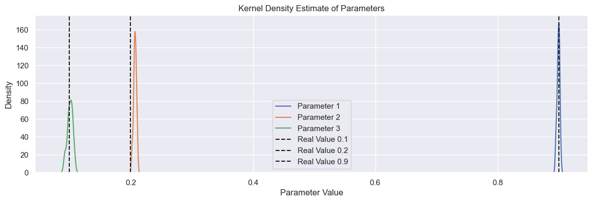
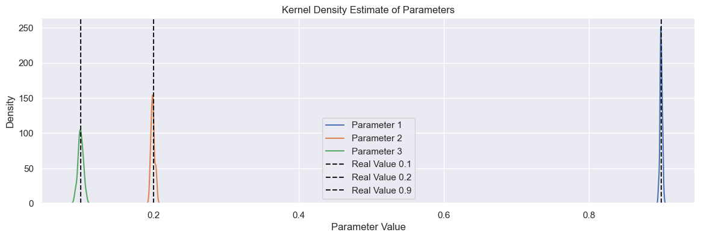

# Importância do Extended Least Squares

Exemplo criado por Wilson Rocha Lacerda Junior

> **Procurando mais detalhes sobre modelos NARMAX?**
> Para informações completas sobre modelos, métodos e uma ampla variedade de exemplos e benchmarks implementados no SysIdentPy, confira nosso livro:
> [*Nonlinear System Identification and Forecasting: Theory and Practice With SysIdentPy*](https://sysidentpy.org/book/0%20-%20Preface/)
>
> Este livro oferece orientação aprofundada para apoiar seu trabalho com o SysIdentPy.

Aqui importamos o modelo NARMAX, a métrica para avaliação do modelo e os métodos para gerar dados de amostra para testes. Também importamos pandas para uso específico.


```python
pip install sysidentpy
```


```python
import numpy as np
import pandas as pd
import matplotlib.pyplot as plt
import seaborn as sns
from sysidentpy.model_structure_selection import FROLS
from sysidentpy.basis_function import Polynomial
from sysidentpy.parameter_estimation import LeastSquares
from sysidentpy.metrics import root_relative_squared_error
from sysidentpy.utils.generate_data import get_siso_data
from sysidentpy.utils.display_results import results
```

## Gerando dados de amostra com 1 entrada e 1 saída

Os dados são gerados simulando o seguinte modelo:
$y_k = 0.2y_{k-1} + 0.1y_{k-1}x_{k-1} + 0.9x_{k-2} + e_{k}$

Se *colored_noise* for definido como True:

$e_{k} = 0.8\nu_{k-1} + \nu_{k}$

onde $x$ é uma variável aleatória uniformemente distribuída e $\nu$ é uma variável com distribuição gaussiana com $\mu=0$ e $\sigma$ definido pelo usuário.

No próximo exemplo, geraremos dados com 3000 amostras com ruído colorido e selecionando 90% dos dados para treinar o modelo.


```python
x_train, x_valid, y_train, y_valid = get_siso_data(
    n=1000, colored_noise=True, sigma=0.2, train_percentage=90
)
```

## Construindo o modelo

Primeiro, treinaremos um modelo sem o Algoritmo Extended Least Squares para fins de comparação.


```python
basis_function = Polynomial(degree=2)
estimator = LeastSquares(unbiased=False)
model = FROLS(
    order_selection=False,
    n_terms=3,
    ylag=2,
    xlag=2,
    info_criteria="aic",
    estimator=estimator,
    basis_function=basis_function,
    err_tol=None,
)
```


```python
model.fit(X=x_train, y=y_train)
yhat = model.predict(X=x_valid, y=y_valid)
rrse = root_relative_squared_error(y_valid, yhat)
print(rrse)
```

    0.5499799245432233


Claramente, há algo errado com o modelo obtido. Veja o notebook *basic_steps* para comparar os resultados obtidos usando os mesmos dados mas sem ruído colorido. Mas vamos ver o que está errado.


```python
r = pd.DataFrame(
    results(
        model.final_model,
        model.theta,
        model.err,
        model.n_terms,
        err_precision=8,
        dtype="sci",
    ),
    columns=["Regressors", "Parameters", "ERR"],
)
print(r)
```

          Regressors  Parameters             ERR
    0        x1(k-2)  8.9976E-01  7.41682256E-01
    1         y(k-1)  2.8734E-01  8.33321202E-02
    2  x1(k-1)y(k-1)  1.2348E-01  5.10334067E-03


## Estimação de parâmetros com bias

Como podemos observar acima, a estrutura do modelo é exatamente a mesma que gerou os dados. Você pode ver que o ERR ordenou os termos da forma correta. E esta é uma nota importante sobre o algoritmo Error Reduction Ratio usado aqui: __ele é muito robusto ao ruído colorido!!__

Esta é uma grande característica! No entanto, embora a estrutura esteja correta, os *parâmetros* do modelo não estão ok! Aqui temos uma estimação com bias! O parâmetro real para $y_{k-1}$ é $0.2$, não $0.3$.

Neste caso, estamos na verdade modelando usando um modelo NARX, não NARMAX. A parte MA existe para permitir uma estimação não-enviesada dos parâmetros. Para alcançar uma estimação não-enviesada dos parâmetros, temos o algoritmo Extended Least Squares. Lembre-se, se os dados têm apenas ruído branco, NARX é suficiente.

Antes de aplicar o Algoritmo Extended Least Squares, executaremos vários modelos NARX para verificar quão diferentes os parâmetros estimados são dos reais.


```python
parameters = np.zeros([3, 50])

for i in range(50):
    x_train, x_valid, y_train, y_valid = get_siso_data(
        n=3000, colored_noise=True, train_percentage=90
    )

    model.fit(X=x_train, y=y_train)
    parameters[:, i] = model.theta.flatten()

# Definir o tema para seaborn (opcional)
sns.set_theme()

plt.figure(figsize=(14, 4))

# Plotar KDE para cada parâmetro
sns.kdeplot(parameters.T[:, 0], label="Parameter 1")
sns.kdeplot(parameters.T[:, 1], label="Parameter 2")
sns.kdeplot(parameters.T[:, 2], label="Parameter 3")

# Plotar linhas verticais onde os valores reais devem estar
plt.axvline(x=0.1, color="k", linestyle="--", label="Real Value 0.1")
plt.axvline(x=0.2, color="k", linestyle="--", label="Real Value 0.2")
plt.axvline(x=0.9, color="k", linestyle="--", label="Real Value 0.9")

plt.xlabel("Parameter Value")
plt.ylabel("Density")
plt.title("Kernel Density Estimate of Parameters")
plt.legend()
plt.show()
```


    

    


## Usando o algoritmo Extended Least Squares

Como mostrado na figura acima, temos um problema para estimar o parâmetro para $y_{k-1}$. Agora usaremos o Algoritmo Extended Least Squares.

No SysIdentPy, basta definir *extended_least_squares* como *True* e o algoritmo será aplicado.


```python
basis_function = Polynomial(degree=2)
estimator = LeastSquares(unbiased=True)
parameters = np.zeros([3, 50])

for i in range(50):
    x_train, x_valid, y_train, y_valid = get_siso_data(
        n=3000, colored_noise=True, train_percentage=90
    )

    model = FROLS(
        order_selection=False,
        n_terms=3,
        ylag=2,
        xlag=2,
        elag=2,
        info_criteria="aic",
        estimator=estimator,
        basis_function=basis_function,
    )

    model.fit(X=x_train, y=y_train)
    parameters[:, i] = model.theta.flatten()


plt.figure(figsize=(14, 4))

# Plotar KDE para cada parâmetro
sns.kdeplot(parameters.T[:, 0], label="Parameter 1")
sns.kdeplot(parameters.T[:, 1], label="Parameter 2")
sns.kdeplot(parameters.T[:, 2], label="Parameter 3")

# Plotar linhas verticais onde os valores reais devem estar
plt.axvline(x=0.1, color="k", linestyle="--", label="Real Value 0.1")
plt.axvline(x=0.2, color="k", linestyle="--", label="Real Value 0.2")
plt.axvline(x=0.9, color="k", linestyle="--", label="Real Value 0.9")

plt.xlabel("Parameter Value")
plt.ylabel("Density")
plt.title("Kernel Density Estimate of Parameters")
plt.legend()
plt.show()
```


    

    


Ótimo! Agora temos uma estimação não-enviesada dos parâmetros!

## Nota

Nota: O Extended Least Squares é um algoritmo iterativo. No SysIdentPy, o padrão é 30 iterações (`uiter=30`) porque é conhecido da literatura que o algoritmo converge rapidamente (cerca de 10 ou 20 iterações).
