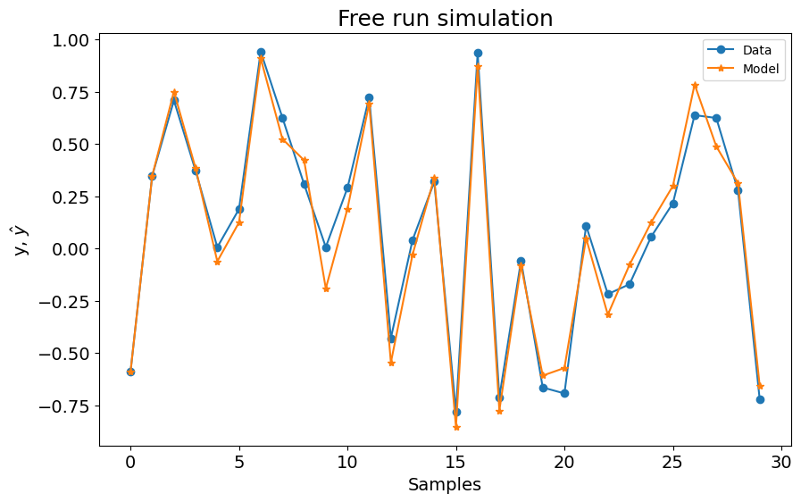
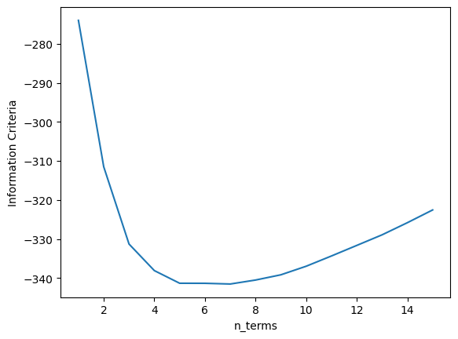
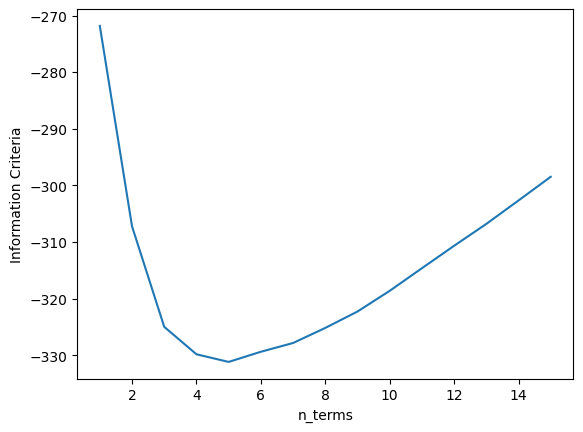
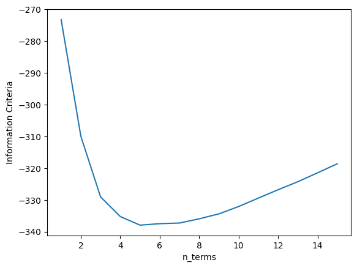
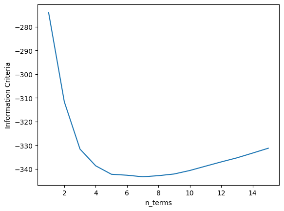

# Critérios de Informação - Visão Geral

Exemplo criado por Wilson Rocha Lacerda Junior

> **Procurando mais detalhes sobre modelos NARMAX?**
> Para informações completas sobre modelos, métodos e uma ampla variedade de exemplos e benchmarks implementados no SysIdentPy, confira nosso livro:
> [*Nonlinear System Identification and Forecasting: Theory and Practice With SysIdentPy*](https://sysidentpy.org/book/0%20-%20Preface/)
>
> Este livro oferece orientação aprofundada para apoiar seu trabalho com o SysIdentPy.

## Comparando diferentes métodos de critérios de informação

Aqui importamos o modelo NARMAX, a métrica para avaliação do modelo e os métodos para gerar dados de amostra para testes. Também importamos o pandas para uso específico.


```python
pip install sysidentpy
```


```python
import numpy as np
import pandas as pd
import matplotlib.pyplot as plt
from sysidentpy.model_structure_selection import FROLS
from sysidentpy.basis_function import Polynomial
from sysidentpy.parameter_estimation import LeastSquares
from sysidentpy.metrics import root_relative_squared_error
from sysidentpy.utils.generate_data import get_siso_data
from sysidentpy.utils.display_results import results
from sysidentpy.utils.plotting import plot_results
```

## Gerando dados de amostra

Os dados são gerados simulando o seguinte modelo:
$y_k = 0.2y_{k-1} + 0.1y_{k-1}x_{k-1} + 0.9x_{k-1} + e_{k}$

Se *colored_noise* for definido como True:

$e_{k} = 0.8\nu_{k-1} + \nu_{k}$

onde $x$ é uma variável aleatória uniformemente distribuída e $\nu$ é uma variável com distribuição gaussiana com $\mu=0$ e $\sigma=0.1$

No próximo exemplo, geraremos dados com 3000 amostras com ruído branco e selecionando 90% dos dados para treinar o modelo.


```python
x_train, x_test, y_train, y_test = get_siso_data(
    n=100, colored_noise=False, sigma=0.1, train_percentage=70
)
```

A ideia é mostrar o impacto do critério de informação na seleção do número de termos para compor o modelo final. Você verá por que é uma ferramenta auxiliar e deixar o algoritmo selecionar o número de termos com base no valor mínimo não é uma boa ideia ao lidar com dados altamente corrompidos por ruído (mesmo ruído branco).

Nota: Você pode encontrar resultados diferentes ao executar os exemplos. Isso se deve ao fato de não estarmos definindo um gerador aleatório fixo para os dados de amostra. No entanto, a análise principal permanece.

## AIC


```python
basis_function = Polynomial(degree=2)
estimator = LeastSquares()

model = FROLS(
    order_selection=True,
    n_info_values=15,
    ylag=2,
    xlag=2,
    info_criteria="aic",
    # estimator=estimator,
    basis_function=basis_function,
    err_tol=None,
)
model.fit(X=x_train, y=y_train)

yhat = model.predict(X=x_test, y=y_test)
rrse = root_relative_squared_error(y_test, yhat)
print(rrse)

r = pd.DataFrame(
    results(
        model.final_model,
        model.theta,
        model.err,
        model.n_terms,
        err_precision=8,
        dtype="sci",
    ),
    columns=["Regressors", "Parameters", "ERR"],
)
print(r)
plot_results(y=y_test, yhat=yhat, n=1000)

xaxis = np.arange(1, model.n_info_values + 1)
plt.plot(xaxis, model.info_values)
plt.xlabel("n_terms")
plt.ylabel("Information Criteria")
```

    0.1681621129389993
           Regressors   Parameters             ERR
    0         x1(k-2)   9.2076E-01  9.41001395E-01
    1          y(k-1)   1.7063E-01  2.71018399E-02
    2   x1(k-1)y(k-1)   1.7342E-01  8.79812755E-03
    3   x1(k-1)y(k-2)  -9.7902E-02  2.75495842E-03
    4  x1(k-2)x1(k-1)   4.9319E-02  1.85339089E-03
    5        y(k-2)^2  -5.6743E-02  1.02439383E-03
    6         x1(k-1)  -2.0179E-02  6.78305323E-04


    

    


    Text(0, 0.5, 'Information Criteria')


    

    


```python
model.info_values
```


    array([-273.81858224, -311.60797635, -331.34011486, -338.49936124,
           -342.10339048, -342.27073244, -342.82764626, -342.16492383,
           -341.04704839, -339.58437034, -337.79642875, -336.20531349,
           -333.72427584, -331.48645717, -329.53042523])


Como pode ser visto acima, o valor mínimo faz o algoritmo escolher um modelo com 4 termos. No entanto, se você verificar o gráfico, 3 termos é a melhor escolha. Aumentar o número de termos de 3 em diante não leva a um modelo melhor, já que a diferença é muito pequena.

Neste caso, você deve executar o modelo novamente com os parâmetros *n_terms=3*! O algoritmo ERR ordenou os termos de forma correta, então você obterá a estrutura exata do modelo novamente!

## AICc


```python
basis_function = Polynomial(degree=2)
estimator = LeastSquares()

model = FROLS(
    order_selection=True,
    n_info_values=15,
    ylag=2,
    xlag=2,
    info_criteria="aicc",
    estimator=estimator,
    basis_function=basis_function,
)
model.fit(X=x_train, y=y_train)
yhat = model.predict(X=x_test, y=y_test)
rrse = root_relative_squared_error(y_test, yhat)
print(rrse)

r = pd.DataFrame(
    results(
        model.final_model,
        model.theta,
        model.err,
        model.n_terms,
        err_precision=8,
        dtype="sci",
    ),
    columns=["Regressors", "Parameters", "ERR"],
)
print(r)
plot_results(y=y_test, yhat=yhat, n=1000)

xaxis = np.arange(1, model.n_info_values + 1)
plt.plot(xaxis, model.info_values)
plt.xlabel("n_terms")
plt.ylabel("Information Criteria")
```

    0.1697650652880654
           Regressors   Parameters             ERR
    0         x1(k-2)   9.2659E-01  9.41001395E-01
    1          y(k-1)   1.7219E-01  2.71018399E-02
    2   x1(k-1)y(k-1)   1.7454E-01  8.79812755E-03
    3   x1(k-1)y(k-2)  -1.0170E-01  2.75495842E-03
    4  x1(k-2)x1(k-1)   5.7955E-02  1.85339089E-03
    5        y(k-2)^2  -4.8117E-02  1.02439383E-03
    6         x1(k-1)  -2.4728E-02  6.78305323E-04


    

    


    Text(0, 0.5, 'Information Criteria')


    

    


```python
model.info_values
```


    array([-273.99834706, -311.49708248, -331.28179881, -338.08184328,
           -341.32119362, -341.3373076 , -341.51818541, -340.50119461,
           -339.16231408, -336.96924137, -334.34018578, -331.63849434,
           -328.92685178, -325.8181513 , -322.55039655])


Como pode ser visto acima, o valor mínimo faz o algoritmo escolher um modelo com 4 termos. O AICc, no entanto, tem diferenças importantes em comparação com o AIC quando o número de amostras é pequeno.

Neste caso, você deve executar o modelo novamente com os parâmetros *n_terms=3*! O algoritmo ERR ordenou os termos de forma correta, então você obterá a estrutura exata do modelo novamente!

## BIC


```python
basis_function = Polynomial(degree=2)
estimator = LeastSquares()

model = FROLS(
    order_selection=True,
    n_info_values=15,
    ylag=2,
    xlag=2,
    info_criteria="bic",
    estimator=estimator,
    basis_function=basis_function,
)

model.fit(X=x_train, y=y_train)
yhat = model.predict(X=x_test, y=y_test)
rrse = root_relative_squared_error(y_test, yhat)
print(rrse)

r = pd.DataFrame(
    results(
        model.final_model,
        model.theta,
        model.err,
        model.n_terms,
        err_precision=8,
        dtype="sci",
    ),
    columns=["Regressors", "Parameters", "ERR"],
)
print(r)
plot_results(y=y_test, yhat=yhat, n=1000)

xaxis = np.arange(1, model.n_info_values + 1)
plt.plot(xaxis, model.info_values)
plt.xlabel("n_terms")
plt.ylabel("Information Criteria")
```

    0.16868631871856155
           Regressors   Parameters             ERR
    0         x1(k-2)   9.3050E-01  9.41001395E-01
    1          y(k-1)   1.7980E-01  2.71018399E-02
    2   x1(k-1)y(k-1)   1.7026E-01  8.79812755E-03
    3   x1(k-1)y(k-2)  -8.5581E-02  2.75495842E-03
    4  x1(k-2)x1(k-1)   7.0047E-02  1.85339089E-03


    

    


    Text(0, 0.5, 'Information Criteria')


    

    


```python
model.info_values
```


    array([-271.83944541, -307.24268246, -324.99827569, -329.8387331 ,
           -331.19139703, -329.39731055, -327.84829815, -325.18581094,
           -322.29019301, -318.63381344, -314.63988674, -310.67712915,
           -306.81399235, -302.66957173, -298.4885502 ])


O BIC fez um trabalho melhor neste caso! A forma como ele penaliza o modelo em relação ao número de termos garante que o valor mínimo aqui foi exatamente o número esperado de termos para compor o modelo. Bom, mas nem sempre o melhor método!

## LILC


```python
basis_function = Polynomial(degree=2)
estimator = LeastSquares()

model = FROLS(
    order_selection=True,
    n_info_values=15,
    ylag=2,
    xlag=2,
    info_criteria="lilc",
    estimator=estimator,
    basis_function=basis_function,
)
model.fit(X=x_train, y=y_train)
yhat = model.predict(X=x_test, y=y_test)
rrse = root_relative_squared_error(y_test, yhat)
print(rrse)

r = pd.DataFrame(
    results(
        model.final_model,
        model.theta,
        model.err,
        model.n_terms,
        err_precision=8,
        dtype="sci",
    ),
    columns=["Regressors", "Parameters", "ERR"],
)
print(r)
plot_results(y=y_test, yhat=yhat, n=1000)

xaxis = np.arange(1, model.n_info_values + 1)
plt.plot(xaxis, model.info_values)
plt.xlabel("n_terms")
plt.ylabel("Information Criteria")
```

    0.16868631871856155
           Regressors   Parameters             ERR
    0         x1(k-2)   9.3050E-01  9.41001395E-01
    1          y(k-1)   1.7980E-01  2.71018399E-02
    2   x1(k-1)y(k-1)   1.7026E-01  8.79812755E-03
    3   x1(k-1)y(k-2)  -8.5581E-02  2.75495842E-03
    4  x1(k-2)x1(k-1)   7.0047E-02  1.85339089E-03


    

    


    Text(0, 0.5, 'Information Criteria')


    

    


```python
model.info_values
```


    array([-273.17951619, -309.92282401, -329.01848803, -335.19901621,
           -337.89175092, -337.43773522, -337.22879359, -335.90637716,
           -334.35083001, -332.03452122, -329.3806653 , -326.75797849,
           -324.23491246, -321.43056262, -318.58961187])


O LILC também inclui termos espúrios. Como o AIC, ele falha em selecionar automaticamente os termos corretos, mas você pode selecionar o número certo com base no gráfico acima!

## FPE


```python
basis_function = Polynomial(degree=2)
estimator = LeastSquares()

model = FROLS(
    order_selection=True,
    n_info_values=15,
    ylag=2,
    xlag=2,
    info_criteria="fpe",
    estimator=estimator,
    basis_function=basis_function,
)
model.fit(X=x_train, y=y_train)
yhat = model.predict(X=x_test, y=y_test)
rrse = root_relative_squared_error(y_test, yhat)
print(rrse)

r = pd.DataFrame(
    results(
        model.final_model,
        model.theta,
        model.err,
        model.n_terms,
        err_precision=8,
        dtype="sci",
    ),
    columns=["Regressors", "Parameters", "ERR"],
)
print(r)

xaxis = np.arange(1, model.n_info_values + 1)
plt.plot(xaxis, model.info_values)
plt.xlabel("n_terms")
plt.ylabel("Information Criteria")
```

    0.1697650652880654
           Regressors   Parameters             ERR
    0         x1(k-2)   9.2659E-01  9.41001395E-01
    1          y(k-1)   1.7219E-01  2.71018399E-02
    2   x1(k-1)y(k-1)   1.7454E-01  8.79812755E-03
    3   x1(k-1)y(k-2)  -1.0170E-01  2.75495842E-03
    4  x1(k-2)x1(k-1)   5.7955E-02  1.85339089E-03
    5        y(k-2)^2  -4.8117E-02  1.02439383E-03
    6         x1(k-1)  -2.4728E-02  6.78305323E-04


    Text(0, 0.5, 'Information Criteria')


    

    


```python
model.info_values
```


    array([-274.05880892, -311.68054386, -331.65290152, -338.70751749,
           -342.27085495, -342.68306863, -343.33508312, -342.86743567,
           -342.15953986, -340.68281499, -338.85950374, -337.05732543,
           -335.3437066 , -333.33668596, -331.27985457])


O FPE também falhou em selecionar automaticamente o número correto de termos! Mas, como apontamos antes, o Critério de Informação é uma ferramenta auxiliar! Se você olhar os gráficos, todos os métodos permitem que você escolha o número correto de termos!

## Nota Importante

Aqui estamos lidando com uma estrutura de modelo conhecida! Em relação a dados reais, não conhecemos o número correto de termos, então os métodos acima se destacam como excelentes ferramentas para ajudá-lo!

Se você verificar as métricas acima, mesmo com os modelos com mais termos, você verá métricas excelentes! Mas a Identificação de Sistemas sempre busca a melhor estrutura de modelo! A Seleção de Estrutura do Modelo é o núcleo dos métodos NARMAX! Neste sentido, os exemplos são para mostrar conceitos básicos e como os algoritmos funcionam!
