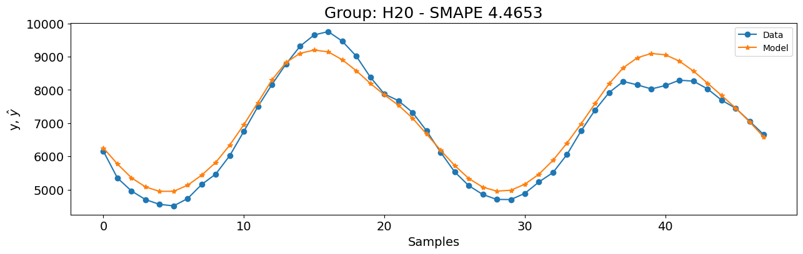

# Benchmark M4

Nota: O exemplo mostrado neste notebook é retirado do livro complementar [Nonlinear System Identification and Forecasting: Theory and Practice with SysIdentPy](https://sysidentpy.org/book/0-Preface/).

O dataset M4 é um recurso bem conhecido para previsão de séries temporais, oferecendo uma ampla gama de séries de dados usadas para testar e melhorar métodos de previsão. Criado para a competição M4 organizada por Spyros Makridakis, este dataset impulsionou muitos avanços em técnicas de previsão.

O dataset M4 inclui 100.000 séries temporais de vários campos como demografia, finanças, indústria, macroeconomia e microeconomia, que foram selecionados aleatoriamente do banco de dados ForeDeCk. As séries vêm em diferentes frequências (anual, trimestral, mensal, semanal, diária e horária), tornando-o uma coleção abrangente para testar métodos de previsão.

Neste estudo de caso, focaremos no subconjunto horário do dataset M4. Este subconjunto consiste em dados de séries temporais registrados por hora, fornecendo uma visão detalhada e de alta frequência das mudanças ao longo do tempo. Dados horários apresentam desafios únicos devido à sua granularidade e ao potencial de capturar flutuações e padrões de curto prazo.

O dataset M4 fornece um benchmark padrão para comparar diferentes métodos de previsão, permitindo que pesquisadores e profissionais avaliem seus modelos de forma consistente. Com séries de vários domínios e frequências, o dataset M4 representa desafios de previsão do mundo real, tornando-o valioso para desenvolver técnicas de previsão robustas. A competição e o dataset em si levaram à criação de novos algoritmos e métodos, melhorando significativamente a precisão e confiabilidade das previsões.

Apresentaremos um passo a passo completo usando o dataset horário M4 para demonstrar as capacidades do SysIdentPy. O SysIdentPy oferece uma variedade de ferramentas e técnicas projetadas para lidar efetivamente com as complexidades de dados de séries temporais, mas focaremos em uma configuração rápida e fácil para este caso. Abordaremos a seleção de modelos e métricas de avaliação específicas para o dataset horário.

Ao final deste estudo de caso, você terá uma compreensão sólida de como usar o SysIdentPy para previsão com o dataset horário M4, preparando você para enfrentar desafios de previsão semelhantes em cenários do mundo real.

### Pacotes Necessários e Versões

Para garantir que você possa replicar este estudo de caso, é essencial usar versões específicas dos pacotes necessários. Abaixo está uma lista dos pacotes junto com suas respectivas versões necessárias para executar os estudos de caso efetivamente.

Para instalar todos os pacotes necessários, você pode criar um arquivo `requirements.txt` com o seguinte conteúdo:

```
sysidentpy==0.4.0
datasetsforecast==0.0.8
pandas==2.2.2
numpy==1.26.0
matplotlib==3.8.4
s3fs==2024.6.1
```

Então, instale os pacotes usando:
```
pip install -r requirements.txt
```

- Certifique-se de usar um ambiente virtual para evitar conflitos entre versões de pacotes.
- As versões especificadas são baseadas na compatibilidade com os exemplos de código fornecidos. Se você estiver usando versões diferentes, alguns ajustes no código podem ser necessários.

### Configuração do SysIdentPy

Nesta seção, demonstraremos a aplicação do SysIdentPy ao dataset Silver box. O código a seguir guiará você através do processo de carregamento do dataset, configuração dos parâmetros do SysIdentPy e construção de um modelo para o sistema mencionado.


```python
import warnings
import numpy as np
import pandas as pd
from pandas.errors import SettingWithCopyWarning
import matplotlib.pyplot as plt

from sysidentpy.model_structure_selection import FROLS, AOLS
from sysidentpy.basis_function import Polynomial
from sysidentpy.parameter_estimation import LeastSquares
from sysidentpy.metrics import (
    root_relative_squared_error,
    symmetric_mean_absolute_percentage_error,
)
from sysidentpy.utils.plotting import plot_results

from datasetsforecast.m4 import M4, M4Evaluation

warnings.simplefilter(action="ignore", category=FutureWarning)
warnings.simplefilter(action="ignore", category=UserWarning)
warnings.simplefilter(action="ignore", category=SettingWithCopyWarning)

train = pd.read_csv("https://auto-arima-results.s3.amazonaws.com/M4-Hourly.csv")
test = pd.read_csv(
    "https://auto-arima-results.s3.amazonaws.com/M4-Hourly-test.csv"
).rename(columns={"y": "y_test"})
```

Os gráficos a seguir fornecem uma visualização dos dados de treinamento para um pequeno subconjunto das séries temporais. O gráfico mostra os dados brutos, dando uma visão dos padrões e comportamentos inerentes a cada série.

Ao observar os dados, você pode ter uma noção da variedade e complexidade das séries temporais com as quais estamos trabalhando. Os gráficos podem revelar características importantes como tendências, padrões sazonais e anomalias potenciais dentro das séries temporais. Entender esses elementos é crucial para o desenvolvimento de modelos de previsão precisos.

No entanto, ao lidar com um grande número de séries temporais diferentes, é comum começar com suposições amplas em vez de análises individuais detalhadas. Neste contexto, adotaremos uma abordagem semelhante. Em vez de entrar nos detalhes de cada dataset, faremos algumas suposições gerais e veremos como o SysIdentPy as trata.

Esta abordagem fornece um ponto de partida prático, demonstrando como o SysIdentPy pode gerenciar diferentes tipos de dados de séries temporais sem muito trabalho. À medida que você se familiariza mais com a ferramenta, pode refinar seus modelos com insights mais detalhados. Por enquanto, vamos focar em usar o SysIdentPy para criar as previsões com base nessas suposições iniciais.

Nossa primeira suposição é que há um padrão sazonal de 24 horas nas séries. Examinando os gráficos abaixo, isso parece razoável. Portanto, começaremos a construir nossos modelos com `ylag=24`.


```python
ax = (
    train[train["unique_id"] == "H10"]
    .reset_index(drop=True)["y"]
    .plot(figsize=(15, 2), title="H10")
)
xcoords = [a for a in range(24, 24 * 30, 24)]

for xc in xcoords:
    plt.axvline(x=xc, color="red", linestyle="--", alpha=0.5)
```


    

    


Vamos verificar e construir um modelo para o grupo `H20` antes de extrapolar as configurações para todos os grupos. Como não há features de entrada, usaremos um modelo tipo `NAR` no SysIdentPy. Para manter as coisas simples e rápidas, começaremos com função de base Polinomial com grau $1$.


```python
unique_id = "H20"
y_id = train[train["unique_id"] == unique_id]["y"].values.reshape(-1, 1)
y_val = test[test["unique_id"] == unique_id]["y_test"].values.reshape(-1, 1)

basis_function = Polynomial(degree=1)
model = FROLS(
    order_selection=True,
    ylag=24,
    estimator=LeastSquares(),
    basis_function=basis_function,
    model_type="NAR",
)

model.fit(y=y_id)
y_val = np.concatenate([y_id[-model.max_lag :], y_val])
y_hat = model.predict(y=y_val, forecast_horizon=48)
smape = symmetric_mean_absolute_percentage_error(
    y_val[model.max_lag : :], y_hat[model.max_lag : :]
)

plot_results(
    y=y_val[model.max_lag :],
    yhat=y_hat[model.max_lag :],
    n=30000,
    figsize=(15, 4),
    title=f"Grupo: {unique_id} - SMAPE {round(smape, 4)}",
)
```


    

    


Provavelmente, os resultados não são ótimos e não funcionarão para todos os grupos. No entanto, vamos verificar como esta configuração se compara ao modelo vencedor da [competição de séries temporais M4](https://www.researchgate.net/publication/325901666_The_M4_Competition_Results_findings_conclusion_and_way_forward): o Exponential Smoothing with Recurrent Neural Networks ([ESRNN](https://www.sciencedirect.com/science/article/abs/pii/S0169207019301153)).


```python
esrnn_url = (
    "https://github.com/Nixtla/m4-forecasts/raw/master/forecasts/submission-118.zip"
)
esrnn_forecasts = M4Evaluation.load_benchmark("data", "Hourly", esrnn_url)
esrnn_evaluation = M4Evaluation.evaluate("data", "Hourly", esrnn_forecasts)

esrnn_evaluation
```


<div>
<style scoped>
    .dataframe tbody tr th:only-of-type {
        vertical-align: middle;
    }

    .dataframe tbody tr th {
        vertical-align: top;
    }

    .dataframe thead th {
        text-align: right;
    }
</style>
<table border="1" class="dataframe">
  <thead>
    <tr style="text-align: right;">
      <th></th>
      <th>SMAPE</th>
      <th>MASE</th>
      <th>OWA</th>
    </tr>
  </thead>
  <tbody>
    <tr>
      <th>Hourly</th>
      <td>9.328443</td>
      <td>0.893046</td>
      <td>0.440163</td>
    </tr>
  </tbody>
</table>
</div>


O código a seguir levou apenas 49 segundos para rodar na minha máquina (processador AMD Ryzen 5 5600x, 32GB RAM a 3600MHz). Devido à sua eficiência, não criei uma versão paralela. Ao final deste caso de uso, você verá como o SysIdentPy pode ser rápido e eficaz, entregando bons resultados sem muita otimização.


```python
r = []
ds_test = list(range(701, 749))
for u_id, data in train.groupby(by=["unique_id"], observed=True):
    y_id = data["y"].values.reshape(-1, 1)
    basis_function = Polynomial(degree=1)
    model = FROLS(
        ylag=24,
        estimator=LeastSquares(),
        basis_function=basis_function,
        model_type="NAR",
        n_info_values=25,
    )
    try:
        model.fit(y=y_id)
        y_val = y_id[-model.max_lag :].reshape(-1, 1)
        y_hat = model.predict(y=y_val, forecast_horizon=48)
        r.append(
            [
                u_id * len(y_hat[model.max_lag : :]),
                ds_test,
                y_hat[model.max_lag : :].ravel(),
            ]
        )
    except Exception:
        print(f"Problema com {u_id}")

results_1 = pd.DataFrame(r, columns=["unique_id", "ds", "NARMAX_1"]).explode(
    ["unique_id", "ds", "NARMAX_1"]
)
results_1["NARMAX_1"] = results_1["NARMAX_1"].astype(float)  # .clip(lower=10)
pivot_df = results_1.pivot(index="unique_id", columns="ds", values="NARMAX_1")
results = pivot_df.to_numpy()

M4Evaluation.evaluate("data", "Hourly", results)
```


<div>
<style scoped>
    .dataframe tbody tr th:only-of-type {
        vertical-align: middle;
    }

    .dataframe tbody tr th {
        vertical-align: top;
    }

    .dataframe thead th {
        text-align: right;
    }
</style>
<table border="1" class="dataframe">
  <thead>
    <tr style="text-align: right;">
      <th></th>
      <th>SMAPE</th>
      <th>MASE</th>
      <th>OWA</th>
    </tr>
  </thead>
  <tbody>
    <tr>
      <th>Hourly</th>
      <td>16.034196</td>
      <td>0.958083</td>
      <td>0.636132</td>
    </tr>
  </tbody>
</table>
</div>


Os resultados iniciais são razoáveis, mas não correspondem exatamente ao desempenho do `ESRNN`. Esses resultados são baseados apenas em nossa primeira suposição. Para entender melhor o desempenho, vamos examinar os grupos com os piores resultados.


O gráfico a seguir ilustra dois desses grupos, `H147` e `H136`. Ambos exibem um padrão sazonal de 24 horas.


No entanto, uma observação mais atenta revela um insight adicional: além do padrão diário, essas séries também mostram um padrão semanal. Observe como os dados parecem quando dividimos a série em segmentos semanais.


```python
xcoords = list(range(0, 168 * 5, 168))
filtered_train = train[train["unique_id"] == "H147"].reset_index(drop=True)

fig, ax = plt.subplots(figsize=(10, 1.5 * len(xcoords[1:])))
for i, start in enumerate(xcoords[:-1]):
    end = xcoords[i + 1]
    ax = fig.add_subplot(len(xcoords[1:]), 1, i + 1)
    filtered_train["y"].iloc[start:end].plot(ax=ax)
    ax.set_title(f"H147 -> Fatia {i+1}: Hora {start} a {end-1}")

plt.tight_layout()
plt.show()
```


    

    


Portanto, construiremos modelos definindo `ylag=168`.

> Note que este é um número muito alto para lags, então tenha cuidado se quiser tentar com graus polinomiais mais altos porque o tempo para rodar os modelos pode aumentar significativamente. Tentei algumas configurações com grau polinomial igual a 2 e levou apenas $6$ minutos para rodar (ainda menos, usando `AOLS`), sem fazer o código rodar em paralelo. Como você pode ver, o SysIdentPy pode ser muito rápido e você pode torná-lo mais rápido aplicando paralelização.


```python
# isso levou 2min para rodar no meu computador.
r = []
ds_test = list(range(701, 749))
for u_id, data in train.groupby(by=["unique_id"], observed=True):
    y_id = data["y"].values.reshape(-1, 1)
    basis_function = Polynomial(degree=1)
    model = FROLS(
        ylag=168,
        estimator=LeastSquares(),
        basis_function=basis_function,
        model_type="NAR",
    )
    try:
        model.fit(y=y_id)
        y_val = y_id[-model.max_lag :].reshape(-1, 1)
        y_hat = model.predict(y=y_val, forecast_horizon=48)
        r.append(
            [
                u_id * len(y_hat[model.max_lag : :]),
                ds_test,
                y_hat[model.max_lag : :].ravel(),
            ]
        )
    except Exception:
        print(f"Problema com {u_id}")

results_1 = pd.DataFrame(r, columns=["unique_id", "ds", "NARMAX_1"]).explode(
    ["unique_id", "ds", "NARMAX_1"]
)
results_1["NARMAX_1"] = results_1["NARMAX_1"].astype(float)  # .clip(lower=10)
pivot_df = results_1.pivot(index="unique_id", columns="ds", values="NARMAX_1")
results = pivot_df.to_numpy()
M4Evaluation.evaluate("data", "Hourly", results)
```


<div>
<style scoped>
    .dataframe tbody tr th:only-of-type {
        vertical-align: middle;
    }

    .dataframe tbody tr th {
        vertical-align: top;
    }

    .dataframe thead th {
        text-align: right;
    }
</style>
<table border="1" class="dataframe">
  <thead>
    <tr style="text-align: right;">
      <th></th>
      <th>SMAPE</th>
      <th>MASE</th>
      <th>OWA</th>
    </tr>
  </thead>
  <tbody>
    <tr>
      <th>Hourly</th>
      <td>10.475998</td>
      <td>0.773749</td>
      <td>0.446471</td>
    </tr>
  </tbody>
</table>
</div>


Agora, os resultados estão muito mais próximos dos do modelo `ESRNN`! Enquanto o Erro Percentual Absoluto Médio Simétrico (`SMAPE`) é ligeiramente pior, o Erro Escalado Absoluto Médio (`MASE`) é melhor quando comparado ao `ESRNN`, levando a uma métrica de Média Ponderada Geral (`OWA`) muito semelhante. Notavelmente, esses resultados são alcançados usando apenas modelos `AR` simples. A seguir, vamos ver se o método `AOLS` pode fornecer resultados ainda melhores.


```python
r = []
ds_test = list(range(701, 749))
for u_id, data in train.groupby(by=["unique_id"], observed=True):
    y_id = data["y"].values.reshape(-1, 1)
    basis_function = Polynomial(degree=1)
    model = AOLS(
        ylag=168,
        basis_function=basis_function,
        model_type="NAR",
        # devido às configurações de lag alto, k foi aumentado para 6 como um palpite inicial
        k=6,
    )
    try:
        model.fit(y=y_id)
        y_val = y_id[-model.max_lag :].reshape(-1, 1)
        y_hat = model.predict(y=y_val, forecast_horizon=48)
        r.append(
            [
                u_id * len(y_hat[model.max_lag : :]),
                ds_test,
                y_hat[model.max_lag : :].ravel(),
            ]
        )
    except Exception:
        print(f"Problema com {u_id}")

results_1 = pd.DataFrame(r, columns=["unique_id", "ds", "NARMAX_1"]).explode(
    ["unique_id", "ds", "NARMAX_1"]
)
results_1["NARMAX_1"] = results_1["NARMAX_1"].astype(float)  # .clip(lower=10)
pivot_df = results_1.pivot(index="unique_id", columns="ds", values="NARMAX_1")
results = pivot_df.to_numpy()
M4Evaluation.evaluate("data", "Hourly", results)
```


<div>
<style scoped>
    .dataframe tbody tr th:only-of-type {
        vertical-align: middle;
    }

    .dataframe tbody tr th {
        vertical-align: top;
    }

    .dataframe thead th {
        text-align: right;
    }
</style>
<table border="1" class="dataframe">
  <thead>
    <tr style="text-align: right;">
      <th></th>
      <th>SMAPE</th>
      <th>MASE</th>
      <th>OWA</th>
    </tr>
  </thead>
  <tbody>
    <tr>
      <th>Hourly</th>
      <td>9.951141</td>
      <td>0.809965</td>
      <td>0.439755</td>
    </tr>
  </tbody>
</table>
</div>


A Média Ponderada Geral (`OWA`) é ainda melhor que a do modelo `ESRNN`! Além disso, o método `AOLS` foi incrivelmente eficiente, levando apenas **6 segundos para rodar**. Esta combinação de alto desempenho e execução rápida torna o `AOLS` uma alternativa atraente para previsão de séries temporais em casos com múltiplas séries.

Antes de terminar, vamos verificar como o desempenho do modelo `H147` melhorou com a configuração `ylag=168`.


> Com base no artigo de benchmark M4, também poderíamos limitar as previsões menores que 10 para 10 e os resultados seriam ligeiramente melhores. Mas isso fica a critério do usuário.

Poderíamos alcançar um desempenho ainda melhor com algum ajuste fino da configuração do modelo. No entanto, deixarei a exploração desses ajustes alternativos como um exercício para o usuário. Porém, tenha em mente que experimentar com diferentes configurações nem sempre garante resultados melhores. Um conhecimento teórico mais profundo pode frequentemente levá-lo a melhores configurações e, portanto, melhores resultados.
