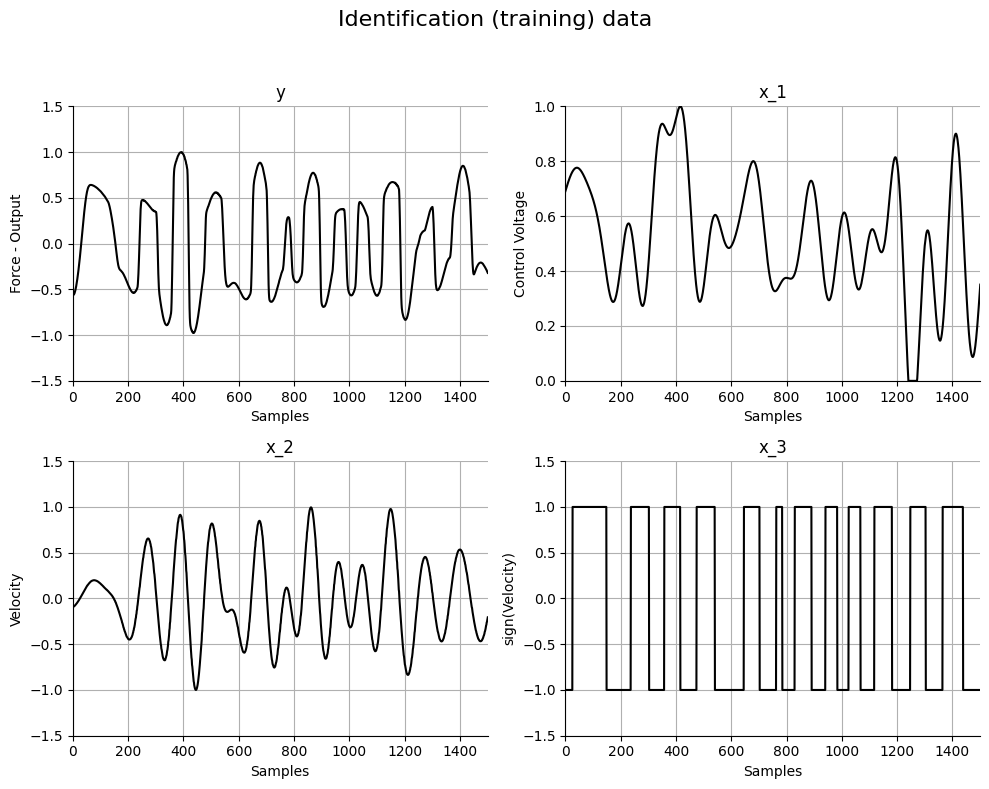
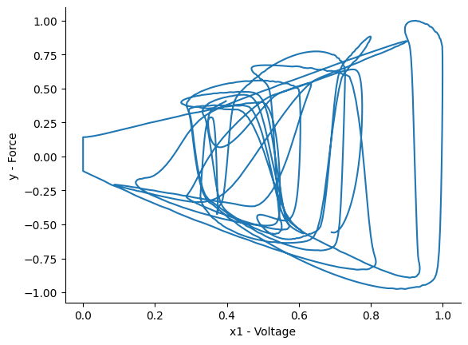
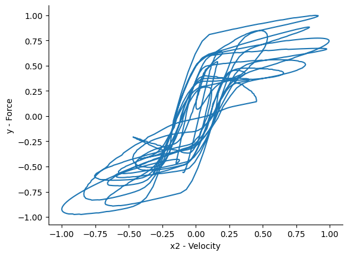
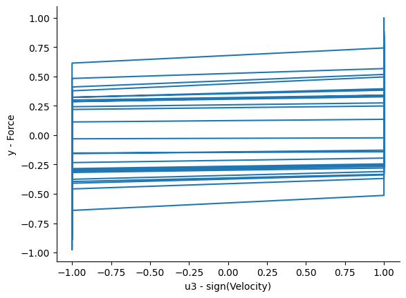
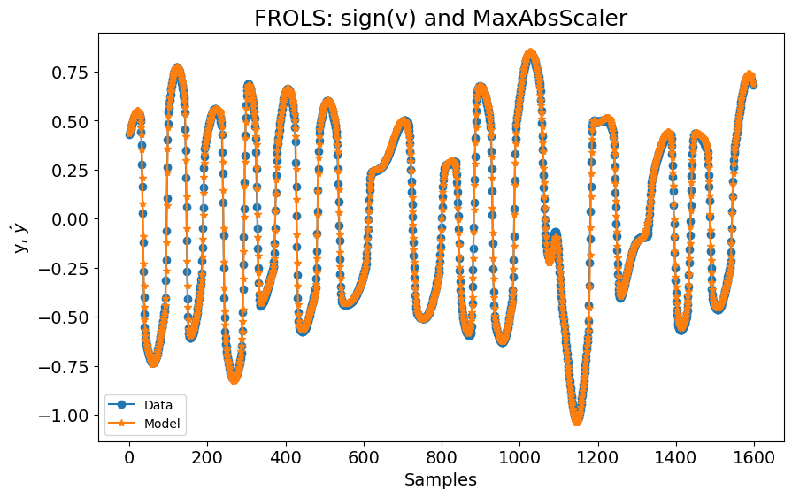
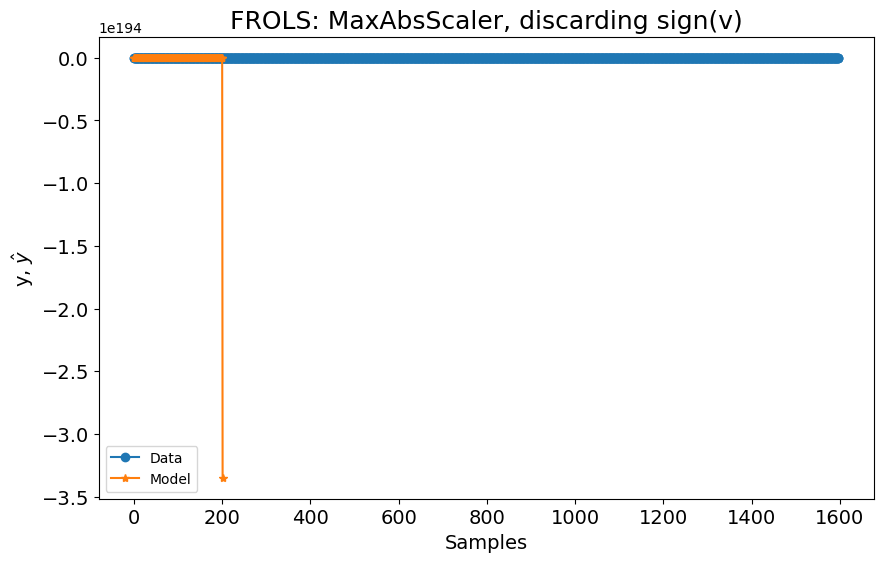
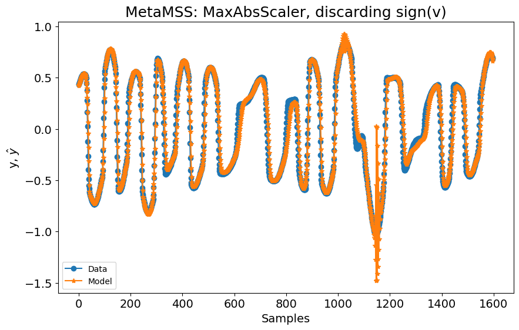
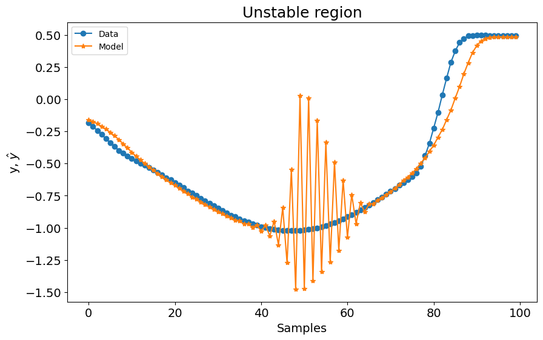
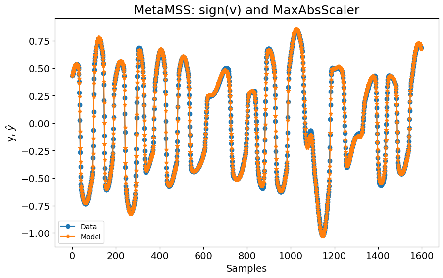
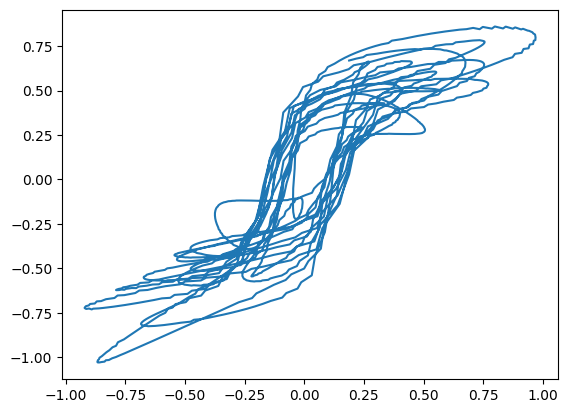

# Modelagem de um Dispositivo Amortecedor Magneto-Reológico

Nota: O exemplo mostrado neste notebook é retirado do livro complementar [Nonlinear System Identification and Forecasting: Theory and Practice with SysIdentPy](https://sysidentpy.org/book/0-Preface/).

Os efeitos de memória entre entrada e saída quase-estáticas tornam a modelagem de sistemas histeréticos muito difícil. Modelos baseados em física são frequentemente usados para descrever os loops de histerese, mas esses modelos geralmente carecem da simplicidade e eficiência requeridas em aplicações práticas envolvendo caracterização, identificação e controle de sistemas. Como detalhado em [Martins, S. A. M. and Aguirre, L. A. - Sufficient conditions for rate-independent hysteresis in autoregressive identified models](https://www.sciencedirect.com/science/article/abs/pii/S0888327015005968), modelos NARX provaram ser uma escolha viável para descrever os loops de histerese. Veja o Capítulo 8 para um background detalhado. No entanto, mesmo considerando as condições suficientes para representação de histerese independente de taxa, algoritmos clássicos de seleção de estrutura falham em retornar um modelo com desempenho decente e o usuário precisa definir uma função multi-valorada para garantir a ocorrência da estrutura limitante $\mathcal{H}$ ([Martins, S. A. M. and Aguirre, L. A. - Sufficient conditions for rate-independent hysteresis in autoregressive identified models](https://www.sciencedirect.com/science/article/abs/pii/S0888327015005968)).

Embora algum progresso tenha sido feito, trabalhos anteriores foram limitados a modelos com um único ponto de equilíbrio. O presente estudo de caso visa apresentar novas perspectivas na seleção de estrutura de modelos de sistemas histeréticos considerando os casos onde os modelos têm múltiplas entradas e não é restrito quanto ao número de pontos de equilíbrio. Para isso, o algoritmo MetaMSS será usado para construir um modelo para um amortecedor magneto-reológico (MRD) considerando as condições suficientes mencionadas.

### Uma Breve descrição do modelo Bouc-Wen de dispositivo amortecedor magneto-reológico

Os dados usados neste estudo de caso são do modelo Bouc-Wen ([Bouc, R - Forced Vibrations of a Mechanical System with Hysteresis](https://www.scirp.org/reference/referencespapers?referenceid=726819)), ([Wen, Y. X. - Method for Random Vibration of Hysteretic Systems](https://ascelibrary.org/doi/10.1061/JMCEA3.0002106)) de um MRD cujo diagrama esquemático é mostrado na figura abaixo.


> O modelo para um amortecedor magneto-reológico proposto por [Spencer, B. F. and Sain, M. K. - Controlling buildings: a new frontier in feedback](https://ieeexplore.ieee.org/document/642972).

A forma geral do modelo Bouc-Wen pode ser descrita como ([Spencer, B. F. and Sain, M. K. - Controlling buildings: a new frontier in feedback](https://ieeexplore.ieee.org/document/642972)):

$$
\begin{equation}
\dfrac{dz}{dt} = g\left[x,z,sign\left(\dfrac{dx}{dt}\right)\right]\dfrac{dx}{dt},
\end{equation}
$$

onde $z$ é a saída do modelo histerético, $x$ a entrada e $g[\cdot]$ uma função não linear de $x$, $z$ e $sign (dx/dt)$. ([Spencer, B. F. and Sain, M. K. - Controlling buildings: a new frontier in feedback](https://ieeexplore.ieee.org/document/642972)) propuseram o seguinte modelo fenomenológico para o dispositivo mencionado:

$$
\begin{align}
f&= c_1\dot{\rho}+k_1(x-x_0),\nonumber\\
\dot{\rho}&=\dfrac{1}{c_0+c_1}[\alpha z+c_0\dot{x}+k_0(x-\rho)],\nonumber\\
\dot{z}&=-\gamma|\dot{x}-\dot{\rho}|z|z|^{n-1}-\beta(\dot{x}-\dot{\rho})|z|^n+A(\dot{x}-\dot{\rho}),\nonumber\\
\alpha&=\alpha_a+\alpha_bu_{bw},\nonumber\\
c_1&=c_{1a}+c_{1b}u_{bw},\nonumber\\
c_0&=c_{0a}+c_{0b}u_{bw},\nonumber\\
\dot{u}_{bw}&=-\eta(u_{bw}-E).
\end{align}
$$

onde $f$ é a força de amortecimento, $c_1$ e $c_0$ representam os coeficientes viscosos, $E$ é a tensão de entrada, $x$ é o deslocamento e $\dot{x}$ é a velocidade do modelo. Os parâmetros do sistema (veja a tabela abaixo) foram retirados de [Leva, A. and Piroddi, L. - NARX-based technique for the modelling of magneto-rheological damping devices](https://iopscience.iop.org/article/10.1088/0964-1726/11/1/309).

| Parâmetro  | Valor          | Parâmetro | Valor        |
|------------|----------------|-----------|--------------|
| $c_{0_a}$  | $20.2 \, N \, s/cm$  | $\alpha_{a}$  | $44.9 \, N/cm$  |
| $c_{0_b}$  | $2.68 \, N \, s/cm \, V$ | $\alpha_{b}$  | $638 \, N/cm$   |
| $c_{1_a}$  | $350 \, N \, s/cm$   | $\gamma$      | $39.3 \, cm^{-2}$ |
| $c_{1_b}$  | $70.7 \, N \, s/cm \, V$  | $\beta$       | $39.3 \, cm^{-2}$ |
| $k_{0}$    | $15 \, N/cm$    | $n$           | $2$          |
| $k_{1}$    | $5.37 \, N/cm$   | $\eta$       | $251 \, s^{-1}$ |
| $x_{0}$    | $0 \, cm$      | $A$           | $47.2$       |

Para este estudo particular, tanto as entradas de deslocamento quanto de tensão, $x$ e $E$, respectivamente, foram geradas filtrando uma sequência de ruído gaussiano branco usando um filtro FIR Blackman-Harris com frequência de corte de $6$Hz. O tamanho do passo de integração foi definido como $h = 0.002$, seguindo os procedimentos descritos em [Martins, S. A. M. and Aguirre, L. A. - Sufficient conditions for rate-independent hysteresis in autoregressive identified models](https://www.sciencedirect.com/science/article/abs/pii/S0888327015005968). Estes procedimentos são apenas para fins de identificação, já que as entradas de um MRD podem ter várias características diferentes.

Os dados usados neste exemplo são fornecidos pelo Professor Samir Angelo Milani Martins.

Os desafios são:

- possui uma não linearidade com memória, ou seja, uma não linearidade dinâmica;
- a não linearidade é governada por uma variável interna z(t), que não é mensurável;
- a forma funcional não linear na equação de Bouc Wen é não linear no parâmetro;
- a forma funcional não linear na equação de Bouc Wen não admite uma expansão de série de Taylor finita devido à presença de valores absolutos

### Pacotes Necessários e Versões

Para garantir que você possa replicar este estudo de caso, é essencial usar versões específicas dos pacotes necessários. Abaixo está uma lista dos pacotes junto com suas respectivas versões necessárias para executar os estudos de caso efetivamente.

Para instalar todos os pacotes necessários, você pode criar um arquivo `requirements.txt` com o seguinte conteúdo:

```
sysidentpy==0.4.0
pandas==2.2.2
numpy==1.26.0
matplotlib==3.8.4
scikit-learn==1.4.2
```

Então, instale os pacotes usando:
```
pip install -r requirements.txt
```

- Certifique-se de usar um ambiente virtual para evitar conflitos entre versões de pacotes.
- As versões especificadas são baseadas na compatibilidade com os exemplos de código fornecidos. Se você estiver usando versões diferentes, alguns ajustes no código podem ser necessários.

### Configuração do SysIdentPy


```python
import numpy as np
from sklearn.preprocessing import MaxAbsScaler, MinMaxScaler
import pandas as pd
import matplotlib.pyplot as plt

from sysidentpy.model_structure_selection import FROLS
from sysidentpy.basis_function import Polynomial
from sysidentpy.utils.display_results import results
from sysidentpy.parameter_estimation import LeastSquares
from sysidentpy.metrics import root_relative_squared_error
from sysidentpy.utils.plotting import plot_results

df = pd.read_csv(
    "https://raw.githubusercontent.com/wilsonrljr/sysidentpy-data/refs/heads/main/datasets/bouc_wen/boucwen_histeretic_system.csv"
)
scaler_x = MaxAbsScaler()
scaler_y = MaxAbsScaler()

init = 400
x_train = df[["E", "v"]].iloc[init : df.shape[0] // 2, :]
x_train["sign_v"] = np.sign(df["v"])
x_train = scaler_x.fit_transform(x_train)

x_test = df[["E", "v"]].iloc[df.shape[0] // 2 + 1 : df.shape[0] - init, :]
x_test["sign_v"] = np.sign(df["v"])
x_test = scaler_x.transform(x_test)

y_train = df[["f"]].iloc[init : df.shape[0] // 2, :].values.reshape(-1, 1)
y_train = scaler_y.fit_transform(y_train)

y_test = (
    df[["f"]].iloc[df.shape[0] // 2 + 1 : df.shape[0] - init, :].values.reshape(-1, 1)
)
y_test = scaler_y.transform(y_test)

# Plotando os dados
plt.figure(figsize=(10, 8))
plt.suptitle("Dados de identificação (treinamento)", fontsize=16)

plt.subplot(221)
plt.plot(y_train, "k")
plt.ylabel("Força - Saída")
plt.xlabel("Amostras")
plt.title("y")
plt.grid()
plt.axis([0, 1500, -1.5, 1.5])

plt.subplot(222)
plt.plot(x_train[:, 0], "k")
plt.ylabel("Tensão de Controle")
plt.xlabel("Amostras")
plt.title("x_1")
plt.grid()
plt.axis([0, 1500, 0, 1])

plt.subplot(223)
plt.plot(x_train[:, 1], "k")
plt.ylabel("Velocidade")
plt.xlabel("Amostras")
plt.title("x_2")
plt.grid()
plt.axis([0, 1500, -1.5, 1.5])

plt.subplot(224)
plt.plot(x_train[:, 2], "k")
plt.ylabel("sign(Velocidade)")
plt.xlabel("Amostras")
plt.title("x_3")
plt.grid()
plt.axis([0, 1500, -1.5, 1.5])

plt.tight_layout(rect=[0, 0, 1, 0.95])
plt.show()
```


    

    


Vamos verificar como é o comportamento histerético considerando cada entrada:


```python
plt.figure()
plt.plot(x_train[:, 0], y_train)
plt.xlabel("x1 - Tensão")
plt.ylabel("y - Força")

plt.figure()
plt.plot(x_train[:, 1], y_train)
plt.xlabel("x2 - Velocidade")
plt.ylabel("y - Força")

plt.figure()
plt.plot(x_train[:, 2], y_train)
plt.xlabel("u3 - sign(Velocidade)")
plt.ylabel("y - Força")
```


    Text(0, 0.5, 'y - Força')


    

    


    

    


    

    


Agora, podemos simplesmente construir um modelo NARX:


```python
basis_function = Polynomial(degree=3)
model = FROLS(
    xlag=[[1], [1], [1]],
    ylag=1,
    basis_function=basis_function,
    estimator=LeastSquares(),
    info_criteria="aic",
)

model.fit(X=x_train, y=y_train)
yhat = model.predict(X=x_test, y=y_test[: model.max_lag :, :])
rrse = root_relative_squared_error(y_test[model.max_lag :], yhat[model.max_lag :])
print(rrse)
plot_results(
    y=y_test[model.max_lag :],
    yhat=yhat[model.max_lag :],
    n=10000,
    title="FROLS: sign(v) e MaxAbsScaler",
)
```

    0.04510435472905795


    

    


Se removermos a entrada `sign(v)` e tentarmos construir um modelo NARX usando a mesma configuração, o modelo diverge, como pode ser visto na figura a seguir:


```python
basis_function = Polynomial(degree=3)
model = FROLS(
    xlag=[[1], [1]],
    ylag=1,
    basis_function=basis_function,
    estimator=LeastSquares(),
    info_criteria="aic",
)

model.fit(X=x_train[:, :2], y=y_train)
yhat = model.predict(X=x_test[:, :2], y=y_test[: model.max_lag :, :])
rrse = root_relative_squared_error(y_test[model.max_lag :], yhat[model.max_lag :])
print(rrse)
plot_results(
    y=y_test[model.max_lag :],
    yhat=yhat[model.max_lag :],
    n=10000,
    title="FROLS: MaxAbsScaler, descartando sign(v)",
)
```

    nan


    c:\Users\wilso\miniconda3\envs\sysidentpyv04\Lib\site-packages\sysidentpy\narmax_base.py:724: RuntimeWarning: overflow encountered in power
      regressor_value[j] = np.prod(np.power(raw_regressor, model_exponent))
    c:\Users\wilso\miniconda3\envs\sysidentpyv04\Lib\site-packages\sysidentpy\metrics\_regression.py:216: RuntimeWarning: overflow encountered in square
      numerator = np.sum(np.square((yhat - y)))


    

    


Se usarmos o algoritmo `MetaMSS` em vez disso, os resultados são melhores.


```python
from sysidentpy.model_structure_selection import MetaMSS

basis_function = Polynomial(degree=3)
model = MetaMSS(
    xlag=[[1], [1]],
    ylag=1,
    basis_function=basis_function,
    estimator=LeastSquares(),
    random_state=42,
)

model.fit(X=x_train[:, :2], y=y_train)
yhat = model.predict(X=x_test[:, :2], y=y_test[: model.max_lag :, :])
rrse = root_relative_squared_error(y_test[model.max_lag :], yhat[model.max_lag :])
print(rrse)
plot_results(
    y=y_test[model.max_lag :],
    yhat=yhat[model.max_lag :],
    n=10000,
    title="MetaMSS: MaxAbsScaler, descartando sign(v)",
)
```

    c:\Users\wilso\miniconda3\envs\sysidentpyv04\Lib\site-packages\sysidentpy\narmax_base.py:724: RuntimeWarning: overflow encountered in power
      regressor_value[j] = np.prod(np.power(raw_regressor, model_exponent))
    c:\Users\wilso\miniconda3\envs\sysidentpyv04\Lib\site-packages\sysidentpy\model_structure_selection\meta_model_structure_selection.py:453: RuntimeWarning: overflow encountered in square
      sum_of_squared_residues = np.sum(residues**2)
    c:\Users\wilso\miniconda3\envs\sysidentpyv04\Lib\site-packages\sysidentpy\metrics\_regression.py:216: RuntimeWarning: overflow encountered in square
      numerator = np.sum(np.square((yhat - y)))
    c:\Users\wilso\miniconda3\envs\sysidentpyv04\Lib\site-packages\numpy\linalg\linalg.py:2590: RuntimeWarning: divide by zero encountered in power
      absx **= ord
    c:\Users\wilso\miniconda3\envs\sysidentpyv04\Lib\site-packages\numpy\core\fromnumeric.py:88: RuntimeWarning: invalid value encountered in reduce
      return ufunc.reduce(obj, axis, dtype, out, **passkwargs)


    0.24685651932553157


    

    


No entanto, quando a saída do sistema atinge seu valor mínimo, o modelo oscila


```python
plot_results(
    y=y_test[1100:1200], yhat=yhat[1100:1200], n=10000, title="Região instável"
)
```


    

    


Se adicionarmos a entrada `sign(v)` novamente e usarmos `MetaMSS`, os resultados são muito próximos do algoritmo `FROLS` com todas as entradas


```python
basis_function = Polynomial(degree=3)
model = MetaMSS(
    xlag=[[1], [1], [1]],
    ylag=1,
    basis_function=basis_function,
    estimator=LeastSquares(),
    random_state=42,
)

model.fit(X=x_train, y=y_train)
yhat = model.predict(X=x_test, y=y_test[: model.max_lag :, :])
rrse = root_relative_squared_error(y_test[model.max_lag :], yhat[model.max_lag :])
print(rrse)
plot_results(
    y=y_test[model.max_lag :],
    yhat=yhat[model.max_lag :],
    n=10000,
    title="MetaMSS: sign(v) e MaxAbsScaler",
)
```

    c:\Users\wilso\miniconda3\envs\sysidentpyv04\Lib\site-packages\sysidentpy\parameter_estimation\estimators.py:75: UserWarning: Psi matrix might have linearly dependent rows.Be careful and check your data
      self._check_linear_dependence_rows(psi)
    c:\Users\wilso\miniconda3\envs\sysidentpyv04\Lib\site-packages\sysidentpy\narmax_base.py:724: RuntimeWarning: overflow encountered in power
      regressor_value[j] = np.prod(np.power(raw_regressor, model_exponent))
    c:\Users\wilso\miniconda3\envs\sysidentpyv04\Lib\site-packages\sysidentpy\model_structure_selection\meta_model_structure_selection.py:453: RuntimeWarning: overflow encountered in square
      sum_of_squared_residues = np.sum(residues**2)
    c:\Users\wilso\miniconda3\envs\sysidentpyv04\Lib\site-packages\numpy\linalg\linalg.py:2590: RuntimeWarning: divide by zero encountered in power
      absx **= ord


    0.055422497807759194


    

    


Este caso também destacará a importância do escalonamento de dados. Anteriormente, usamos o método `MaxAbsScaler`, que resultou em ótimos modelos ao usar as entradas `sign(v)`, mas também resultou em modelos instáveis ao remover essa feature de entrada. Quando o escalonamento é aplicado usando `MinMaxScaler`, no entanto, a estabilidade geral dos resultados melhora, e o modelo não diverge, mesmo quando a entrada `sign(v)` é removida, usando o algoritmo `FROLS`.

O usuário pode obter os resultados abaixo apenas alterando o método de escalonamento de dados usando


```python
scaler_x = MinMaxScaler()
scaler_y = MinMaxScaler()
```

e executando cada modelo novamente. Essa é a única mudança para melhorar os resultados.


> FROLS: com `sign(v)` e `MinMaxScaler`. RMSE: 0.1159


FROLS: descartando `sign(v)` e usando `MinMaxScaler`. RMSE: 0.1639


> MetaMSS: descartando `sign(v)` e usando `MinMaxScaler`. RMSE: 0.1762


> MetaMSS: incluindo `sign(v)` e usando `MinMaxScaler`. RMSE: 0.0694

Em contraste, o método MetaMSS retornou o melhor modelo geral, mas não melhor que o melhor método `FROLS` usando `MaxAbsScaler`.

Aqui está o loop histerético predito:


```python
plt.plot(x_test[:, 1], yhat)
```


    [<matplotlib.lines.Line2D at 0x225ff4f8b00>]


    

    
