# Estimação Multiobjetivo de Parâmetros - Visão Geral

Exemplo criado por Gabriel Bueno Leandro, Samir Milani Martins e Wilson Rocha Lacerda Junior

> **Procurando mais detalhes sobre modelos NARMAX?**
> Para informações abrangentes sobre modelos, métodos e uma grande variedade de exemplos e benchmarks implementados no SysIdentPy, confira nosso livro:
> [*Nonlinear System Identification and Forecasting: Theory and Practice With SysIdentPy*](https://sysidentpy.org/book/0%20-%20Preface/)
>
> Este livro oferece uma orientação aprofundada para apoiar o seu trabalho com o SysIdentPy.

A estimação multiobjetivo de parâmetros representa uma mudança de paradigma fundamental na forma como abordamos o problema de ajuste de parâmetros para modelos NARMAX. Em vez de buscar um único conjunto de valores de parâmetros que ajuste o modelo de forma ótima aos dados, abordagens multiobjetivo visam identificar um conjunto de soluções de parâmetros, conhecido como frente de Pareto, que fornece um compromisso entre objetivos conflitantes. Esses objetivos frequentemente abrangem um espectro de critérios de desempenho do modelo, como qualidade de ajuste, complexidade do modelo e robustez.

## Referência

**Para mais informações, consulte a referência: https://doi.org/10.1080/00207170601185053**.


## Caso de uso: Conversor Buck

<div style="text-align: justify"> Um conversor buck é um tipo de conversor CC/CC que reduz a tensão (enquanto aumenta a corrente) de sua entrada (fonte) para sua saída (carga). Ele é semelhante a um conversor boost (elevador) e é um tipo de fonte de alimentação chaveada (SMPS) que tipicamente contém pelo menos dois semicondutores (um diodo e um transistor, embora conversores buck modernos substituam o diodo por um segundo transistor usado para retificação síncrona) e pelo menos um elemento de armazenamento de energia, um capacitor, um indutor ou ambos combinados. </div>


```python
import numpy as np
import matplotlib.pyplot as plt
import pandas as pd
from sysidentpy.model_structure_selection import FROLS
from sysidentpy.multiobjective_parameter_estimation import AILS
from sysidentpy.basis_function import Polynomial
from sysidentpy.parameter_estimation import LeastSquares
from sysidentpy.utils.display_results import results
from sysidentpy.utils.plotting import plot_results
from sysidentpy.metrics import root_relative_squared_error
from sysidentpy.utils.narmax_tools import set_weights
```

## Comportamento Dinâmico


```python
df_train = pd.read_csv(
    r"https://raw.githubusercontent.com/wilsonrljr/sysidentpy-data/refs/heads/main/datasets/buck/buck_id.csv"
)
df_valid = pd.read_csv(
    r"https://raw.githubusercontent.com/wilsonrljr/sysidentpy-data/refs/heads/main/datasets/buck/buck_valid.csv"
)

# Plotando a saída medida (dados de identificação e validação)
plt.figure(1)
plt.title("Output")
plt.plot(df_train.sampling_time, df_train.y, label="Identification", linewidth=1.5)
plt.plot(df_valid.sampling_time, df_valid.y, label="Validation", linewidth=1.5)
plt.xlabel("Samples")
plt.ylabel("Voltage")
plt.legend()
plt.show()
```


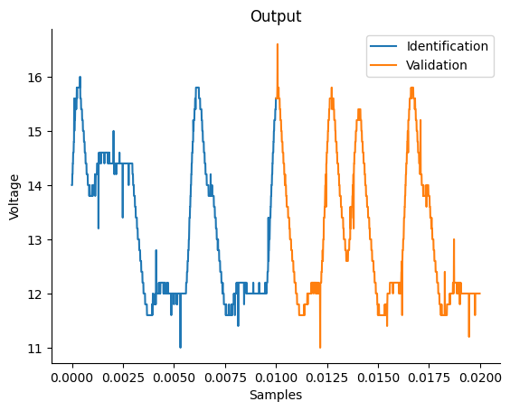


```python
# Plotando a entrada medida (dados de identificação e validação)
plt.figure(2)
plt.title("Input")
plt.plot(df_train.sampling_time, df_train.input, label="Identification", linewidth=1.5)
plt.plot(df_valid.sampling_time, df_valid.input, label="Validation", linewidth=1.5)
plt.ylim(2.1, 2.6)
plt.ylabel("u")
plt.xlabel("Samples")
plt.legend()
plt.show()
```


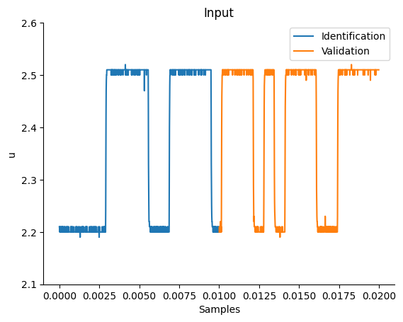


## Função Estática do Conversor Buck

O ciclo de trabalho, representado pelo símbolo $D$, é definido como a razão entre o tempo em que o sistema permanece ligado ($T_{on}$) e o tempo total do ciclo de operação ($T$). Matematicamente, isso pode ser expresso como $D=\frac{T_{on}}{T}$. O complemento do ciclo de trabalho, representado por $D'$, é definido como a razão entre o tempo em que o sistema permanece desligado ($T_{off}$) e o tempo total do ciclo de operação ($T$), podendo ser expresso como $D'=\frac{T_{off}}{T}$.

A tensão de carga ($V_o$) está relacionada à tensão da fonte ($V_d$) pela equação $V_o = D\cdot V_d = (1 - D')\cdot V_d$. Para este conversor em particular, sabe-se que $D' = \frac{\bar{u} - 1}{3}$, o que significa que a função estática deste sistema pode ser derivada teoricamente como:

$V_o = \frac{4V_d}{3} - \frac{V_d}{3}\cdot \bar{u}$

Se assumirmos que a tensão da fonte $V_d$ é igual a 24 V, podemos reescrever a expressão acima como:

$V_o = (4 - \bar{u})\cdot 8$


```python
# Dados estáticos
Vd = 24
Uo = np.linspace(0, 4, 50)
Yo = (4 - Uo) * Vd / 3
Uo = Uo.reshape(-1, 1)
Yo = Yo.reshape(-1, 1)
plt.figure(3)
plt.title("Buck Converter Static Curve")
plt.xlabel("$\\bar{u}$")
plt.ylabel("$\\bar{y}$")
plt.plot(Uo, Yo, linewidth=1.5, linestyle="-", marker="o")
plt.show()
```


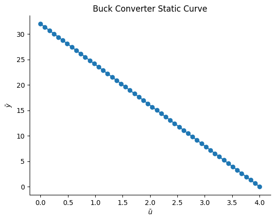


## Ganho Estático do Conversor Buck

O ganho de um conversor Buck é uma medida de como sua tensão de saída varia em resposta a alterações na tensão de entrada. Matematicamente, o ganho pode ser calculado como a derivada da função estática do conversor, que descreve a relação entre suas tensões de entrada e saída.

Neste caso, a função estática do conversor Buck é dada pela equação:

$V_o = (4 - \bar{u})\cdot 8$

Tomando a derivada dessa equação em relação a $\hat{u}$, obtemos que o ganho do conversor Buck é igual a −8. Em outras palavras, para cada unidade de aumento na tensão de entrada $\hat{u}$, a tensão de saída $V_o$ diminuirá em 8 unidades.

Assim, $gain = V_o' = -8$.


```python
# Definindo o ganho
gain = -8 * np.ones(len(Uo)).reshape(-1, 1)
plt.figure(3)
plt.title("Buck Converter Static Gain")
plt.xlabel("$\\bar{u}$")
plt.ylabel("$\\bar{gain}$")
plt.plot(Uo, gain, linewidth=1.5, label="gain", linestyle="-", marker="o")
plt.legend()
plt.show()
```


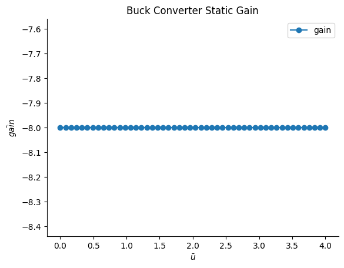


## Construindo um modelo dinâmico usando a abordagem mono-objetivo


```python
x_train = df_train.input.values.reshape(-1, 1)
y_train = df_train.y.values.reshape(-1, 1)
x_valid = df_valid.input.values.reshape(-1, 1)
y_valid = df_valid.y.values.reshape(-1, 1)

basis_function = Polynomial(degree=2)
estimator = LeastSquares()
model = FROLS(
    order_selection=True,
    n_info_values=8,
    ylag=2,
    xlag=2,
    info_criteria="aic",
    estimator=estimator,
    basis_function=basis_function,
)

model.fit(X=x_train, y=y_train)
```


## Algoritmo Affine Information Least Squares (AILS)

O AILS é um algoritmo de estimação multiobjetivo de parâmetros, baseado em um conjunto de pares de informação afim. A abordagem multiobjetivo proposta no artigo mencionado e implementada no SysIdentPy leva a um problema de otimização multiobjetivo convexo, que pode ser resolvido pelo AILS. O AILS é um esquema do tipo LeastSquares, não iterativo, para encontrar as soluções de conjunto de Pareto para o problema multiobjetivo.

Assim, com a estrutura do modelo definida (usaremos a obtida acima com os dados dinâmicos), é possível estimar os parâmetros utilizando a abordagem multiobjetivo.

As informações sobre função estática e ganho estático, além dos habituais dados dinâmicos de entrada/saída, podem ser usadas para construir o par de informações afins para estimar os parâmetros do modelo. Podemos modelar a função de custo como:

$$
\gamma(\hat\theta) = w_1\cdot J_{LS}(\hat{\theta}) + w_2\cdot J_{SF}(\hat{\theta}) + w_3\cdot J_{SG}(\hat{\theta})
$$


## Estimação multiobjetivo de parâmetros considerando 3 objetivos diferentes: erro de predição, função estática e ganho estático


```python
# você pode usar qualquer estrutura de modelo no seu caso de uso, mas neste notebook usaremos a obtida acima para comparar com outros trabalhos
mo_estimator = AILS(final_model=model.final_model)

# definindo os pesos (log-spaced) de cada função objetivo
w = set_weights(static_function=True, static_gain=True)

# você também pode usar algo como

# w = np.array(
#     [
#         [0.98, 0.7, 0.5, 0.35, 0.25, 0.01, 0.15, 0.01],
#         [0.01, 0.1, 0.3, 0.15, 0.25, 0.98, 0.35, 0.01],
#         [0.01, 0.2, 0.2, 0.50, 0.50, 0.01, 0.50, 0.98],
#     ]
# )

# para definir os pesos. Cada linha corresponde a cada objetivo
```

O AILS possui um método `estimate` que retorna as funções custo (J), a norma Euclidiana das funções custo (E), os parâmetros estimados referentes a cada combinação de pesos (theta), a matriz de regressores do ganho e da função estática HR e QR, respectivamente.


```python
J, E, theta, HR, QR, position = mo_estimator.estimate(
    X=x_train, y=y_train, gain=gain, y_static=Yo, X_static=Uo, weighing_matrix=w
)
result = {
    "w1": w[0, :],
    "w2": w[2, :],
    "w3": w[1, :],
    "J_ls": J[0, :],
    "J_sg": J[1, :],
    "J_sf": J[2, :],
    "||J||:": E,
}
pd.DataFrame(result)
```


Agora podemos definir $\theta$ associado a qualquer combinação de pesos.


```python
model.theta = theta[-1, :].reshape(
    -1, 1
)  # definindo o theta estimado para a última combinação de pesos
# a estrutura do modelo é exatamente a mesma, mas a ordem dos regressores é alterada no método estimate. Por isso você precisa alterar o model.final_model
model.final_model = mo_estimator.final_model
yhat = model.predict(X=x_valid, y=y_valid)
rrse = root_relative_squared_error(y_valid, yhat)
r = pd.DataFrame(
    results(
        model.final_model,
        model.theta,
        model.err,
        model.n_terms,
        err_precision=3,
        dtype="sci",
    ),
    columns=["Regressors", "Parameters", "ERR"],
)
r
```


### Os resultados dinâmicos para esse $\theta$ escolhido são


```python
plot_results(y=y_valid, yhat=yhat, n=1000)
```


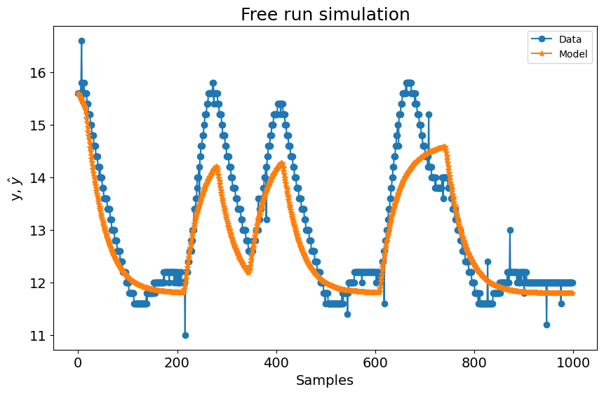


### O resultado do ganho estático é


```python
plt.figure(4)
plt.title("Gain")
plt.plot(
    Uo,
    gain,
    linewidth=1.5,
    linestyle="-",
    marker="o",
    label="Buck converter static gain",
)
plt.plot(
    Uo,
    HR.dot(model.theta),
    linestyle="-",
    marker="^",
    linewidth=1.5,
    label="NARX model gain",
)
plt.xlabel("$\\bar{u}$")
plt.ylabel("$\\bar{g}$")
plt.ylim(-16, 0)
plt.legend()
plt.show()
```


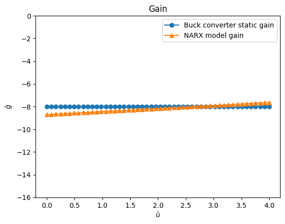


### O resultado da função estática é


```python
plt.figure(5)
plt.title("Static Curve")
plt.plot(Uo, Yo, linewidth=1.5, label="Static curve", linestyle="-", marker="o")
plt.plot(
    Uo,
    QR.dot(model.theta),
    linewidth=1.5,
    label="NARX \u200b\u200bstatic representation",
    linestyle="-",
    marker="^",
)
plt.xlabel("$\\bar{u}$")
plt.xlabel("$\\bar{y}$")
plt.legend()
plt.show()
```


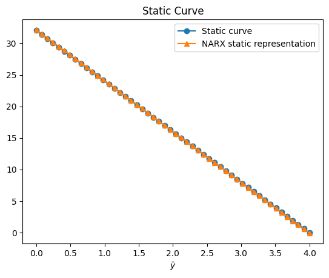


## Obtendo a melhor combinação de pesos com base na norma da função de custo


```python
# a variável `position` retornada no método `estimate` fornece a posição da melhor combinação de pesos
model.theta = theta[position, :].reshape(
    -1, 1
)  # definindo o theta estimado para a melhor combinação de pesos
# a estrutura do modelo é exatamente a mesma, mas a ordem dos regressores é alterada no método estimate. Por isso você precisa alterar o model.final_model
model.final_model = mo_estimator.final_model
yhat = model.predict(X=x_valid, y=y_valid)
rrse = root_relative_squared_error(y_valid, yhat)
r = pd.DataFrame(
    results(
        model.final_model,
        model.theta,
        model.err,
        model.n_terms,
        err_precision=3,
        dtype="sci",
    ),
    columns=["Regressors", "Parameters", "ERR"],
)
print(r)

# Resultados dinâmicos para esse theta escolhido
plot_results(y=y_valid, yhat=yhat, n=1000)
# Resultado do ganho estático
plt.figure(4)
plt.title("Gain")
plt.plot(
    Uo,
    gain,
    linewidth=1.5,
    linestyle="-",
    marker="o",
    label="Buck converter static gain",
)
plt.plot(
    Uo,
    HR.dot(model.theta),
    linestyle="-",
    marker="^",
    linewidth=1.5,
    label="NARX model gain",
)
plt.xlabel("$\\bar{u}$")
plt.ylabel("$\\bar{g}$")
plt.ylim(-16, 0)
plt.legend()
plt.show()
# Resultado da função estática
plt.figure(5)
plt.title("Static Curve")
plt.plot(Uo, Yo, linewidth=1.5, label="Static curve", linestyle="-", marker="o")
plt.plot(
    Uo,
    QR.dot(model.theta),
    linewidth=1.5,
    label="NARX \u200b\u200bstatic representation",
    linestyle="-",
    marker="^",
)
plt.xlabel("$\\bar{u}$")
plt.xlabel("$\\bar{y}$")
plt.legend()
plt.show()
```


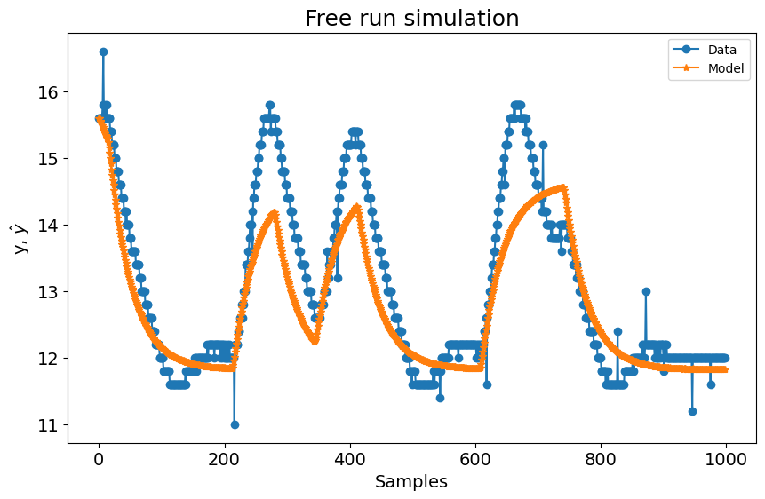


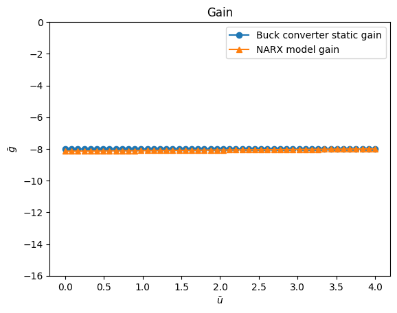


Você também pode plotar as soluções de Pareto-set


```python
plt.figure(6)
ax = plt.axes(projection="3d")
ax.plot3D(J[0, :], J[1, :], J[2, :], "o", linewidth=0.1)
ax.set_title("Pareto-set solutions", fontsize=15)
ax.set_xlabel("$J_{ls}$", fontsize=10)
ax.set_ylabel("$J_{sg}$", fontsize=10)
ax.set_zlabel("$J_{sf}$", fontsize=10)
plt.show()
```


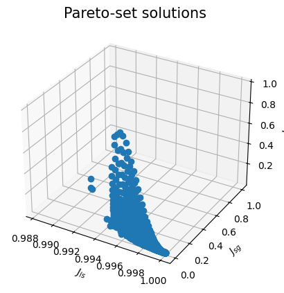


## Detalhando o AILS

O modelo NARX polinomial construído usando a abordagem mono-objetivo possui a seguinte estrutura:

$$
y(k) = \theta_1 y(k-1) + \theta_2 y(k-2) + \theta_3 u(k-1) y(k-1) + \theta_4 + \theta_5 y(k-1)^2 + \theta_6 u(k-1) + \theta_7 y(k-2)y(k-1) + \theta_8 y(k-2)^2
$$

O objetivo ao usar a informação de função estática e ganho estático no cenário multiobjetivo é estimar o vetor $\hat{\theta}$ com base em:

$$
\theta = [w_1\Psi^T\Psi + w_2(HR)^T(HR) + w_3(QR)(QR)^T]^{-1} [w_1\Psi^T y + w_2(HR)^T\overline{g}+w_3(QR)^T\overline{y}]
$$

A matriz $\Psi$ é construída usando a abordagem usual de modelagem dinâmica mono-objetivo no SysIdentPy. Entretanto, ainda é necessário encontrar as matrizes Q, H e R. O AILS possui métodos para calcular todas essas matrizes. Basicamente, para isso, $q_i^T$ é primeiro estimado:

$$
q_i^T =
\begin{bmatrix}
1 & \overline{y_i} & \overline{u_1} & \overline{y_i}^2 & \cdots & \overline{y_i}^l &  F_{yu} & \overline{u_i}^2 & \cdots & \overline{u_i}^l
\end{bmatrix}
$$

onde $F_{yu}$ representa todos os monômios não lineares no modelo que estão relacionados a $y(k)$ e $u(k)$, e $l$ é o maior grau de não linearidade no modelo para termos de entrada e saída. Para um modelo com grau de não linearidade igual a 2, podemos obter:

$$
q_i^T = 
\begin{bmatrix}
1 & \overline{y_i} & \overline{u_i} & \overline{y_i}^2 & \overline{u_i}\:\overline{y_i} & \overline{u_i}^2 
\end{bmatrix}
$$

É possível codificar a matriz $q_i^T$ de forma que ela siga a codificação de modelo definida no SysIdentPy. Para isso, 0 é considerado como constante, $y_i$ igual a 1 e $u_i$ igual a 2. O número de colunas indica o grau de não linearidade do sistema e o número de linhas reflete o número de termos:

$$
q_i = 
\begin{bmatrix}
0 & 0\\
1 & 0\\
2 & 0\\
1 & 1\\
2 & 1\\
2 & 2\\
\end{bmatrix}
= 
\begin{bmatrix}
1 \\
\overline{y_i}\\
\overline{u_i}\\
\overline{y_i}^2\\
\overline{u_i}\:\overline{y_i}\\
\overline{u_i}^2\\
\end{bmatrix}
$$

Por fim, o resultado pode ser facilmente obtido usando o método `regressor_space` do SysIdentPy.


```python
from sysidentpy.narmax_base import RegressorDictionary

object_qit = RegressorDictionary(xlag=1, ylag=1)
R_example = object_qit.regressor_space(n_inputs=1) // 1000
print(f"R = {R_example}")
```

assim:

$$
\overline{y_i} = q_i^T R\theta
$$

e:

$$
\overline{g_i} = H R\theta
$$

onde $R$ é o mapeamento linear dos regressores estáticos representados por $q_i^T$. Além disso, a matriz $H$ contém informação afim relativa a $\overline{g_i}$, que é igual a $\overline{g_i} = \frac{d\overline{y}}{d\overline{u}}{\big |}_{(\overline{u_i}\:\overline{y_i})}$.

A partir de agora, começaremos a aplicar a estimação de parâmetros de forma multiobjetivo. Isso será feito tendo em mente o modelo NARX polinomial do conversor BUCK. Nesse contexto, $q_i^T$ será genérico e assumirá um formato específico para o problema em questão. Para essa tarefa, será usado o método `R_qit`, cujo objetivo é retornar o $q_i^T$ relacionado ao modelo e a matriz de mapeamento linear $R$:


```python
R, qit = mo_estimator.build_linear_mapping()
print("R matrix:")
print(R)
print("qit matrix:")
print(qit)
```

Assim,

$$
q_i = 
\begin{bmatrix}
0 & 0\\
1 & 0\\
2 & 0\\
1 & 1\\
2 & 1\\ 
\end{bmatrix}
= 
\begin{bmatrix}
1\\
\overline{y}\\
\overline{u}\\
\overline{y^2}\\
\overline{u}\:\overline{y}\\ 
\end{bmatrix}
$$

Você pode notar que o método produz saídas consistentes com o esperado:

$$
y(k) = \theta_1 y(k-1) + \theta_2 y(k-2) + \theta_3 u(k-1) y(k-1) + \theta_4 + \theta_5 y(k-1)^2 + \theta_6 u(k-1) + \theta_7 y(k-2)y(k-1) + \theta_8 y(k-2)^2
$$

e:

$$
R = 
\begin{bmatrix}
term/\theta & \theta_1 & \theta_2 & \theta_3 & \theta_4 & \theta_5 & \theta_6 & \theta_7 & \theta_8\\
1 & 0 & 0 & 0 & 1 & 0 & 0 & 0 & 0\\
\overline{y} & 1 & 1 & 0 & 0 & 0 & 0 & 0 & 0\\
\overline{u} & 0 & 0 & 0 & 0 & 0 & 1 & 0 & 0\\
\overline{y^2} & 0 & 0 & 0 & 0 & 1 & 0 & 1 & 1\\
\overline{y}\:\overline{u} & 0 & 0 & 1 & 0 & 0 & 0 & 0 & 0\\
\end{bmatrix}
$$

## Validação

A seguinte estrutura de modelo será usada para validar a abordagem:

$$
y(k) = \theta_1 y(k-1) + \theta_2 y(k-2) + \theta_3 + \theta_4 u(k-1) + \theta_5 u(k-1)^2 + \theta_6 u(k-2)u(k-1)+\theta_7 u(k-2) + \theta_8 u(k-2)^2
$$

$$
\therefore
$$

$$
final\_model = 
\begin{bmatrix}
1001 & 0\\
1002 & 0\\
0 & 0\\
2001 & 0\\
2001 & 2001\\
2002 & 2001\\
2002 & 0\\
2002 & 2002
\end{bmatrix}
$$

Definindo em código:


```python
final_model = np.array(
    [
        [1001, 0],
        [1002, 0],
        [0, 0],
        [2001, 0],
        [2001, 2001],
        [2002, 2001],
        [2002, 0],
        [2002, 2002],
    ]
)
final_model
```


```python
mult2 = AILS(final_model=final_model)
```


```python
def psi(X, Y):
    PSI = np.zeros((len(X), 8))
    for k in range(2, len(Y)):
        PSI[k, 0] = Y[k - 1]
        PSI[k, 1] = Y[k - 2]
        PSI[k, 2] = 1
        PSI[k, 3] = X[k - 1]
        PSI[k, 4] = X[k - 1] ** 2
        PSI[k, 5] = X[k - 2] * X[k - 1]
        PSI[k, 6] = X[k - 2]
        PSI[k, 7] = X[k - 2] ** 2
    return np.delete(PSI, [0, 1], axis=0)
```

O valor de $\theta$ com o menor erro quadrático médio obtido com o mesmo código implementado em Scilab foi:

$$
W_{LS} = 0.3612343
$$

e:

$$
W_{SG} = 0.3548699
$$

e:

$$
W_{SF} = 0.3548699
$$


```python
PSI = psi(x_train, y_train)
w = np.array([[0.3612343], [0.2838959], [0.3548699]])
```


```python
J, E, theta, HR, QR, position = mult2.estimate(
    y=y_train, X=x_train, gain=gain, y_static=Yo, X_static=Uo, weighing_matrix=w
)
result = {
    "w1": w[0, :],
    "w2": w[2, :],
    "w3": w[1, :],
    "J_ls": J[0, :],
    "J_sg": J[1, :],
    "J_sf": J[2, :],
    "||J||:": E,
}
# a ordem dos pesos é diferente por causa da forma como implementamos em Python, mas os resultados são muito próximos, como esperado
pd.DataFrame(result)
```


Resultados dinâmicos


```python
model.theta = theta[position, :].reshape(-1, 1)
model.final_model = mult2.final_model
yhat = model.predict(X=x_valid, y=y_valid)
rrse = root_relative_squared_error(y_valid, yhat)
r = pd.DataFrame(
    results(
        model.final_model,
        model.theta,
        model.err,
        model.n_terms,
        err_precision=3,
        dtype="sci",
    ),
    columns=["Regressors", "Parameters", "ERR"],
)
r
```


```python
plot_results(y=y_valid, yhat=yhat, n=1000)
```


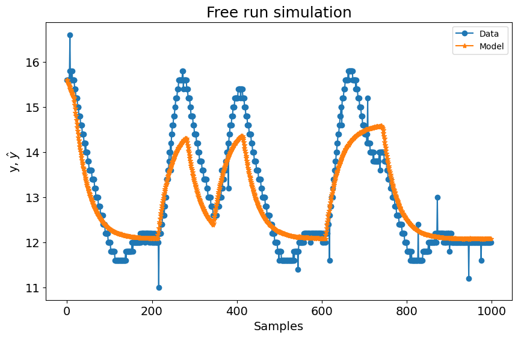


Ganho estático


```python
plt.figure(7)
plt.title("Gain")
plt.plot(
    Uo,
    gain,
    linewidth=1.5,
    linestyle="-",
    marker="o",
    label="Buck converter static gain",
)
plt.plot(
    Uo,
    HR.dot(model.theta),
    linestyle="-",
    marker="^",
    linewidth=1.5,
    label="NARX model gain",
)
plt.xlabel("$\\bar{u}$")
plt.ylabel("$\\bar{g}$")
plt.ylim(-16, 0)
plt.legend()
plt.show()
```


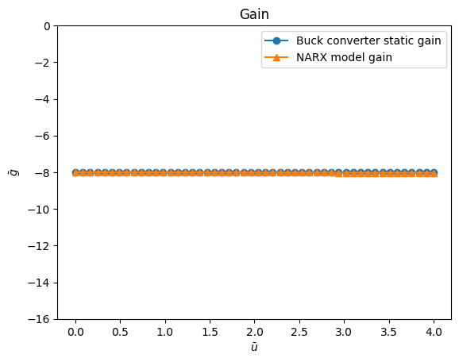


Função estática


```python
plt.figure(8)
plt.title("Static Curve")
plt.plot(Uo, Yo, linewidth=1.5, label="Static curve", linestyle="-", marker="o")
plt.plot(
    Uo,
    QR.dot(model.theta),
    linewidth=1.5,
    label="NARX \u200b\u200bstatic representation",
    linestyle="-",
    marker="^",
)
plt.xlabel("$\\bar{u}$")
plt.xlabel("$\\bar{y}$")
plt.legend()
plt.show()
```


Soluções Pareto-set


```python
plt.figure(9)
ax = plt.axes(projection="3d")
ax.plot3D(J[0, :], J[1, :], J[2, :], "o", linewidth=0.1)
ax.set_title("Optimum pareto-curve", fontsize=15)
ax.set_xlabel("$J_{ls}$", fontsize=10)
ax.set_ylabel("$J_{sg}$", fontsize=10)
ax.set_zlabel("$J_{sf}$", fontsize=10)
plt.show()
```


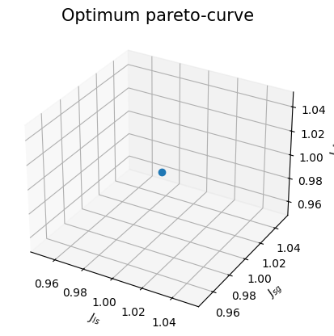


```python
theta[position, :]
```


A tabela a seguir mostra os resultados reportados em `IniciacaoCientifica2007` e aqueles obtidos com a implementação do SysIdentPy:

| Theta       | SysIdentPy   | IniciacaoCientifica2007       |
|-------------|--------------|-------------------------------|
| $\theta_1$  | 0.5514725    | 0.549144                      |
| $\theta_2$  | 0.40449005   | 0.408028                      |
| $\theta_3$  | 1.42867821   | 1.45097                       |
| $\theta_4$  | -12.60548863 | -12.55788                     |
| $\theta_5$  | 8.32740057   | 8.1516315                     |
| $\theta_6$  | -11.41574116 | -11.09728                     |
| $\theta_7$  | 12.25729955  | 12.215782                     |
| $\theta_8$  | 3.08461195   | 2.9319577                     |

onde:

$$
E_{Scilab} = 17.426613
$$

e:

$$
E_{Python} = 17.474865
$$

#### Nota: como mencionado anteriormente, a ordem dos regressores no modelo muda, mas a estrutura é a mesma. As tabelas mostram o respectivo parâmetro de cada regressor em `SysIdentPy` e `IniciacaoCientifica2007`, mas a ordem $\theta_1$, $\theta_2$ e assim por diante não é a mesma daquela em `model.final_model`.


```python
R, qit = mult2.build_linear_mapping()
print("R matrix:")
print(R)
print("qit matrix:")
print(qit)
```

A estrutura do modelo que será utilizada (`IniciacaoCientifica2007`):

$$
y(k) = \theta_1 y(k-1) + \theta_2 y(k-2) + \theta_3 + \theta_4 u(k-1) + \theta_5 u(k-1)^2 + \theta_6 u(k-2)u(k-1)+\theta_7 u(k-2) + \theta_8 u(k-2)^2
$$

$$
q_i = 
\begin{bmatrix}
0 & 0\\
1 & 0\\
2 & 0\\
2 & 2\\ 
\end{bmatrix}
= 
\begin{bmatrix}
1\\
\overline{y}\\
\overline{u}\\
\overline{u^2}
\end{bmatrix}
$$

e:

$$
R = 
\begin{bmatrix}
term/\theta & \theta_1 & \theta_2 & \theta_3 & \theta_4 & \theta_5 & \theta_6 & \theta_7 & \theta_8\\
1 & 0 & 0 & 1 & 0 & 0 & 0 & 0 & 0\\
\overline{y} & 1 & 1 & 0 & 0 & 0 & 0 & 0 & 0\\
\overline{u} & 0 & 0 & 0 & 1 & 0 & 0 & 1 & 0\\
\overline{u^2} & 0 & 0 & 0 & 0 & 1 & 1 & 0 & 1
\end{bmatrix}
$$

consistente com a matriz R:

```text
R = [0 0 1 0 0 0 0 0;1 1 0 0 0 0 0 0;0 0 0 1 0 0 1 0;0 0 0 0 1 1 0 1]; // R
```

ou:

$$
R = 
\begin{bmatrix}
0 & 0 & 1 & 0 & 0 & 0 & 0 & 0\\
1 & 1 & 0 & 0 & 0 & 0 & 0 & 0\\
0 & 0 & 0 & 1 & 0 & 0 & 1 & 0\\
0 & 0 & 0 & 0 & 1 & 1 & 0 & 1
\end{bmatrix}
$$

## Otimização biobjetivo

### Caso de uso aplicado ao conversor Buck CC-CC usando como objetivos a informação da curva estática e o erro de predição (dinâmico)


```python
bi_objective = AILS(
    static_function=True, static_gain=False, final_model=final_model, normalize=True
)
```

O valor de $\theta$ com o menor erro quadrático médio obtido através da rotina em Scilab foi:

$$
W_{LS} = 0.9931126
$$

e:

$$
W_{SF} = 0.0068874
$$


```python
w = np.zeros((2, 2000))
w[0, :] = np.logspace(-0.01, -6, num=2000, base=2.71)
w[1, :] = np.ones(2000) - w[0, :]
J, E, theta, HR, QR, position = bi_objective.estimate(
    y=y_train, X=x_train, y_static=Yo, X_static=Uo, weighing_matrix=w
)
result = {"w1": w[0, :], "w2": w[1, :], "J_ls": J[0, :], "J_sg": J[1, :], "||J||:": E}
pd.DataFrame(result)
```


```python
model.theta = theta[position, :].reshape(-1, 1)
model.final_model = bi_objective.final_model
yhat = model.predict(X=x_valid, y=y_valid)
rrse = root_relative_squared_error(y_valid, yhat)
r = pd.DataFrame(
    results(
        model.final_model,
        model.theta,
        model.err,
        model.n_terms,
        err_precision=3,
        dtype="sci",
    ),
    columns=["Regressors", "Parameters", "ERR"],
)
r
```


```python
plot_results(y=y_valid, yhat=yhat, n=1000)
```


```python
plt.figure(10)
plt.title("Static Curve")
plt.plot(Uo, Yo, linewidth=1.5, label="Static curve", linestyle="-", marker="o")
plt.plot(
    Uo,
    QR.dot(model.theta),
    linewidth=1.5,
    label="NARX \u200b\u200bstatic representation",
    linestyle="-",
    marker="^",
)
plt.xlabel("$\\bar{u}$")
plt.xlabel("$\\bar{y}$")
plt.legend()
plt.show()
```


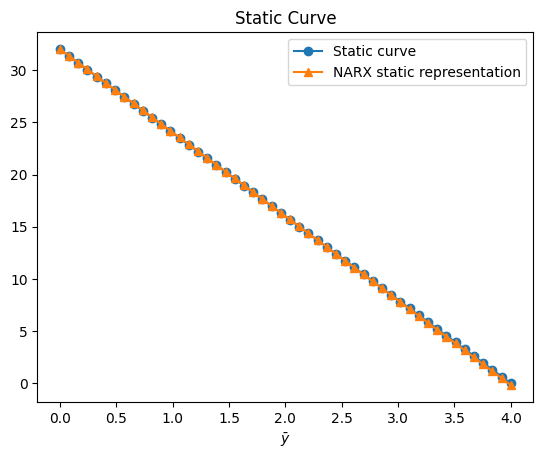


```python
plt.figure(11)
plt.title("Costs Functions")
plt.plot(J[1, :], J[0, :], "o")
plt.xlabel("Static Curve Information")
plt.ylabel("Prediction Error")
plt.show()
```


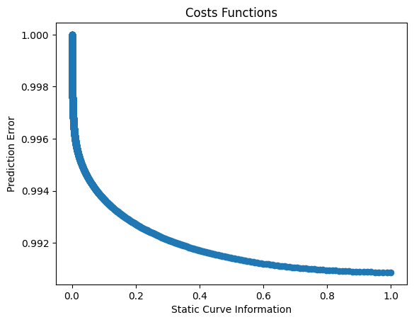


onde o melhor $\theta$ estimado é

| Theta       | SysIdentPy   | IniciacaoCientifica2007  |
|-------------|--------------|--------------------------|
| $\theta_1$  | 0.54940883   | 0.5494135                |
| $\theta_2$  | 0.40803995   | 0.4080312                |
| $\theta_3$  | 1.38725684   | 3.3857601                |
| $\theta_4$  | -12.51466378 | -12.513688               |
| $\theta_5$  | 8.11712897   | 8.116575                 |
| $\theta_6$  | -11.04664789 | -11.04592                |
| $\theta_7$  | 12.22693907  | 12.227184                |
| $\theta_8$  | 2.90425844   | 2.9038468                |

onde:

$$
E_{Scilab} = 17.408934
$$

e:

$$
E_{Python} = 17.408947
$$

## Estimação multiobjetivo de parâmetros

### Caso de uso considerando 2 objetivos diferentes: erro de predição e ganho estático


```python
bi_objective_gain = AILS(
    static_function=False, static_gain=True, final_model=final_model, normalize=False
)
```

O valor de $\theta$ com o menor erro quadrático médio obtido através da rotina em Scilab foi:

$$
W_{LS} = 0.9931126
$$

e:

$$
W_{SF} = 0.0068874
$$


```python
w = np.zeros((2, 2000))
w[0, :] = np.logspace(0, -6, num=2000, base=2.71)
w[1, :] = np.ones(2000) - w[0, :]
J, E, theta, HR, QR, position = bi_objective_gain.estimate(
    X=x_train, y=y_train, gain=gain, y_static=Yo, X_static=Uo, weighing_matrix=w
)
result = {"w1": w[0, :], "w2": w[1, :], "J_ls": J[0, :], "J_sg": J[1, :], "||J||:": E}
pd.DataFrame(result)
```


```python
# Escrevendo os resultados
model.theta = theta[position, :].reshape(-1, 1)
model.final_model = bi_objective_gain.final_model
yhat = model.predict(X=x_valid, y=y_valid)
rrse = root_relative_squared_error(y_valid, yhat)
r = pd.DataFrame(
    results(
        model.final_model,
        model.theta,
        model.err,
        model.n_terms,
        err_precision=3,
        dtype="sci",
    ),
    columns=["Regressors", "Parameters", "ERR"],
)
r
```


```python
plot_results(y=y_valid, yhat=yhat, n=1000)
```


```python
plt.figure(12)
plt.title("Gain")
plt.plot(
    Uo,
    gain,
    linewidth=1.5,
    linestyle="-",
    marker="o",
    label="Buck converter static gain",
)
plt.plot(
    Uo,
    HR.dot(model.theta),
    linestyle="-",
    marker="^",
    linewidth=1.5,
    label="NARX model gain",
)
plt.xlabel("$\\bar{u}$")
plt.ylabel("$\\bar{g}$")
plt.legend()
plt.show()
```


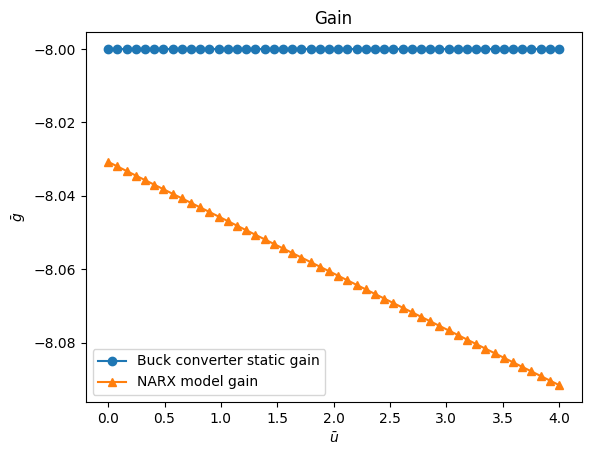


```python
plt.figure(11)
plt.title("Costs Functions")
plt.plot(J[1, :], J[0, :], "o")
plt.xlabel("Gain Information")
plt.ylabel("Prediction Error")
plt.show()
```


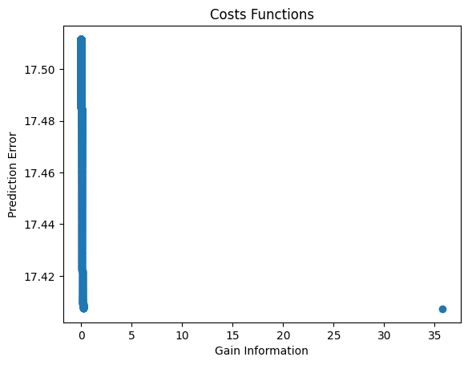


sendo o $\theta$ selecionado:

| Theta       | SysIdentPy    | IniciacaoCientifica2007   |
|-------------|---------------|---------------------------|
| $\theta_1$  | 0.54939785    | 0.54937289                |
| $\theta_2$  | 0.40805603    | 0.40810168                |
| $\theta_3$  | 1.48525190    | 1.48663719                |
| $\theta_4$  | -12.58066084  | -12.58127183              |
| $\theta_5$  | 8.16862622    | 8.16780294                |
| $\theta_6$  | -11.12171897  | -11.11998621              |
| $\theta_7$  | 12.20954849   | 12.20927355               |
| $\theta_8$  | 2.94548501    | 2.9446532                 |

onde:

$$
E_{Scilab} =  17.408997
$$

e:

$$
E_{Python} = 17.408781
$$

## Informações adicionais

Você também pode acessar as matrizes Q e H usando os seguintes métodos.

Matriz Q:


```python
bi_objective_gain.build_static_function_information(Uo, Yo)[1]
```


Matriz H+R:


```python
bi_objective_gain.build_static_gain_information(Uo, Yo, gain)[1]
```

