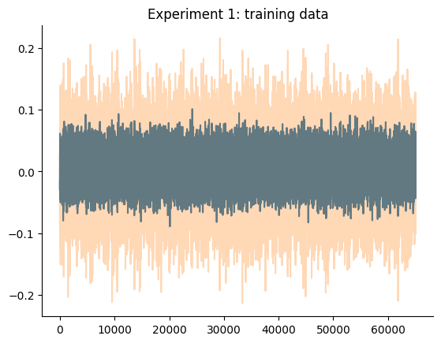
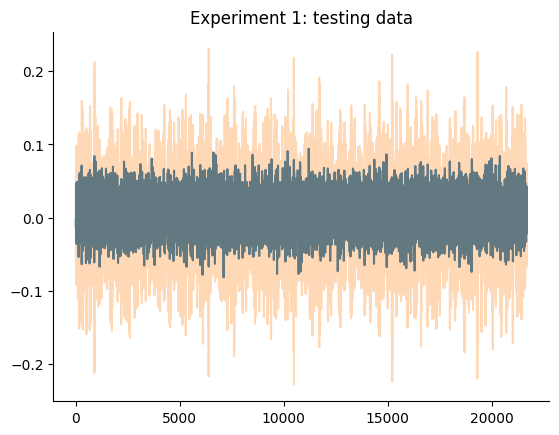
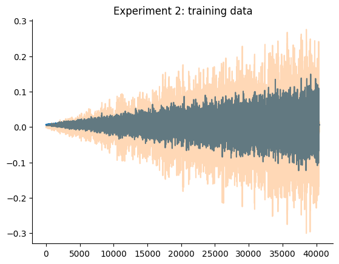
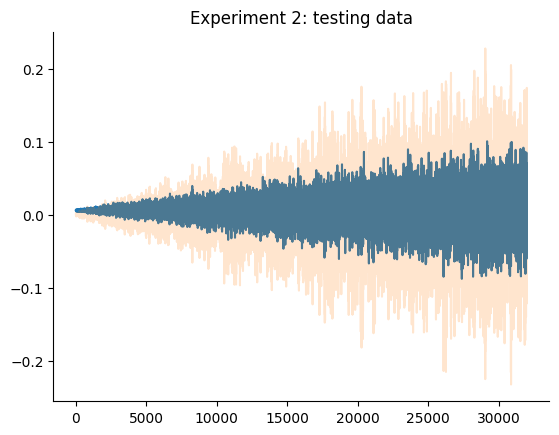
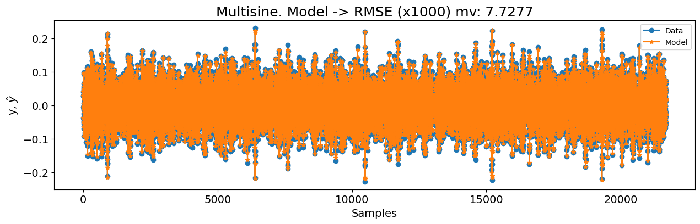
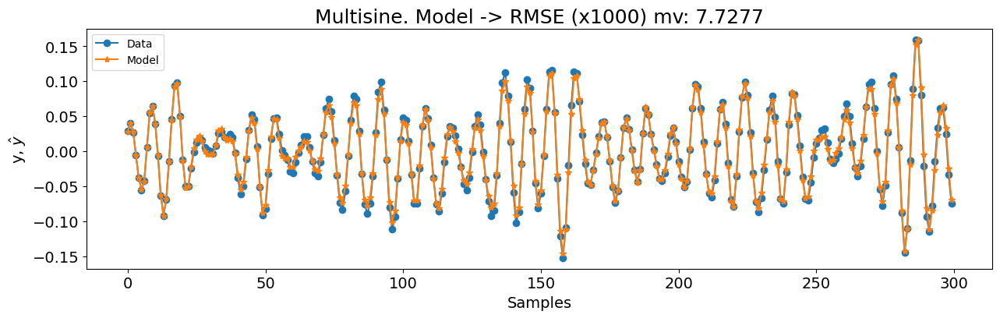
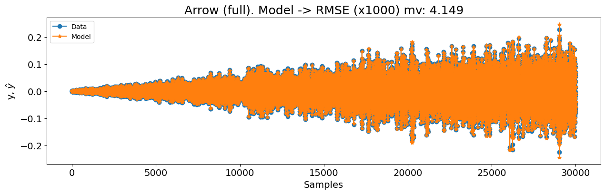
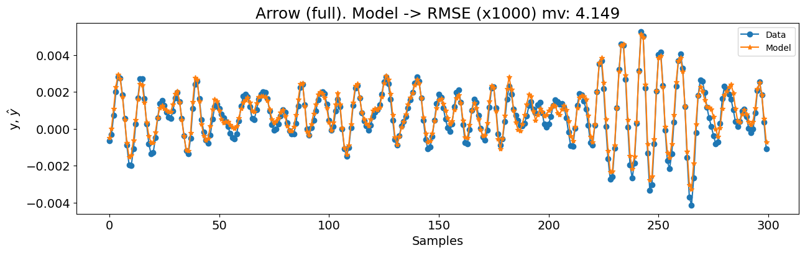
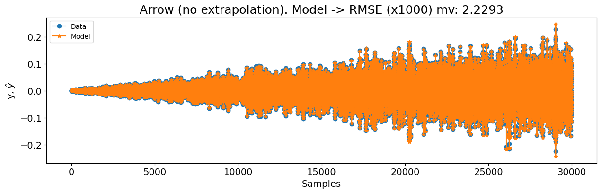
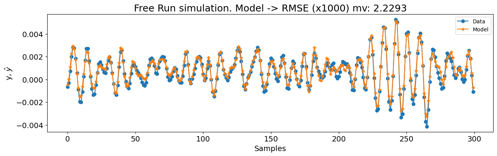

# Sistema Silver Box

Nota: O exemplo mostrado neste notebook é retirado do livro complementar [Nonlinear System Identification and Forecasting: Theory and Practice with SysIdentPy](https://sysidentpy.org/book/0-Preface/).

O conteúdo da descrição deriva principalmente (copiar e colar) do [artigo associado - Three free data sets for development and benchmarking in nonlinear system identification](https://ieeexplore.ieee.org/document/6669201). Para uma descrição detalhada, os leitores são encaminhados à referência vinculada.

> O sistema Silverbox pode ser visto como uma implementação eletrônica do oscilador de Duffing. É construído como um sistema linear invariante no tempo de 2ª ordem com uma não linearidade estática polinomial de 3º grau ao redor dele em feedback. Este tipo de dinâmica é, por exemplo, frequentemente encontrado em sistemas mecânicos [Nonlinear Benchmark - Silverbox](https://www.nonlinearbenchmark.org/benchmarks/silverbox).

Neste estudo de caso, criaremos um modelo NARX para o benchmark Silver box. O Silver box representa uma versão simplificada de processos oscilatórios mecânicos, que são uma categoria crítica de sistemas dinâmicos não lineares. Exemplos incluem suspensões de veículos, onde amortecedores e molas progressivas desempenham papéis vitais. Os dados gerados pelo Silver box fornecem uma representação simplificada de tais componentes combinados. O circuito elétrico que gera esses dados aproxima de perto, mas não corresponde perfeitamente, aos modelos idealizados descritos abaixo.

Conforme descrito no artigo original, o sistema foi excitado usando um gerador de forma de onda geral (HPE1445A). O sinal de entrada começa como um sinal de tempo discreto $r(k)$, que é convertido para um sinal analógico $r_c(t)$ usando reconstrução zero-order-hold. O sinal de excitação real $u_0(t)$ é então obtido passando $r_c(t)$ através de um filtro passa-baixa analógico $G(p)$ para eliminar o conteúdo de alta frequência em torno de múltiplos da frequência de amostragem. Aqui, $p$ denota o operador de diferenciação. Assim, a entrada é dada por:

$$
u_0(t) = G(p) r_c(t).
$$

Os sinais de entrada e saída foram medidos usando placas de aquisição de dados HP1430A, com relógios sincronizados para as placas de aquisição e gerador. A frequência de amostragem foi:

$$
f_s = \frac{10^7}{2^{14}} = 610.35 \, \text{Hz}.
$$

O silver box usa circuitos elétricos analógicos para gerar dados representando um sistema mecânico ressonante não linear com uma massa móvel $m$, amortecimento viscoso $d$, e uma mola não linear $k(y)$. O circuito elétrico é projetado para relacionar o deslocamento $y(t)$ (a saída) à força $u(t)$ (a entrada) pela seguinte equação diferencial:

$$
m \frac{d^2 y(t)}{dt^2} + d \frac{d y(t)}{dt} + k(y(t)) y(t) = u(t).
$$

A mola progressiva não linear é descrita por uma rigidez estática dependente da posição:

$$
k(y(t)) = a + b y^2(t).
$$

A relação sinal-ruído é suficientemente alta para modelar o sistema sem considerar o ruído de medição. No entanto, o ruído de medição pode ser incluído substituindo $y(t)$ pela variável artificial $x(t)$ na equação acima, e introduzindo perturbações $w(t)$ e $e(t)$ da seguinte forma:

$$
\begin{align}
& m \frac{d^2 x(t)}{dt^2} + d \frac{d x(t)}{dt} + k(x(t)) x(t) = u(t) + w(t), \\
& k(x(t)) = a + b x^2(t), \\
& y(t) = x(t) + e(t).
\end{align}
$$

### Pacotes Necessários e Versões

Para garantir que você possa replicar este estudo de caso, é essencial usar versões específicas dos pacotes necessários. Abaixo está uma lista dos pacotes junto com suas respectivas versões necessárias para executar os estudos de caso efetivamente.

Para instalar todos os pacotes necessários, você pode criar um arquivo `requirements.txt` com o seguinte conteúdo:

```
sysidentpy==0.4.0
pandas==2.2.2
numpy==1.26.0
matplotlib==3.8.4
nonlinear_benchmarks==0.1.2
```

Então, instale os pacotes usando:

```
pip install -r requirements.txt
```

- Certifique-se de usar um ambiente virtual para evitar conflitos entre versões de pacotes.
- As versões especificadas são baseadas na compatibilidade com os exemplos de código fornecidos. Se você estiver usando versões diferentes, alguns ajustes no código podem ser necessários.

### Configuração do SysIdentPy

Nesta seção, demonstraremos a aplicação do SysIdentPy ao dataset Silver box. O código a seguir guiará você através do processo de carregamento do dataset, configuração dos parâmetros do SysIdentPy e construção de um modelo para o sistema mencionado.


```python
import numpy as np
import matplotlib.pyplot as plt

from sysidentpy.model_structure_selection import FROLS
from sysidentpy.basis_function import Polynomial, Fourier
from sysidentpy.parameter_estimation import LeastSquares
from sysidentpy.metrics import root_mean_squared_error
from sysidentpy.utils.plotting import plot_results

import nonlinear_benchmarks

train_val, test = nonlinear_benchmarks.Silverbox(atleast_2d=True)

x_train, y_train = train_val.u, train_val.y
test_multisine, test_arrow_full, test_arrow_no_extrapolation = test
x_test, y_test = test_multisine.u, test_multisine.y

n = test_multisine.state_initialization_window_length
```

Usamos o pacote `nonlinear_benchmarks` para carregar os dados. O usuário é encaminhado à [documentação do pacote - GerbenBeintema/nonlinear_benchmarks: The official dataload for http://www.nonlinearbenchmark.org/ (github.com)](https://github.com/GerbenBeintema/nonlinear_benchmarks/tree/master) para verificar os detalhes de como usá-lo.

O gráfico a seguir detalha os dados de treinamento e teste do experimento.


```python
plt.plot(x_train)
plt.plot(y_train, alpha=0.3)
plt.title("Experimento 1: dados de treinamento")
plt.show()

plt.plot(x_test)
plt.plot(y_test, alpha=0.3)
plt.title("Experimento 1: dados de teste")
plt.show()

plt.plot(test_arrow_full.u)
plt.plot(test_arrow_full.y, alpha=0.3)
plt.title("Experimento 2: dados de treinamento")
plt.show()

plt.plot(test_arrow_no_extrapolation.u)
plt.plot(test_arrow_no_extrapolation.y, alpha=0.2)
plt.title("Experimento 2: dados de teste")
plt.show()
```


    

    


    

    


    

    


    

    


> Nota Importante

O objetivo deste benchmark é desenvolver um modelo que supere o modelo estado-da-arte (SOTA) apresentado no artigo de benchmarking. No entanto, os resultados no [artigo](https://arxiv.org/pdf/2012.07697) diferem daqueles fornecidos no [repositório GitHub](https://github.com/GerbenBeintema/SS-encoder-WH-Silver/blob/main/SS%20encoder%20Silverbox.ipynb).

| nx  | Conjunto        | NRMS    | RMS (mV)   |
| --- | --------------- | ------- | ---------- |
| 2   | Treino          | 0.10653 | 5.8103295  |
| 2   | Validação       | 0.11411 | 6.1938068  |
| 2   | Teste           | 0.19151 | 10.2358533 |
| 2   | Teste (no extra)| 0.12284 | 5.2789727  |
| 4   | Treino          | 0.03571 | 1.9478290  |
| 4   | Validação       | 0.03922 | 2.1286373  |
| 4   | Teste           | 0.12712 | 6.7943448  |
| 4   | Teste (no extra)| 0.05204 | 2.2365904  |
| 8   | Treino          | 0.03430 | 1.8707026  |
| 8   | Validação       | 0.03732 | 2.0254112  |
| 8   | Teste           | 0.10826 | 5.7865255  |
| 8   | Teste (no extra)| 0.04743 | 2.0382715  |
> Tabela: resultados apresentados no github.

Parece que os valores mostrados no artigo realmente representam o tempo de treinamento, não as métricas de erro. Entrarei em contato com os autores para confirmar esta informação. De acordo com o site Nonlinear Benchmark, a informação é a seguinte:


onde os valores na coluna "Training time" correspondem aos apresentados como métricas de erro no artigo.

> Enquanto aguardamos a confirmação dos valores corretos para este benchmark, demonstraremos o desempenho do SysIdentPy. No entanto, nos absteremos de fazer comparações ou tentar melhorar o modelo nesta fase.

### Resultados

Começaremos (como fizemos em todos os outros estudos de caso) com uma configuração básica do FROLS usando uma função de base polinomial com grau igual a 2. O `xlag` e `ylag` são definidos como $7$ neste primeiro exemplo. Como o dataset é consideravelmente grande, começaremos com `n_info_values=40`. Como estamos lidando com um grande dataset de treinamento, usaremos o `err_tol` em vez de critérios de informação para ter um desempenho mais rápido. Também definiremos `n_terms=40`, o que significa que a busca parará se o `err_tol` for atingido ou 40 regressores forem testados no algoritmo `ERR`. Embora esta abordagem possa resultar em um modelo sub-ótimo, é um ponto de partida razoável para nossa primeira tentativa. Existem três experimentos diferentes: multisine, arrow (full) e arrow (no extrapolation).


```python
basis_function = Polynomial(degree=2)
model = FROLS(
    xlag=7,
    ylag=7,
    basis_function=basis_function,
    estimator=LeastSquares(),
    err_tol=0.999,
    n_terms=40,
    order_selection=False,
)

model.fit(X=x_train, y=y_train)
y_test = np.concatenate([y_train[-model.max_lag :], y_test])
x_test = np.concatenate([x_train[-model.max_lag :], x_test])
yhat = model.predict(X=x_test, y=y_test[: model.max_lag, :])
rmse = root_mean_squared_error(y_test[model.max_lag + n :], yhat[model.max_lag + n :])
nrmse = rmse / y_test.std()
rmse_mv = 1000 * rmse
print(nrmse, rmse_mv)
plot_results(
    y=y_test[model.max_lag :],
    yhat=yhat[model.max_lag :],
    n=30000,
    figsize=(15, 4),
    title=f"Multisine. Modelo -> RMSE (x1000) mv: {round(rmse_mv, 4)}",
)

plot_results(
    y=y_test[model.max_lag :],
    yhat=yhat[model.max_lag :],
    n=300,
    figsize=(15, 4),
    title=f"Multisine. Modelo -> RMSE (x1000) mv: {round(rmse_mv, 4)}",
)
```

    0.1423804033714937 7.727682109791501


    

    


    

    


```python
x_train, y_train = train_val.u, train_val.y
test_multisine, test_arrow_full, test_arrow_no_extrapolation = test
x_test, y_test = test_arrow_full.u, test_arrow_full.y

n = test_arrow_full.state_initialization_window_length

basis_function = Polynomial(degree=3)
model = FROLS(
    xlag=14,
    ylag=14,
    basis_function=basis_function,
    estimator=LeastSquares(),
    err_tol=0.9999,
    n_terms=80,
    order_selection=False,
)

model.fit(X=x_train, y=y_train)
# não concatenaremos os últimos valores dos dados de treino para usar como condição inicial aqui porque
# estes dados de teste têm um comportamento muito diferente.
# No entanto, se você quiser, pode fazer isso e verá que o modelo ainda terá
# um ótimo desempenho após algumas iterações
yhat = model.predict(X=x_test, y=y_test[: model.max_lag, :])
rmse = root_mean_squared_error(y_test[model.max_lag + n :], yhat[model.max_lag + n :])
nrmse = rmse / y_test.std()
rmse_mv = 1000 * rmse

print(nrmse, rmse_mv)

plot_results(
    y=y_test[model.max_lag :],
    yhat=yhat[model.max_lag :],
    n=30000,
    figsize=(15, 4),
    title=f"Arrow (full). Modelo -> RMSE (x1000) mv: {round(rmse_mv, 4)}",
)

plot_results(
    y=y_test[model.max_lag :],
    yhat=yhat[model.max_lag :],
    n=300,
    figsize=(15, 4),
    title=f"Arrow (full). Modelo -> RMSE (x1000) mv: {round(rmse_mv, 4)}",
)
```

    0.07762658947015803 4.14903534238172


    

    


    

    


```python
x_train, y_train = train_val.u, train_val.y
test_multisine, test_arrow_full, test_arrow_no_extrapolation = test
x_test, y_test = test_arrow_no_extrapolation.u, test_arrow_no_extrapolation.y

n = test_arrow_no_extrapolation.state_initialization_window_length

basis_function = Polynomial(degree=3)
model = FROLS(
    xlag=14,
    ylag=14,
    basis_function=basis_function,
    estimator=LeastSquares(),
    err_tol=0.9999,
    n_terms=40,
    order_selection=False,
)

model.fit(X=x_train, y=y_train)
yhat = model.predict(X=x_test, y=y_test[: model.max_lag, :])
rmse = root_mean_squared_error(y_test[model.max_lag + n :], yhat[model.max_lag + n :])
nrmse = rmse / y_test.std()
rmse_mv = 1000 * rmse
print(nrmse, rmse_mv)

plot_results(
    y=y_test[model.max_lag :],
    yhat=yhat[model.max_lag :],
    n=30000,
    figsize=(15, 4),
    title=f"Arrow (no extrapolation). Modelo -> RMSE (x1000) mv: {round(rmse_mv, 4)}",
)

plot_results(
    y=y_test[model.max_lag :],
    yhat=yhat[model.max_lag :],
    n=300,
    figsize=(15, 4),
    title=f"Simulação Free Run. Modelo -> RMSE (x1000) mv: {round(rmse_mv, 4)}",
)
```

    0.05187400789723806 2.2293393254015776


    

    


    

    
