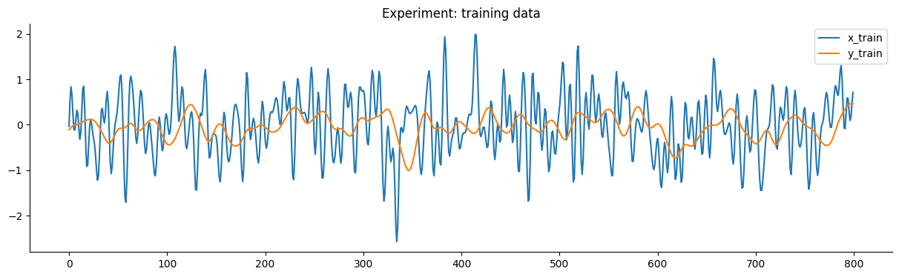
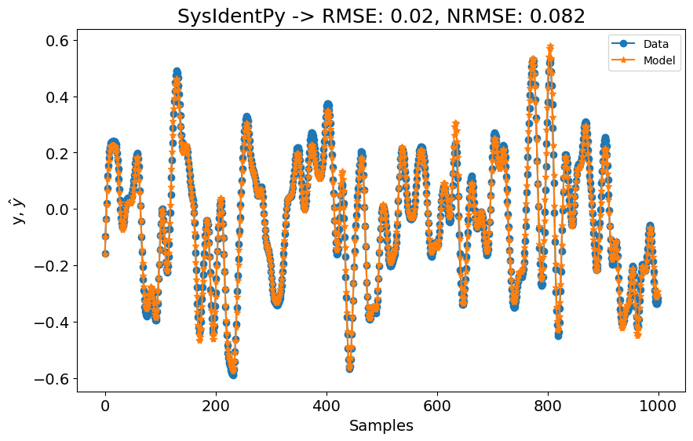
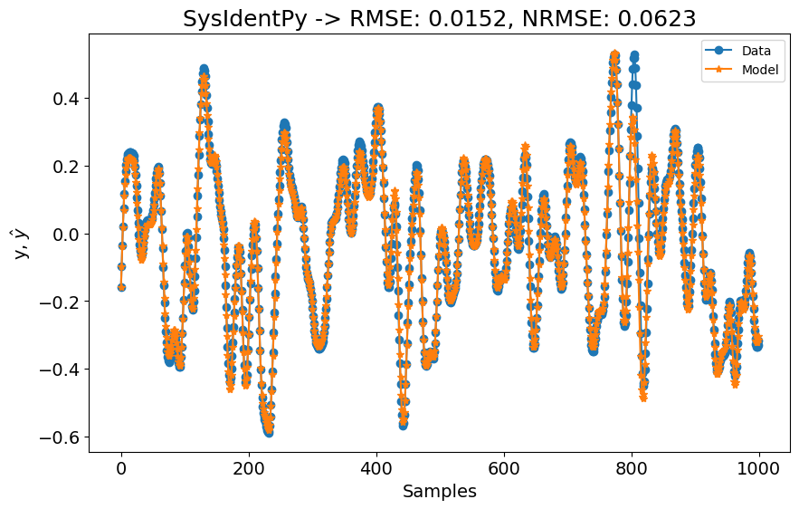
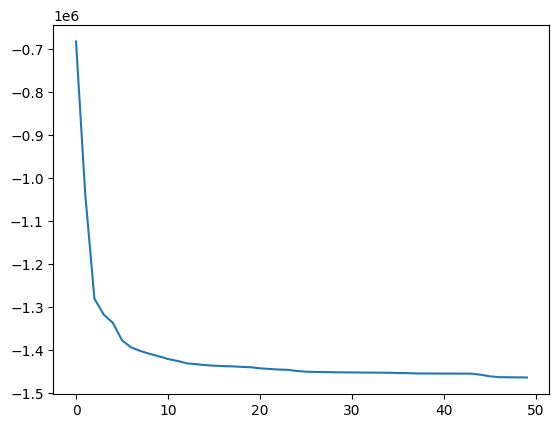

# Sistema Wiener Hammerstein

Nota: O exemplo mostrado neste notebook é retirado do livro complementar [Nonlinear System Identification and Forecasting: Theory and Practice with SysIdentPy](https://sysidentpy.org/book/0-Preface/).

O conteúdo da descrição deriva principalmente do [site do benchmark - Nonlinear Benchmark](https://www.nonlinearbenchmark.org/benchmarks) e do [artigo associado - Wiener-Hammerstein benchmark with process noise](https://data.4tu.nl/articles/_/12952124). Para uma descrição detalhada, os leitores são encaminhados às referências vinculadas.

> O site de benchmarks não lineares representa uma contribuição significativa para a comunidade de identificação de sistemas e aprendizado de máquina. Os usuários são encorajados a explorar todos os artigos referenciados no site.

Este benchmark foca em um circuito eletrônico Wiener-Hammerstein onde o ruído de processo desempenha um papel significativo na distorção do sinal de saída.

A estrutura Wiener-Hammerstein é um sistema orientado a blocos bem conhecido que contém uma não linearidade estática intercalada entre dois blocos Lineares Invariantes no Tempo (LTI) (Figura 2). Este arranjo apresenta um problema de identificação desafiador devido à presença desses blocos LTI.


> Figura 2: o sistema Wiener-Hammerstein

Na Figura 2, o sistema Wiener-Hammerstein é ilustrado com ruído de processo $e_x(t)$ entrando antes da não linearidade estática $f(x)$, intercalado entre blocos LTI representados por $R(s)$ e $S(s)$ na entrada e saída, respectivamente. Além disso, pequenas fontes de ruído desprezíveis $e_u(t)$ e $e_y(t)$ afetam os canais de medição. Os sinais de entrada e saída medidos são denotados como $u_m(t)$ e $y_m(t)$.

O primeiro bloco LTI $R(s)$ é efetivamente modelado como um filtro passa-baixa de terceira ordem. O segundo subsistema LTI $S(s)$ é configurado como um filtro Chebyshev inverso com atenuação de banda de parada de $40 dB$ e frequência de corte de $5 kHz$. Notavelmente, $S(s)$ inclui um zero de transmissão dentro da faixa de frequência operacional, complicando sua inversão.

A não linearidade estática $f(x)$ é implementada usando uma rede de diodo-resistor, resultando em não linearidade de saturação. O ruído de processo $e_x(t)$ é introduzido como ruído gaussiano branco filtrado, gerado a partir de um filtro Butterworth passa-baixa de terceira ordem em tempo discreto seguido por zero-order hold e filtragem de reconstrução passa-baixa analógica com corte de $20 kHz$.

As fontes de ruído de medição $e_u(t)$ e $e_y(t)$ são mínimas comparadas a $e_x(t)$. As entradas do sistema e o ruído de processo são gerados usando um Gerador de Forma de Onda Arbitrária (AWG), especificamente o Agilent/HP E1445A, amostrando a $78125 Hz$, sincronizado com um sistema de aquisição (Agilent/HP E1430A) para garantir coerência de fase e prevenir erros de vazamento. O buffering entre as placas de aquisição e as entradas e saídas do sistema minimiza a distorção do equipamento de medição.

O benchmark fornece dois sinais de teste padrão através do site de benchmarking: um multisine de fase aleatória e um sinal de varredura senoidal. Ambos os sinais têm um valor $rms$ de $0.71 Vrms$ e cobrem frequências de DC a $15 kHz$ (excluindo DC). A varredura senoidal abrange esta faixa de frequência a uma taxa de $4.29 MHz/min$. Estes conjuntos de teste servem como alvos para avaliar o desempenho do modelo, enfatizando representação precisa sob condições variadas.

O benchmark Wiener-Hammerstein destaca três desafios principais de identificação de sistemas não lineares:

1. **Ruído de Processo:** Significativo no sistema, influenciando a fidelidade da saída.
2. **Não Linearidade Estática:** Indiretamente acessível a partir de dados medidos, apresentando desafios de identificação.
3. **Dinâmicas de Saída:** Inversão complexa devido à presença de zero de transmissão em $S(s)$.

O objetivo deste benchmark é desenvolver e validar modelos robustos usando dados de estimação separados, garantindo caracterização precisa do comportamento do sistema Wiener-Hammerstein.

### Pacotes Necessários e Versões

Para garantir que você possa replicar este estudo de caso, é essencial usar versões específicas dos pacotes necessários. Abaixo está uma lista dos pacotes junto com suas respectivas versões necessárias para executar os estudos de caso efetivamente.

Para instalar todos os pacotes necessários, você pode criar um arquivo `requirements.txt` com o seguinte conteúdo:

```
sysidentpy==0.4.0
pandas==2.2.2
numpy==1.26.0
matplotlib==3.8.4
nonlinear_benchmarks==0.1.2
```

Então, instale os pacotes usando:
```
pip install -r requirements.txt
```

- Certifique-se de usar um ambiente virtual para evitar conflitos entre versões de pacotes.
- As versões especificadas são baseadas na compatibilidade com os exemplos de código fornecidos. Se você estiver usando versões diferentes, alguns ajustes no código podem ser necessários.

### Configuração do SysIdentPy

Nesta seção, demonstraremos a aplicação do SysIdentPy ao dataset do sistema Wiener-Hammerstein. O código a seguir guiará você através do processo de carregamento do dataset, configuração dos parâmetros do SysIdentPy e construção de um modelo para o sistema Wiener-Hammerstein.


```python
import numpy as np
import pandas as pd
import matplotlib.pyplot as plt

from sysidentpy.model_structure_selection import FROLS, AOLS, MetaMSS
from sysidentpy.basis_function import Polynomial, Fourier
from sysidentpy.utils.display_results import results
from sysidentpy.parameter_estimation import (
    LeastSquares,
    BoundedVariableLeastSquares,
    NonNegativeLeastSquares,
    LeastSquaresMinimalResidual,
)

from sysidentpy.metrics import root_mean_squared_error
from sysidentpy.utils.plotting import plot_results

import nonlinear_benchmarks

train_val, test = nonlinear_benchmarks.WienerHammerBenchMark(atleast_2d=True)
x_train, y_train = train_val
x_test, y_test = test
```

Usamos o pacote `nonlinear_benchmarks` para carregar os dados. O usuário é encaminhado à [documentação do pacote](https://github.com/GerbenBeintema/nonlinear_benchmarks/tree/master) para verificar os detalhes de como usá-lo.

O gráfico a seguir detalha os dados de treinamento e teste do experimento.


```python
plot_n = 800

plt.figure(figsize=(15, 4))
plt.plot(x_train[:plot_n])
plt.plot(y_train[:plot_n])
plt.title("Experimento: dados de treinamento")
plt.legend(["x_train", "y_train"])
plt.show()

plt.figure(figsize=(15, 4))
plt.plot(x_test[:plot_n])
plt.plot(y_test[:plot_n])
plt.title("Experimento: dados de teste")
plt.legend(["x_test", "y_test"])
plt.show()
```


    

    


    

    


O objetivo deste benchmark é obter um modelo que tenha um desempenho melhor que o modelo SOTA fornecido no artigo de benchmarking.


> Resultados estado-da-arte apresentados no [artigo de benchmarking](https://arxiv.org/pdf/2405.10779). Nesta seção estamos trabalhando apenas com os resultados Wiener-Hammerstein, que são apresentados na coluna $W-H$.

### Resultados

Começaremos com uma configuração básica do FROLS usando uma função de base polinomial com grau igual a 2. O `xlag` e `ylag` são definidos como $7$ neste primeiro exemplo. Como o dataset é consideravelmente grande, começaremos com `n_info_values=50`. Isso significa que o algoritmo FROLS não incluirá todos os regressores ao calcular os critérios de informação usados para determinar a ordem do modelo. Embora esta abordagem possa resultar em um modelo sub-ótimo, é um ponto de partida razoável para nossa primeira tentativa.


```python
# 3min para rodar na minha máquina (amd 5600x, 32gb ram)

n = test.state_initialization_window_length

basis_function = Polynomial(degree=2)
model = FROLS(
    xlag=7,
    ylag=7,
    basis_function=basis_function,
    estimator=LeastSquares(unbiased=False),
    n_info_values=50,
)

model.fit(X=x_train, y=y_train)
y_test = np.concatenate([y_train[-model.max_lag :], y_test])
x_test = np.concatenate([x_train[-model.max_lag :], x_test])
yhat = model.predict(X=x_test, y=y_test[: model.max_lag, :])
rmse = root_mean_squared_error(y_test[model.max_lag + n :], yhat[model.max_lag + n :])
rmse_sota = rmse / y_test.std()
plot_results(
    y=y_test[model.max_lag :],
    yhat=yhat[model.max_lag :],
    n=1000,
    title=f"SysIdentPy -> RMSE: {round(rmse, 4)}, NRMSE: {round(rmse_sota, 4)}",
)
```


    

    


A primeira configuração já é melhor que os modelos **SOTA** mostrados na tabela de benchmark! Começamos usando `xlag=ylag=7` para ter uma ideia de quão bem o SysIdentPy lidaria com este dataset, mas os resultados já são muito bons! No entanto, o artigo de benchmarking indica que eles usaram lags maiores para seus modelos. Vamos verificar o que acontece se definirmos `xlag=ylag=10`.


```python
# 7min para rodar na minha máquina (amd 5600x, 32gb ram)

x_train, y_train = train_val
x_test, y_test = test

n = test.state_initialization_window_length

basis_function = Polynomial(degree=2)
model = FROLS(
    xlag=10,
    ylag=10,
    basis_function=basis_function,
    estimator=LeastSquares(unbiased=False),
    n_info_values=50,
)

model.fit(X=x_train, y=y_train)
y_test = np.concatenate([y_train[-model.max_lag :], y_test])
x_test = np.concatenate([x_train[-model.max_lag :], x_test])
yhat = model.predict(X=x_test, y=y_test[: model.max_lag, :])
rmse = root_mean_squared_error(y_test[model.max_lag + n :], yhat[model.max_lag + n :])
rmse_sota = rmse / y_test.std()
plot_results(
    y=y_test[model.max_lag :],
    yhat=yhat[model.max_lag :],
    n=1000,
    title=f"SysIdentPy -> RMSE: {round(rmse, 4)}, NRMSE: {round(rmse_sota, 4)}",
)
```


    

    


O desempenho é ainda melhor agora! Por enquanto, não estamos preocupados com a complexidade do modelo (mesmo neste caso onde estamos comparando com uma rede neural de estado profundo...). No entanto, se verificarmos a ordem do modelo e o gráfico `AIC`, vemos que o modelo tem 50 regressores, mas os valores de `AIC` não mudam muito após cada regressão adicionada.


```python
plt.plot(model.info_values)
```


    [<matplotlib.lines.Line2D at 0x28c0058a450>]


    

    


Então, o que acontece se definirmos um modelo com metade dos regressores?


```python
# 14 segundos para rodar

x_train, y_train = train_val
x_test, y_test = test

n = test.state_initialization_window_length

basis_function = Polynomial(degree=2)
model = FROLS(
    xlag=10,
    ylag=10,
    basis_function=basis_function,
    estimator=LeastSquares(unbiased=False),
    n_info_values=50,
    n_terms=25,
    order_selection=False,
)

model.fit(X=x_train, y=y_train)
y_test = np.concatenate([y_train[-model.max_lag :], y_test])
x_test = np.concatenate([x_train[-model.max_lag :], x_test])
yhat = model.predict(X=x_test, y=y_test[: model.max_lag, :])
rmse = root_mean_squared_error(y_test[model.max_lag + n :], yhat[model.max_lag + n :])
rmse_sota = rmse / y_test.std()
plot_results(
    y=y_test[model.max_lag :],
    yhat=yhat[model.max_lag :],
    n=1000,
    title=f"SysIdentPy -> RMSE: {round(rmse, 4)}, NRMSE: {round(rmse_sota, 4)}",
)
```


    

    


Como mostrado na figura acima, os resultados ainda superam os modelos SOTA apresentados no artigo de benchmarking. Os resultados SOTA do artigo provavelmente também poderiam ser melhorados. Os usuários são encorajados a explorar o [pacote deepsysid](https://github.com/AlexandraBaier/deepsysid), que pode ser usado para construir redes neurais de estado profundo.

Esta configuração básica pode servir como ponto de partida para os usuários desenvolverem modelos ainda melhores usando o SysIdentPy. Experimente!
