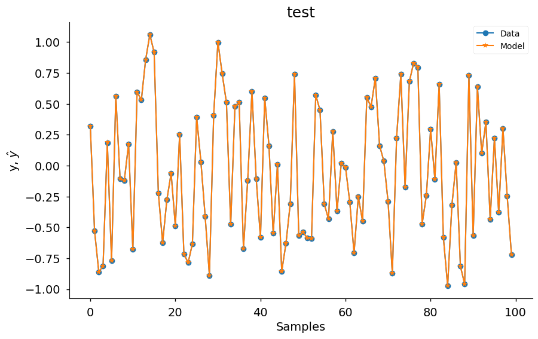

# Seu Primeiro Modelo

Exemplo criado por Wilson Rocha Lacerda Junior

> **Procurando mais detalhes sobre modelos NARMAX?**
> Para informações completas sobre modelos, métodos e uma ampla variedade de exemplos e benchmarks implementados no SysIdentPy, confira nosso livro:
> [*Nonlinear System Identification and Forecasting: Theory and Practice With SysIdentPy*](https://sysidentpy.org/book/0%20-%20Preface/)
>
> Este livro oferece orientação aprofundada para apoiar seu trabalho com o SysIdentPy.

Aqui importamos o modelo NARMAX, a métrica para avaliação do modelo e os métodos para gerar dados de amostra para testes. Também importamos o pandas para uso específico.


```python
pip install sysidentpy
```


```python
import numpy as np
import pandas as pd
import matplotlib.pyplot as plt
from sysidentpy.model_structure_selection import FROLS
from sysidentpy.basis_function import Polynomial
from sysidentpy.parameter_estimation import LeastSquares
from sysidentpy.metrics import root_relative_squared_error
from sysidentpy.utils.generate_data import get_siso_data
from sysidentpy.utils.display_results import results
from sysidentpy.utils.plotting import plot_residues_correlation, plot_results
from sysidentpy.residues.residues_correlation import (
    compute_residues_autocorrelation,
    compute_cross_correlation,
)
```

## Gerando dados de amostra com 1 entrada e 1 saída

Os dados são gerados simulando o seguinte modelo:

$y_k = 0.2y_{k-1} + 0.1y_{k-1}x_{k-1} + 0.9x_{k-1} + e_{k}$

Se *colored_noise* for definido como True:

$e_{k} = 0.8\nu_{k-1} + \nu_{k}$

onde $x$ é uma variável aleatória uniformemente distribuída e $\nu$ é uma variável com distribuição gaussiana com $\mu=0$ e $\sigma=0.1$

No próximo exemplo, geraremos dados com 1000 amostras com ruído branco e selecionando 90% dos dados para treinar o modelo.


```python
x_train, x_valid, y_train, y_valid = get_siso_data(
    n=1000, colored_noise=False, sigma=0.0001, train_percentage=90
)
```

Para obter um modelo NARMAX, precisamos escolher alguns valores, *e.g.*, o grau de não-linearidade (*degree*), o lag máximo para as entradas e saída (*xlag* e *ylag*).

Além disso, você pode selecionar o critério de informação a ser usado com o Error Reduction Ratio para selecionar a ordem do modelo e o método para estimar os parâmetros do modelo:

- Critérios de Informação: aic, aicc, bic, lilc, fpe
- Estimação de Parâmetros: LeastSquares, TotalLeastSquares, RecursiveLeastSquares, NonNegativeLeastSquares, LeastMeanSquares e muitos outros (veja a documentação)

O valor *n_terms* é opcional. Ele se refere ao número de termos a incluir no modelo final. Você pode definir este valor com base no critério de informação (veja abaixo) ou com base em informação a priori sobre a estrutura do modelo. O valor padrão é *n_terms=None*, então o algoritmo escolherá o valor mínimo alcançado pelo critério de informação.

Para usar critérios de informação, você deve definir *order_selection=True*. Você também pode selecionar *n_info_values* (padrão = 15).


```python
basis_function = Polynomial(degree=2)
estimator = LeastSquares()
model = FROLS(
    order_selection=True,
    n_info_values=3,
    ylag=2,
    xlag=2,
    info_criteria="aic",
    estimator=estimator,
    err_tol=None,
    basis_function=basis_function,
)
```

## Seleção de Estrutura do Modelo

O método *fit* executa o algoritmo Error Reduction Ratio usando reflexão de Householder para selecionar a estrutura do modelo.

Argumentos keyword-only são obrigatórios nos métodos *fit* e *predict*. Este é um esforço para promover o uso claro e não-ambíguo da biblioteca.


```python
model.fit(X=x_train, y=y_train)
```


    <sysidentpy.model_structure_selection.forward_regression_orthogonal_least_squares.FROLS at 0x1db932f5090>


## Simulação Free Run

O método *predict* é usado para gerar as predições. Por enquanto, suportamos apenas *free run simulation* (também conhecida como *infinity steps ahead*). Em breve permitiremos ao usuário definir uma predição *one-step ahead* ou *k-step ahead*.


```python
yhat = model.predict(X=x_valid, y=y_valid)
```

## Avaliando o modelo

Neste exemplo usamos a métrica *root_relative_squared_error* porque ela é frequentemente usada em Identificação de Sistemas. Mais métricas e informações podem ser encontradas na documentação.


```python
rrse = root_relative_squared_error(y_valid, yhat)
print(rrse)
```

    0.00017649882109753117


*model_object.results* retorna os regressores selecionados do modelo, os parâmetros estimados e os valores de ERR. Como mostrado abaixo, o algoritmo detecta exatamente o modelo que foi usado para simular os dados.


```python
r = pd.DataFrame(
    results(
        model.final_model,
        model.theta,
        model.err,
        model.n_terms,
        err_precision=8,
        dtype="sci",
    ),
    columns=["Regressors", "Parameters", "ERR"],
)
print(r)
```

          Regressors  Parameters             ERR
    0        x1(k-2)  9.0001E-01  9.57604864E-01
    1         y(k-1)  2.0000E-01  3.88976063E-02
    2  x1(k-1)y(k-1)  9.9992E-02  3.49749526E-03


Além disso, você pode acessar os métodos *residuals* e *plot_result* para visualizar a predição e duas análises de resíduos. Os valores *extras* e *lam* abaixo contêm outra análise de resíduos para que você possa plotar manualmente. Este método será melhorado em breve.


```python
plt.style.available
```


    ['Solarize_Light2',
     '_classic_test_patch',
     '_mpl-gallery',
     '_mpl-gallery-nogrid',
     'bmh',
     'classic',
     'dark_background',
     'fast',
     'fivethirtyeight',
     'ggplot',
     'grayscale',
     'seaborn-v0_8',
     'seaborn-v0_8-bright',
     'seaborn-v0_8-colorblind',
     'seaborn-v0_8-dark',
     'seaborn-v0_8-dark-palette',
     'seaborn-v0_8-darkgrid',
     'seaborn-v0_8-deep',
     'seaborn-v0_8-muted',
     'seaborn-v0_8-notebook',
     'seaborn-v0_8-paper',
     'seaborn-v0_8-pastel',
     'seaborn-v0_8-poster',
     'seaborn-v0_8-talk',
     'seaborn-v0_8-ticks',
     'seaborn-v0_8-white',
     'seaborn-v0_8-whitegrid',
     'tableau-colorblind10']


```python
plot_results(
    y=y_valid,
    yhat=yhat,
    n=1000,
    title="test",
    xlabel="Samples",
    ylabel=r"y, $\hat{y}$",
    data_color="#1f77b4",
    model_color="#ff7f0e",
    marker="o",
    model_marker="*",
    linewidth=1.5,
    figsize=(10, 6),
    style="seaborn-v0_8-notebook",
    facecolor="white",
)
ee = compute_residues_autocorrelation(y_valid, yhat)
plot_residues_correlation(
    data=ee, title="Residues", ylabel="$e^2$", style="seaborn-v0_8-notebook"
)
x1e = compute_cross_correlation(y_valid, yhat, x_valid)
plot_residues_correlation(
    data=x1e, title="Residues", ylabel="$x_1e$", style="seaborn-v0_8-notebook"
)
```


    

    


    

    


    

    


## Definindo o parâmetro *n_terms*

No exemplo acima, deixamos o número de termos que compõem o modelo final ser definido como o valor mínimo do critério de informação. Uma vez que você executou o algoritmo e escolheu o melhor número de parâmetros, pode definir *order_selection* como *False* e definir o valor de *n_terms* (3 neste exemplo). Aqui temos um pequeno dataset, mas em dados maiores isso pode ser crítico porque executar o algoritmo de critério de informação é mais custoso computacionalmente. Como já sabemos o melhor número de regressores, definimos *n_terms* e obtemos o mesmo resultado.

No entanto, isso não é crítico apenas por eficiência computacional. Em muitas situações, o valor mínimo do critério de informação pode levar a overfitting. Em alguns casos, a diferença entre escolher um modelo com 30 regressores ou 10 é mínima, então você pode escolher o modelo com 10 termos sem perder precisão.

A seguir, usamos *info_values* para plotar os valores do critério de informação. Como você pode ver, o valor mínimo está onde $xaxis = 5$


```python
xaxis = np.arange(1, model.n_info_values + 1)
plt.plot(xaxis, model.info_values)
plt.xlabel("n_terms")
plt.ylabel("Information Criteria")
```


    Text(0, 0.5, 'Information Criteria')


    

    


```{note}
 Aqui estamos criando amostras aleatórias com ruído branco e deixando o algoritmo escolher
 o número de termos com base no valor mínimo do critério de informação.
 Esta não é a melhor abordagem em Identificação de Sistemas, mas serve como um exemplo simples.
 O critério de informação deve ser usado como uma __ferramenta auxiliar__ para selecionar *n_terms*.
 Plote os valores de informação para ajudá-lo nisso!

 Se você executar o exemplo acima várias vezes, pode encontrar alguns casos onde o
 algoritmo escolhe apenas os dois primeiros regressores, ou quatro (dependendo do método
 de critério de informação selecionado). Isso ocorre porque o valor mínimo do critério de informação
 depende da variância residual (afetada pelo ruído) e tem algumas limitações em cenários não-lineares.
 No entanto, se você verificar os valores de ERR (robusto ao ruído), verá que o
 ERR está ordenando os regressores da maneira correta!

 Temos alguns exemplos no notebook *information_criteria*!
```

O *n_info_values* limita o número de regressores para aplicar o critério de informação. Escolhemos $n_y = n_x = \ell = 2$, então o regressor candidato é uma lista de 15 regressores. Podemos definir *n_info_values = 15* e ver os valores de informação para todos os regressores. Esta opção pode economizar alguns recursos computacionais ao lidar com múltiplas entradas e grandes datasets.


```python
basis_function = Polynomial(degree=2)
estimator = LeastSquares()

model = FROLS(
    order_selection=True,
    n_info_values=15,
    ylag=2,
    xlag=2,
    info_criteria="aic",
    estimator=estimator,
    basis_function=basis_function,
    err_tol=None,
)

model.fit(X=x_train, y=y_train)

xaxis = np.arange(1, model.n_info_values + 1)
plt.plot(xaxis, model.info_values)
plt.xlabel("n_terms")
plt.ylabel("Information Criteria")
```


    Text(0, 0.5, 'Information Criteria')


    

    


Agora executando sem executar métodos de critério de informação (definindo o *n_terms*) porque já sabemos o número ótimo de regressores


```python
basis_function = Polynomial(degree=2)
estimator = LeastSquares()

model = FROLS(
    order_selection=False,
    n_info_values=15,
    n_terms=3,
    ylag=2,
    xlag=2,
    info_criteria="aic",
    estimator=estimator,
    basis_function=basis_function,
    err_tol=None,
)
model.fit(X=x_train, y=y_train)
yhat = model.predict(X=x_valid, y=y_valid)
rrse = root_relative_squared_error(y_valid, yhat)
print(rrse)

r = pd.DataFrame(
    results(
        model.final_model,
        model.theta,
        model.err,
        model.n_terms,
        err_precision=8,
        dtype="sci",
    ),
    columns=["Regressors", "Parameters", "ERR"],
)
print(r)
```

    0.00017649882109753117
          Regressors  Parameters             ERR
    0        x1(k-2)  9.0001E-01  9.57604864E-01
    1         y(k-1)  2.0000E-01  3.88976063E-02
    2  x1(k-1)y(k-1)  9.9992E-02  3.49749526E-03


## Método predict

Você pode perguntar por que é necessário passar os dados de teste no método predict. A resposta é: você não precisa passar os dados de teste quando está executando uma predição infinity-steps ahead, você só precisa passar as condições iniciais. No entanto, se você quiser verificar como seu modelo se comporta em uma predição 1-step ahead ou n-step ahead, você deve fornecer os dados de teste.

Para mostrar que você só precisa da condição inicial, considere o seguinte exemplo usando o modelo treinado anteriormente:


```python
model.max_lag  # the number of initial conditions you should provide
```


    2


```python
yhat = model.predict(
    X=x_valid, y=y_valid[: model.max_lag]
)  # passing only the 2 initial values which will be used as initial conditions
rrse = root_relative_squared_error(y_valid, yhat)
print(rrse)
```

    0.00017649882109753117


Como você pode ver, o rrse obtido é o mesmo que o obtido quando inserimos os dados de teste completos. Isso ocorre porque, mesmo nos casos em que você fornece os dados de teste completos, o método de predição usa apenas os primeiros valores como condições iniciais e descarta os outros valores internamente.

Na predição 1-step ahead ou n-steps ahead, você deve fornecer os dados de teste completos porque tratamos todos os cálculos internamente para que os usuários não precisem se preocupar em implementar os loops por conta própria.

Se você quiser verificar como seu modelo se comporta em um cenário de 3-steps ahead usando 200 amostras nos dados de teste, isso significa que a cada 3 iterações o feedback do modelo usará os dados reais como condições iniciais. É por isso que os dados de teste completos são necessários, porque caso contrário o modelo não encontrará o valor real para usar como feedback na n-ésima iteração.

Este é o caso onde você tem acesso aos dados históricos para verificar como seu modelo se comporta na predição n-steps ahead. Se você optar por usar uma predição de modelo 3-steps ahead na vida real, você precisa prever as próximas 3 amostras, aguardar as 3 iterações, coletar os dados reais e usar os novos dados como condição inicial para prever os próximos 3 valores e assim por diante.

No cenário de predição infinity-steps ahead, se seu modelo tiver uma entrada, ele será capaz de fazer predições para todas as entradas fornecendo apenas as condições iniciais. Se seu modelo não tiver entrada (um modelo NAR, por exemplo), você pode definir o horizonte de previsão e o modelo fará predições usando apenas as condições iniciais. Todo o feedback será dos valores preditos (esta é, aliás, uma das razões pelas quais modelos n-steps ahead geralmente são melhores que modelos infinity-ahead).

Vale mencionar que mudar a condição inicial não significa que você está mudando seu modelo. A única coisa que muda é a condição inicial e isso pode fazer uma diferença real em muitos casos.

## Informações extras

Você pode acessar algumas informações extras como a lista de todos os regressores candidatos


```python
# for now the list is returned as a codification. Here, $0$ is the constant term, $[1001]=y{k-1}, [100n]=y_{k-n}, [200n] = x1_{k-n}, [300n]=x2_{k-n}$ and so on
model.regressor_code  # list of all possible regressors given non_degree, n_y and n_x values
```


    array([[   0,    0],
           [1001,    0],
           [1002,    0],
           [2001,    0],
           [2002,    0],
           [1001, 1001],
           [1002, 1001],
           [2001, 1001],
           [2002, 1001],
           [1002, 1002],
           [2001, 1002],
           [2002, 1002],
           [2001, 2001],
           [2002, 2001],
           [2002, 2002]])


```python
print(model.err, "\n\n")  # err values for the selected terms
print(model.theta)  # estimated parameters for the final model structure
```

    [9.57604864e-01 3.88976063e-02 3.49749526e-03 1.43420284e-10
     0.00000000e+00 0.00000000e+00 0.00000000e+00 0.00000000e+00
     0.00000000e+00 0.00000000e+00 0.00000000e+00 0.00000000e+00
     0.00000000e+00 0.00000000e+00 0.00000000e+00] 
    
    
    [[0.90000582]
     [0.20000142]
     [0.0999919 ]]


```python

```
