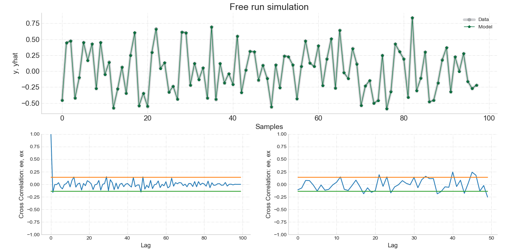

# Summary

The field of System Identification (SI) aims to build mathematical models for static and dynamic behavior from experimental data[@Lju1987]. In particular, nonlinear system identification has become a central issue in SI community and from the $1950$s onwards many methods have been proposed. In this respect, NARMAX (Nonlinear AutoRegressive Moving Average with eXogenous input) models are among the most well-documented and used model representation of dynamical systems[@Bil2013].

The polynomial NARMAX model was proposed by [@BL1981; @LB1985; @CB1989] and can be described as

\begin{equation}
y_k= F^\ell[y_{k-1}, \dotsc, y_{k-n_y},x_{k-d}, x_{k-d-1}, \dotsc, x_{k-d-n_x} + e_{k-1}, \dotsc, e_{k-n_e}] + e_k,
\end{equation}

where $n_y\in \mathbb{N}^*$, $n_x \in \mathbb{N}$, $n_e \in \mathbb{N}$ , are the maximum lags for the system output and input respectively; $x_k \in \mathbb{R}^{n_x}$ is the system input and $y_k \in \mathbb{R}^{n_y}$ is the system output at discrete time~$k \in \mathbb{N}^n$; $e_k \in \mathbb{R}^{n_e}$ represents uncertainties and possible noise at discrete time~$k$. In this case, $\mathcal{F}^\ell$ is some nonlinear function of the input and output regressors with nonlinearity degree $\ell \in \mathbb{N}$ and $d$ is a time delay typically set to $d=1$.

Although there are many possible approximations of $\mathcal{F}(\cdot)$ (e.g., Neural Networks, Fuzzy, Wavelet, Radial Basis Function), the power-form Polynomial NARMAX model is the most commonly used[@Bil2013; @MA2016]:

\begin{align}
\label{eq5:narx}
y_k =& \sum_{0} + \sum_{i=1}^{p}\Theta_{y}^{i}y_{k-i} + \sum_{j=1}^{q}\Theta_{e}^{j}e_{k-j} + \sum_{m=1}^{r}\Theta_{x}^{m}x_{k-m} \nonumber \\
& + \sum_{i=1}^{p}\sum_{j=1}^{q}\Theta_{ye}^{ij}y_{k-i} e_{k-j} + \sum_{i=1}^{p}\sum_{m=1}^{r}\Theta_{yx}^{im}y_{k-i} x_{k-m}  \nonumber \\
& + \sum_{j=1}^{q}\sum_{m=1}^{r}\Theta_{e x}^{jm}e_{k-j} x_{k-m}  \nonumber \\
&  + \sum_{i=1}^{p}\sum_{j=1}^{q}\sum_{m=1}^{r}\Theta_{y e x}^{ijm}y_{k-i} e_{k-j} x_{k-m} \nonumber \\
& + \sum_{m_1=1}^{r} \sum_{m_2=m_1}^{r}\Theta_{x^2}^{m_1 m_2} x_{k-m_1} x_{k-m_2} \dotsc \nonumber \\
& + \sum_{m_1=1}^{r} \dotsc \sum_{m_l=m_{l-1}}^{r} \Theta_{x^l}^{m_1, \dotsc, m_2} x_{k-m_1} x_{k-m_l},
\end{align}

Polynomial NARMAX models have many interesting atrributes[@Bil2013; @Agu2004]:

- All polynomial functions are smooth in $\mathbb{R}$;
- The Weierstrass theorem [@Wei1885] states that any given continuous real-valued function defined on a closed and bounded space $[a,b]$ can be uniformly approximated using a polynomial on that interval;
- Can describe several nonlinear dynamical systems, which include industrial processes, control systems, structural systems, economic and financial systems, biology, medicine, social systems, and much more[@WMNL2019; @FWHM2003; @GGBW2016; @KGHK2003; @BBWL2018; CER2001; @Bil2013; @Agu2004];
- Polynomial NARMAX models can be used both for prediction and inference.

# SysIdentPy

SysIdentPy is an open source python package for system identification using polynomial NARMAX models. The package can handle SISO and MISO NARMAX models identification. It provides various tools including classical Model Structure Selection (MSS) algorithms (e.g., Forward Regression Orthogonal Least Squares); parameter estimation using ordinary Least Squares, recursive algorithms and adaptative filters; four different information criterion methods for order selection (AIC, BIC, LILC, FPE); regression metrics; residual analysis  and so on. The reader is referred to the package documentation for further details.

SysIdentpy is designed designed to be easily expanded and user friendly. Moreover, the package aims to provid useful tools for researchers and students not only in SI field, but also in correlated areas such as Machine Learning, Statistical Learning and Data Science.

# Example

A typical example of model identification and validation is as follows:

```python
from sysidentpy.polynomial_basis import PolynomialNarmax
from sysidentpy.metrics import root_relative_squared_error
from sysidentpy.utils.generate_data import get_miso_data, get_siso_data
x_train, x_valid, y_train, y_valid = get_siso_data(n=1000,
                                                   colored_noise=False,
                                                   sigma=0.001,
                                                   train_percentage=90)
model = PolynomialNarmax(non_degree=2,
                         order_selection=True,
                         n_info_values=10,
                         extended_least_squares=False,
                         ylag=2, xlag=2,
                         info_criteria='aic',
                         estimator='least_squares',
                         )
model.fit(x_train, y_train)
yhat = model.predict(x_valid, y_valid)
rrse = root_relative_squared_error(y_valid, yhat)
print(rrse)
results = pd.DataFrame(model.results(err_precision=8,
                                     dtype='dec'),
                       columns=['Regressors', 'Parameters', 'ERR'])

print(results)
ee, ex, extras, lam = model.residuals(x_valid, y_valid, yhat)
model.plot_result(y_valid, yhat, ee, ex)
```

The table below and Figure 1 are the ouput of the aforementioned example.

| Regressors     | Parameters | ERR        |
|----------------|------------|------------|
| x2(k-1)        | 0.6000     | 0.90482955 |
| x2(k-2)x1(k-1) | -0.3000    | 0.05072675 |
| y(k-1)^2       | 0.3999     | 0.04410386 |
| x1(k-1)y(k-1)  | 0.1000     | 0.00033239 |



_Figure 1. Results from modeling a simulated system available with the SysIdentPy package. Free run simulation (validation data vs. model prediction), autocorrelation of the residues and cross correlation between residues and the input._

# Future work

Future releases will include new methods for MSS of polynomial NARMAX models, multiobjective MSS and parameter estimation algorithms, new adaptative filters, frequency domain analysis, and algorithms for using NARMAX models for classification problems.

# References