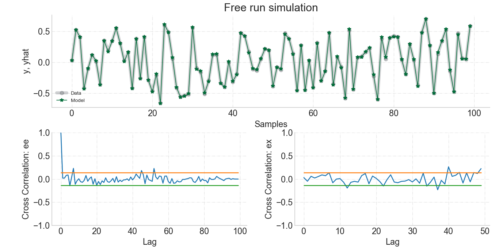

# Summary

The field of System Identification (SI) aims to build mathematical models for static and dynamic behavior from experimental data [@Lju1987]. In particular, nonlinear system identification has become a central issue in the SI community, and from the 1950s onwards many methods have been proposed. In this respect, NARMAX (Nonlinear AutoRegressive Moving Average with eXogenous input) models are among the most well-documented and used model representation of dynamical systems [@Bil2013].

The NARMAX model was proposed by [@BL1981; @LB1985; @CB1989] and can be described as

\begin{equation}
y_k= \mathcal{F}[y_{k-1}, \dotsc, y_{k-n_y},x_{k-d}, x_{k-d-1}, \dotsc, x_{k-d-n_x}, e_{k-1}, \dotsc, e_{k-n_e}] + e_k,
\end{equation}

where $n_y\in \mathbb{N}^*$, $n_x \in \mathbb{N}$, $n_e \in \mathbb{N}$ , are the maximum lags for the system output and input respectively; $x_k \in \mathbb{R}^{n_x}$ is the system input and $y_k \in \mathbb{R}^{n_y}$ is the system output at discrete time $k \in \mathbb{N}^n$; $e_k \in \mathbb{R}^{n_e}$ represents uncertainties and possible noise at discrete time $k$. In this case, $\mathcal{F}$ is some nonlinear function of the input and output regressors and $d$ is a time delay typically set to $d=1$.

Although there are many possible approximations of $\mathcal{F}(\cdot)$ (e.g., Neural Networks, Fuzzy, Wavelet, Radial Basis Function), the power-form Polynomial NARMAX model is the most commonly used [@Bil2013; @KST2020]:

\begin{align}
  y_k = \sum_{i=1}^{p}\Theta_i \times \prod_{j=0}^{n_x}u_{k-j}^{b_i, j}\prod_{l=1}^{n_e}e_{k-l}^{d_i, l}\prod_{m=1}^{n_y}y_{k-m}^{a_i, m}
\label{eq5:narx}
\end{align}
where $p$ is the number of regressors, $\Theta_i$ are the model parameters, and $a_i, m$, $b_i, j$ and $d_i, l \in \mathbb{N}$ are the exponents of the output, input and noise terms, respectively.

The following example is a polynomial NARMAX model where the nonlinearity degree is equal to $2$, identified from experimental data of a DC motor/generator with no prior knowledge of the model form, taken from [@LJAM2017]:
\begin{align}
  y_k =& 1.7813y_{k-1}-0.7962y_{k-2}+0.0339x_{k-1} -0.1597x_{k-1} y_{k-1} +0.0338x_{k-2} + \nonumber \\
  & + 0.1297x_{k-1}y_{k-2} - 0.1396x_{k-2}y_{k-1}+ 0.1086x_{k-2}y_{k-2}+0.0085y_{k-2}^2 + 0.0247e_{k-1}e_{k-2}
  \label{eq5:dcmotor}
\end{align}

The $\Theta$ values are the coefficients of each term of the polynomial equation.

Polynomial basis functions are one of the most used representations of NARMAX models due to several interesting atrributes, such as [@Bil2013; @Agu2004]:

- All polynomial functions are smooth in $\mathbb{R}$.
- The Weierstrass approximation theorem [@Wei1885] states that any continuous real-valued function defined on a closed and bounded space $[a,b]$ can be uniformly approximated using a polynomial on that interval.
- They can describe several nonlinear dynamical systems [@Bil2013], including industrial processes, control systems, structural systems, economic and financial systems, biology, medicine, and social systems [@WMNL2019; @FWHM2003; @GGBW2016; @KGHK2003; @BBWL2018; @CER2001; @Bil2013; @Agu2004; @MA2016].
- Several algorithms have been developed for both structure selection and parameter estimation of polynomial NARMAX models.
- Polynomial NARMAX models can be used both for prediction and inference. The structure of polynomial NARMAX models are easy to interpret and can be related to the underlying system, which is not a trivial task when using, for example, neural or wavelet functions.

Estimating the parameters of NARMAX models is a simple task if the model structure is known *a priori*. However, usually there is no information on what terms one should include in the final model, and selecting the correct terms has to be part of the system identification procedure. Thus, the identification of NARMAX models is twofold: selecting the most significant regressors given a dictionary of candidate terms, which relies on model structure selection algorithms, and estimating their parameters.

# SysIdentPy

`SysIdentPy` is an open-source Python package for system identification using polynomial NARMAX models. The package can handle SISO (Single-Input Single-Output) and MISO (Multiple-Inputs Single-Output) NARMAX model identification and its variants such as NARX, NAR, ARMAX, ARX, and AR models. It provides various tools for both model structure selection and parameter estimation including classical algorithms, e.g., forward regression orthogonal least squares and extended least squares orthogonal forward regression; parameter estimation using ordinary least squares, recursive algorithms and adaptative filters; the Akaike Information Criterion (AIC), Bayesian Information Criterion (BIC), Khinchin's law of iterated logarithm criterion (LILC), and Final Prediction Error (FPE) methods for model order selection [@HK1999]; regression metrics; and residual analysis. The reader is referred to the package documentation for further details.

`SysIdentPy` is designed to be easily expanded and user friendly. Moreover, the package aims to provide useful tools for researchers and students not only in the SI field, but also in correlated areas such as Machine Learning, Statistical Learning and Data Science. Recently, an R package was published [@ayala2020r] with tools to model dynamic systems using NARMAX models. However, to the best of our knowledge, `SysIdentPy` is the first open-source package for system identification using NARMAX models in Python. Moreover, SysIdentPy includes recursive and gradient methods for parameter estimation, e.g., recursive least squares, affine least mean squares, sign-sign least mean squares and many others that are not available in the above-mentioned R package. Also, the user can choose between four methods for model order selection, which is not possible with the mentioned R package.

# Example

The following is an example of how to use `SysIdentPy` to build a NARMAX model from data. For simplicity, the example uses simulated data with $1000$ samples, generated using the method `get_miso_data`:

```python
import numpy as np
import pandas as pd
import matplotlib.pyplot as plt
from sysidentpy.polynomial_basis import PolynomialNarmax
from sysidentpy.metrics import root_relative_squared_error
from sysidentpy.utils.generate_data import get_miso_data

x_train, x_valid, y_train, y_valid = get_miso_data(n=1000,
                                                   colored_noise=False,
                                                   sigma=0.001,
                                                   train_percentage=90)
```

Assuming that there is no information regarding what system generated the data, a dictionary of candidate terms must be created by defining the nonlinearity degree of the polynomial function and the maximum lag of the input and output terms. These parameters are, respectively, `non_degree, ylag, xlag`. The Akaike Information Criterion is chosen for model order selection and the least squares method is used for parameter estimation:

```python
model = PolynomialNarmax(non_degree=2,
                         order_selection=True,
                         ylag=2, xlag=[[1, 2], [1, 2]],
                         info_criteria='aic',
                         estimator='least_squares',
                         )
```

The user can also run a SISO example by replacing `get_miso_data` with `get_siso_data` and the `xlag` values with an integer or a list of integers. If one wants to estimate the parameters using, for example, the recursive least squares algorithm, just set `estimator` to `'recursive_least_squares'`. Replacing the AIC method with BIC, for example, can be done analogously by replacing `'aic'` with `'bic'`.

The `fit` method is used to obtain the model and `predict` to validate the model using new data.
The metric to evaluate is the relative root squared error. To get the root mean square error metric, for example, import it using `from sysidentpy.metrics import root_mean_square_error` and replace the root relative squared error method with it.

```python
model = PolynomialNarmax(non_degree=2,
                         order_selection=True,
                         ylag=2, xlag=[[1, 2], [1, 2]],
                         info_criteria='aic',
                         estimator='least_squares',
                         )

model.fit(x_train, y_train)
yhat = model.predict(x_valid, y_valid)
rrse = root_relative_squared_error(y_valid, yhat)
print(rrse)
```

The `model.results` and `model.residuals` statements return the polynomial model obtained using the `fit` method and plot the results for qualitative analysis.

```python
results = pd.DataFrame(model.results(err_precision=8,
                                     dtype='dec'),
                       columns=['Regressors', 'Parameters', 'ERR'])

print(results)
ee, ex, extras, lam = model.residuals(x_valid, y_valid, yhat)
model.plot_result(y_valid, yhat, ee, ex)
```

The table below and Figure 1 are the ouput of the aforementioned example. Table 1 details the regressors chosen to compose the final model, its respective parameters and the error reduction ratio (ERR), which measure the contribution of each regressor to explain the system output. ERR values can be interpreted as a feature importance metric. Figure 1 depicts the simulation of model prediction and the validation data as well as the autocorrelation of the model residues and the cross-correlation between the input and the residues.

| Regressors     | Parameters | ERR        |
|----------------|------------|------------|
| x2(k-1)        | 0.6000     | 0.90482955 |
| x2(k-2)x1(k-1) | -0.3000    | 0.05072675 |
| y(k-1)^2       | 0.3999     | 0.04410386 |
| x1(k-1)y(k-1)  | 0.1000     | 0.00033239 |


_Figure 1. Results from modeling a simulated system available with the `SysIdentPy` package. Free run simulation (validation data vs. model prediction), autocorrelation of the residues and cross correlation between residues and the input._

For more information and examples of how to build NARMAX models and its variants using different methods for parameters estimation, model order selection and many more, see the package documentation.

# Future work

Future releases will include new methods for model structure selection of polynomial NARMAX models, new basis functions, multiobjective model structure selection and parameter estimation algorithms, new adaptative filters, frequency domain analysis, and algorithms for using NARMAX models for classification problems.

# References
